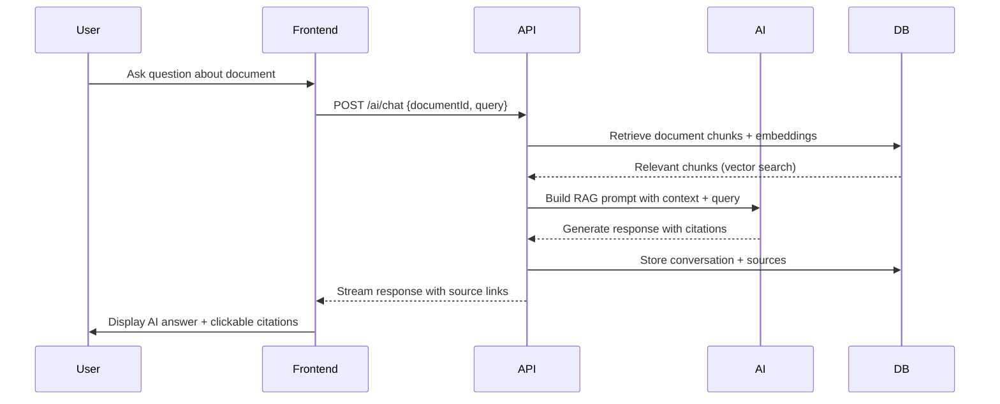
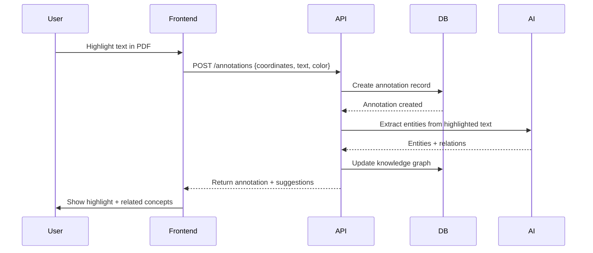

# CiteMind Architecture Overview

## System Architecture

CiteMind follows a **modern full-stack architecture** with clear separation of concerns, local-first capabilities, and enterprise-grade scalability.

```
┌─────────────────────────────────────────────────────────────────────┐
│                           CLIENT LAYER                               │
│  ┌──────────────┐  ┌──────────────┐  ┌──────────────┐               │
│  │   Web App    │  │  Desktop App │  │   Mobile App │  (Future)    │
│  │  (React/Vite)│  │  (Electron)  │  │  (React Native)│             │
│  └──────┬───────┘  └──────┬───────┘  └──────┬───────┘               │
│         │                 │                 │                       │
│         └─────────────────┴─────────────────┘                       │
│                           │                                         │
│                    ┌──────┴──────┐                                   │
│                    │  Local-First │  Dexie.js (IndexedDB)            │
│                    │   Sync Layer │  Offline queue, CRDT              │
│                    └──────┬──────┘                                   │
└─────────────────────────┼───────────────────────────────────────────┘
                          │ HTTPS / WebSocket
┌─────────────────────────┼───────────────────────────────────────────┐
│                         ▼                                           │
│  ┌────────────────────────────────────────────────────────────────┐ │
│  │                        EDGE LAYER                               │ │
│  │  ┌──────────┐  ┌──────────┐  ┌──────────┐  ┌──────────┐     │ │
│  │  │    CDN   │  │   WAF    │  │   DDoS   │  │  Cache   │     │ │
│  │  │(CloudFlare)│  │(AWS WAF) │  │ Protection│  │ (Redis)  │     │ │
│  │  └──────────┘  └──────────┘  └──────────┘  └──────────┘     │ │
│  └────────────────────────────────────────────────────────────────┘ │
│                                                                     │
│  ┌────────────────────────────────────────────────────────────────┐ │
│  │                      API GATEWAY LAYER                          │ │
│  │  ┌──────────────┐  ┌──────────────┐  ┌──────────────┐        │ │
│  │  │ Rate Limit   │  │  Auth/JWT    │  │  Request     │        │ │
│  │  │   (Redis)    │  │   (Clerk)    │  │  Validation  │        │ │
│  │  └──────────────┘  └──────────────┘  └──────────────┘        │ │
│  └────────────────────────────────────────────────────────────────┘ │
│                                                                     │
│  ┌────────────────────────────────────────────────────────────────┐ │
│  │                     APPLICATION LAYER                             │ │
│  │  ┌──────────────┐  ┌──────────────┐  ┌──────────────┐        │ │
│  │  │  REST API    │  │  WebSocket   │  │   GraphQL    │        │ │
│  │  │  (Express)   │  │  (Socket.io) │  │   (Future)   │        │ │
│  │  └──────────────┘  └──────────────┘  └──────────────┘        │ │
│  │                                                                 │
│  │  ┌──────────────┐  ┌──────────────┐  ┌──────────────┐        │ │
│  │  │  Auth Service │  │  AI Service  │  │  Search Svc  │        │ │
│  │  │  (JWT/SSO)   │  │  (LangChain) │  │  (Hybrid)    │        │ │
│  │  └──────────────┘  └──────────────┘  └──────────────┘        │ │
│  │                                                                 │
│  │  ┌──────────────┐  ┌──────────────┐  ┌──────────────┐        │ │
│  │  │  Document    │  │  Annotation  │  │  Export      │        │ │
│  │  │  Service     │  │  Service     │  │  Service     │        │ │
│  │  └──────────────┘  └──────────────┘  └──────────────┘        │ │
│  └────────────────────────────────────────────────────────────────┘ │
│                                                                     │
│  ┌────────────────────────────────────────────────────────────────┐ │
│  │                       DATA LAYER                                │ │
│  │  ┌──────────────┐  ┌──────────────┐  ┌──────────────┐        │ │
│  │  │  PostgreSQL  │  │   pgvector   │  │    Redis     │        │ │
│  │  │  (Primary DB)│  │  (Vectors)   │  │   (Cache)    │        │ │
│  │  └──────────────┘  └──────────────┘  └──────────────┘        │ │
│  │                                                                 │
│  │  ┌──────────────┐  ┌──────────────┐  ┌──────────────┐        │ │
│  │  │  Object      │  │  Message     │  │  Background  │        │ │
│  │  │  Storage     │  │  Queue       │  │  Workers     │        │ │
│  │  │  (S3/MinIO)  │  │  (BullMQ)    │  │  (Node.js)   │        │ │
│  │  └──────────────┘  └──────────────┘  └──────────────┘        │ │
│  └────────────────────────────────────────────────────────────────┘ │
└─────────────────────────────────────────────────────────────────────┘
```

## Technology Stack

| Layer | Technology | Purpose |
|-------|------------|---------|
| **Frontend** | React 18 + Vite + TypeScript | UI framework and build tooling |
| **Styling** | Tailwind CSS + shadcn/ui | Utility-first CSS and component library |
| **State** | Zustand + TanStack Query | Global state and server state management |
| **PDF** | PDF.js + react-pdf | PDF rendering and text extraction |
| **Graph** | React Flow + D3.js | Knowledge graph and research board |
| **Backend** | Node.js + Express + TypeScript | REST API and business logic |
| **ORM** | Prisma | Database schema management and queries |
| **Database** | PostgreSQL 15 + pgvector | Primary database with vector search |
| **Cache** | Redis | Session storage, API caching, rate limiting |
| **Queue** | BullMQ | Background job processing (PDF parsing, AI jobs) |
| **Storage** | MinIO / S3 | Object storage for PDFs and exports |
| **AI** | OpenAI / Anthropic / Local LLMs | Document understanding and generation |
| **Embeddings** | text-embedding-3-small / BGE | Semantic text embeddings |
| **Search** | pgvector + tsquery | Hybrid vector + full-text search |
| **Auth** | JWT + Clerk / Auth0 | Authentication and SSO |
| **Observability** | Pino + Prometheus + Sentry | Logging, metrics, and error tracking |

## Key Architectural Decisions

### 1. Local-First with Cloud Sync

CiteMind is designed as a **local-first application**. All user data is stored locally in IndexedDB (via Dexie.js) and optionally synced to the cloud. This ensures:
- ✅ Offline capability for researchers in the field
- ✅ Fast, responsive UI regardless of network latency
- ✅ Data sovereignty — users own their research
- ✅ Enterprise compliance — data stays within tenant boundaries

### 2. AI Provider Abstraction

The AI layer is fully abstracted via the `BaseProvider` interface:
- **OpenAI** — Primary provider for production
- **Anthropic** — Alternative for longer context windows
- **Local LLMs** — Ollama/Llama.cpp for air-gapped environments
- **Mock Provider** — Offline development and testing

This abstraction ensures:
- No vendor lock-in
- Graceful degradation when providers fail
- Easy addition of new AI models
- Compliance with data residency requirements (local models for EU/China)

### 3. Document Processing Pipeline

Every uploaded document goes through a 9-stage pipeline:

```
Upload → Parse → Extract → Thumbnail → Metadata → Chunk → Embed → Index → Ready
```

Stages 1-3 happen synchronously (fast feedback to user). Stages 4-9 run asynchronously via BullMQ workers, ensuring the UI remains responsive even for 1000+ page documents.

### 4. Hybrid Search Architecture

Search combines three techniques for maximum accuracy:
1. **Vector Search** (pgvector HNSW) — Semantic similarity
2. **Full-Text Search** (PostgreSQL tsquery) — Exact matching
3. **Reciprocal Rank Fusion** — Combine and re-rank results

This hybrid approach ensures users find both conceptually related and exactly matching content.

### 5. Multi-Tenant Security

Enterprise deployments use **row-level security (RLS)** in PostgreSQL:
- Every table has a `tenant_id` column
- RLS policies enforce tenant isolation at the database level
- Application-level middleware double-checks permissions
- AI prompts include tenant context to prevent cross-tenant leakage

### 6. Event-Driven Architecture

Key events in the system are published to a Redis pub/sub channel:
- `document.uploaded` → Triggers processing pipeline
- `document.processed` → Notifies frontend, triggers AI analysis
- `annotation.created` → Updates knowledge graph, notifies collaborators
- `ai.response.generated` → Streams to frontend, logs for audit

This decouples components and enables real-time collaboration features.

## Data Flow

### AI Chat Workflow



### Annotation Workflow



## Scalability Strategy

### Phase 1: MVP (1-100 users)
- Single server deployment
- Docker Compose on single VM
- PostgreSQL + pgvector on same host
- Local file storage (MinIO)

### Phase 2: Growth (100-10,000 users)
- Load-balanced API servers (3-5 instances)
- Managed PostgreSQL (RDS / Cloud SQL)
- Separate Redis cluster
- S3 for object storage
- CDN for static assets

### Phase 3: Enterprise (10,000+ users)
- Kubernetes orchestration (EKS / GKE / AKS)
- Read replicas for PostgreSQL
- Dedicated vector database (Pinecone / Weaviate)
- Multi-region deployment
- Auto-scaling based on AI job queue depth

## Security Architecture

See [docs/security.md](./docs/security.md) for the complete security design.

Key security layers:
1. **Perimeter** — WAF, DDoS protection, CDN
2. **Transport** — TLS 1.3, mTLS for service-to-service
3. **Application** — JWT auth, RBAC, input validation, rate limiting
4. **Data** — Encryption at rest (AES-256), RLS, tenant isolation
5. **AI** — Prompt isolation, PII redaction, zero training on user data

## Deployment Options

### Local Development
```bash
docker-compose up -d
```

### Single Server (Small Team)
```bash
docker-compose -f docker-compose.prod.yml up -d
```

### Kubernetes (Enterprise)
```bash
kubectl apply -f k8s/
```

See [docs/infrastructure.md](./docs/infrastructure.md) for detailed deployment guides and cost estimates.

## Monitoring & Observability

| Metric | Tool | Alert Threshold |
|--------|------|-----------------|
| API Response Time | Prometheus | P99 > 500ms |
| Error Rate | Sentry | > 0.1% of requests |
| AI Job Queue Depth | Prometheus | > 100 pending jobs |
| Database CPU | CloudWatch | > 80% for 5 min |
| PDF Processing Time | Custom | > 5 min per 100 pages |
| User Session Count | PostHog | N/A (analytics) |

## Future Architecture Evolution

- **GraphQL API** — Unified data fetching for complex frontend queries
- **WebRTC** — Real-time collaborative cursor and annotation sharing
- **WebAssembly** — Client-side PDF parsing for instant feedback
- **Federated Search** — Connect to external databases (JSTOR, PubMed, arXiv)
- **Plugin System** — Third-party extensions for domain-specific workflows

---

For the complete technical specification, see [docs/technical-design.md](./docs/technical-design.md).
