# Functional Design Document: CiteMind

## AI-Powered Research Notebook & Document Intelligence Workspace

---

**Version**: 1.0  
**Date**: 2025-07-26  
**Author**: Functional Design Agent  
**Status**: Draft  
**Classification**: Internal — Product Design

---

## Table of Contents

1. [Product Overview](#1-product-overview)
2. [User Personas](#2-user-personas)
3. [User Journeys](#3-user-journeys)
4. [Core Workflows](#4-core-workflows)
5. [Functional Modules](#5-functional-modules)
6. [Document Import Workflow](#6-document-import-workflow)
7. [PDF Annotation Workflow](#7-pdf-annotation-workflow)
8. [Highlight Extraction Workflow](#8-highlight-extraction-workflow)
9. [AI Chat with Document Workflow](#9-ai-chat-with-document-workflow)
10. [Multi-Document Research Workflow](#10-multi-document-research-workflow)
11. [Knowledge Graph Workflow](#11-knowledge-graph-workflow)
12. [Citation Workflow](#12-citation-workflow)
13. [Research Board Workflow](#13-research-board-workflow)
14. [Export Workflow](#14-export-workflow)
15. [Collaboration Workflow](#15-collaboration-workflow)
16. [Admin Workflow](#16-admin-workflow)
17. [User Settings](#17-user-settings)
18. [Notifications](#18-notifications)
19. [Error Handling](#19-error-handling)
20. [Accessibility Requirements](#20-accessibility-requirements)
21. [Non-Functional Requirements](#21-non-functional-requirements)
22. [Acceptance Criteria](#22-acceptance-criteria)

---

## 1. Product Overview

### 1.1 Vision Statement

CiteMind is an AI-native research workspace that unifies deep PDF annotation, visual knowledge mapping, multi-document AI reasoning, citation management, and professional export into a single, integrated environment. It eliminates the need for researchers to stitch together 5–10 separate tools, ending context loss, workflow friction, and knowledge fragmentation.

### 1.2 Product Differentiation

Unlike competitors that excel in one dimension while failing in others, CiteMind architecturally integrates five core capabilities from the ground up:

| Capability | CiteMind Approach | Typical Competitor Gap |
|---|---|---|
| **Deep PDF Annotation** | Native, layer-based annotation engine with AI-aware highlights | AI tools lack annotation; annotators lack AI |
| **AI Document Understanding** | Annotation-grounded AI that reasons from user highlights, not just raw text | No tool connects AI to user annotations |
| **Visual Knowledge Mapping** | Infinite canvas with cited knowledge cards, not just sticky notes | Visual tools lack citations; citation tools lack visuals |
| **Multi-Document Reasoning** | Cross-document synthesis with traceable, exportable citations | AI tools answer across docs but don't export structured citations |
| **Professional Export** | One-click export from research workspace to paper, report, or thesis | No tool bridges research and deliverable creation |

### 1.3 Product Positioning

- **For**: Serious researchers, graduate students, legal professionals, R&D scientists, strategy consultants, and research teams
- **Who need**: To read, annotate, understand, connect, synthesize, and cite documents efficiently
- **CiteMind is**: An AI-powered research notebook and document intelligence workspace
- **That**: Combines the deep annotation of LiquidText, the AI reasoning of NotebookLM, the visual clarity of Heptabase, and the citation rigor of Zotero
- **Unlike**: Using 5–10 disconnected tools that cause context loss and workflow friction
- **CiteMind**: Keeps every insight, annotation, and AI reasoning traceable to its source

### 1.4 Key Value Propositions

1. **Annotation-Grounded AI**: AI that understands not just document text but your highlights, comments, and markings — reasoning from your curated evidence, not just raw content
2. **Citation-Native Knowledge Graph**: Every node in your visual knowledge map is a cited source; every connection is a traceable claim
3. **Multi-Document Synthesis**: Ask questions across dozens of documents and receive synthesised answers with inline citations and source verification
4. **Research-to-Deliverable Pipeline**: Transform your research workspace into a professional paper, report, or thesis with structured export
5. **Zero Context Loss**: Everything — annotations, AI conversations, knowledge graph connections, citations — lives in one unified workspace

### 1.5 Platform Support

| Platform | MVP | Post-MVP |
|---|---|---|
| Web (Desktop) | ✓ Primary | ✓ |
| macOS (Native) | ✓ | ✓ |
| Windows (Native) | ✓ | ✓ |
| iOS (iPad) | Post-MVP | ✓ |
| Android | Post-MVP | ✓ |
| Browser Extension | Post-MVP | ✓ |
| VS Code Extension | — | Future |

### 1.6 Release Phases

| Phase | Focus | Timeline |
|---|---|---|
| **MVP** | Single-user PDF annotation, AI chat, basic knowledge board, citation export | Months 1–4 |
| **V1.0** | Multi-document AI, knowledge graph, collaborative research boards, Zotero integration | Months 5–8 |
| **V2.0** | Real-time collaboration, enterprise SSO, advanced analytics, API access | Months 9–12 |
| **Enterprise** | On-premise deployment, advanced compliance, custom AI models, admin controls | Year 2 |

---

## 2. User Personas

### 2.1 Persona 1: Graduate Researcher (Dr. Maya Chen)

**Demographics**
- **Age**: 26–32
- **Role**: PhD candidate in Computational Biology / Postdoctoral researcher
- **Institution**: Research university or medical school
- **Technical skill**: High (comfortable with Python, R, LaTeX, reference managers)
- **Budget**: Limited (student/pricing sensitive); institutional license preferred

**Goals**
1. Read and annotate 50–100+ papers per semester for literature review
2. Extract key findings, methodologies, and datasets from papers systematically
3. Build a structured knowledge base connecting findings across papers
4. Generate properly formatted citations for thesis chapters and publications
5. Collaborate with advisor and lab members on shared research projects

**Pain Points**
- Using Zotero for references, LiquidText for annotation, Obsidian for notes, and Overleaf for writing — context is lost at every transition
- NotebookLM gives good AI answers but can't see her annotations or export proper citations
- Heptabase helps visualise connections but has no citation support or PDF annotation
- Her annotations are scattered across PDFs with no way to search or reason across them
- Collaborative literature reviews require sending static PDFs back and forth

**Research Workflow**
1. Discover papers through PubMed, Google Scholar, arXiv
2. Import PDFs into reference manager
3. Read and highlight key sections in PDF reader
4. Take notes in separate note-taking app
5. Manually copy citations into writing document
6. Repeat for 100+ papers

**CiteMind Value**
- All annotation, note-taking, AI analysis, and citation management in one workspace
- AI can answer questions based on her specific highlights (not just raw text)
- Visual knowledge board helps map experimental design connections across papers
- One-click export of annotated bibliography and cited summaries to LaTeX/Word
- Collaboration with advisor on shared projects with real-time annotation sync

**Frequency of Use**: Daily (4–8 hours during research phases)

**Feature Priorities**
1. Deep PDF annotation with highlighting, comments, and region selection
2. AI chat that understands annotations and provides cited answers
3. Knowledge graph for mapping connections between papers
4. Citation export to BibTeX, Zotero, and formatted styles
5. Multi-document synthesis for literature review chapters

---

### 2.2 Persona 2: Legal Researcher (James Whitfield, Associate Attorney)

**Demographics**
- **Age**: 28–38
- **Role**: Associate at mid-size law firm or in-house counsel
- **Firm**: 50–500 attorneys
- **Technical skill**: Medium (comfortable with Word, Adobe Acrobat, Westlaw, Lexis)
- **Budget**: Firm pays for tools; needs enterprise-grade security and compliance

**Goals**
1. Analyse case law, statutes, contracts, and regulatory documents efficiently
2. Build case briefs with precise citations to page numbers and passages
3. Compare contract language across multiple agreements
4. Prepare deposition summaries and exhibit lists with source tracking
5. Share research with partners and paralegals securely

**Pain Points**
- PDF case files are hundreds of pages; finding relevant passages is time-consuming
- Current tools (Adobe Acrobat, Word) have no AI to answer questions about documents
- Annotation is basic (highlights, comments) with no intelligent extraction
- Cross-document comparison requires manually opening multiple PDFs side-by-side
- Citation format must be exact (Bluebook, ALWD); manual formatting is error-prone
- Client confidentiality requires on-premise or secure cloud storage

**Research Workflow**
1. Retrieve case files, contracts, and statutes from firm document management system
2. Print or view PDFs in Adobe Acrobat
3. Highlight key passages and add sticky notes
4. Copy passages into Word document with manual citation
5. Create comparison tables manually across documents
6. Share via email or document management system

**CiteMind Value**
- AI-powered document Q&A that cites specific page numbers and passages
- Multi-document comparison that identifies conflicting language across contracts
- Annotation extraction that auto-generates case briefs with proper citations
- Secure, permissioned collaboration with audit trails for client confidentiality
- Export to professional legal brief formats with Bluebook/ALWD citations

**Frequency of Use**: Daily (2–6 hours during case preparation)

**Feature Priorities**
1. AI chat with precise page/paragraph citations
2. Multi-document comparison and conflict detection
3. Annotation extraction to structured case briefs
4. Enterprise security and access controls
5. Professional export to legal brief formats

---

### 2.3 Persona 3: R&D Scientist (Dr. Elena Vasquez, Principal Scientist)

**Demographics**
- **Age**: 35–50
- **Role**: Principal Scientist at biotechnology or pharmaceutical company
- **Company**: Mid-size to large enterprise (1,000+ employees)
- **Technical skill**: High (comfortable with research databases, statistical tools, collaboration platforms)
- **Budget**: Enterprise budget; needs integration with existing systems

**Goals**
1. Monitor patent landscape and competitor publications in therapeutic area
2. S synthesise findings from internal research reports and external publications
3. Build compound-target-disease knowledge maps for drug discovery
4. Prepare regulatory submission documents with traceable evidence
5. Collaborate with cross-functional teams (medicinal chemistry, biology, clinical)

**Pain Points**
- Internal research reports are siloed in SharePoint with poor searchability
- Patent literature is dense and requires cross-referencing with scientific publications
- Current tools don't connect chemical structures, biological targets, and clinical outcomes
- Regulatory submissions require traceable evidence chains that are hard to assemble
- Team collaboration is fragmented across SharePoint, Slack, and email

**Research Workflow**
1. Search patent databases (USPTO, EPO, WIPO) and scientific literature (PubMed, SciFinder)
2. Download PDFs and store in SharePoint or local drives
3. Read and annotate in PDF reader or printed copies
4. Take notes in OneNote or Word
5. Create PowerPoint presentations for team meetings
6. Compile evidence for regulatory submissions manually

**CiteMind Value**
- Unified workspace for patents, publications, and internal reports
- AI-powered synthesis across document types with evidence tracing
- Knowledge graph that connects compounds, targets, diseases, and publications
- Structured export to regulatory submission formats (eCTD, IND, NDA)
- Team collaboration with role-based access and audit trails

**Frequency of Use**: Daily (2–4 hours; intensive during project milestones)

**Feature Priorities**
1. Multi-document synthesis across patents and publications
2. Knowledge graph with custom node types (compounds, targets, diseases)
3. Integration with SharePoint and enterprise document management
4. Structured export to regulatory formats
5. Team collaboration with permissions and audit trails

---

### 2.4 Persona 4: Strategy Consultant (Marcus Johnson, Senior Consultant)

**Demographics**
- **Age**: 28–40
- **Role**: Senior Consultant at top-tier management consulting firm
- **Firm**: MBB or tier-2 consulting firm
- **Technical skill**: Medium (comfortable with PowerPoint, Excel, Word; less technical than researchers)
- **Budget**: Firm pays; needs polished output and client confidentiality

**Goals**
1. Analyse industry reports, company filings, and competitor documents for client projects
2. S synthesise insights from 20–50 documents into client-ready presentations
3. Build logical argument trees with traceable evidence for each claim
4. Create client deliverables (reports, presentations, fact packs) efficiently
5. Collaborate with project teams and share findings with partners

**Pain Points**
- Client documents are confidential and must remain secure
- Current workflow: read PDFs, take notes in Word, create PowerPoint manually
- No tool helps connect insights across documents into a coherent narrative
- AI tools like ChatGPT can't be used for client work due to confidentiality and hallucination risks
- Need to cite specific sources for every claim in client deliverables

**Research Workflow**
1. Receive client documents and industry reports from project team
2. Read and highlight in PDF reader or printed copies
3. Take notes in Word or OneNote
4. Create PowerPoint slides with manual copy-paste from sources
5. Add source citations manually to each slide
6. Review with engagement manager and partner

**CiteMind Value**
- Confidential, secure workspace for client documents
- AI-powered synthesis that cites specific sources for every claim
- Research board for visualising argument trees and evidence chains
- Export to PowerPoint and Word with embedded citations
- Collaboration with team members and partners in shared project spaces

**Frequency of Use**: Project-dependent (intensive for 2–4 weeks per project, then lighter)

**Feature Priorities**
1. Multi-document AI synthesis with source citations
2. Research board for argument mapping and evidence trees
3. Export to PowerPoint and Word with embedded citations
4. Enterprise security and client confidentiality controls
5. Collaboration in shared project spaces

---

## 3. User Journeys

### 3.1 Graduate Researcher Journey: From Discovery to Publication

**Journey Map**

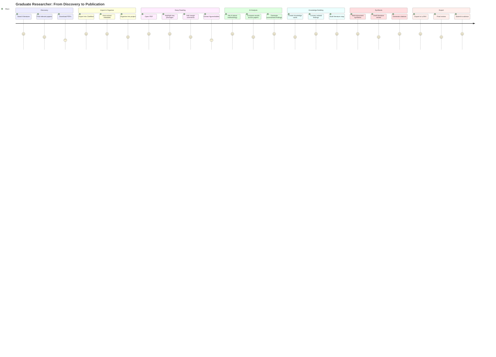
```mermaid
journey
    title Graduate Researcher: From Discovery to Publication
    section Discovery
      Search literature: 5: Maya
      Find relevant papers: 4: Maya
      Download PDFs: 3: Maya
    section Import & Organise
      Import into CiteMind: 5: Maya
      Auto-extract metadata: 5: Maya
      Organise into project: 4: Maya
    section Deep Reading
      Open PDF: 5: Maya
      Highlight key passages: 5: Maya
      Add margin comments: 4: Maya
      Extract figures/tables: 3: Maya
    section AI Analysis
      Ask AI about methodology: 5: Maya
      Compare results across papers: 4: Maya
      Generate summarised findings: 5: Maya
    section Knowledge Building
      Create knowledge cards: 4: Maya
      Connect related findings: 5: Maya
      Build literature map: 5: Maya
    section Synthesis
      Multi-document synthesis: 5: Maya
      Draft literature review: 4: Maya
      Generate citations: 5: Maya
    section Export
      Export to LaTeX: 5: Maya
      Final review: 4: Maya
      Submit to advisor: 5: Maya
```

**Step-by-Step Journey**

| Stage | Action | Touchpoint | Emotion | Pain Point Solved |
|---|---|---|---|---|
| 1. Discovery | Maya searches PubMed and finds 50 relevant papers | Browser | Neutral | — |
| 2. Import | Bulk uploads PDFs to CiteMind project | Web app | Satisfied | No more scattered files |
| 3. Organisation | Auto-extracted metadata and thumbnails appear | Project workspace | Pleased | No manual entry |
| 4. Deep Reading | Opens first PDF, highlights methods and results | PDF viewer | Engaged | Annotation tools work natively |
| 5. AI Assistance | Asks AI: "What datasets did Smith et al. use?" | AI chat panel | Impressed | AI understands the paper |
| 6. Cross-Paper | Asks AI: "Compare methodologies of Smith and Jones" | AI chat panel | Excited | Multi-document reasoning |
| 7. Extraction | Auto-extracts all highlighted findings to cards | AI sidebar | Delighted | No manual copying |
| 8. Knowledge Map | Drags cards to research board, draws connections | Research board | Creative | Visual thinking enabled |
| 9. Synthesis | AI synthesises 20 papers into literature review draft | AI chat panel | Productive | Writer's block overcome |
| 10. Citation | Exports with BibTeX citations and formatted references | Export dialog | Confident | Citation accuracy guaranteed |
| 11. Delivery | Sends LaTeX file to advisor with all sources traced | Email/LaTeX | Proud | Professional output |

**Critical Moments**
- **Moment of Delight**: AI answers a specific question and cites the exact page and paragraph where the answer is found
- **Moment of Frustration (competitor)**: Having to switch between 4 apps to complete one research task
- **Aha Moment**: Realising her highlights are searchable, connected, and AI-reasonable as a unified knowledge base

---

### 3.2 Legal Researcher Journey: Case Preparation

**Journey Map**

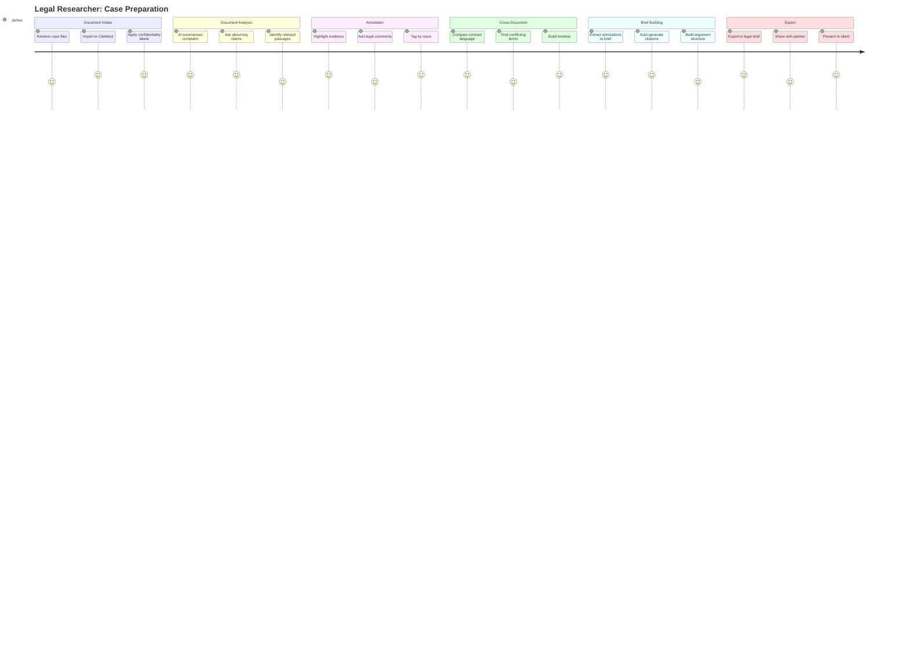
```mermaid
journey
    title Legal Researcher: Case Preparation
    section Document Intake
      Retrieve case files: 4: James
      Import to CiteMind: 5: James
      Apply confidentiality labels: 5: James
    section Document Analysis
      AI summarises complaint: 5: James
      Ask about key claims: 5: James
      Identify relevant passages: 4: James
    section Annotation
      Highlight evidence: 5: James
      Add legal comments: 4: James
      Tag by issue: 5: James
    section Cross-Document
      Compare contract language: 5: James
      Find conflicting terms: 4: James
      Build timeline: 5: James
    section Brief Building
      Extract annotations to brief: 5: James
      Auto-generate citations: 5: James
      Build argument structure: 4: James
    section Export
      Export to legal brief: 5: James
      Share with partner: 4: James
      Present to client: 5: James
```

**Step-by-Step Journey**

| Stage | Action | Touchpoint | Emotion | Pain Point Solved |
|---|---|---|---|---|
| 1. Intake | James retrieves 500-page case file from document management system | DMS integration | Neutral | — |
| 2. Import | Imports to CiteMind with client-confidential security label | Web app | Satisfied | Secure workspace |
| 3. AI Summary | Asks AI to summarise the complaint and identify causes of action | AI chat panel | Impressed | Rapid document understanding |
| 4. Evidence Hunt | Highlights key evidence passages and adds legal analysis comments | PDF viewer | Engaged | Annotation + AI combined |
| 5. Issue Tagging | Tags annotations by legal issue (breach, damages, jurisdiction) | Annotation sidebar | Organised | Structured case preparation |
| 6. Cross-Document | Compares indemnity clauses across 5 contracts | AI chat panel | Excited | No manual side-by-side |
| 7. Timeline | AI builds chronology from dates across all case documents | Research board | Productive | Manual timeline eliminated |
| 8. Brief Building | Extracts all tagged annotations into structured case brief | Export dialog | Confident | Auto-cited, formatted |
| 9. Review | Shares with partner for review and comment | Collaboration | Collaborative | Real-time feedback |
| 10. Delivery | Exports to Word with Bluebook citations and presents to client | Word export | Professional | Client-ready output |

**Critical Moments**
- **Moment of Delight**: AI identifies a conflicting clause across contracts that James missed
- **Moment of Relief**: Knowing client-confidential documents are encrypted and access-controlled
- **Aha Moment**: Realising annotations can be auto-extracted into a structured brief with proper citations

---

### 3.3 R&D Scientist Journey: Drug Discovery Knowledge Mapping

**Journey Map**

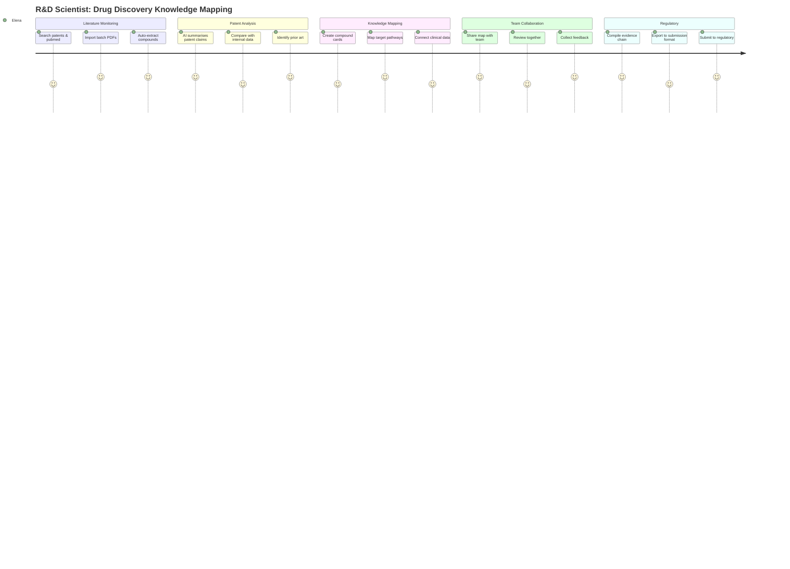
```mermaid
journey
    title R&D Scientist: Drug Discovery Knowledge Mapping
    section Literature Monitoring
      Search patents & pubmed: 4: Elena
      Import batch PDFs: 5: Elena
      Auto-extract compounds: 5: Elena
    section Patent Analysis
      AI summarises patent claims: 5: Elena
      Compare with internal data: 4: Elena
      Identify prior art: 5: Elena
    section Knowledge Mapping
      Create compound cards: 4: Elena
      Map target pathways: 5: Elena
      Connect clinical data: 4: Elena
    section Team Collaboration
      Share map with team: 5: Elena
      Review together: 4: Elena
      Collect feedback: 5: Elena
    section Regulatory
      Compile evidence chain: 5: Elena
      Export to submission format: 4: Elena
      Submit to regulatory: 5: Elena
```

**Step-by-Step Journey**

| Stage | Action | Touchpoint | Emotion | Pain Point Solved |
|---|---|---|---|---|
| 1. Monitoring | Elena sets up alerts for new patents in therapeutic area | Alert system | Neutral | — |
| 2. Batch Import | 50 new patents and publications imported to CiteMind | Web app | Satisfied | Bulk processing |
| 3. Auto-Extract | AI auto-extracts chemical structures, targets, and biological data | AI sidebar | Impressed | No manual data entry |
| 4. Patent Analysis | AI summarises patent claims and identifies freedom-to-operate issues | AI chat panel | Engaged | Rapid patent assessment |
| 5. Cross-Reference | Compares patent data with internal research reports | AI chat panel | Excited | Internal + external synthesis |
| 6. Knowledge Map | Creates compound-target-disease knowledge graph | Research board | Creative | Visual drug discovery map |
| 7. Team Share | Shares knowledge map with medicinal chemistry team | Collaboration | Collaborative | Shared understanding |
| 8. Evidence Chain | Maps evidence chain from in vitro to clinical data | Knowledge graph | Confident | Traceable regulatory evidence |
| 9. Export | Exports to regulatory submission format with all citations | Export dialog | Professional | Submission-ready output |

---

### 3.4 Strategy Consultant Journey: Client Engagement

**Journey Map**

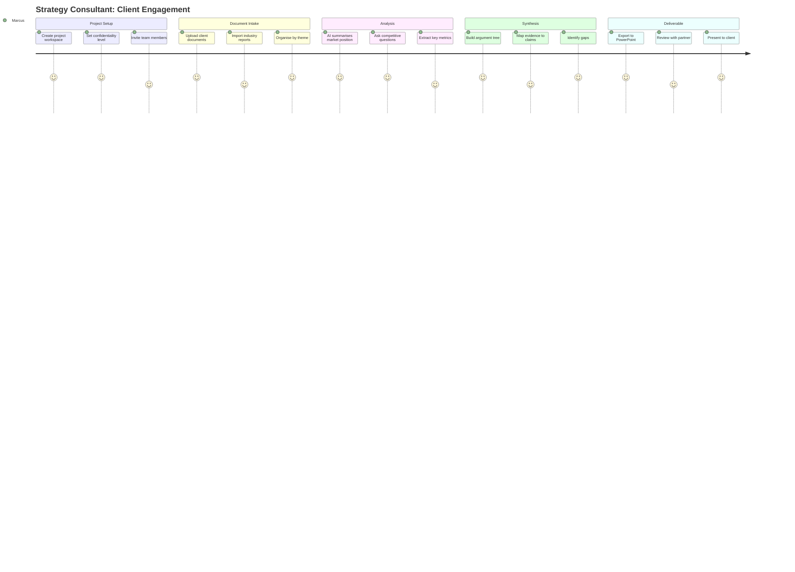
```mermaid
journey
    title Strategy Consultant: Client Engagement
    section Project Setup
      Create project workspace: 5: Marcus
      Set confidentiality level: 5: Marcus
      Invite team members: 4: Marcus
    section Document Intake
      Upload client documents: 5: Marcus
      Import industry reports: 4: Marcus
      Organise by theme: 5: Marcus
    section Analysis
      AI summarises market position: 5: Marcus
      Ask competitive questions: 5: Marcus
      Extract key metrics: 4: Marcus
    section Synthesis
      Build argument tree: 5: Marcus
      Map evidence to claims: 4: Marcus
      Identify gaps: 5: Marcus
    section Deliverable
      Export to PowerPoint: 5: Marcus
      Review with partner: 4: Marcus
      Present to client: 5: Marcus
```

**Step-by-Step Journey**

| Stage | Action | Touchpoint | Emotion | Pain Point Solved |
|---|---|---|---|---|
| 1. Setup | Creates confidential project workspace with client data encryption | Web app | Secure | Client confidentiality |
| 2. Intake | Uploads 30 client documents and industry reports | Web app | Satisfied | All documents in one place |
| 3. Theme Organisation | AI suggests thematic organisation; Marcus refines | Project workspace | Organised | Intelligent organisation |
| 4. Market Analysis | Asks AI: "What is the client's competitive position?" | AI chat panel | Impressed | Rapid market understanding |
| 5. Competitive Intel | Asks AI: "How do competitors' pricing strategies compare?" | AI chat panel | Excited | Cross-document intelligence |
| 6. Argument Tree | Builds visual argument tree on research board with evidence cards | Research board | Creative | Structured thinking |
| 7. Gap Analysis | AI identifies missing evidence for key claims | AI chat panel | Productive | Complete coverage |
| 8. Export | Exports to PowerPoint with embedded citations and source links | Export dialog | Confident | Client-ready presentation |
| 9. Review | Partner reviews and adds comments in real-time | Collaboration | Collaborative | Iterative refinement |
| 10. Delivery | Presents to client with full traceability of every claim | Presentation | Professional | Credible, evidence-based |

---

## 4. Core Workflows

### 4.1 The CiteMind Research Loop

All research activity in CiteMind follows a unified five-stage workflow:

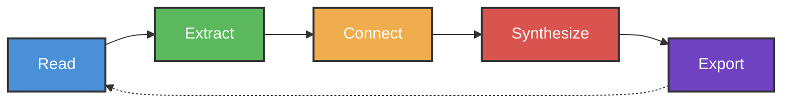
```mermaid
graph LR
    A[Read] --> B[Extract]
    B --> C[Connect]
    C --> D[Synthesize]
    D --> E[Export]
    E -.-> A
    
    style A fill:#4a90d9,stroke:#333,stroke-width:2px,color:#fff
    style B fill:#5cb85c,stroke:#333,stroke-width:2px,color:#fff
    style C fill:#f0ad4e,stroke:#333,stroke-width:2px,color:#fff
    style D fill:#d9534f,stroke:#333,stroke-width:2px,color:#fff
    style E fill:#6f42c1,stroke:#333,stroke-width:2px,color:#fff
```

### 4.2 Stage 1: Read

**Purpose**: Ingest documents and deeply read with annotation tools

**Activities**:
- Import documents (PDF, Word, images, web pages, text files)
- Render documents with native PDF viewer (not simple image conversion)
- Annotate with highlights, underlines, strikethroughs, text comments, voice comments, region selections, ink/stylus annotations
- Navigate with outline, thumbnails, search, and page jump
- Adjust view with zoom, rotation, continuous scroll, page-by-page, side-by-side
- AI-assisted reading: auto-generated summary, key findings extraction, methodology identification

**Input**: Document files, web URLs, clipboard content
**Output**: Annotated documents with rich metadata

### 4.3 Stage 2: Extract

**Purpose**: Transform annotations and document content into structured, reusable knowledge units

**Activities**:
- Auto-extract all highlights and comments into structured cards
- AI-extract key entities: people, organisations, dates, chemicals, genes, legal terms
- AI-extract claims, findings, methodologies, limitations
- Extract tables and figures with OCR and structure preservation
- Extract citations and references with auto-resolution
- Create knowledge cards from any selection (text, image, table, annotation)

**Input**: Annotations, document content, AI extraction prompts
**Output**: Structured knowledge cards, entity lists, extracted tables/figures

### 4.4 Stage 3: Connect

**Purpose**: Build visual and semantic relationships between knowledge units

**Activities**:
- Drag knowledge cards onto research board (infinite canvas)
- Draw connections between cards with relationship labels (supports, contradicts, extends, cites)
- Create hierarchical structures (argument trees, taxonomies)
- Create temporal structures (timelines, sequences)
- Create spatial structures (concept maps, system diagrams)
- AI-suggested connections based on semantic similarity and citation relationships
- Bidirectional linking between cards and source documents

**Input**: Knowledge cards, user connections, AI suggestions
**Output**: Visual knowledge graph on research board

### 4.5 Stage 4: Synthesize

**Purpose**: Generate new insights, summaries, and arguments from connected knowledge

**Activities**:
- AI chat with single document (grounded in annotations and text)
- AI chat across multiple documents (multi-document reasoning with citations)
- AI-generated synthesis: literature review sections, argument summaries, gap analyses
- AI-generated comparisons: methodology comparison, results comparison, conclusion comparison
- AI-generated critiques: limitation analysis, bias detection, strength assessment
- All AI outputs include inline citations with links to source annotations

**Input**: Knowledge graph, user queries, AI prompts
**Output**: Synthesised text with citations, comparison tables, critique reports

### 4.6 Stage 5: Export

**Purpose**: Transform research workspace into professional deliverables

**Activities**:
- Export annotated documents (PDF with annotations embedded)
- Export knowledge board as image, PDF, or interactive web page
- Export AI conversations as structured notes with citations
- Export citations in standard formats (BibTeX, RIS, Zotero, EndNote, APA, MLA, Chicago, Bluebook)
- Export synthesised content to Word, LaTeX, Markdown, Google Docs, PowerPoint
- Export research board to presentation slides with embedded citations
- One-click export of complete research package (all documents, annotations, notes, citations)

**Input**: Research workspace content, user export preferences
**Output**: Professional deliverables in requested format

---

## 5. Functional Modules

### 5.1 Module: Project Management

**Module ID**: MOD-PROJECT  
**Priority**: P0 (MVP)  
**Owner**: Product Team

#### Feature: Project Creation

- **Feature name**: Create Research Project
- **User story**: As a researcher, I want to create a dedicated workspace for each research project so that I can keep documents, annotations, and knowledge organised by topic.
- **Functional behaviour**: User creates a new project with name, description, colour tag, and optional template. Project becomes the container for all documents, annotations, AI conversations, and knowledge boards.
- **Input**: Project name (required), description (optional), colour tag (optional), template selection (optional), confidentiality level (optional)
- **Output**: New project workspace with unique ID, created timestamp, and default folders
- **Edge cases**: Duplicate project name (auto-append number), empty name (validation error), maximum projects reached (upgrade prompt)
- **Validation rules**: Name must be 1–200 characters; description max 2000 characters; must not duplicate existing project name for the same user
- **Acceptance criteria**: 
  - Given a user is on the dashboard, when they click "New Project" and enter a valid name, then a new project workspace is created and opened within 2 seconds.
  - Given a user enters a duplicate project name, when they submit, then an inline validation message appears suggesting a unique name.

#### Feature: Project Organisation

- **Feature name**: Project Folder Structure
- **User story**: As a researcher, I want to organise documents within a project using folders and tags so that I can find documents quickly in large projects.
- **Functional behaviour**: Users can create folders, subfolders, and apply multiple tags to documents. Drag-and-drop document organisation. Smart folders based on filters (e.g., "All documents with AI summary").
- **Input**: Folder name, parent folder, tag names, filter criteria for smart folders
- **Output**: Updated project tree structure
- **Edge cases**: Circular folder references (prevented), deeply nested folders (max 10 levels), special characters in names (sanitised)
- **Validation rules**: Folder name 1–100 characters; max 100 tags per document; tag name 1–50 characters
- **Acceptance criteria**: 
  - Given a user is in a project, when they create a folder and drag documents into it, then the documents are moved and the tree updates immediately.
  - Given a user applies a tag, when they search by that tag, then all tagged documents appear in results.

#### Feature: Project Templates

- **Feature name**: Project Templates
- **User story**: As a researcher, I want to start from a pre-configured project template so that I don't have to set up the same folder structure every time.
- **Functional behaviour**: System provides templates: Blank, Literature Review, Case Study, Lab Notebook, Patent Analysis, Consulting Engagement. Templates include pre-configured folders, tags, and knowledge board layouts.
- **Input**: Template selection
- **Output**: New project with pre-configured structure
- **Edge cases**: Template deleted (fallback to blank), custom template creation (post-MVP)
- **Validation rules**: Template must exist in system or user library
- **Acceptance criteria**: 
  - Given a user selects "Literature Review" template, when the project is created, then it contains folders for "To Read", "Reading", "Read", "Key Papers", and a pre-configured knowledge board with literature review structure.

---

### 5.2 Module: Document Management

**Module ID**: MOD-DOCUMENT  
**Priority**: P0 (MVP)  
**Owner**: Product Team

#### Feature: Document Import

- **Feature name**: Import Documents
- **User story**: As a researcher, I want to import documents from my computer, cloud storage, or the web so that I can work with all my research materials in one place.
- **Functional behaviour**: Multi-file upload via drag-and-drop or file picker. Supported formats: PDF, DOCX, TXT, RTF, HTML, Markdown, images (PNG, JPG, TIFF). Web import via URL or browser extension. Cloud import from Google Drive, Dropbox, OneDrive (post-MVP). Zotero/Mendeley import (post-MVP).
- **Input**: File(s), URL, cloud storage path, reference manager library
- **Output**: Imported documents with auto-extracted metadata (title, author, date, abstract if available), thumbnail preview, and processing status
- **Edge cases**: Corrupted PDF (error with recovery attempt), password-protected PDF (prompt for password), oversized file (max 100MB per file, 500MB per batch), unsupported format (error with format list)
- **Validation rules**: File must be supported format; size must be within limits; URL must be accessible
- **Acceptance criteria**: 
  - Given a user drags 10 PDFs onto the project workspace, when the upload completes, then all documents appear with thumbnails and metadata within 30 seconds per document.
  - Given a user imports a password-protected PDF, when the import is attempted, then a password prompt appears and the document unlocks upon correct entry.

#### Feature: Document Viewer

- **Feature name**: PDF Document Viewer
- **User story**: As a researcher, I want to read documents with a high-quality, responsive viewer so that I can annotate and navigate efficiently.
- **Functional behaviour**: Native PDF rendering (not image-based). Multiple view modes: single page, continuous scroll, side-by-side, fit width, fit page, custom zoom (10%–500%). Navigation: page thumbnails, document outline/bookmarks, search with highlighting, page jump, previous/next annotation. Text selection with copy. Annotation layer overlay.
- **Input**: PDF document, user view preferences
- **Output**: Rendered document page with annotation overlay
- **Edge cases**: Malformed PDF (graceful degradation with error message), missing fonts (fallback rendering), very large PDFs (lazy loading), scanned PDFs (OCR indicator)
- **Validation rules**: Document must be successfully parsed; rendering must complete within 3 seconds for first page
- **Acceptance criteria**: 
  - Given a user opens a 500-page PDF, when the first page renders, then it appears within 2 seconds and subsequent pages load on demand without blocking.
  - Given a user searches for a term, when results are found, then all occurrences are highlighted and navigable with a result counter.

#### Feature: Document Metadata

- **Feature name**: Document Metadata Editor
- **User story**: As a researcher, I want to view and edit document metadata so that my references are accurate and searchable.
- **Functional behaviour**: Auto-extract and display metadata: title, authors, publication date, journal/source, DOI, URL, abstract, keywords. Manual editing of all fields. Auto-citation preview. Metadata export to reference manager formats.
- **Input**: Document content, user edits, external database lookups (Crossref, PubMed, arXiv)
- **Output**: Structured metadata with confidence scores for auto-extracted fields
- **Edge cases**: Metadata extraction fails (manual entry mode), conflicting metadata from multiple sources (user selection), missing DOI (search and suggest)
- **Validation rules**: Title required; date must be valid format; DOI must match pattern if provided
- **Acceptance criteria**: 
  - Given a user imports an academic PDF, when the metadata is extracted, then at least title and authors are auto-populated with 90% accuracy for standard academic papers.

---

### 5.3 Module: Annotation Engine

**Module ID**: MOD-ANNOTATION  
**Priority**: P0 (MVP)  
**Owner**: Product Team

#### Feature: Text Highlighting

- **Feature name**: Text Highlighting and Underlining
- **User story**: As a researcher, I want to highlight and underline text in documents so that I can mark important passages for later reference.
- **Functional behaviour**: Select text and apply highlight (yellow, green, blue, pink, orange, purple) or underline. Multiple non-overlapping highlights per page. Highlights are persistent, saved automatically, and exportable. Highlights appear in annotation sidebar with context preview.
- **Input**: Text selection, colour choice, annotation type (highlight/underline)
- **Output**: Persistent annotation layer on document, entry in annotation list
- **Edge cases**: Overlapping highlights (merge or stack options), highlight across page break (continuous), text in image/scanned PDF (OCR required indicator)
- **Validation rules**: Selection must be non-empty; colour must be from defined palette; must be within document bounds
- **Acceptance criteria**: 
  - Given a user selects text and clicks the yellow highlight button, when the action completes, then the text is highlighted, an entry appears in the annotation sidebar, and the annotation persists after reload.

#### Feature: Margin Comments

- **Feature name**: Margin Comments and Notes
- **User story**: As a researcher, I want to add comments and notes to specific passages so that I can record my thoughts and analysis alongside the text.
- **Functional behaviour**: Attach text comments to highlights, text selections, or page regions. Rich text support (bold, italic, lists). Comment threads (reply to comments). Comment visibility toggle. Comment search across project.
- **Input**: Text content, attachment point (highlight, selection, or page region), comment type (inline or margin)
- **Output**: Comment annotation linked to document location, displayed in margin or overlay
- **Edge cases**: Very long comment (expand/collapse), comment on deleted highlight (orphan handling), comment resolution (mark as resolved/followed-up)
- **Validation rules**: Comment content max 10,000 characters; must be attached to valid document location
- **Acceptance criteria**: 
  - Given a user adds a comment to a highlighted passage, when another user (collaborator) views the document, then the comment is visible in the margin and linked to the highlight.

#### Feature: Region Annotations

- **Feature name**: Region and Area Annotations
- **User story**: As a researcher, I want to annotate regions of a page (figures, tables, diagrams) so that I can mark and comment on non-text elements.
- **Functional behaviour**: Draw rectangular or freehand regions on any part of the page. Attach comments to regions. Region annotations work on images, figures, charts, and scanned pages. OCR extraction from region ("extract text from this figure").
- **Input**: Region geometry (coordinates), comment text (optional), extraction request (optional)
- **Output**: Region annotation on document, extracted content if requested
- **Edge cases**: Region partially off-page (clip to page bounds), region on rotated page (transform coordinates), very small region (minimum size warning)
- **Validation rules**: Region must intersect with page; minimum area 100px²; maximum area page size
- **Acceptance criteria**: 
  - Given a user draws a rectangle around a figure, when they add a comment, then the region is saved and the comment is linked to that region.

#### Feature: Ink/Stylus Annotations

- **Feature name**: Ink and Stylus Annotations
- **User story**: As a researcher using a tablet or stylus, I want to handwrite notes and draw on documents so that I can annotate naturally.
- **Functional behaviour**: Freehand ink drawing with pressure sensitivity (where supported). Multiple pen colours and thicknesses. Eraser tool. Ink annotations are vector-based and scalable. Optional: handwriting recognition to convert ink to text.
- **Input**: Pen/stylus input (coordinates, pressure, colour, thickness)
- **Output**: Vector ink path on annotation layer
- **Edge cases**: Palm rejection (touch vs stylus), ink on zoomed page (scale with zoom), ink export (embed in PDF or separate layer)
- **Validation rules**: Input must be from stylus or touch in ink mode; minimum stroke length 5px
- **Acceptance criteria**: 
  - Given a user draws a circle around a paragraph with a stylus, when the ink is saved, then it appears at the correct location and scales appropriately with zoom.

#### Feature: Annotation Sidebar

- **Feature name**: Annotation Sidebar and List
- **User story**: As a researcher, I want to see all my annotations in a structured list so that I can navigate, search, and manage them efficiently.
- **Functional behaviour**: Sidebar showing all annotations in the current document with: type icon, colour indicator, context preview (surrounding text), comment snippet, page number, timestamp. Sort by: page order, date created, type, colour. Filter by: type, colour, date range, search term. Click to jump to annotation location. Bulk actions: delete, export, change colour.
- **Input**: Document annotations, user sort/filter preferences
- **Output**: Filtered, sorted annotation list with navigation
- **Edge cases**: Hundreds of annotations (virtual scrolling), all annotations filtered out (empty state), annotation on deleted page (show warning)
- **Validation rules**: Filter must be valid combination; sort must be valid field
- **Acceptance criteria**: 
  - Given a document with 50 annotations, when the user opens the annotation sidebar, then all annotations are listed with context previews and the list scrolls smoothly without lag.

---

### 5.4 Module: AI Document Intelligence

**Module ID**: MOD-AI  
**Priority**: P0 (MVP)  
**Owner**: AI Team

#### Feature: AI Document Chat

- **Feature name**: Chat with Document
- **User story**: As a researcher, I want to ask questions about a document and receive accurate, cited answers so that I can understand complex content faster.
- **Functional behaviour**: Conversational AI panel alongside the document viewer. User asks questions in natural language. AI answers based on document content, with inline citations showing page numbers and quoted passages. AI can reference user annotations ("What did I highlight about methodology?"). Conversation history is saved and searchable. Supports follow-up questions with context.
- **Input**: User question (text), document content, user annotations, conversation history
- **Output**: AI answer with inline citations, confidence indicator, and suggested follow-up questions
- **Edge cases**: Question outside document scope ("I don't know" with honesty), ambiguous question (clarification request), document not yet processed ("Please wait" with progress), hallucination prevention (citation verification)
- **Validation rules**: Question must be non-empty (max 2000 chars); document must be processed; citations must map to actual document locations
- **Acceptance criteria**: 
  - Given a user asks "What methodology did the authors use?" about a processed document, when the AI responds, then the answer includes a citation to the specific page and paragraph where the methodology is described, and the cited text is verifiable in the document.
  - Given a user asks a question unrelated to the document, when the AI responds, then it clearly states the answer is not found in the document rather than hallucinating.

#### Feature: AI Summary Generation

- **Feature name**: Auto-Generate Document Summary
- **User story**: As a researcher, I want an AI-generated summary of a document so that I can quickly grasp its key points before deep reading.
- **Functional behaviour**: One-click summary generation with adjustable length (brief, standard, detailed). Summary includes: key findings, methodology, main arguments, limitations, and relevance assessment. Summary is saved and editable. Can be regenerated with different focus (methodology-heavy, results-heavy, critique-focused).
- **Input**: Document content, user preference (length, focus)
- **Output**: Structured summary with sections, confidence scores, and links to source passages
- **Edge cases**: Very short document (summary may be limited), non-standard document (poetry, fiction — adapt style), document in foreign language (auto-detect and offer translation)
- **Validation rules**: Document must be processed; summary must be factual and verifiable
- **Acceptance criteria**: 
  - Given a 20-page academic paper, when the user clicks "Generate Summary", then a structured summary appears within 10 seconds with key findings, methodology, and limitations sections.

#### Feature: Multi-Document AI Chat

- **Feature name**: Chat Across Multiple Documents
- **User story**: As a researcher, I want to ask questions that span multiple documents so that I can synthesise findings across my entire research corpus.
- **Functional behaviour**: User selects 2–50 documents and asks a question. AI synthesises an answer drawing from all selected documents, with per-document citations. Identifies agreements, contradictions, and gaps across documents. Can generate structured comparison tables. Supports "Compare" and "S synthesise" modes.
- **Input**: User question, selected document set (2–50), user annotations from those documents
- **Output**: Synthesised answer with per-document citations, comparison matrix, and gap identification
- **Edge cases**: No relevant information in selected documents (honest decline), contradictory findings (present both sides with sources), too many documents (summarise and prioritise), documents in different languages (translate and compare)
- **Validation rules**: Minimum 2 documents selected; all documents must be processed; citations must be traceable
- **Acceptance criteria**: 
  - Given a user selects 10 papers and asks "Compare the methodologies used across these studies", when the AI responds, then a structured comparison table appears with each methodology described and cited to its source paper.

#### Feature: AI Extraction

- **Feature name**: AI-Powered Content Extraction
- **User story**: As a researcher, I want AI to extract structured information from documents so that I don't have to manually copy data into tables.
- **Functional behaviour**: Extract structured data based on user prompts: "Extract all experimental parameters into a table", "Extract all cited references with their claims", "Extract timeline of events". AI produces structured output (table, list, timeline) with citations to source locations. Exportable to CSV, Excel, Markdown.
- **Input**: User extraction prompt, document content
- **Output**: Structured data table/list with source citations
- **Edge cases**: Ambiguous extraction request (clarification), no matching data found (empty result with explanation), conflicting data (flag and present both)
- **Validation rules**: Prompt must be clear and specific; extracted data must be traceable to source
- **Acceptance criteria**: 
  - Given a user requests "Extract all chemical compounds and their properties", when the AI processes the document, then a table appears with compound names, properties, and page number citations for each entry.

---

### 5.5 Module: Knowledge Board

**Module ID**: MOD-BOARD  
**Priority**: P0 (MVP)  
**Owner**: Product Team

#### Feature: Infinite Canvas Board

- **Feature name**: Research Board (Infinite Canvas)
- **User story**: As a researcher, I want an infinite canvas where I can visually organise my research so that I can see connections and build arguments spatially.
- **Functional behaviour**: Pan and zoom infinite canvas. Add cards (text, images, extracted highlights, AI summaries, embedded documents). Draw connections between cards with relationship labels. Create groups/containers. Multiple boards per project. Board templates (argument map, timeline, concept map, Venn diagram). Background options (grid, dots, blank, custom colour).
- **Input**: User actions (drag, drop, draw, type), card content, connection definitions
- **Output**: Persistent visual board layout
- **Edge cases**: Very large board (performance optimisation), lost card off-screen (minimap navigation), accidental deletion (undo/redo, 50 steps)
- **Validation rules**: Board name required; max 10,000 cards per board; max 100 boards per project
- **Acceptance criteria**: 
  - Given a user creates a board and adds 50 cards with connections, when they pan and zoom, then the board remains responsive (60fps) and all cards are renderable.

#### Feature: Knowledge Cards

- **Feature name**: Knowledge Cards on Board
- **User story**: As a researcher, I want to create cards that represent ideas, quotes, or findings so that I can arrange them visually on my research board.
- **Functional behaviour**: Cards support: text (rich text, markdown), images, extracted highlights (with source link), AI summaries, embedded document previews, checklist items, colour coding, tags, and size variants (small, medium, large). Cards can be duplicated, grouped, and linked. Cards maintain bidirectional links to source documents.
- **Input**: Card content, type, position, size, colour, tags
- **Output**: Rendered card on board with interactive handles
- **Edge cases**: Very long text (auto-expand with scroll), many cards in small area (collision detection, auto-arrange), card with broken source link (show warning)
- **Validation rules**: Content max 50,000 chars per card; position must be within canvas bounds; colour from defined palette
- **Acceptance criteria**: 
  - Given a user creates a text card with a quote from a paper, when they click the source link, then the document opens to the exact page of the quote.

#### Feature: Connections and Relationships

- **Feature name**: Draw Connections Between Cards
- **User story**: As a researcher, I want to draw connections between cards and label the relationship so that I can visualise how ideas relate to each other.
- **Functional behaviour**: Draw lines/arrows between cards. Relationship types: "supports", "contradicts", "extends", "cites", "causes", "is part of", "relates to", and custom labels. Line styles: solid, dashed, dotted, coloured. Connection labels are editable and can be positioned along the line. Curved or straight lines. Directional or bidirectional arrows.
- **Input**: Source card, target card, relationship type, line style, label
- **Output**: Visual connection on board with label
- **Edge cases**: Card deleted (connection shows warning or auto-removes), self-connection (loop allowed with warning), very long label (truncate with tooltip)
- **Validation rules**: Both cards must exist; relationship type must be valid or custom; label max 100 chars
- **Acceptance criteria**: 
  - Given a user draws a connection from Card A to Card B and labels it "contradicts", when the connection is saved, then the label appears along the line and the connection is persistent after reload.

#### Feature: AI-Suggested Connections

- **Feature name**: AI-Suggested Connections
- **User story**: As a researcher, I want AI to suggest connections between my cards so that I can discover relationships I might have missed.
- **Functional behaviour**: AI analyses card content and suggests potential connections with relationship type and confidence score. User can accept, reject, or modify suggestions. Suggestions based on: semantic similarity, shared entities, citation relationships, temporal proximity, and logical inference.
- **Input**: Board cards and their content, AI analysis
- **Output**: List of suggested connections with confidence scores and rationale
- **Edge cases**: Low confidence suggestions (filter threshold), conflicting suggestions (prioritise), too many suggestions (batch and prioritise)
- **Validation rules**: Suggestion must link existing cards; confidence score must be provided; rationale must be verifiable
- **Acceptance criteria**: 
  - Given a board with 20 cards about a research topic, when the user requests AI suggestions, then 5–10 meaningful connections are proposed with explanations within 5 seconds.

---

### 5.6 Module: Knowledge Graph

**Module ID**: MOD-GRAPH  
**Priority**: P1 (V1.0)  
**Owner**: AI Team

#### Feature: Citation-Native Knowledge Graph

- **Feature name**: Knowledge Graph View
- **User story**: As a researcher, I want to see my research as a semantic knowledge graph where every node is a cited source so that I can trace every claim to its origin.
- **Functional behaviour**: Automatic graph generation from research board connections. Nodes represent: documents, extracted claims, entities (people, organisations, chemicals), concepts, and user notes. Edges represent: citations, support, contradiction, causation, and custom relationships. Interactive graph with force-directed layout, hierarchical layout, and circular layout options. Node size by importance/centrality. Colour coding by node type. Search and filter within graph. Click node to see details and source.
- **Input**: Board content, document metadata, AI-extracted entities and relationships
- **Output**: Interactive knowledge graph with navigable nodes and edges
- **Edge cases**: Isolated nodes (show in separate list), very large graph (clustering, performance), circular references (detect and display)
- **Validation rules**: Every claim node must have at least one citation edge; every document node must link to actual document
- **Acceptance criteria**: 
  - Given a project with 10 documents and 50 knowledge cards, when the user opens the knowledge graph view, then an interactive graph appears within 5 seconds with all nodes and edges rendered and clickable.

#### Feature: Graph Exploration

- **Feature name**: Explore Knowledge Graph
- **User story**: As a researcher, I want to explore my knowledge graph to find related concepts and trace evidence chains so that I can build stronger arguments.
- **Functional behaviour**: Click any node to see its neighbourhood (connected nodes). Expand/collapse node neighbourhoods. Pathfinding between two nodes ("How does this claim connect to that evidence?"). Filter by node type, relationship type, or date range. Time-based graph animation (show how knowledge evolved). Save graph views as bookmarks.
- **Input**: User click/filter actions, graph data
- **Output**: Filtered/explored graph view with path highlighting
- **Edge cases**: No path between nodes (message shown), filtered graph empty (adjust filters prompt), very long path (truncate with "show more")
- **Validation rules**: Path must exist in graph data; filters must be valid; bookmarks must have unique names
- **Acceptance criteria**: 
  - Given a user clicks a claim node, when the neighbourhood expands, then all directly connected nodes are highlighted and the connection labels are visible.

---

### 5.7 Module: Citation Engine

**Module ID**: MOD-CITATION  
**Priority**: P1 (V1.0)  
**Owner**: Product Team

#### Feature: Citation Extraction

- **Feature name**: Auto-Extract Citations
- **User story**: As a researcher, I want citations and references to be automatically extracted from documents so that I don't have to manually type bibliography entries.
- **Functional behaviour**: AI extracts all in-text citations and reference list entries from documents. Matches extracted citations against Crossref, PubMed, arXiv, and other databases. Resolves DOIs automatically. Identifies citation style (APA, MLA, Chicago, Vancouver, IEEE, etc.). Flags incomplete or broken citations.
- **Input**: Document content, external database APIs
- **Output**: Structured citation list with resolved metadata, DOIs, and confidence scores
- **Edge cases**: Citation not found in database (manual entry prompt), ambiguous citation (multiple matches — user selection), non-standard citation format (best-effort parsing with warning)
- **Validation rules**: Citation must have at least author and title or DOI; DOI must match regex pattern if present
- **Acceptance criteria**: 
  - Given a standard academic PDF with a reference list, when the AI extracts citations, then at least 90% of references are correctly parsed with author, title, and year within 10 seconds.

#### Feature: Citation Export

- **Feature name**: Export Citations in Standard Formats
- **User story**: As a researcher, I want to export my citations in the format required by my thesis, journal, or institution so that I can meet submission requirements.
- **Functional behaviour**: Export citations in formats: BibTeX, RIS, Zotero RDF, EndNote XML, and formatted text (APA 7th, MLA 9th, Chicago 17th, Harvard, Vancouver, IEEE, Bluebook, ALWD). Citation style selection per project or per export. Export entire project bibliography or selected citations. "Cited in this document" filter for automatic reference list generation.
- **Input**: Citation library, selected citations, output format, style guide
- **Output**: Formatted citation file or text
- **Edge cases**: Citation missing required field for style (flag and offer fix), mixed citation types (handle gracefully), very large bibliography (batch export)
- **Validation rules**: Output format must be supported; style must be supported; all citations must have minimum required fields
- **Acceptance criteria**: 
  - Given a user selects 20 citations and chooses "APA 7th", when they export, then a properly formatted reference list is generated with hanging indents and correct author-date format.

#### Feature: Citation in AI Output

- **Feature name**: Cited AI Output
- **User story**: As a researcher, I want every AI-generated claim to include a citation to its source so that I can verify the information and use it in my writing.
- **Functional behaviour**: All AI-generated summaries, comparisons, and syntheses include inline citations with: source document name, page number, and quoted passage. Citations are clickable links that open the source document to the cited location. Citation format is configurable. Users can verify citations (highlight cited passage in source). AI includes confidence level for each claim.
- **Input**: AI-generated text, source documents and annotations
- **Output**: Cited text with inline references and confidence indicators
- **Edge cases**: Citation to deleted document (show warning), page number changed due to edits (update or warn), multiple sources for same claim (list all)
- **Validation rules**: Every claim must have at least one citation; citation must be verifiable; confidence must be stated
- **Acceptance criteria**: 
  - Given an AI summary of a document, when the user clicks an inline citation, then the source document opens to the exact page and the cited passage is highlighted.

---

### 5.8 Module: Export Engine

**Module ID**: MOD-EXPORT  
**Priority**: P1 (V1.0)  
**Owner**: Product Team

#### Feature: Document Export

- **Feature name**: Export Annotated Documents
- **User story**: As a researcher, I want to export documents with my annotations embedded so that I can share my marked-up documents with others.
- **Functional behaviour**: Export PDF with annotations embedded (highlights, comments, ink). Export annotation summary as separate document. Options: include/exclude comments, include/exclude highlights, flatten annotations, export only annotation list. Maintain annotation colours and metadata.
- **Input**: Document with annotations, export preferences
- **Output**: PDF with embedded annotations or annotation summary document
- **Edge cases**: Ink annotations may not render in all PDF viewers (warning), very large annotation count ( optimise), password-protected output (optional encryption)
- **Validation rules**: Document must have annotations to export; format must be supported
- **Acceptance criteria**: 
  - Given a document with 20 highlights and 10 comments, when the user exports with annotations, then the output PDF contains all highlights and comments visible in standard PDF viewers.

#### Feature: Board Export

- **Feature name**: Export Research Board
- **User story**: As a researcher, I want to export my research board as an image or PDF so that I can include it in presentations or reports.
- **Functional behaviour**: Export board as: PNG (current view or full board), PDF (vector or raster), SVG (vector), interactive HTML (clickable links to sources). Options: include background, include card source links, include connection labels, resolution selection. Automatic pagination for very large boards.
- **Input**: Board layout, card content, connections, export preferences
- **Output**: Image, PDF, SVG, or HTML file
- **Edge cases**: Very large board (memory warning, tile export), cards with broken links (export with warning), text overflow on cards (auto-adjust or truncate)
- **Validation rules**: Board must exist; export format must be supported; resolution must be within bounds
- **Acceptance criteria**: 
  - Given a board with 30 cards and connections, when the user exports as PNG, then a clear, high-resolution image is generated within 5 seconds.

#### Feature: Synthesis Export

- **Feature name**: Export AI Synthesis
- **User story**: As a researcher, I want to export AI-generated syntheses with embedded citations so that I can use them as drafts in my writing.
- **Functional behaviour**: Export AI chat conversations and syntheses to: Word (.docx), LaTeX (.tex), Markdown (.md), Google Docs (via API), plain text. Citations are preserved as formatted references or field codes. Footnotes or endnotes option. Export with or without AI conversation history. Export with or without confidence indicators.
- **Input**: AI conversation/synthesis, citation library, export preferences
- **Output**: Formatted document with embedded citations
- **Edge cases**: Citation style not available (fallback to default), unsupported formatting (graceful degradation), very long synthesis (pagination)
- **Validation rules**: Content must exist; format must be supported; citations must be resolvable
- **Acceptance criteria**: 
  - Given an AI synthesis with 10 inline citations, when the user exports to Word, then a .docx file is generated with all citations formatted as footnotes with proper style.

---

### 5.9 Module: Collaboration

**Module ID**: MOD-COLLAB  
**Priority**: P1 (V1.0)  
**Owner**: Product Team

#### Feature: Real-Time Collaboration

- **Feature name**: Real-Time Collaborative Research
- **User story**: As a research team member, I want to work on the same project with my colleagues in real time so that we can collaborate efficiently without version conflicts.
- **Functional behaviour**: Multiple users can view and edit the same project simultaneously. Real-time cursor and selection indicators. Real-time annotation updates. Real-time board changes. Presence indicators (who is viewing what). Comment threads with @mentions. Conflict resolution for simultaneous edits (last-write-wins with notification). Activity feed showing recent changes.
- **Input**: User actions, document edits, annotation changes, board modifications
- **Output**: Synchronised project state across all connected users
- **Edge cases**: Offline user comes back online (sync with conflict resolution), very large team (100+ users — performance considerations), user edits deleted content (error with recovery)
- **Validation rules**: User must have edit permission; changes must be valid; conflicts must be resolved with user awareness
- **Acceptance criteria**: 
  - Given two users are viewing the same document, when one user adds a highlight, then the other user sees the highlight appear within 1 second.

#### Feature: Sharing and Permissions

- **Feature name**: Share Projects with Permissions
- **User story**: As a project owner, I want to share my research project with specific people and control what they can do so that I can collaborate securely.
- **Functional behaviour**: Share via email invitation or link. Permission levels: Viewer (read-only), Commenter (add comments only), Editor (full edit), Admin (manage sharing). Share entire project or specific documents/boards. Set expiration dates for links. Revoke access at any time. View access audit log. Password-protected sharing option.
- **Input**: Recipient email or link generation, permission level, expiration date, password
- **Output**: Invitation sent or shareable link generated; access control updated
- **Edge cases**: Recipient already has access (update permissions), link shared publicly (warning for sensitive content), expired link (access denied with message)
- **Validation rules**: Email must be valid; permission must be valid level; expiration must be future date if set
- **Acceptance criteria**: 
  - Given a user shares a project with "viewer" permission, when the recipient opens the link, then they can view all content but cannot add annotations or edit.

#### Feature: Comment Threads

- **Feature name**: Comment Threads and Mentions
- **User story**: As a collaborator, I want to start comment threads on specific annotations or board cards and mention colleagues so that we can discuss research findings asynchronously.
- **Functional behaviour**: Start thread on any annotation, card, or document region. Reply in nested threads. @mention users to send notifications. Resolve threads (mark as resolved with optional summary). Thread visibility: private (only participants), team (all project members), or public (if shared). Thread search across project.
- **Input**: Thread location, comment text, mentions, visibility setting
- **Output**: Thread with comments, notifications sent, thread status
- **Edge cases**: Mentioned user not in project (invite prompt), thread on deleted content (archived with reference), very long thread (collapse with "show more")
- **Validation rules**: Thread must be attached to existing content; comment must be non-empty; mention must be valid user
- **Acceptance criteria**: 
  - Given a user starts a thread on a highlight and @mentions a colleague, when the colleague is online, then they receive a notification within 5 seconds and can reply to the thread.

---

### 5.10 Module: User Management

**Module ID**: MOD-USER  
**Priority**: P0 (MVP)  
**Owner**: Platform Team

#### Feature: User Authentication

- **Feature name**: User Sign-Up and Login
- **User story**: As a user, I want to sign up and log in to CiteMind so that I can access my research workspace securely.
- **Functional behaviour**: Email/password registration with verification. OAuth2 login (Google, Microsoft, Apple). SAML/SSO for enterprise (post-MVP). Password reset via email. Remember me option. Session management with timeout. Multi-factor authentication (MFA) for enterprise (post-MVP). Account lockout after failed attempts.
- **Input**: Email, password, OAuth token, SAML assertion
- **Output**: Authenticated session, JWT token, user profile
- **Edge cases**: Email already registered (suggest login), OAuth account already linked (merge or separate), expired verification link (resend)
- **Validation rules**: Email must be valid format; password must be 8+ chars with complexity; OAuth token must be valid
- **Acceptance criteria**: 
  - Given a user enters valid email and password, when they submit registration, then a verification email is sent and the account is created after verification.

#### Feature: User Profile

- **Feature name**: User Profile Management
- **User story**: As a user, I want to manage my profile and preferences so that CiteMind works the way I like.
- **Functional behaviour**: Edit profile: display name, avatar, institution/organisation, role, bio. Change password. Manage connected accounts (OAuth). View account usage (storage, projects, documents). Export personal data (GDPR). Delete account with data removal confirmation.
- **Input**: Profile fields, password, account action requests
- **Output**: Updated profile, confirmation messages, data exports
- **Edge cases**: Institution not in database (add new), avatar upload too large (max 5MB), account deletion with shared projects (transfer ownership prompt)
- **Validation rules**: Display name 1–100 chars; bio max 500 chars; avatar must be image under 5MB
- **Acceptance criteria**: 
  - Given a user updates their display name and uploads an avatar, when they save, then the profile updates immediately and the new name/avatar appears in the UI.

---

### 5.11 Module: Search & Discovery

**Module ID**: MOD-SEARCH  
**Priority**: P1 (V1.0)  
**Owner**: AI Team

#### Feature: Semantic Search

- **Feature name**: Semantic Search Across Projects
- **User story**: As a researcher, I want to search across all my documents, annotations, and notes using natural language so that I can find relevant content even when I don't remember exact keywords.
- **Functional behaviour**: Natural language search across: document text, annotations, comments, knowledge cards, AI conversations, and metadata. Semantic (vector) search finds conceptually related content even without keyword matches. Hybrid search combining keyword and semantic. Filters: document type, date range, project, annotation colour, author. Search results grouped by source with context snippets. Click to navigate to source.
- **Input**: Search query, filter criteria
- **Output**: Ranked results with relevance scores, context snippets, and source links
- **Edge cases**: No results (suggest related queries), ambiguous query (clarification suggestions), very large result set (pagination, clustering)
- **Validation rules**: Query must be non-empty (after trimming); filters must be valid; results must be from user's accessible content
- **Acceptance criteria**: 
  - Given a user searches "methodology for CRISPR screening", when results appear, then they include documents, annotations, and cards related to CRISPR methodology even if they don't contain the exact search phrase.

#### Feature: AI Discovery

- **Feature name**: AI-Powered Discovery
- **User story**: As a researcher, I want AI to suggest relevant documents and connections from my library so that I can discover related research I might have missed.
- **Functional behaviour**: AI analyses current project content and suggests: related documents from the user's library, relevant web sources (optional), connections between existing documents, and potential research gaps. Suggestions include rationale and relevance score. User can accept, reject, or save for later.
- **Input**: Current project content, user library, optional web search
- **Output**: Suggested documents, connections, and gaps with explanations
- **Edge cases**: User library empty (no suggestions), suggestions irrelevant (feedback improves future), privacy concerns (user controls web search)
- **Validation rules**: Suggestions must be from user's accessible content or public sources; relevance score must be provided; rationale must be verifiable
- **Acceptance criteria**: 
  - Given a project with 5 papers on a topic, when AI suggests related documents, then at least 3 relevant suggestions are made with explanations of why they relate.

---

### 5.12 Module: Integrations

**Module ID**: MOD-INTEGRATION  
**Priority**: P2 (V2.0)  
**Owner**: Platform Team

#### Feature: Reference Manager Sync

- **Feature name**: Sync with Reference Managers
- **User story**: As a researcher, I want to sync my CiteMind library with Zotero, Mendeley, or EndNote so that I can maintain one reference library across tools.
- **Functional behaviour**: Two-way sync with Zotero (via API), Mendeley (via API), and EndNote (via import/export). Sync documents, metadata, and collections/folders. Conflict resolution (last modified wins or manual). Automatic sync on schedule or manual trigger. Import from reference manager to CiteMind project. Export CiteMind citations to reference manager.
- **Input**: Reference manager API credentials, sync direction, conflict preference
- **Output**: Synchronised library with conflict log
- **Edge cases**: API rate limit (backoff and retry), item deleted in one system (confirm deletion), duplicate items (merge or keep separate)
- **Validation rules**: Credentials must be valid; sync direction must be valid; items must have minimum metadata
- **Acceptance criteria**: 
  - Given a user connects Zotero with 200 items, when sync completes, then all items appear in CiteMind with metadata and PDF links within 2 minutes.

#### Feature: Cloud Storage Import

- **Feature name**: Import from Cloud Storage
- **User story**: As a researcher, I want to import documents from Google Drive, Dropbox, or OneDrive so that I can bring in documents I already have stored.
- **Functional behaviour**: OAuth authentication with cloud providers. Browse folders and select files. Bulk import with progress indicator. Maintain folder structure as project organisation (optional). Sync option: keep CiteMind in sync with cloud folder (post-MVP).
- **Input**: Cloud provider OAuth, folder/file selection
- **Output**: Imported documents with preserved organisation
- **Edge cases**: OAuth token expired (re-authenticate prompt), file deleted from cloud (skip with warning), very large file (size limit warning)
- **Validation rules**: OAuth must be valid; files must be accessible and supported; size within limits
- **Acceptance criteria**: 
  - Given a user authenticates with Google Drive and selects a folder with 20 PDFs, when import completes, then all PDFs are imported with their folder structure preserved.

---

## 6. Document Import Workflow

### 6.1 Workflow Diagram

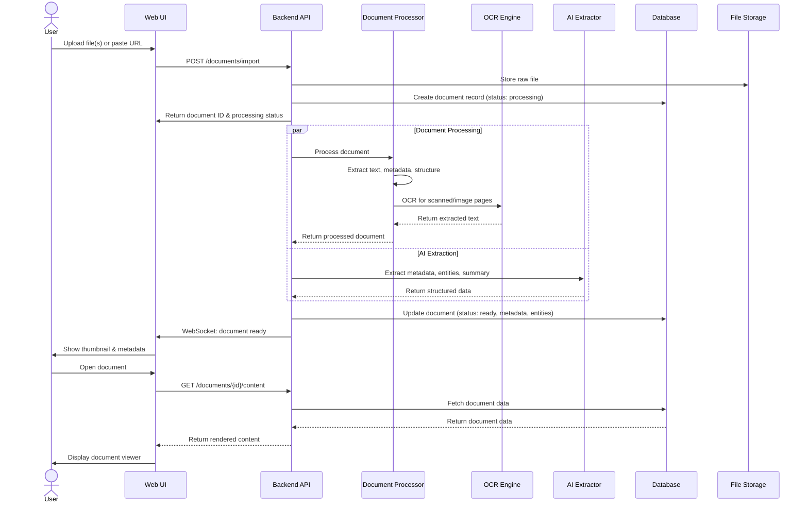
```mermaid
sequenceDiagram
    actor User
    participant UI as Web UI
    participant API as Backend API
    participant DP as Document Processor
    participant OCR as OCR Engine
    participant AI as AI Extractor
    participant DB as Database
    participant Storage as File Storage

    User->>UI: Upload file(s) or paste URL
    UI->>API: POST /documents/import
    API->>Storage: Store raw file
    API->>DB: Create document record (status: processing)
    API->>UI: Return document ID & processing status
    
    par Document Processing
        API->>DP: Process document
        DP->>DP: Extract text, metadata, structure
        DP->>OCR: OCR for scanned/image pages
        OCR-->>DP: Return extracted text
        DP-->>API: Return processed document
    and AI Extraction
        API->>AI: Extract metadata, entities, summary
        AI-->>API: Return structured data
    end
    
    API->>DB: Update document (status: ready, metadata, entities)
    API->>UI: WebSocket: document ready
    UI->>User: Show thumbnail & metadata
    User->>UI: Open document
    UI->>API: GET /documents/{id}/content
    API->>DB: Fetch document data
    DB-->>API: Return document data
    API-->>UI: Return rendered content
    UI->>User: Display document viewer
```

### 6.2 Detailed Steps

| Step | Actor | Action | System Response | Validation |
|---|---|---|---|---|
| 1 | User | Selects files or enters URL | Import dialog accepts input | File type and size validated |
| 2 | System | Uploads file to storage | Returns upload progress | Network integrity check |
| 3 | System | Creates document record | Returns document ID | UUID generated, user associated |
| 4 | System | Extracts text and structure | Parses PDF/DOCX/TXT | Parser validation, fallback for malformed |
| 5 | System | OCR if needed | Extracts text from images | OCR confidence threshold check |
| 6 | System | AI extracts metadata | Returns title, authors, etc. | Cross-reference with external DBs |
| 7 | System | AI generates summary | Returns structured summary | Factuality check against document |
| 8 | System | Updates document status | Marks as "ready" | All fields validated |
| 9 | System | Notifies user | Shows thumbnail and metadata | UI state update |
| 10 | User | Opens document | Viewer renders content | Content integrity check |

### 6.3 Supported Formats

| Format | Extension | Text Extraction | OCR | Annotation | Thumbnail | Priority |
|---|---|---|---|---|---|---|
| PDF | .pdf | ✓ | If scanned | ✓ | ✓ | P0 |
| Word | .docx | ✓ | N/A | Read-only | ✓ | P0 |
| Text | .txt, .md | ✓ | N/A | Read-only | ✓ | P0 |
| Rich Text | .rtf | ✓ | N/A | Read-only | ✓ | P1 |
| HTML | .html | ✓ | N/A | Read-only | ✓ | P1 |
| Image | .png, .jpg, .tiff | Via OCR | ✓ | Region only | ✓ | P1 |
| PowerPoint | .pptx | ✓ | N/A | Read-only | ✓ | P2 |
| Excel | .xlsx | ✓ | N/A | Read-only | ✓ | P2 |

### 6.4 Error Handling

| Error | User Message | Recovery Action |
|---|---|---|
| Unsupported format | "This file format is not supported. Try PDF, Word, or text files." | Allow retry with different file |
| File too large | "This file exceeds the 100MB limit. Try compressing or splitting it." | Suggest compression tools |
| Corrupted PDF | "This PDF appears corrupted. Try opening it in another viewer and re-saving." | Offer to attempt recovery |
| Password protected | "This PDF is password-protected. Please enter the password to unlock it." | Prompt for password |
| OCR failed | "We couldn't read text from this scanned page. You can still view the image." | Allow manual text entry |
| Processing timeout | "This document is taking longer to process. We'll notify you when it's ready." | Background processing with notification |
| Metadata extraction failed | "We couldn't auto-extract metadata. You can add it manually." | Show manual metadata form |

---

## 7. PDF Annotation Workflow

### 7.1 Workflow Diagram

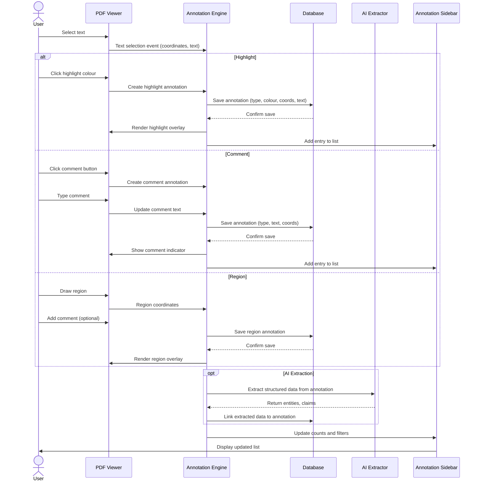
```mermaid
sequenceDiagram
    actor User
    participant Viewer as PDF Viewer
    participant AE as Annotation Engine
    participant DB as Database
    participant AI as AI Extractor
    participant Sidebar as Annotation Sidebar

    User->>Viewer: Select text
    Viewer->>AE: Text selection event (coordinates, text)
    
    alt Highlight
        User->>Viewer: Click highlight colour
        Viewer->>AE: Create highlight annotation
        AE->>DB: Save annotation (type, colour, coords, text)
        DB-->>AE: Confirm save
        AE->>Viewer: Render highlight overlay
        AE->>Sidebar: Add entry to list
    else Comment
        User->>Viewer: Click comment button
        Viewer->>AE: Create comment annotation
        User->>Viewer: Type comment
        Viewer->>AE: Update comment text
        AE->>DB: Save annotation (type, text, coords)
        DB-->>AE: Confirm save
        AE->>Viewer: Show comment indicator
        AE->>Sidebar: Add entry to list
    else Region
        User->>Viewer: Draw region
        Viewer->>AE: Region coordinates
        User->>Viewer: Add comment (optional)
        AE->>DB: Save region annotation
        DB-->>AE: Confirm save
        AE->>Viewer: Render region overlay
    end
    
    opt AI Extraction
        AE->>AI: Extract structured data from annotation
        AI-->>AE: Return entities, claims
        AE->>DB: Link extracted data to annotation
    end
    
    AE->>Sidebar: Update counts and filters
    Sidebar->>User: Display updated list
```

### 7.2 Annotation Types

| Type | Input Method | Visual | Metadata | Extraction |
|---|---|---|---|---|
| Highlight | Text select + colour button | Coloured background | Colour, text, page, coords | Text content auto-extracted |
| Underline | Text select + underline button | Underline | Colour, text, page, coords | Text content auto-extracted |
| Strikethrough | Text select + strikethrough button | Line through text | Text, page, coords | Text content auto-extracted |
| Comment | Text select or click + comment button | Icon in margin | Text, page, coords, thread | Text + comment extracted |
| Region | Draw rectangle or freehand | Border/fill overlay | Geometry, page, comment | OCR if image |
| Ink | Stylus/touch drawing | Vector path | Path data, colour, width | Handwriting recognition (optional) |
| Bookmark | Click + bookmark button | Bookmark icon | Page, label | Page reference |

### 7.3 Edge Cases

| Edge Case | Behaviour |
|---|---|
| Overlapping highlights | Merge or stack based on user preference; merged highlight shows combined colours or dominant colour |
| Highlight across page break | Continuous highlight rendered across pages; stored as single annotation with page range |
| Delete highlighted text in source | Annotation becomes "orphan"; shown in sidebar with "source unavailable" warning; preserved for reference |
| Annotation on rotated page | Coordinates transformed to account for rotation; visual renders correctly |
| Very large annotation count | Virtual scrolling in sidebar; performance optimisation in viewer (render only visible) |
| Annotation in scanned/image PDF | OCR required before text annotation; region annotation always available |

---

## 8. Highlight Extraction Workflow

### 8.1 Workflow Diagram

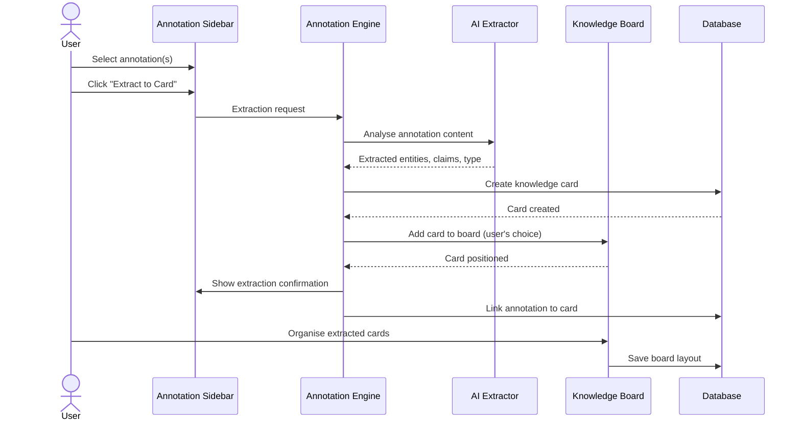
```mermaid
sequenceDiagram
    actor User
    participant Sidebar as Annotation Sidebar
    participant AE as Annotation Engine
    participant AI as AI Extractor
    participant KB as Knowledge Board
    participant DB as Database

    User->>Sidebar: Select annotation(s)
    User->>Sidebar: Click "Extract to Card"
    Sidebar->>AE: Extraction request
    
    AE->>AI: Analyse annotation content
    AI-->>AE: Extracted entities, claims, type
    
    AE->>DB: Create knowledge card
    DB-->>AE: Card created
    
    AE->>KB: Add card to board (user's choice)
    KB-->>AE: Card positioned
    
    AE->>Sidebar: Show extraction confirmation
    AE->>DB: Link annotation to card
    
    User->>KB: Organise extracted cards
    KB->>DB: Save board layout
```

### 8.2 Extraction Types

| Extraction Action | Source | Output | AI Processing |
|---|---|---|---|
| Extract to Card | Single highlight | Text card with source link | None (raw text) |
| Extract with AI | Single highlight | Card with summary + entities | Summarise, extract entities |
| Extract All | All highlights in document | Multiple cards, grouped by colour | Categorise by colour meaning |
| Extract to Table | Multiple highlights | Structured table (claims, evidence, source) | Structure as table with columns |
| Extract Timeline | Date-containing highlights | Chronological timeline | Extract and normalise dates |
| Extract Claims | Methodology/results highlights | Claim cards with evidence | Identify claim type and strength |

### 8.3 Validation Rules

- Extracted text must be non-empty after trimming
- Source link must be valid and verifiable
- Card content must not exceed 50,000 characters
- AI-extracted entities must have confidence scores ≥ 0.7
- Duplicate extractions (same text, same page) are flagged with "already extracted" warning

---

## 9. AI Chat with Document Workflow

### 9.1 Workflow Diagram

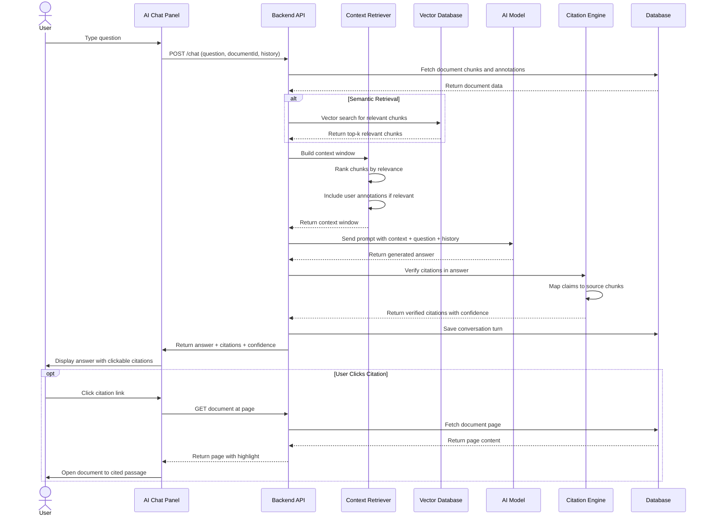
```mermaid
sequenceDiagram
    actor User
    participant Chat as AI Chat Panel
    participant API as Backend API
    participant Retriever as Context Retriever
    participant VDB as Vector Database
    participant AI as AI Model
    participant Citation as Citation Engine
    participant DB as Database

    User->>Chat: Type question
    Chat->>API: POST /chat (question, documentId, history)
    
    API->>DB: Fetch document chunks and annotations
    DB-->>API: Return document data
    
    alt Semantic Retrieval
        API->>VDB: Vector search for relevant chunks
        VDB-->>API: Return top-k relevant chunks
    end
    
    API->>Retriever: Build context window
    Retriever->>Retriever: Rank chunks by relevance
    Retriever->>Retriever: Include user annotations if relevant
    Retriever-->>API: Return context window
    
    API->>AI: Send prompt with context + question + history
    AI-->>API: Return generated answer
    
    API->>Citation: Verify citations in answer
    Citation->>Citation: Map claims to source chunks
    Citation-->>API: Return verified citations with confidence
    
    API->>DB: Save conversation turn
    API->>Chat: Return answer + citations + confidence
    Chat->>User: Display answer with clickable citations
    
    opt User Clicks Citation
        User->>Chat: Click citation link
        Chat->>API: GET document at page
        API->>DB: Fetch document page
        DB-->>API: Return page content
        API-->>Chat: Return page with highlight
        Chat->>User: Open document to cited passage
    end
```

### 9.2 Context Building Strategy

| Context Source | Priority | Inclusion Criteria | Max Tokens |
|---|---|---|---|
| User annotations (highlights + comments) | Highest | Always included if semantically relevant | 2,000 |
| Document sections matching query | High | Top 5 semantic matches | 4,000 |
| Document metadata (title, abstract) | Medium | Always included | 500 |
| Conversation history | Medium | Last 10 turns | 2,000 |
| Previous AI summaries | Low | If relevant | 1,000 |
| **Total Context Window** | | | **8,000–12,000** |

### 9.3 Citation Format

AI-generated answers include citations in this format:

```
The study found that CRISPR-Cas9 editing efficiency was 85% in primary cells [1]. 
However, off-target effects remained a concern [2].

[1] Smith et al. (2024), p. 345, "Editing efficiency reached 85% ± 3% in 
    primary human T cells..." — Document: Smith_CRISPR_2024.pdf
[2] Smith et al. (2024), p. 348, "Off-target cleavage was detected at 3 of 
    12 predicted sites..." — Document: Smith_CRISPR_2024.pdf
```

### 9.4 Edge Cases

| Scenario | Behaviour |
|---|---|
| Question outside document scope | "I don't have information about that in this document. Would you like me to search your other documents?" |
| Question about user annotations | AI includes annotation content in context: "You highlighted: 'Method X was superior' (p. 12)" |
| Ambiguous question | "Are you asking about X or Y? Please clarify so I can give you a precise answer." |
| Document not yet processed | "This document is still being processed. Please try again in a moment." with progress indicator |
| Citation verification fails | "I found this information, but I cannot verify the exact page number. The content appears in the document." |
| Very long answer | Collapse after 500 words with "Show more" button; maintain citation integrity |

---

## 10. Multi-Document Research Workflow

### 10.1 Workflow Diagram

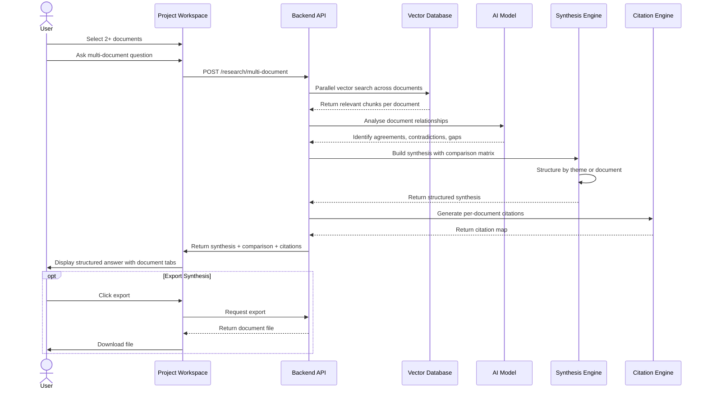
```mermaid
sequenceDiagram
    actor User
    participant UI as Project Workspace
    participant API as Backend API
    participant VDB as Vector Database
    participant AI as AI Model
    participant Synthesis as Synthesis Engine
    participant Citation as Citation Engine

    User->>UI: Select 2+ documents
    User->>UI: Ask multi-document question
    UI->>API: POST /research/multi-document
    
    API->>VDB: Parallel vector search across documents
    VDB-->>API: Return relevant chunks per document
    
    API->>AI: Analyse document relationships
    AI-->>API: Identify agreements, contradictions, gaps
    
    API->>Synthesis: Build synthesis with comparison matrix
    Synthesis->>Synthesis: Structure by theme or document
    Synthesis-->>API: Return structured synthesis
    
    API->>Citation: Generate per-document citations
    Citation-->>API: Return citation map
    
    API->>UI: Return synthesis + comparison + citations
    UI->>User: Display structured answer with document tabs
    
    opt Export Synthesis
        User->>UI: Click export
        UI->>API: Request export
        API-->>UI: Return document file
        UI->>User: Download file
    end
```

### 10.2 Synthesis Modes

| Mode | Description | Output Format | Use Case |
|---|---|---|---|
| Compare | Side-by-side comparison of documents | Comparison table | Methodology comparison |
| S synthesise | Integrated narrative across documents | Structured text with citations | Literature review section |
| Contrast | Highlight differences and contradictions | Conflict matrix | Finding gaps in literature |
| Timeline | Chronological ordering of findings | Timeline view | Historical analysis |
| Evidence Map | Map claims to supporting evidence | Argument map | Building evidence-based arguments |
| Gap Analysis | Identify what is missing across documents | Gap list with suggestions | Research planning |

### 10.3 Document Limits

| Plan | Max Documents per Query | Processing Time Target |
|---|---|---|
| Free | 3 documents | < 15 seconds |
| Pro | 20 documents | < 20 seconds |
| Team | 50 documents | < 30 seconds |
| Enterprise | 100+ documents | < 60 seconds |

---

## 11. Knowledge Graph Workflow

### 11.1 Workflow Diagram

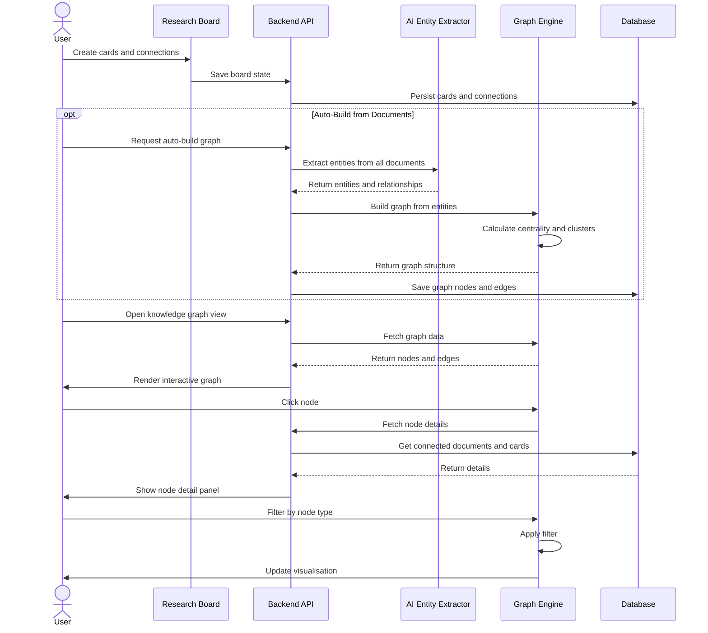
```mermaid
sequenceDiagram
    actor User
    participant Board as Research Board
    participant API as Backend API
    participant AI as AI Entity Extractor
    participant Graph as Graph Engine
    participant DB as Database

    User->>Board: Create cards and connections
    Board->>API: Save board state
    API->>DB: Persist cards and connections
    
    opt Auto-Build from Documents
        User->>API: Request auto-build graph
        API->>AI: Extract entities from all documents
        AI-->>API: Return entities and relationships
        API->>Graph: Build graph from entities
        Graph->>Graph: Calculate centrality and clusters
        Graph-->>API: Return graph structure
        API->>DB: Save graph nodes and edges
    end
    
    User->>API: Open knowledge graph view
    API->>Graph: Fetch graph data
    Graph-->>API: Return nodes and edges
    API->>User: Render interactive graph
    
    User->>Graph: Click node
    Graph->>API: Fetch node details
    API->>DB: Get connected documents and cards
    DB-->>API: Return details
    API->>User: Show node detail panel
    
    User->>Graph: Filter by node type
    Graph->>Graph: Apply filter
    Graph->>User: Update visualisation
```

### 11.2 Node Types

| Node Type | Source | Properties | Colour |
|---|---|---|---|
| Document | Imported document | Title, author, date, DOI | Blue |
| Claim | AI/user extracted | Text, confidence, evidence type | Green |
| Entity | AI extracted | Name, type, aliases | Orange |
| Concept | User/AI defined | Label, definition, examples | Purple |
| Note | User created | Text, tags, source | Yellow |
| Highlight | Extracted annotation | Text, page, colour | Cyan |
| Method | AI extracted | Name, description, parameters | Teal |
| Finding | AI extracted | Result, significance, p-value | Red |

### 11.3 Edge Types

| Edge Type | Direction | Meaning | Style |
|---|---|---|---|
| Cites | Directed (A → B) | A cites B | Solid |
| Supports | Directed (A → B) | A supports B | Solid green |
| Contradicts | Directed (A → B) | A contradicts B | Solid red |
| Extends | Directed (A → B) | A extends B's findings | Dashed green |
| Related | Undirected | A and B are related | Dotted |
| Part of | Directed (A → B) | A is part of B | Solid grey |
| Causes | Directed (A → B) | A causes B | Solid with arrowhead |
| Custom | User-defined | User-defined meaning | User-defined style |

---

## 12. Citation Workflow

### 12.1 Workflow Diagram

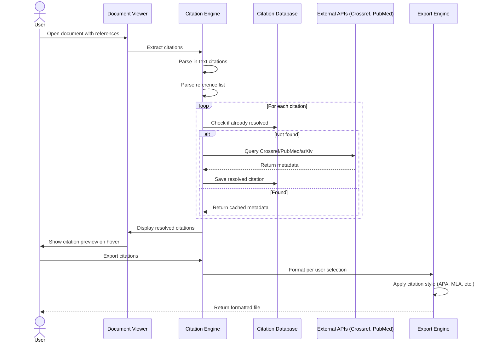
```mermaid
sequenceDiagram
    actor User
    participant Doc as Document Viewer
    participant Cite as Citation Engine
    participant DB as Citation Database
    participant Ext as External APIs (Crossref, PubMed)
    participant Export as Export Engine

    User->>Doc: Open document with references
    Doc->>Cite: Extract citations
    Cite->>Cite: Parse in-text citations
    Cite->>Cite: Parse reference list
    
    loop For each citation
        Cite->>DB: Check if already resolved
        alt Not found
            Cite->>Ext: Query Crossref/PubMed/arXiv
            Ext-->>Cite: Return metadata
            Cite->>DB: Save resolved citation
        else Found
            DB-->>Cite: Return cached metadata
        end
    end
    
    Cite->>Doc: Display resolved citations
    Doc->>User: Show citation preview on hover
    
    User->>Cite: Export citations
    Cite->>Export: Format per user selection
    Export->>Export: Apply citation style (APA, MLA, etc.)
    Export-->>User: Return formatted file
```

### 12.2 Supported Citation Styles

| Style | In-Text | Bibliography | Priority |
|---|---|---|---|
| APA 7th | Author-date | Hanging indent, alphabetical | P0 |
| MLA 9th | Author-page | Hanging indent, alphabetical | P0 |
| Chicago 17th (Notes-Bib) | Footnote | Bibliography | P1 |
| Chicago 17th (Author-Date) | Author-date | Reference list | P1 |
| Harvard | Author-date | Reference list | P1 |
| Vancouver | Numbered | Numbered list | P1 |
| IEEE | Numbered | Numbered list | P1 |
| Bluebook | Footnote | Legal citation format | P2 |
| ALWD | Footnote | Legal citation format | P2 |
| BibTeX | .bib file | N/A | P0 |
| RIS | .ris file | N/A | P1 |
| Zotero RDF | .rdf file | N/A | P2 |

### 12.3 Citation Quality Levels

| Level | Criteria | Indicator |
|---|---|---|
| Verified | DOI resolved, metadata confirmed from authoritative source | Green checkmark |
| Probable | Metadata extracted from document, no external confirmation | Yellow indicator |
| Incomplete | Missing required fields (author, title, or year) | Red warning |
| Manual | User-entered, not verified | Grey indicator |

---

## 13. Research Board Workflow

### 13.1 Workflow Diagram

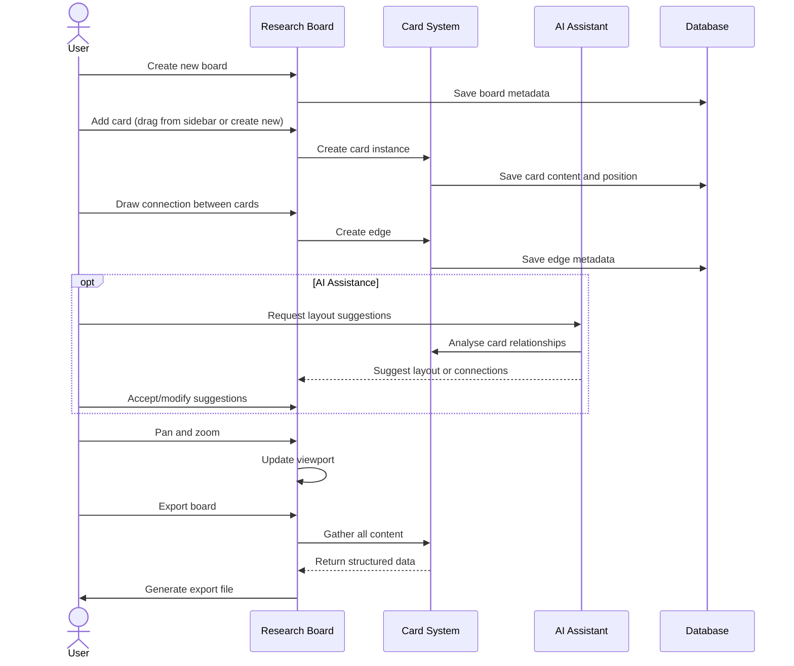
```mermaid
sequenceDiagram
    actor User
    participant Board as Research Board
    participant Cards as Card System
    participant AI as AI Assistant
    participant DB as Database

    User->>Board: Create new board
    Board->>DB: Save board metadata
    
    User->>Board: Add card (drag from sidebar or create new)
    Board->>Cards: Create card instance
    Cards->>DB: Save card content and position
    
    User->>Board: Draw connection between cards
    Board->>Cards: Create edge
    Cards->>DB: Save edge metadata
    
    opt AI Assistance
        User->>AI: Request layout suggestions
        AI->>Cards: Analyse card relationships
        AI-->>Board: Suggest layout or connections
        User->>Board: Accept/modify suggestions
    end
    
    User->>Board: Pan and zoom
    Board->>Board: Update viewport
    
    User->>Board: Export board
    Board->>Cards: Gather all content
    Cards-->>Board: Return structured data
    Board->>User: Generate export file
```

### 13.2 Board Templates

| Template | Description | Pre-Configured Elements |
|---|---|---|
| Blank | Empty board | None |
| Literature Review | Structured review layout | Sections: Introduction, Methods, Results, Discussion, Conclusion |
| Argument Map | Logical argument structure | Claim → Evidence → Warrant → Backing |
| Timeline | Chronological layout | Time axis, event cards, period markers |
| Concept Map | Concept relationships | Central concept, branching nodes, cross-links |
| Case Brief | Legal case structure | Facts, Issue, Rule, Application, Conclusion |
| Comparison | Side-by-side comparison | Two or more columns with comparison criteria |
| SWOT | Strategic analysis | Strengths, Weaknesses, Opportunities, Threats quadrants |
| Experiment | Lab notebook layout | Hypothesis, Method, Results, Conclusion sections |

### 13.3 Card Operations

| Operation | Trigger | Effect | Undo |
|---|---|---|---|
| Create | Double-click, drag from sidebar, AI extraction | New card appears | ✓ Delete |
| Move | Drag card | Card repositioned | ✓ Move back |
| Resize | Drag handle | Card dimensions changed | ✓ Resize back |
| Edit | Double-click card | Content editable | ✓ Revert |
| Delete | Delete key, context menu | Card removed | ✓ Restore |
| Duplicate | Cmd/Ctrl+D | Copy created | ✓ Delete copy |
| Group | Select multiple + group | Container created | ✓ Ungroup |
| Link | Draw connection | Edge created | ✓ Delete edge |
| Colour | Colour picker | Card colour changed | ✓ Revert colour |
| Tag | Tag input | Tag added | ✓ Remove tag |

---

## 14. Export Workflow

### 14.1 Workflow Diagram

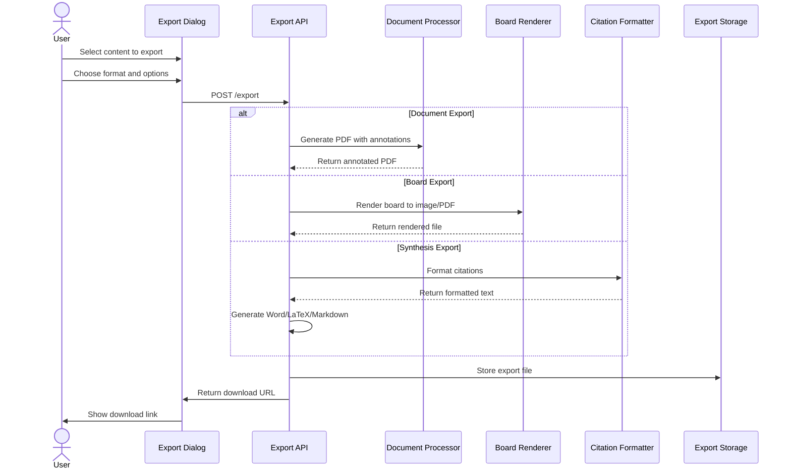
```mermaid
sequenceDiagram
    actor User
    participant UI as Export Dialog
    participant API as Export API
    participant Doc as Document Processor
    participant Board as Board Renderer
    participant Cite as Citation Formatter
    participant Storage as Export Storage

    User->>UI: Select content to export
    User->>UI: Choose format and options
    UI->>API: POST /export
    
    alt Document Export
        API->>Doc: Generate PDF with annotations
        Doc-->>API: Return annotated PDF
    else Board Export
        API->>Board: Render board to image/PDF
        Board-->>API: Return rendered file
    else Synthesis Export
        API->>Cite: Format citations
        Cite-->>API: Return formatted text
        API->>API: Generate Word/LaTeX/Markdown
    end
    
    API->>Storage: Store export file
    API->>UI: Return download URL
    UI->>User: Show download link
```

### 14.2 Export Options Matrix

| Content | PDF | Word | LaTeX | Markdown | PowerPoint | Image | HTML |
|---|---|---|---|---|---|---|---|
| Annotated Document | ✓ | — | — | — | — | — | — |
| Annotation List | ✓ | ✓ | ✓ | ✓ | — | — | ✓ |
| Research Board | ✓ | — | — | — | — | ✓ | ✓ |
| AI Synthesis | ✓ | ✓ | ✓ | ✓ | — | — | ✓ |
| Knowledge Graph | ✓ | — | — | — | — | ✓ | ✓ |
| Citations | ✓ | ✓ | ✓ | ✓ | — | — | ✓ |
| Complete Project | ✓ | — | — | — | — | — | — |
| Presentation | — | — | — | — | ✓ | — | — |

---

## 15. Collaboration Workflow

### 15.1 Workflow Diagram

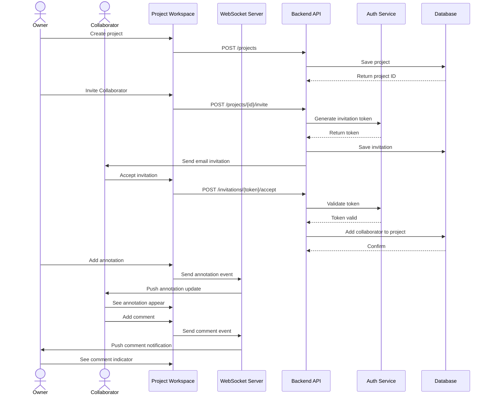
```mermaid
sequenceDiagram
    actor Owner
    actor Collaborator
    participant UI as Project Workspace
    participant WS as WebSocket Server
    participant API as Backend API
    participant Auth as Auth Service
    participant DB as Database

    Owner->>UI: Create project
    UI->>API: POST /projects
    API->>DB: Save project
    DB-->>API: Return project ID
    
    Owner->>UI: Invite Collaborator
    UI->>API: POST /projects/{id}/invite
    API->>Auth: Generate invitation token
    Auth-->>API: Return token
    API->>DB: Save invitation
    API->>Collaborator: Send email invitation
    
    Collaborator->>UI: Accept invitation
    UI->>API: POST /invitations/{token}/accept
    API->>Auth: Validate token
    Auth-->>API: Token valid
    API->>DB: Add collaborator to project
    DB-->>API: Confirm
    
    Owner->>UI: Add annotation
    UI->>WS: Send annotation event
    WS->>Collaborator: Push annotation update
    Collaborator->>UI: See annotation appear
    
    Collaborator->>UI: Add comment
    UI->>WS: Send comment event
    WS->>Owner: Push comment notification
    Owner->>UI: See comment indicator
```

### 15.2 Permission Matrix

| Permission | Viewer | Commenter | Editor | Admin | Owner |
|---|---|---|---|---|---|
| View documents | ✓ | ✓ | ✓ | ✓ | ✓ |
| View annotations | ✓ | ✓ | ✓ | ✓ | ✓ |
| View board | ✓ | ✓ | ✓ | ✓ | ✓ |
| Add comments | — | ✓ | ✓ | ✓ | ✓ |
| Add annotations | — | — | ✓ | ✓ | ✓ |
| Edit board | — | — | ✓ | ✓ | ✓ |
| Invite others | — | — | — | ✓ | ✓ |
| Manage permissions | — | — | — | ✓ | ✓ |
| Delete project | — | — | — | — | ✓ |
| Export content | ✓ | ✓ | ✓ | ✓ | ✓ |
| Use AI features | — | — | ✓ | ✓ | ✓ |

---

## 16. Admin Workflow

### 16.1 Enterprise Admin Dashboard

**Module ID**: MOD-ADMIN  
**Priority**: P2 (Enterprise)  
**Owner**: Enterprise Team

#### Feature: User Management

- **Feature name**: Manage Organisation Users
- **User story**: As an organisation admin, I want to manage user accounts so that I can control access to CiteMind within my organisation.
- **Functional behaviour**: View all users in organisation. Add users individually or via bulk CSV upload. Deactivate/reactivate accounts. Reset passwords. Assign roles (User, Team Lead, Admin). View user activity (login history, project count, storage usage). Export user list.
- **Input**: User data, role assignments, action commands
- **Output**: Updated user list, confirmation messages
- **Edge cases**: Duplicate email (error), bulk upload with errors (partial success report), deactivating own account (confirmation + transfer admin)
- **Validation rules**: Email must be unique and valid; role must be valid; bulk upload max 1,000 users
- **Acceptance criteria**: 
  - Given an admin uploads a CSV with 100 users, when processing completes, then 98 users are created and a report shows 2 errors with reasons.

#### Feature: Project Oversight

- **Feature name**: Organisation Project Overview
- **User story**: As an organisation admin, I want to see all projects in my organisation so that I can monitor research activity and ensure compliance.
- **Functional behaviour**: View all projects with owner, member count, storage used, creation date, and last activity. Filter by owner, date range, or project status. Access any project for audit purposes (read-only). Generate usage reports.
- **Input**: Filter criteria, audit request
- **Output**: Project list, audit view, usage reports
- **Edge cases**: Very large organisation (pagination, search), confidential project (admin can view but actions are logged), deleted project (view in trash)
- **Validation rules**: Admin must have organisation-level access; audit actions are logged immutably
- **Acceptance criteria**: 
  - Given an admin views the project list, when they filter by date range, then only projects active in that range are shown with accurate member and storage counts.

#### Feature: Security Policies

- **Feature name**: Configure Security Policies
- **User story**: As an organisation admin, I want to configure security policies so that our data protection requirements are enforced.
- **Functional behaviour**: Set password complexity requirements. Enforce MFA. Configure session timeout. Set IP allowlist (optional). Configure data retention policies. Enable/disable AI features. Set maximum project/document limits per user. Configure export restrictions. View security audit log.
- **Input**: Policy settings
- **Output**: Updated policy configuration, audit log entry
- **Edge cases**: Policy conflict (warning with resolution), policy too restrictive (user impact warning), policy propagation delay (up to 1 hour)
- **Validation rules**: Session timeout 5–480 minutes; password complexity minimum level 1–4; retention period 30–2555 days
- **Acceptance criteria**: 
  - Given an admin enables MFA requirement, when a user logs in, then they are prompted to set up MFA before accessing projects.

---

## 17. User Settings

### 17.1 Account Settings

| Setting | Options | Default | Scope |
|---|---|---|---|
| Display name | Free text | From registration | Account |
| Email | Valid email | Registration email | Account |
| Password | Change with verification | — | Account |
| Avatar | Upload or default | Default avatar | Account |
| Institution | Free text or dropdown | Empty | Account |
| Time zone | IANA time zone | Browser detected | Account |
| Language | en, zh, de, fr, es, ja, ko | Browser detected | Account |
| Date format | ISO, US, EU | ISO | Account |

### 17.2 Preference Settings

| Setting | Options | Default | Scope |
|---|---|---|---|
| Theme | Light, Dark, System | System | Account |
| Default view | Single page, Continuous | Single page | Account |
| Annotation colours | Custom palette | Default | Account |
| AI model | Fast, Balanced, Thorough | Balanced | Project |
| Citation style | APA, MLA, etc. | APA 7th | Project |
| Auto-save | On, Off | On | Account |
| Auto-extract | On, Off | On | Project |
| Notifications | Email, In-app, None | In-app | Account |
| Keyboard shortcuts | Customisable | Default | Account |

### 17.3 Notification Settings

| Event | In-App | Email | Push | Default |
|---|---|---|---|---|
| Mention in comment | ✓ | ✓ | ✓ | Email + In-app |
| Project invitation | ✓ | ✓ | ✓ | Email |
| Annotation added by collaborator | ✓ | — | — | In-app |
| AI processing complete | ✓ | — | — | In-app |
| Export ready | ✓ | ✓ | — | In-app |
| Storage limit warning | ✓ | ✓ | — | Email + In-app |
| Security alert | ✓ | ✓ | ✓ | All channels |
| Weekly digest | ✓ | ✓ | — | Email (opt-in) |

### 17.4 Privacy Settings

| Setting | Options | Default | Scope |
|---|---|---|---|
| AI learning from my data | Allow, Don't allow | Allow (anonymised) | Account |
| Public profile | Visible, Hidden | Hidden | Account |
| Search engine indexing | Allow, Block | Block | Account |
| Data export | Request download | — | Account |
| Account deletion | Request deletion | — | Account |

---

## 18. Notifications

### 18.1 Notification Types

| Type | Trigger | Content | Action |
|---|---|---|---|
| Document ready | Import processing complete | Document name, thumbnail | Open document |
| AI summary ready | Summary generation complete | Document name, summary preview | View summary |
| Mention | User @mentioned in comment | Commenter name, comment snippet, location | Go to comment |
| Invitation | User invited to project | Inviter name, project name | Accept/decline |
| Collaboration | Collaborator made change | Change type, document/board, user | View change |
| Export ready | Export generation complete | File name, format, size | Download |
| Storage warning | Approaching storage limit | Current usage, limit, percentage | Manage storage |
| Security | Suspicious login or change | Event type, time, location | Review activity |
| System | Maintenance or update | Scheduled time, expected impact | Acknowledge |
| Digest | Weekly summary | Activity summary, highlights | View full report |

### 18.2 Notification Delivery

| Channel | Real-Time | Batch | Priority |
|---|---|---|---|
| In-app bell | ✓ | — | All |
| Email | — | ✓ (immediate for high priority) | Medium+ |
| Browser push | ✓ | — | High+ |
| Mobile push | ✓ | — | High+ |
| SMS | — | — | Critical only (enterprise) |
| Slack/Teams | — | ✓ | Medium+ (enterprise) |

### 18.3 Notification Lifecycle

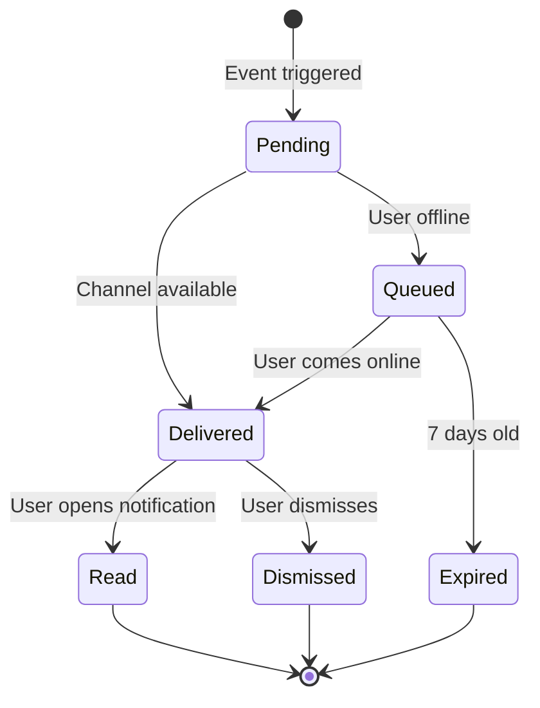
```mermaid
stateDiagram-v2
    [*] --> Pending: Event triggered
    Pending --> Delivered: Channel available
    Pending --> Queued: User offline
    Queued --> Delivered: User comes online
    Delivered --> Read: User opens notification
    Delivered --> Dismissed: User dismisses
    Read --> [*]
    Dismissed --> [*]
    Queued --> Expired: 7 days old
    Expired --> [*]
```

---

## 19. Error Handling

### 19.1 Error Categories

| Category | Examples | User Message | Recovery |
|---|---|---|---|
| **Client** | Network timeout, browser crash, invalid input | "Something went wrong. Please try again." | Retry with backoff, auto-save recovery |
| **Server** | 500 error, database timeout, service unavailable | "We're experiencing issues. Your work is saved." | Retry with exponential backoff, queue for later |
| **AI** | Model timeout, hallucination detected, context overflow | "The AI is thinking..." or "I need more context." | Retry with smaller context, suggest alternatives |
| **Document** | Corrupted file, unsupported format, OCR failure | "This document couldn't be processed." | Skip and continue, manual processing option |
| **Storage** | Quota exceeded, upload failed, sync conflict | "Storage limit reached." or "Sync conflict detected." | Upgrade prompt, conflict resolution UI |
| **Auth** | Session expired, permission denied, token invalid | "Please log in again." or "Access denied." | Redirect to login, show permission request |
| **External** | API rate limit, third-party down, integration error | "External service temporarily unavailable." | Retry with backoff, fallback to local processing |

### 19.2 Error Recovery Patterns

| Pattern | Implementation | When Used |
|---|---|---|
| Auto-retry | Exponential backoff (1s, 2s, 4s, 8s, max 30s) | Transient network failures |
| Circuit breaker | Fail fast after 5 errors, retry after 60s | Persistent service failures |
| Graceful degradation | Reduce features rather than fail | AI model overload |
| User recovery | Save draft state, offer recovery UI | Browser crashes, unexpected closes |
| Queue and retry | Background processing with retry | Large batch operations |
| Fallback | Use local cache when server unavailable | Offline mode |

### 19.3 User-Facing Error Messages

| Error Code | User Message | Action Button |
|---|---|---|
| ERR-001 | "Your session has expired. Please sign in again." | "Sign In" |
| ERR-002 | "This document couldn't be opened. It may be corrupted." | "Try Again" / "Report Issue" |
| ERR-003 | "The AI is taking longer than expected. We'll notify you when it's ready." | "Continue Working" |
| ERR-004 | "You've reached your storage limit. Upgrade to continue uploading." | "Upgrade Plan" / "Manage Files" |
| ERR-005 | "A sync conflict was detected. Please choose which version to keep." | "Resolve Conflict" |
| ERR-006 | "This feature requires a Pro plan. Upgrade to unlock it." | "Upgrade" / "Learn More" |
| ERR-007 | "We couldn't connect to the server. Working offline." | "Retry Connection" |
| ERR-008 | "Invalid file format. Supported formats: PDF, DOCX, TXT." | "Choose Different File" |
| ERR-009 | "Password-protected PDF. Please enter the password to unlock." | "Enter Password" |
| ERR-010 | "AI couldn't verify this claim. Please check the source manually." | "View Source" |

---

## 20. Accessibility Requirements

### 20.1 WCAG 2.1 AA Compliance

| Principle | Requirement | Implementation |
|---|---|---|
| **Perceivable** | Text alternatives for images | Alt text for all images, ARIA labels for icons |
| | Captions/transcripts for media | Transcript for any audio/video content |
| | Colour not sole information carrier | Patterns, labels, and text accompany colour |
| | Text resizeable to 200% | Responsive design, no horizontal scroll at 200% |
| **Operable** | Keyboard accessible | All features accessible via keyboard |
| | No time limits | No automatic timeouts; user-controlled session |
| | Seizure prevention | No flashing content > 3Hz |
| | Navigable | Skip links, headings, landmarks, breadcrumbs |
| **Understandable** | Readable text | Clear language, reading level appropriate |
| | Predictable UI | Consistent navigation, consistent component behaviour |
| | Input assistance | Error prevention, clear error messages, suggestions |
| **Robust** | Compatible with assistive tech | ARIA labels, semantic HTML, screen reader tested |
| | Valid markup | Passes HTML validation |

### 20.2 Keyboard Shortcuts

| Action | Shortcut | Context |
|---|---|---|
| Open search | Cmd/Ctrl + K | Global |
| New project | Cmd/Ctrl + Shift + N | Global |
| New annotation | Cmd/Ctrl + Shift + A | Document viewer |
| Highlight (yellow) | Cmd/Ctrl + Shift + H | Document viewer (text selected) |
| Add comment | Cmd/Ctrl + Shift + C | Document viewer (text selected) |
| Open AI chat | Cmd/Ctrl + Shift + I | Document viewer |
| Next page | Page Down / Space | Document viewer |
| Previous page | Page Up / Shift + Space | Document viewer |
| Zoom in | Cmd/Ctrl + + | Document viewer |
| Zoom out | Cmd/Ctrl + - | Document viewer |
| Fit width | Cmd/Ctrl + 0 | Document viewer |
| Toggle sidebar | Cmd/Ctrl + B | Document viewer |
| Toggle theme | Cmd/Ctrl + Shift + L | Global |
| Save | Cmd/Ctrl + S | Global (auto-save indicator) |
| Undo | Cmd/Ctrl + Z | Global |
| Redo | Cmd/Ctrl + Shift + Z | Global |
| Delete selection | Delete / Backspace | Board/annotation selected |
| Duplicate | Cmd/Ctrl + D | Board card selected |
| Select all | Cmd/Ctrl + A | Current context |
| Escape | Esc | Close modal, cancel action, deselect |
| Focus mode | Cmd/Ctrl + Shift + F | Document viewer |
| Board: pan | Space + drag | Research board |
| Board: zoom | Cmd/Ctrl + scroll | Research board |

### 20.3 Screen Reader Support

| Element | ARIA Role | Label |
|---|---|---|
| Document viewer | `document` | "PDF viewer: {document title}" |
| Annotation | `comment` | "Annotation: {type}, page {number}" |
| Highlight | `mark` | "Highlighted text: {text preview}" |
| AI chat panel | `complementary` | "AI Research Assistant" |
| AI message | `article` | "AI response, confidence: {level}" |
| Knowledge board | `application` | "Research board: {board name}" |
| Card | `article` | "Card: {title}, {content preview}" |
| Connection | `none` (visual) | Descriptive text on nodes |
| Search results | `list` | "Search results: {count} items" |
| Notification | `alert` | "Notification: {message}" |

### 20.4 Focus Management

- Visible focus indicator on all interactive elements
- Focus trap in modals and dialogs
- Focus restoration after modal close
- Skip navigation link at top of page
- Logical tab order (top to bottom, left to right)
- Focus management in AI chat (new message focuses on response)
- Focus management in board (arrow keys navigate between cards)

---

## 21. Non-Functional Requirements

### 21.1 Performance

| Metric | Target | Measurement |
|---|---|---|
| Document upload (first page preview) | < 3 seconds | Time from upload to thumbnail visible |
| Document processing (full text + AI) | < 30 seconds per 100 pages | Time from upload to "ready" status |
| PDF viewer first page render | < 2 seconds | Time from click to visible content |
| Page navigation | < 500ms | Time from click to new page visible |
| Annotation creation | < 100ms | Time from action to visual feedback |
| AI chat response (single doc) | < 10 seconds | Time from submit to first response token |
| AI chat response (multi-doc, 10 docs) | < 20 seconds | Time from submit to first response token |
| Search results | < 2 seconds | Time from query to results visible |
| Board load (100 cards) | < 3 seconds | Time from click to interactive board |
| Board pan/zoom | 60fps | Frame rate during interaction |
| Export generation | < 30 seconds | Time from request to download ready |
| Dashboard load | < 2 seconds | Time from navigation to interactive dashboard |
| Login | < 2 seconds | Time from submit to dashboard visible |

### 21.2 Reliability

| Metric | Target | Measurement |
|---|---|---|
| Uptime | 99.9% | Annual uptime percentage |
| Scheduled maintenance | < 4 hours/month | Announced in advance |
| Data durability | 99.9999999% (11 nines) | Backup and replication |
| Recovery Time Objective (RTO) | < 4 hours | Time to restore service after incident |
| Recovery Point Objective (RPO) | < 1 hour | Maximum data loss in incident |
| Auto-save frequency | Every 5 seconds | Annotation, board, and note changes |
| Conflict resolution | Automatic + manual | Last-write-wins with notification |

### 21.3 Scalability

| Dimension | MVP Target | V1.0 Target | Enterprise Target |
|---|---|---|---|
| Users per project | 1 | 10 | 100+ |
| Projects per user | 10 | 50 | Unlimited |
| Documents per project | 100 | 1,000 | 10,000+ |
| Pages per document | 1,000 | 2,000 | 5,000+ |
| Annotations per document | 500 | 2,000 | 5,000+ |
| Cards per board | 1,000 | 5,000 | 10,000+ |
| Storage per user | 5GB | 50GB | 500GB+ |
| Concurrent users | 10 | 100 | 1,000+ |
| AI queries per day | 100 | 1,000 | 10,000+ |

### 21.4 Security

| Requirement | Implementation | Verification |
|---|---|---|
| Data encryption at rest | AES-256 for files, database encryption | Audit certificate |
| Data encryption in transit | TLS 1.3 minimum | SSL Labs A+ rating |
| Password storage | Argon2id hashing | Security audit |
| API authentication | JWT with refresh tokens | Penetration test |
| Rate limiting | 100 requests/minute per user | Load test |
| Input validation | Server-side validation for all inputs | Fuzz testing |
| XSS prevention | Content Security Policy, output encoding | Security scan |
| CSRF prevention | Token-based, SameSite cookies | Security scan |
| SQL injection prevention | Parameterised queries, ORM | Security scan |
| Dependency scanning | Automated SCA (Snyk/Dependabot) | CI/CD pipeline |
| Penetration testing | Annual third-party assessment | Security report |

### 21.5 Compatibility

| Browser | Minimum Version | Full Support |
|---|---|---|
| Chrome | 100+ | ✓ |
| Firefox | 100+ | ✓ |
| Safari | 15+ | ✓ |
| Edge | 100+ | ✓ |
| Opera | 86+ | Best effort |
| Mobile Chrome | 100+ | ✓ (responsive) |
| Mobile Safari | 15+ | ✓ (responsive) |
| Samsung Internet | 17+ | Best effort |

| OS | Support Level |
|---|---|
| macOS 12+ | Full |
| Windows 10+ | Full |
| Linux (Ubuntu 20.04+) | Full |
| iOS 15+ | Responsive web |
| Android 10+ | Responsive web |
| iPadOS 15+ | Full (with stylus support) |

### 21.6 Internationalisation (i18n)

| Language | MVP | V1.0 | Priority |
|---|---|---|---|
| English (US) | ✓ | ✓ | P0 |
| English (UK) | ✓ | ✓ | P0 |
| Chinese (Simplified) | — | ✓ | P1 |
| Chinese (Traditional) | — | ✓ | P2 |
| Japanese | — | ✓ | P2 |
| German | — | ✓ | P2 |
| French | — | ✓ | P2 |
| Spanish | — | ✓ | P2 |
| Korean | — | — | P3 |
| Portuguese | — | — | P3 |

| Locale Feature | MVP | V1.0 |
|---|---|---|
| UI translations | English only | English + 5 languages |
| RTL support | — | Arabic, Hebrew |
| Date/time formatting | User locale | User locale |
| Number formatting | User locale | User locale |
| Currency display | — | User locale |
| AI response language | Match user language | Match user language |
| OCR language support | English | English + 10 languages |

---

## 22. Acceptance Criteria

### 22.1 MVP Release Criteria

| # | Criterion | Verification Method | Owner |
|---|---|---|---|
| 1 | User can register, log in, and create a project | Manual test | QA |
| 2 | User can upload PDF and view it in the document viewer | Manual test + automated | QA |
| 3 | User can highlight text and add comments | Manual test + automated | QA |
| 4 | Annotations persist after reload and appear in sidebar | Automated test | QA |
| 5 | User can ask AI questions about a document and receive cited answers | Manual test + AI evaluation | QA + AI Team |
| 6 | AI citations are clickable and navigate to source | Manual test | QA |
| 7 | User can create a research board and add cards | Manual test + automated | QA |
| 8 | User can draw connections between cards | Manual test | QA |
| 9 | Board state persists after reload | Automated test | QA |
| 10 | User can export annotations and citations in BibTeX | Manual test | QA |
| 11 | System supports 100 concurrent users without degradation | Load test | Platform |
| 12 | Document processing completes within 30 seconds for 100 pages | Performance test | Platform |
| 13 | AI response time under 10 seconds for single-document queries | Performance test | AI Team |
| 14 | All user data encrypted at rest and in transit | Security audit | Security |
| 15 | WCAG 2.1 AA compliance for core workflows | Accessibility audit | UX |
| 16 | Works on Chrome, Firefox, Safari, Edge (latest 2 versions) | Cross-browser test | QA |
| 17 | Auto-save functions every 5 seconds with no data loss | Automated test | QA |
| 18 | Error messages are clear and actionable | Manual review | UX |
| 19 | API documentation is complete and accurate | Review | Platform |
| 20 | Privacy policy and terms of service are published | Legal review | Legal |

### 22.2 V1.0 Release Criteria

| # | Criterion | Verification Method | Owner |
|---|---|---|---|
| 1 | Multi-document AI chat works with up to 20 documents | Manual test + AI evaluation | QA + AI Team |
| 2 | Knowledge graph auto-generates from documents and board | Manual test | QA |
| 3 | Citation engine supports 5+ styles with correct formatting | Automated test | QA |
| 4 | Real-time collaboration with 2+ users editing simultaneously | Manual test + automated | QA |
| 5 | Comment threads with @mentions and notifications | Manual test | QA |
| 6 | Zotero integration imports and exports correctly | Manual test | QA |
| 7 | Semantic search finds conceptually related content | Manual test + evaluation | QA + AI Team |
| 8 | Export to Word, LaTeX, and PowerPoint with citations | Manual test | QA |
| 9 | System supports 1,000 concurrent users | Load test | Platform |
| 10 | iPad support with stylus annotation | Manual test | QA |
| 11 | Admin dashboard for user and project management | Manual test | QA |
| 12 | SSO integration (SAML 2.0) | Integration test | Platform |
| 13 | Audit logging for all security events | Security audit | Security |
| 14 | GDPR data export and deletion functionality | Compliance test | Legal + QA |

### 22.3 Definition of Done

For every feature to be considered complete:

- [ ] Code is written, reviewed, and merged
- [ ] Unit tests cover ≥ 80% of new code
- [ ] Integration tests pass for affected workflows
- [ ] Manual QA testing is complete with no P1 or P2 bugs
- [ ] Accessibility review passes (WCAG 2.1 AA)
- [ ] Security review passes (no high or critical vulnerabilities)
- [ ] Performance meets targets (documented in Section 21.1)
- [ ] Feature is documented in user-facing help centre
- [ ] Analytics events are instrumented
- [ ] Feature flag is configured for gradual rollout

---

## Appendix A: Glossary

| Term | Definition |
|---|---|
| **Annotation** | A user-created mark on a document (highlight, comment, underline, region, ink) |
| **Citation** | A formal reference to a source document, including author, title, date, and locator |
| **Citation-Native** | An architecture where every knowledge unit maintains a traceable link to its source |
| **Context Window** | The amount of text (in tokens) that can be passed to an AI model for processing |
| **Knowledge Card** | A structured unit of knowledge on the research board, linked to a source |
| **Knowledge Graph** | A visual representation of entities and their relationships, with citation links |
| **Research Board** | An infinite canvas for visual organisation of knowledge cards and connections |
| **Semantic Search** | Search based on meaning rather than exact keyword matching |
| **Vector Database** | A database optimised for storing and querying high-dimensional embeddings |
| **Workspace** | The user's main CiteMind environment containing projects, documents, and settings |

## Appendix B: Document Revision History

| Version | Date | Author | Changes |
|---|---|---|---|
| 0.1 | 2025-07-25 | Functional Design Agent | Initial draft — all sections |
| 1.0 | 2025-07-26 | Functional Design Agent | Complete FDD with all workflows, modules, and acceptance criteria |

---

*Document generated by Functional Design Agent for the CiteMind project.*  
*Based on: Market Research, Competitor Analysis, Gap Analysis, and Product Strategy research inputs.*
