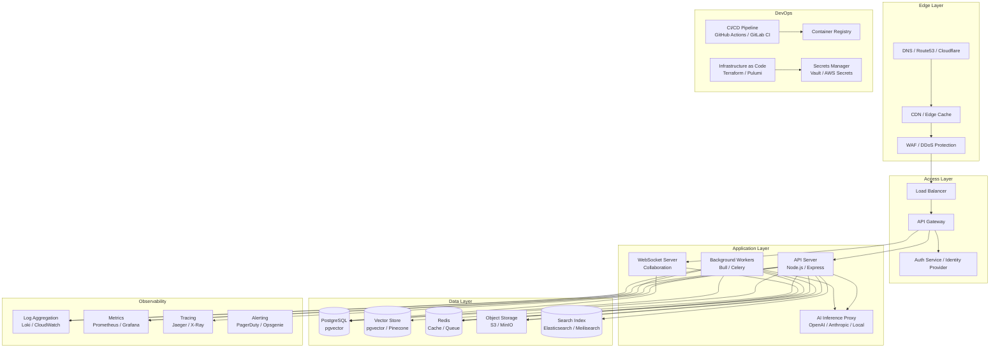
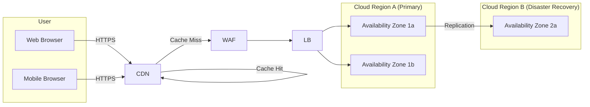
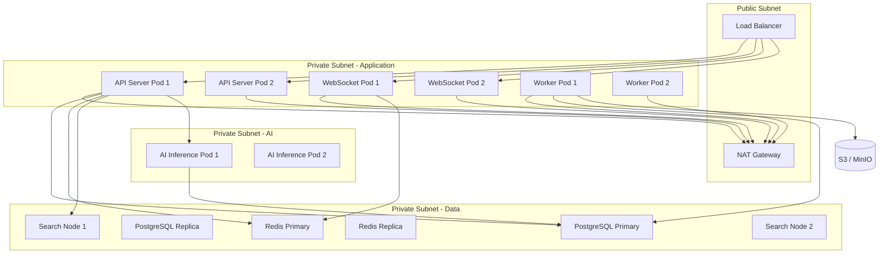
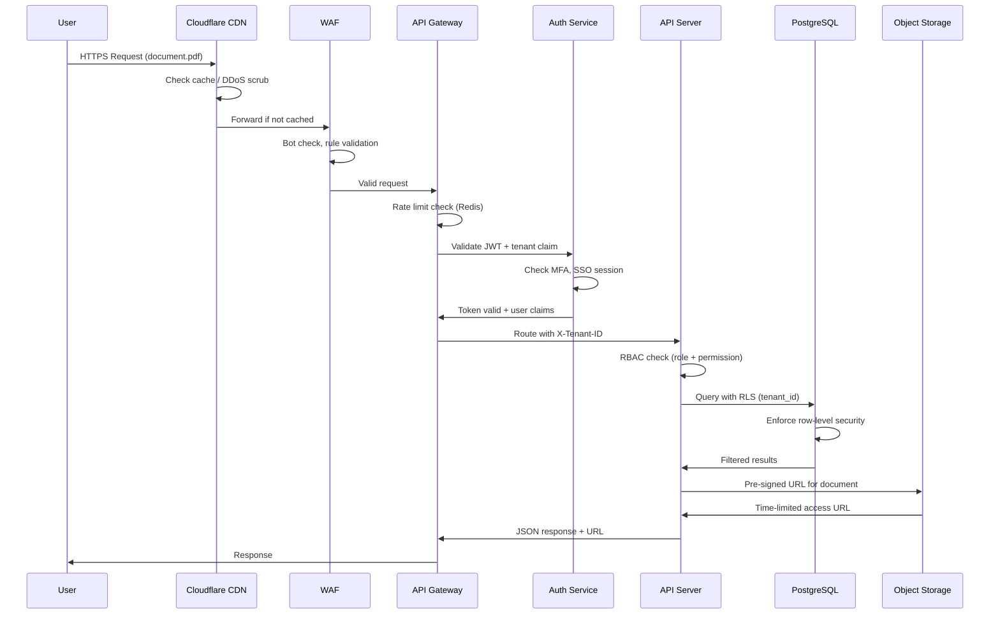
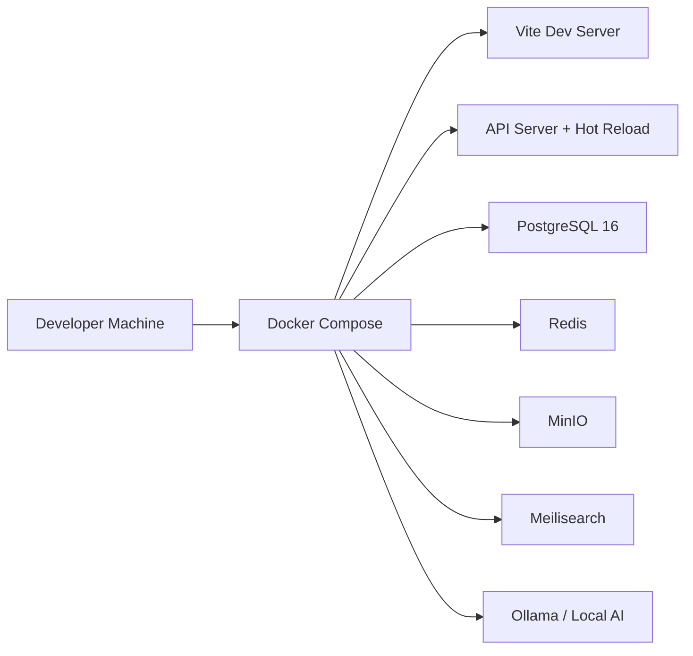
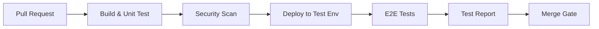
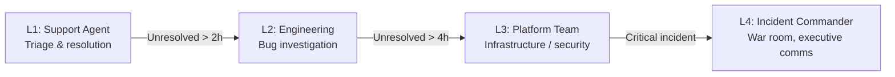
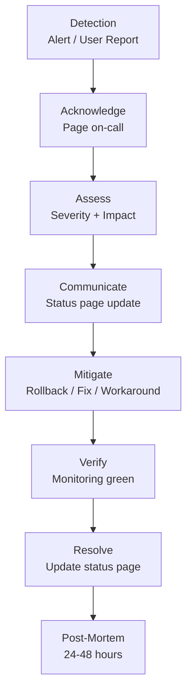
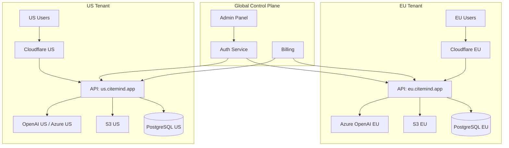

# Enterprise Infrastructure Requirement Document

## CiteMind — AI-Powered Research Notebook & Document Intelligence Workspace

**Version**: 1.0  
**Date**: 2025-07-28  
**Author**: Enterprise Infrastructure Agent  
**Status**: Draft for Review  

---

## Table of Contents

1. [Infrastructure Goals](#1-infrastructure-goals)
2. [Cloud Architecture](#2-cloud-architecture)
3. [Recommended Cloud Options](#3-recommended-cloud-options)
4. [Recommended Production Architecture](#4-recommended-production-architecture)
5. [Development Environment](#5-development-environment)
6. [Testing Environment](#6-testing-environment)
7. [Staging Environment](#7-staging-environment)
8. [Production Environment](#8-production-environment)
9. [Scaling Strategy](#9-scaling-strategy)
10. [Cost Estimate](#10-cost-estimate)
11. [Maintenance Model](#11-maintenance-model)
12. [Support Model](#12-support-model)
13. [Release Management](#13-release-management)
14. [Incident Management](#14-incident-management)
15. [Backup and Recovery](#15-backup-and-recovery)
16. [Data Residency](#16-data-residency)
17. [Compliance Readiness](#17-compliance-readiness)
18. [Enterprise Admin Requirements](#18-enterprise-admin-requirements)

---

## 1. Infrastructure Goals

### 1.1 Mission

Design and maintain a robust, secure, scalable, and cost-efficient infrastructure platform that enables CiteMind to deliver its AI-powered research notebook capabilities to users ranging from solo researchers to enterprise-scale organisations and universities.

### 1.2 Core Principles

| Principle | Description |
|-----------|-------------|
| **Security by Design** | Every component is built with security as a first-class concern, not an afterthought. |
| **Scalability on Demand** | Infrastructure scales elastically with user growth, document volume, and AI processing load. |
| **Resilience & Availability** | Target 99.95% uptime for production; graceful degradation during partial outages. |
| **Cost Efficiency** | Optimise spend across environments; use right-sized resources and reserved capacity where appropriate. |
| **Operational Observability** | Full-stack monitoring, logging, tracing, and alerting from day one. |
| **Compliance Readiness** | Infrastructure supports GDPR, SOC 2, HIPAA, and ISO 27001 requirements without re-architecture. |
| **Multi-Cloud Portability** | Abstract cloud-native services where possible to avoid deep vendor lock-in. |
| **Developer Velocity** | Fast feedback loops for development, testing, and deployment; infrastructure as code (IaC) for all environments. |

### 1.3 Infrastructure Goals by Deployment Tier

| Tier | Users | Primary Goal |
|------|-------|-------------|
| **Solo MVP** | 1 user | Zero-cost or near-zero-cost local/Docker deployment; full offline capability. |
| **Small Team** | 5–20 users | Reliable shared cloud deployment; minimal operational overhead; <$500/month. |
| **Enterprise** | 100–5,000 users | High availability, SSO, audit logging, SLA-backed performance, dedicated support. |
| **University / Institution** | 1,000–50,000 users | Federated identity, bulk licensing, data residency controls, academic pricing. |

### 1.4 Workload Characteristics

CiteMind's infrastructure must support four distinct workload profiles:

1. **Interactive Web Application**: Low-latency CRUD, real-time collaboration, annotation rendering.
2. **AI Inference Pipeline**: Bursty, high-compute tasks (document parsing, embedding generation, LLM chat, summarisation).
3. **Document Processing**: Batch-oriented, I/O-heavy PDF parsing, OCR, page extraction.
4. **Vector & Graph Search**: Memory-intensive, low-latency semantic search and knowledge graph traversal.

---

## 2. Cloud Architecture

### 2.1 Architecture Overview

CiteMind adopts a **modern cloud-native architecture** built on the following pillars:

- **Microservices-oriented backend** with clear separation between synchronous API services and asynchronous worker queues.
- **Containerised deployment** (Docker + Kubernetes) for all application components.
- **Managed services** for databases, message queues, object storage, and AI inference where economically justified.
- **Edge caching and CDN** for static assets, document previews, and exported files.
- **Serverless functions** for lightweight, event-driven processing (webhooks, export triggers, notifications).
- **Multi-tenant data model** with row-level security and logical tenant isolation in shared infrastructure.

### 2.2 High-Level Component Diagram



### 2.3 Deployment Topology



---

## 3. Recommended Cloud Options

### 3.1 Cloud Provider Comparison

| Criteria | **AWS** | **Azure** | **Google Cloud** | **Self-Hosted** |
|----------|---------|-----------|------------------|-----------------|
| **Market Position** | Market leader (32% share) | Strong enterprise (23% share) | Strong AI/ML (10% share) | Full control, zero cloud fees |
| **AI/ML Services** | Bedrock, SageMaker | Azure OpenAI, Cognitive Services | Vertex AI, Gemini API | Ollama, vLLM, local GPUs |
| **Managed PostgreSQL** | RDS + pgvector | Azure Database + pgvector | Cloud SQL + pgvector | Self-managed PostgreSQL |
| **Managed Kubernetes** | EKS | AKS | GKE | k3s, k0s, Rancher |
| **Object Storage** | S3 | Blob Storage | Cloud Storage | MinIO, Ceph |
| **CDN** | CloudFront | Azure CDN | Cloud CDN | Cloudflare (independent) |
| **Enterprise SSO** | Cognito + IAM | Entra ID (Azure AD) | Identity Platform | Keycloak, Authelia |
| **Compliance Certifications** | SOC 2, ISO 27001, HIPAA, FedRAMP | SOC 2, ISO 27001, HIPAA, FedRAMP | SOC 2, ISO 27001, HIPAA | User-managed |
| **Data Residency** | 30+ regions | 60+ regions | 35+ regions | Full control |
| **Pricing Model** | Pay-as-you-go, Reserved, Savings Plans | Pay-as-you-go, Reserved, Hybrid Benefit | Pay-as-you-go, Committed Use | Hardware + power + labour |
| **Operational Overhead** | Low | Low | Low | Very High |
| **Vendor Lock-in** | High | High | Medium | None |
| **Best For** | General purpose, broad services | Enterprise, Microsoft shops | AI-heavy workloads, startups | Sovereignty, cost control, air-gapped |

### 3.2 Recommended Primary Platform: **AWS**

**Rationale**: AWS offers the broadest and most mature service ecosystem, particularly for the multi-modal workload CiteMind requires (web serving, batch processing, AI inference, vector search, object storage). AWS also leads in compliance certifications and global region availability, which is critical for enterprise and university customers.

**Secondary recommendation**: Azure for organisations with existing Microsoft contracts and Entra ID infrastructure (common in enterprises and universities).

### 3.3 Multi-Cloud Strategy

While the primary deployment targets AWS, CiteMind's containerised architecture and infrastructure-as-code approach allow for multi-cloud portability:

- **Compute**: Kubernetes workloads (EKS → AKS → GKE) are portable.
- **Database**: PostgreSQL is standard across all clouds; pgvector extension is supported on all managed PostgreSQL offerings.
- **Storage**: S3 API is the de facto standard; MinIO provides on-prem compatibility.
- **AI**: Abstracted via LangChain/LangServe; swap OpenAI API keys for Azure OpenAI or local Ollama endpoints.
- **CDN**: Cloudflare is cloud-agnostic and recommended across all deployment options.

### 3.4 Self-Hosted Option

A fully self-hosted option is required for:
- **Air-gapped environments** (government, defence, classified research)
- **Sovereign data requirements** (EU data residency without US cloud provider)
- **Cost optimisation** at very large scale (10,000+ users)
- **Solo MVP** (Docker Desktop or local Kubernetes)

**Recommended self-hosted stack**: k3s (lightweight Kubernetes) + PostgreSQL + MinIO + Meilisearch + Ollama + Cloudflare (for CDN/DNS if internet is available) or local Nginx.

---

## 4. Recommended Production Architecture

### 4.1 Layer-by-Layer Breakdown

#### 4.1.1 Edge Layer

| Component | Technology | Purpose |
|-----------|------------|---------|
| **DNS** | Cloudflare / AWS Route 53 | Geo-routed DNS, health checks, failover |
| **CDN** | Cloudflare CDN / AWS CloudFront | Static asset delivery, document preview caching, DDoS mitigation |
| **WAF** | Cloudflare WAF / AWS WAF | SQL injection, XSS, bot mitigation, rate limiting at edge |
| **DDoS Protection** | Cloudflare Magic Transit / AWS Shield Standard | Volumetric attack protection |

#### 4.1.2 API Gateway Layer

| Component | Technology | Purpose |
|-----------|------------|---------|
| **API Gateway** | AWS API Gateway / Kong / Traefik | Route management, API versioning, request transformation, throttling |
| **Load Balancer** | AWS ALB / NGINX Ingress | SSL termination, path-based routing, health checks, sticky sessions for WebSockets |
| **Rate Limiting** | Redis + Express middleware / API Gateway native | Per-user, per-tenant, and per-IP rate limiting; configurable tiers |

#### 4.1.3 Application Layer

| Component | Technology | Purpose | Scaling |
|-----------|------------|---------|---------|
| **API Server** | Node.js + Express (TypeScript) | RESTful API, business logic, CRUD operations | Horizontal (HPA on CPU/memory) |
| **WebSocket Server** | Node.js + Socket.io / ws | Real-time collaboration, cursor sync, annotation broadcast | Horizontal (Redis adapter for multi-instance) |
| **Background Workers** | BullMQ + Node.js / Celery + Python | PDF processing, OCR, embedding generation, export, email | Horizontal (queue-depth-based scaling) |
| **AI Inference Proxy** | LangServe / FastAPI | Route requests to OpenAI, Anthropic, Azure OpenAI, or local models | Horizontal (request-queue-based) |
| **Export Engine** | Node.js + Puppeteer / Python + WeasyPrint | PDF export, Word/PowerPoint generation, HTML rendering | Horizontal (job-based) |

#### 4.1.4 Data Layer

| Component | Technology | Purpose | Configuration |
|-----------|------------|---------|---------------|
| **Primary Database** | PostgreSQL 16 + pgvector | Relational data, vector embeddings, ACID transactions | Multi-AZ, read replicas, automated backups |
| **Vector Database** | pgvector (same PostgreSQL) / Pinecone (optional) | Semantic search, document embeddings | HNSW indexing, ivfflat for large scale |
| **Cache** | Redis 7 (Cluster) | Session store, API response cache, rate limit counters, pub/sub for WebSockets | Multi-AZ, persistence enabled |
| **Search Index** | Meilisearch / Elasticsearch | Full-text search across documents, notes, annotations | Replicated index, incremental updates |
| **Object Storage** | AWS S3 / MinIO | PDFs, images, exports, thumbnails, backup archives | Versioning, lifecycle policies, cross-region replication |
| **Message Queue** | Redis (BullMQ) / RabbitMQ / AWS SQS | Background job dispatch, event streaming | Durability, dead-letter queues |

#### 4.1.5 Observability Layer

| Component | Technology | Purpose |
|-----------|------------|---------|
| **Metrics** | Prometheus + Grafana / Datadog | CPU, memory, request latency, error rates, queue depth, AI inference duration |
| **Logging** | Loki + Grafana / AWS CloudWatch | Structured application logs, audit logs, security logs; 90-day retention standard, 1-year for audit |
| **Tracing** | Jaeger / AWS X-Ray / OpenTelemetry | Distributed tracing across API → DB → AI → Storage |
| **Alerting** | PagerDuty / Opsgenie / Grafana Alerting | On-call rotation, escalation policies, severity-based routing |
| **Uptime Monitoring** | Pingdom / UptimeRobot / Grafana Synthetic | External health checks from multiple regions |
| **Error Tracking** | Sentry | Application exception tracking, release correlation, user impact analysis |

#### 4.1.6 DevOps & Security Layer

| Component | Technology | Purpose |
|-----------|------------|---------|
| **IaC** | Terraform / Pulumi | All infrastructure defined as code; reproducible environments |
| **CI/CD** | GitHub Actions / GitLab CI | Automated build, test, security scan, deploy |
| **Container Registry** | AWS ECR / GitHub Container Registry | Immutable image tags, vulnerability scanning, lifecycle policies |
| **Secrets Management** | HashiCorp Vault / AWS Secrets Manager / Doppler | Rotation, dynamic credentials, audit logs, no secrets in code |
| **Security Scanning** | Trivy (container), Snyk (dependencies), SonarQube (code) | Vulnerability detection in images, libraries, and source |
| **Certificate Management** | cert-manager + Let's Encrypt / AWS ACM | Automatic TLS certificate provisioning and renewal |

### 4.2 Network Architecture



### 4.3 Security Flow Diagram



---

## 5. Development Environment

### 5.1 Purpose

Enable individual developers to run the entire CiteMind stack locally for feature development, debugging, and rapid iteration.

### 5.2 Architecture



### 5.3 Components

| Component | Technology | Notes |
|-----------|------------|-------|
| **Frontend** | Vite + React | Hot module replacement, proxy to local API |
| **Backend** | Node.js + tsx | Nodemon/tsx watch mode, automatic restart |
| **Database** | PostgreSQL 16 (Docker) | pgvector extension pre-installed, seeded with test data |
| **Cache** | Redis (Docker) | Persistence disabled for fast restart |
| **Object Storage** | MinIO (Docker) | S3-compatible API, web UI on port 9001 |
| **Search** | Meilisearch (Docker) | Lightweight, no cluster overhead |
| **AI** | Ollama (Docker) | Local LLM inference (Llama 3, Mistral) for zero API cost during dev |
| **Mail** | Mailpit (Docker) | Catch all outbound email for testing |

### 5.4 Requirements

| Resource | Minimum | Recommended |
|----------|---------|-------------|
| CPU | 4 cores | 8 cores |
| RAM | 16 GB | 32 GB |
| Storage | 50 GB SSD | 100 GB SSD |
| GPU | Optional | NVIDIA GPU for local AI testing |
| OS | macOS, Linux, Windows (WSL2) | macOS or Linux |

### 5.5 Local Orchestration

```yaml
# docker-compose.dev.yml (summary)
services:
  postgres:
    image: pgvector/pgvector:pg16
    ports: ["5432:5432"]
  redis:
    image: redis:7-alpine
    ports: ["6379:6379"]
  minio:
    image: minio/minio
    ports: ["9000:9000", "9001:9001"]
  meilisearch:
    image: getmeili/meilisearch:v1
    ports: ["7700:7700"]
  ollama:
    image: ollama/ollama
    ports: ["11434:11434"]
  api:
    build: ./apps/api
    volumes: ["./apps/api:/app"]
    command: tsx watch src/index.ts
  web:
    build: ./apps/web
    volumes: ["./apps/web:/app"]
    command: npm run dev
```

### 5.6 Development Workflow

1. Clone repository and run `docker compose -f docker-compose.dev.yml up`.
2. Database migrations run automatically via Prisma Migrate.
3. Seed script populates test projects, documents, and users.
4. Developer edits code → hot reload updates within milliseconds.
5. Local AI (Ollama) processes documents without cloud API usage.
6. Pre-commit hooks (Husky) run linting, type-checking, and unit tests.

---

## 6. Testing Environment

### 6.1 Purpose

Isolated environment for automated testing, QA validation, and integration testing without impacting production or staging data.

### 6.2 Architecture

- **Ephemeral**: Spin up on demand for CI/CD pipelines; destroy after tests complete.
- **Persistent**: Long-running environment for manual QA and exploratory testing.

### 6.3 Components

| Component | Configuration | Purpose |
|-----------|-------------|---------|
| **API Server** | 1–2 replicas, debug logging enabled | Integration tests, API contract validation |
| **Frontend** | Static build on preview URL | E2E tests, visual regression |
| **Database** | PostgreSQL (fresh restore from schema) | Test data isolation, migration validation |
| **Cache** | Redis (ephemeral) | Session and cache testing |
| **Storage** | MinIO bucket (isolated) | File upload/download tests |
| **AI** | Mock server (WireMock) / OpenAI test key | Predictable, cost-controlled AI responses |
| **Browser Automation** | Playwright | Cross-browser E2E testing |

### 6.4 CI/CD Integration



### 6.5 Test Data Management

- **Synthetic data**: Factory pattern (Prisma factories) for generating realistic but fake research documents, users, and annotations.
- **Snapshot data**: Anonymised production snapshot (monthly) for performance testing; PII scrubbed.
- **Seed scripts**: Deterministic seed for reproducible test scenarios.

---

## 7. Staging Environment

### 7.1 Purpose

Pre-production mirror for final validation, release rehearsals, stakeholder demos, and load testing. Must replicate production topology at reduced scale.

### 7.2 Configuration

| Component | Production | Staging | Rationale |
|-----------|------------|---------|-----------|
| **API Replicas** | 3–10 | 2 | Validate horizontal scaling logic |
| **DB Instance** | db.r6g.xlarge | db.r6g.large | Same engine, smaller instance |
| **Redis** | Cluster | Single node | Sufficient for functional validation |
| **Storage** | S3 | S3 (separate bucket) | Prevent accidental production data mutation |
| **AI** | Production API keys | Same keys (rate limit monitoring) | Real inference validation |
| **CDN** | Cloudflare | Cloudflare (subdomain) | Cache rule validation |
| **TLS** | Valid certs | Valid certs | SSL termination testing |

### 7.3 Staging Rules

- **Data isolation**: No production PII in staging; synthetic data only.
- **Access control**: Engineering and QA only; no customer access.
- **Deployment frequency**: Every merge to `main` branch.
- **Smoke tests**: Automated post-deployment health checks (5-minute gate).
- **Load tests**: Weekly scheduled k6 or Locust runs against staging.

### 7.4 Load Testing Profile

| Scenario | Target | Duration |
|----------|--------|----------|
| **Normal Load** | 50 concurrent users, 200 req/s | 30 minutes |
| **Peak Load** | 200 concurrent users, 1,000 req/s | 10 minutes |
| **Stress Test** | 500 concurrent users, 2,000 req/s | 5 minutes |
| **AI Spike** | 100 concurrent document uploads | 15 minutes |

---

## 8. Production Environment

### 8.1 Purpose

Live, customer-facing environment with maximum availability, security, and performance.

### 8.2 Availability Targets

| Tier | Uptime SLA | RTO | RPO | Deployment Window |
|------|------------|-----|-----|-------------------|
| **Enterprise** | 99.95% (≤21.6 min/month) | 15 min | 5 min | Blue/green, zero-downtime |
| **Small Team** | 99.9% (≤43.8 min/month) | 30 min | 15 min | Rolling restart |
| **University** | 99.9% | 30 min | 15 min | Rolling restart |
| **Solo** | Best effort | N/A | N/A | Manual restart |

### 8.3 Production Configuration

#### Compute

| Service | Instance Type | Replicas | Scaling Trigger |
|---------|---------------|----------|-----------------|
| API Server | c6g.xlarge (4 vCPU, 8 GB) | 3–10 | CPU > 70% for 2 min |
| WebSocket Server | c6g.large (2 vCPU, 4 GB) | 2–6 | Connections > 5,000 per pod |
| Background Workers | c6g.2xlarge (8 vCPU, 16 GB) | 2–8 | Queue depth > 100 jobs |
| AI Inference Proxy | c6g.xlarge | 2–4 | Request latency > 2s |
| Export Engine | c6g.2xlarge | 1–3 | Queue depth > 10 exports |

#### Database

| Component | Configuration |
|-----------|-------------|
| **PostgreSQL Primary** | db.r6g.xlarge (4 vCPU, 32 GB), Multi-AZ |
| **PostgreSQL Read Replica** | 2 replicas, db.r6g.large, cross-AZ |
| **Connection Pooling** | PgBouncer (transaction mode), 100 connections |
| **Backup** | Automated daily snapshot + continuous PITR |
| **Maintenance Window** | Sundays 02:00–04:00 UTC (low-traffic period) |

#### Redis

| Component | Configuration |
|-----------|-------------|
| **Primary** | cache.r6g.large, Multi-AZ |
| **Persistence** | AOF every 1 second |
| **Eviction Policy** | allkeys-lru |
| **Max Memory** | 6 GB per node |

#### Storage

| Bucket | Purpose | Lifecycle |
|--------|---------|-----------|
| `citemind-documents-prod` | Original PDFs | Standard → IA after 90 days |
| `citemind-exports-prod` | Generated exports | Standard → IA after 30 days → Delete after 365 days |
| `citemind-thumbnails-prod` | Page thumbnails | Standard → IA after 90 days |
| `citemind-backups-prod` | Database backups | Glacier after 30 days |

### 8.4 High Availability

- **Multi-AZ deployment**: All stateful services (DB, Redis) replicated across at least two availability zones.
- **Auto-failover**: RDS Multi-AZ automatic failover (< 60 seconds); Redis Sentinel for cache failover.
- **Circuit breakers**: Hystrix-style circuit breakers for AI provider calls and external API dependencies.
- **Graceful degradation**: If AI service is down, allow document reading and annotation; queue AI tasks for retry.
- **Health checks**: `/health`, `/ready`, `/live` endpoints for Kubernetes probes.

### 8.5 Disaster Recovery

- **Cross-region replication**: S3 buckets replicate to a secondary region. Database snapshots copied to DR region daily.
- **DR region**: Warm standby in secondary region (smaller instance, scaled up during failover).
- **Runbook**: Documented failover procedure with automated Terraform for DR environment spin-up.

---

## 9. Scaling Strategy

### 9.1 Scaling Dimensions

| Dimension | Metric | Scaling Action |
|-------------|--------|----------------|
| **User Growth** | MAU / DAU | Add API replicas, read replicas, CDN edge nodes |
| **Document Volume** | GB stored | Expand S3, add Elasticsearch nodes, shard PostgreSQL |
| **AI Processing** | Jobs queued | Scale worker pods, add AI inference capacity |
| **Concurrent Collaboration** | WebSocket connections | Scale WebSocket pods, add Redis cluster nodes |
| **Search Load** | Query latency | Scale Meilisearch/Elasticsearch replicas |
| **Export Load** | Export queue depth | Scale export engine workers |

### 9.2 Scaling Patterns

#### Horizontal Pod Autoscaling (HPA)

```yaml
# Example HPA configuration
apiVersion: autoscaling/v2
kind: HorizontalPodAutoscaler
metadata:
  name: citemind-api
spec:
  scaleTargetRef:
    apiVersion: apps/v1
    kind: Deployment
    name: citemind-api
  minReplicas: 3
  maxReplicas: 20
  metrics:
    - type: Resource
      resource:
        name: cpu
        target:
          type: Utilization
          averageUtilization: 70
    - type: Pods
      pods:
        metric:
          name: http_requests_per_second
        target:
          type: AverageValue
          averageValue: "1000"
```

#### Database Scaling

| Phase | Configuration | Trigger |
|-------|-------------|---------|
| **Single Instance** | RDS db.r6g.large | < 1,000 users |
| **Primary + Replica** | db.r6g.xlarge + 1 replica | 1,000–5,000 users |
| **Read Replica Pool** | db.r6g.xlarge + 3 replicas | 5,000–20,000 users |
| **Connection Pooling** | PgBouncer + RDS Proxy | Connection limit > 500 |
| **Sharding** | Tenant-level logical sharding or Citus | 20,000+ users or 10 TB+ data |

#### Vector Search Scaling

| Phase | Configuration | Trigger |
|-------|-------------|---------|
| **Single pgvector** | 1M vectors in PostgreSQL | < 10,000 documents |
| **Partitioned pgvector** | Partitioned by project/tenant | 10,000–100,000 documents |
| **Dedicated Vector DB** | Pinecone / Weaviate / Milvus | 100,000+ documents or sub-50ms latency requirement |

### 9.3 Capacity Planning

| Resource | 1,000 Users | 10,000 Users | 100,000 Users |
|----------|-------------|--------------|---------------|
| **Documents** | 50,000 | 500,000 | 5,000,000 |
| **Storage** | 500 GB | 5 TB | 50 TB |
| **Vector Embeddings** | 5M vectors | 50M vectors | 500M vectors |
| **API Requests/day** | 500,000 | 5,000,000 | 50,000,000 |
| **AI Tokens/day** | 10M | 100M | 1B |
| **PostgreSQL** | db.r6g.large | db.r6g.xlarge + 2 replicas | db.r6g.2xlarge + 4 replicas |
| **Redis** | cache.r6g.large | cache.r6g.xlarge (cluster) | cache.r6g.2xlarge (cluster) |
| **API Pods** | 3 | 6 | 20 |
| **Worker Pods** | 2 | 6 | 20 |
| **S3 Transfer** | 50 GB/month | 500 GB/month | 5 TB/month |

---

## 10. Cost Estimate

### 10.1 Cost Methodology

All costs are estimated in **USD per month** based on AWS US-East-1 pricing as of July 2025. Costs include compute, storage, data transfer, AI inference, and managed services. Excludes labour and enterprise support plans.

### 10.2 Solo User MVP (Local / Docker)

| Component | Technology | Cost |
|-----------|------------|------|
| **Compute** | Local machine (existing) | $0 |
| **Database** | Docker PostgreSQL | $0 |
| **Storage** | Local filesystem / MinIO Docker | $0 |
| **AI** | Ollama (local) or OpenAI API (pay-as-you-go) | $0–$20 |
| **CDN** | None | $0 |
| **Domain** | Optional | $10–$15 |
| **Total** | | **$0–$35/month** |

### 10.3 Small Team Version (5–20 Users)

| Environment | Components | Minimum Infra | Recommended Infra | Estimated Monthly Cost | Scaling Trigger |
|-------------|------------|-------------|-------------------|----------------------|-----------------|
| **Production** | API Server (ECS/Fargate) | 1 vCPU, 2 GB | 2 vCPU, 4 GB × 2 | $75–$150 | > 70% CPU |
| | PostgreSQL (RDS) | db.t4g.micro | db.t4g.medium | $50–$120 | Connection limit |
| | Redis (ElastiCache) | cache.t4g.micro | cache.t4g.small | $15–$35 | Memory pressure |
| | S3 Storage | 100 GB | 500 GB | $5–$25 | Storage growth |
| | S3 Transfer | 50 GB | 200 GB | $5–$20 | User activity |
| | AI Inference | OpenAI API | OpenAI API + rate limits | $50–$300 | Usage |
| | CDN (Cloudflare) | Free tier | Pro ($20) | $0–$20 | Traffic |
| | DNS + TLS | Route 53 | Route 53 + ACM | $5–$10 | — |
| | Monitoring | CloudWatch basic | CloudWatch + alarms | $0–$20 | — |
| **Total** | | | | **$205–$700/month** | |

### 10.4 Enterprise Version (100–5,000 Users)

| Environment | Components | Minimum Infra | Recommended Infra | Estimated Monthly Cost | Scaling Trigger |
|-------------|------------|-------------|-------------------|----------------------|-----------------|
| **Production** | EKS Cluster (control plane) | Standard | Standard | $75 | — |
| | API Server (EKS nodes) | 3 × c6g.large | 6 × c6g.xlarge | $150–$600 | CPU > 70% |
| | WebSocket Server | 2 × c6g.large | 4 × c6g.large | $100–$200 | Connection count |
| | Background Workers | 2 × c6g.xlarge | 6 × c6g.2xlarge | $200–$1,200 | Queue depth |
| | AI Inference Proxy | 2 × c6g.large | 4 × c6g.xlarge | $100–$400 | Latency > 2s |
| | PostgreSQL (RDS) | db.r6g.xlarge | db.r6g.2xlarge + 2 replicas | $400–$1,500 | Query latency |
| | Redis (ElastiCache) | cache.r6g.large | cache.r6g.xlarge (cluster) | $150–$500 | Memory pressure |
| | Elasticsearch | 3 × m6g.large | 3 × m6g.xlarge | $200–$600 | Query latency |
| | S3 Storage | 2 TB | 10 TB | $50–$250 | Document volume |
| | S3 Transfer | 500 GB | 2 TB | $50–$200 | Export/download |
| | CloudFront CDN | 100 GB | 1 TB | $10–$100 | Cache ratio |
| | WAF + Shield | Standard | Advanced | $0–$300 | Threat level |
| | AI Tokens (OpenAI/Azure) | 50M tokens | 500M tokens | $500–$5,000 | Per-user usage |
| | Monitoring & Logging | CloudWatch | Datadog / New Relic | $200–$1,000 | Log volume |
| | Secrets Manager | AWS Secrets | HashiCorp Vault | $50–$200 | Secret rotation |
| **Total** | | | | **$2,225–$12,125/month** | |

### 10.5 University / Research Institution Version (1,000–50,000 Users)

| Environment | Components | Minimum Infra | Recommended Infra | Estimated Monthly Cost | Scaling Trigger |
|-------------|------------|-------------|-------------------|----------------------|-----------------|
| **Production** | EKS Cluster | 2 node groups | 3 node groups (auto-scaling) | $200–$500 | Node count |
| | API Server | 6 × c6g.xlarge | 20 × c6g.2xlarge | $600–$4,000 | Request rate |
| | WebSocket Server | 4 × c6g.xlarge | 12 × c6g.xlarge | $400–$1,200 | Concurrent users |
| | Workers | 6 × c6g.2xlarge | 20 × c6g.2xlarge | $600–$2,000 | Job queue |
| | PostgreSQL | db.r6g.2xlarge + 2 replicas | db.r6g.4xlarge + 4 replicas | $1,000–$3,000 | Active connections |
| | Redis | cache.r6g.xlarge cluster | cache.r6g.2xlarge cluster | $300–$800 | Cache hit rate |
| | Elasticsearch | 3 × m6g.xlarge | 6 × m6g.2xlarge | $600–$2,000 | Index size |
| | S3 Storage | 10 TB | 50 TB | $250–$1,250 | Research data |
| | S3 Transfer | 2 TB | 10 TB | $200–$1,000 | Semester peaks |
| | CDN | Cloudflare Pro | Cloudflare Enterprise | $20–$5,000 | Academic pricing |
| | AI | Azure OpenAI (academic) | Azure OpenAI + local GPU | $1,000–$10,000 | Token volume |
| | Monitoring | Datadog | Datadog + custom | $500–$2,000 | Volume |
| **Total** | | | | **$5,670–$32,750/month** | |

### 10.6 Cost Optimisation Strategies

| Strategy | Description | Expected Savings |
|----------|-------------|------------------|
| **Reserved Instances** | 1-year or 3-year reserved capacity for baseline compute | 30–60% |
| **Savings Plans** | Flexible compute savings plans for variable workloads | 20–40% |
| **S3 Lifecycle Policies** | Move old documents to Infrequent Access, then Glacier | 50–70% on archival |
| **Spot Instances** | Use Spot for background workers and non-critical batch jobs | 60–90% |
| **Cloudflare** | Free CDN tier for small teams; aggressive caching | 20–50% bandwidth |
| **Local AI (Ollama)** | Use local GPU for university deployments; only fall back to cloud for complex queries | 30–70% AI costs |
| **Right-Sizing** | Monthly review of resource utilisation; downsize over-provisioned instances | 10–20% |
| **Request Batching** | Batch embedding requests; use OpenAI's `text-embedding-3-small` | 50% embedding cost |

### 10.7 Total Cost of Ownership (TCO) — 3-Year Projection

| Tier | Year 1 | Year 2 | Year 3 | 3-Year Total |
|------|--------|--------|--------|--------------|
| **Solo** | $500 | $500 | $500 | $1,500 |
| **Small Team (avg 12 users)** | $6,000 | $8,000 | $10,000 | $24,000 |
| **Enterprise (avg 1,000 users)** | $80,000 | $120,000 | $160,000 | $360,000 |
| **University (avg 10,000 users)** | $200,000 | $300,000 | $400,000 | $900,000 |

*Note: TCO includes infrastructure, AI inference, monitoring, and third-party SaaS. Excludes engineering labour and customer support.*

---

## 11. Maintenance Model

### 11.1 Maintenance Categories

| Category | Frequency | Activities | Owner |
|----------|-----------|------------|-------|
| **Preventive** | Weekly | Patch OS, update dependencies, review security advisories | SRE Team |
| **Corrective** | On-demand | Bug fixes, hot patches, incident remediation | Engineering |
| **Adaptive** | Monthly | Feature releases, capacity scaling, new integrations | Engineering |
| **Perfective** | Quarterly | Performance tuning, cost optimisation, refactoring | Platform Team |

### 11.2 Maintenance Windows

| Environment | Window | Activities |
|-------------|--------|------------|
| **Production** | Sundays 02:00–04:00 UTC | Database minor version upgrades, OS patching (blue/green where possible) |
| **Staging** | Anytime | Pre-production validation of maintenance changes |
| **Development** | Continuous | No restrictions |

### 11.3 Dependency Update Policy

| Dependency Type | Update Cadence | Testing Required |
|-----------------|----------------|-------------------|
| **Security patches** | Within 24 hours of CVSS ≥ 7.0 | Automated + smoke test |
| **Minor versions** | Monthly | Full regression suite |
| **Major versions** | Quarterly, planned | Full regression + load test + 2-week soak |
| **AI model versions** | As released by provider | A/B evaluation against benchmark dataset |

### 11.4 Infrastructure as Code Maintenance

- All infrastructure changes via Terraform/Pulumi PR.
- `terraform plan` required on every PR; `terraform apply` only via CI/CD.
- State stored in remote backend (S3 + DynamoDB locking) with versioning enabled.
- Monthly drift detection: `terraform plan` run against production to detect manual changes.

---

## 12. Support Model

### 12.1 Support Tiers

| Tier | Users | Response Time | Channels | Includes |
|------|-------|---------------|----------|----------|
| **Community** | Solo / Open Source | Best effort | GitHub Issues, Discord | Community help only |
| **Standard** | Small Team | 24 hours (business days) | Email, in-app chat | Bug fixes, usage guidance |
| **Business** | Enterprise | 4 hours (24/7) | Email, chat, phone, Slack Connect | Dedicated CSM, priority bug fixes |
| **Enterprise** | University / Large Org | 1 hour (24/7) | All channels + dedicated Slack | SLA, custom features, on-prem option |

### 12.2 Support Escalation



### 12.3 Support Tools

| Tool | Purpose |
|------|---------|
| **Zendesk / Intercom** | Ticket management, in-app chat, knowledge base |
| **PagerDuty** | On-call rotation, incident escalation |
| **Statuspage.io** | Public status page for outages and maintenance |
| **Sentry** | Error context for faster reproduction |
| **Logz.io / Datadog** | Log access for L2/L3 support engineers |

---

## 13. Release Management

### 13.1 Release Strategy

| Release Type | Frequency | Description |
|--------------|-----------|-------------|
| **Patch** | As needed | Security fixes, critical bugs, no new features |
| **Minor** | Bi-weekly | New features, enhancements, non-breaking changes |
| **Major** | Quarterly | Breaking changes, architecture updates, new modules |
| **Hotfix** | Emergency | Critical security or availability fix; bypasses normal pipeline |

### 13.2 Release Pipeline

```mermaid
graph LR
    DEV[Feature Branch] --> PR[Pull Request]
    PR --> CI[CI: Build, Unit Test, Lint, Security Scan]
    CI --> MERGE[Merge to Main]
    MERGE --> STAGE[Auto-Deploy to Staging]
    STAGE --> E2E[E2E Tests + Smoke Tests]
    E2E --> APPROVAL[Release Manager Approval]
    APPROVAL --> CANARY[Canary: 5% Traffic]
    CANARY --> MONITOR[30-Min Monitoring]
    MONITOR --> FULL[100% Rollout]
    FULL --> NOTIFY[Release Notes + Notification]
```



### 13.3 Canary Deployment

- New versions deploy to 5% of API pods first.
- Monitor error rate, latency, and AI response quality for 30 minutes.
- Auto-rollback if error rate > 0.1% or p99 latency > 2× baseline.
- Full rollout only after manual approval or automated health gate.

### 13.4 Feature Flags

| Tool | Unleash / LaunchDarkly / Flagsmith | Purpose |
|------|-----------------------------------|---------|
| **Use case** | Gradual feature rollout, A/B testing, kill switches | |
| **Flag types** | Boolean, gradual (percentage), target (user segment), experiment (A/B) | |
| **Critical flags** | AI features, new export formats, collaboration, knowledge graph v2 | |

### 13.5 Rollback Procedure

1. **Detection**: Automated alert or manual report within 5 minutes of issue.
2. **Decision**: Release manager or on-call engineer decides rollback within 10 minutes.
3. **Execution**: Revert deployment to previous stable image (Kubernetes rollback < 2 minutes).
4. **Validation**: Smoke tests confirm recovery.
5. **Post-mortem**: Root cause analysis within 24 hours; action items tracked.

---

## 14. Incident Management

### 14.1 Incident Severity Levels

| Severity | Description | Response Time | Resolution Target | Examples |
|----------|-------------|---------------|-------------------|----------|
| **SEV-1** | Complete service outage; data loss risk | 5 minutes | 1 hour | Database down, all APIs 500, payment failure |
| **SEV-2** | Major feature degraded; significant user impact | 15 minutes | 4 hours | AI processing down, search unavailable, export failing |
| **SEV-3** | Minor feature degraded; workaround exists | 1 hour | 24 hours | Notification delays, slow PDF rendering, non-critical UI bug |
| **SEV-4** | Cosmetic issue; no user impact | 1 business day | 1 week | Logo misalignment, outdated copy |

### 14.2 Incident Response Process



### 14.3 Incident Response Roles

| Role | Responsibility |
|------|----------------|
| **Incident Commander (IC)** | Coordinates response, makes decisions, communicates externally |
| **Scribe** | Documents timeline, actions, and decisions in real-time |
| **Technical Lead** | Drives technical investigation and mitigation |
| **Communications Lead** | Updates status page, customer comms, executive briefing |
| **Subject Matter Expert** | Deep expertise in affected component (DB, AI, security) |

### 14.4 Post-Mortem Template

Every SEV-1 and SEV-2 incident requires a post-mortem within 48 hours:

1. **Timeline**: Precise minute-by-minute account.
2. **Impact**: Number of affected users, data volume, financial impact.
3. **Root Cause**: 5 Whys analysis or equivalent.
4. **Trigger**: What event caused the incident.
5. **Contributing Factors**: Preconditions that allowed the incident.
6. **Detection**: How quickly was it detected? Could it have been faster?
7. **Mitigation**: What was done to resolve it? What worked? What didn't?
8. **Action Items**: Specific, assigned, time-bound preventive actions.
9. **Lessons Learned**: Broader organisational learnings.

---

## 15. Backup and Recovery

### 15.1 Backup Strategy

| Data Type | Frequency | Retention | Method | Location |
|-----------|-----------|-----------|--------|----------|
| **PostgreSQL** | Continuous (PITR) + Daily snapshot | 35 days | RDS automated backup | Same region + cross-region copy |
| **PostgreSQL** | Weekly manual | 1 year | pg_dump to S3 | Cross-region S3 |
| **Redis** | Hourly RDB + AOF | 7 days | ElastiCache snapshot | Same region |
| **S3 Objects** | Versioning enabled | Indefinite (with lifecycle) | S3 versioning | Same region + cross-region replication |
| **Elasticsearch** | Daily snapshot | 30 days | Curator + S3 repository | Same region |
| **Terraform State** | Every apply | Indefinite | S3 versioning + DynamoDB | Same region |
| **Secrets** | On rotation | Indefinite | Vault backup / Secrets Manager | Same region + HSM |

### 15.2 Recovery Objectives

| Tier | RTO | RPO | Recovery Method |
|------|-----|-----|-----------------|
| **Database** | 15 minutes | 5 minutes | Automated failover to Multi-AZ standby; restore from snapshot if corruption |
| **Object Storage** | 5 minutes | 0 minutes | S3 cross-region replication; failover DNS to DR bucket |
| **Cache (Redis)** | 10 minutes | 1 hour | Rebuild from PostgreSQL + warm from backup |
| **Search Index** | 30 minutes | 24 hours | Rebuild from PostgreSQL documents or restore from snapshot |
| **Full Region** | 2 hours | 15 minutes | DR region warm standby; Terraform apply for compute; restore DB from cross-region snapshot |

### 15.3 Backup Testing

- **Quarterly restore drills**: Restore production database to isolated instance; validate data integrity.
- **Annual DR exercise**: Full failover to DR region; run smoke tests; document timing and gaps.
- **Backup verification**: Automated daily check that latest backup is restorable (size, checksum, sample query).

---

## 16. Data Residency

### 16.1 Data Residency Requirements

| Jurisdiction | Requirement | Solution |
|--------------|-------------|----------|
| **European Union (GDPR)** | Personal data must remain in EU unless adequacy decision exists | EU regions (Frankfurt, Ireland, Paris) with no cross-border replication |
| **United Kingdom** | UK data must remain in UK post-Brexit | London region deployment |
| **United States (FedRAMP)** | Government data in US; FedRAMP authorised cloud | AWS GovCloud or Azure Government |
| **China** | Personal data must remain in mainland China | Aliyun / Tencent Cloud partner deployment or self-hosted |
| **Australia** | Critical infrastructure data in Australia | Sydney region |
| **Canada** | Public sector data in Canada | Montreal / Toronto region |
| **Switzerland** | Swiss data must stay in Switzerland | Zurich region |

### 16.2 Multi-Region Deployment Model



### 16.3 Data Residency Controls

- **Tenant pinning**: Each tenant is assigned to a specific region at creation time; all data (DB, S3, AI) stays within that region.
- **Region selector**: Enterprise customers choose their primary region during onboarding.
- **Cross-border transfer**: Only anonymised/aggregated analytics may leave the region; explicit opt-in for any personal data transfer.
- **Data residency certificate**: Annual third-party audit confirming data locality for enterprise customers.

---

## 17. Compliance Readiness

### 17.1 Compliance Roadmap

| Standard | Target Date | Responsibility | Evidence |
|----------|-------------|----------------|----------|
| **SOC 2 Type I** | Month 6 | Security + Engineering | Policies, controls, audit logs |
| **SOC 2 Type II** | Month 12 | Security + Engineering | 6-month control operation evidence |
| **ISO 27001** | Month 12 | Security + Engineering | ISMS, risk register, audit |
| **GDPR** | Launch | Legal + Engineering | Privacy policy, DPA, consent mechanism |
| **HIPAA** | Month 18 (if healthcare) | Legal + Security | BAA, encryption, access controls, audit |
| **FedRAMP** | Month 24 (if government) | Security + Compliance | 3PAO assessment, continuous monitoring |

### 17.2 Compliance Checklist

| Standard | Requirement | Status | Evidence |
|----------|-------------|--------|----------|
| **SOC 2 (Security)** | Access controls | In Progress | RBAC, SSO, MFA implementation |
| **SOC 2 (Security)** | Encryption at rest | In Progress | PostgreSQL TLS, S3 SSE-KMS, Redis TLS |
| **SOC 2 (Security)** | Encryption in transit | In Progress | TLS 1.3, mTLS for service mesh |
| **SOC 2 (Availability)** | Uptime monitoring | Planned | CloudWatch SLO dashboards |
| **SOC 2 (Availability)** | Disaster recovery | In Progress | Multi-AZ, cross-region backup, DR runbook |
| **SOC 2 (Confidentiality)** | Data classification | Planned | Label-based classification engine |
| **SOC 2 (Processing Integrity)** | Change management | In Progress | GitHub PR workflow, CI/CD, Terraform |
| **GDPR** | Lawful basis | In Progress | Consent management, contract basis |
| **GDPR** | Right to access | Planned | Self-service data export |
| **GDPR** | Right to erasure | In Progress | Soft delete + 30-day purge + audit |
| **GDPR** | Data portability | In Progress | JSON/CSV export, standard formats |
| **GDPR** | Breach notification | In Progress | 72-hour detection + notification pipeline |
| **HIPAA** | Administrative safeguards | Planned | Security officer, training, policies |
| **HIPAA** | Physical safeguards | N/A (Cloud) | AWS BAA, data centre controls |
| **HIPAA** | Technical safeguards | In Progress | Audit logs, encryption, access controls |
| **ISO 27001** | Risk assessment | In Progress | Quarterly risk register review |
| **ISO 27001** | Asset management | Planned | CMDB, data classification |
| **ISO 27001** | Incident management | In Progress | SEV-1/2/3/4 process, post-mortems |
| **FedRAMP** | Controls baseline | Planned | Moderate baseline control mapping |

### 17.3 Compliance Automation

- **Vanta / Drata / Hyperproof**: Continuous compliance monitoring; automated evidence collection.
- **Policy as Code**: Security policies (e.g., "no public S3 buckets") enforced via Terraform and OPA (Open Policy Agent).
- **Audit logs**: Immutable, tamper-evident logs stored in separate account with write-only access.

---

## 18. Enterprise Admin Requirements

### 18.1 Enterprise Admin Dashboard

| Module | Features |
|----------|----------|
| **User Management** | Invite, suspend, deactivate users; bulk CSV import; role assignment; MFA enforcement |
| **Tenant Configuration** | Custom domain, branding (logo, colours), SSO/SAML configuration, session timeout |
| **Usage Analytics** | Active users, document count, AI token consumption, storage utilisation, export volume |
| **Security Controls** | IP allowlisting, device trust, session management, password policy, MFA policy |
| **Audit Log Viewer** | Searchable, filterable log of all admin and user actions; export to CSV/JSON |
| **Data Retention** | Configure document retention periods, automatic deletion policies, legal hold |
| **Integration Management** | Connect to Zotero, Mendeley, Slack, Microsoft Teams, Reference Manager APIs |
| **Billing & Licensing** | Seat management, licence renewal, payment method, invoice history, academic discount |
| **Support Access** | Grant temporary support access with full audit trail; revoke automatically |
| **Backup Management** | On-demand backup trigger, restore to point-in-time, cross-region replication status |

### 18.2 Enterprise Policy Engine

| Policy | Description | Enforcement |
|--------|-------------|-------------|
| **Password Policy** | Minimum length, complexity, expiry | Auth0 / Entra ID policy |
| **Session Timeout** | Idle timeout, absolute timeout | JWT expiry + refresh token rotation |
| **MFA Enforcement** | Required for all users or admin-only | Identity provider conditional access |
| **IP Allowlist** | Restrict access to corporate IPs | WAF / API Gateway rule |
| **Export Restrictions** | Disable export for sensitive documents | RBAC permission + feature flag |
| **AI Provider Restriction** | Force local AI only (no cloud) | Feature flag + AI proxy configuration |
| **Data Residency Lock** | Prevent data leaving assigned region | Region-scoped IAM + S3 bucket policy |
| **Audit Retention** | Minimum audit log retention | Immutable log bucket with lifecycle |

### 18.3 Integration Requirements

| System | Integration Type | Use Case |
|--------|-----------------|----------|
| **Microsoft Entra ID** | SAML 2.0 / OIDC | Enterprise SSO, conditional access |
| **Okta** | SAML 2.0 / OIDC | Enterprise SSO, user provisioning (SCIM) |
| **Google Workspace** | OIDC | Education and startup SSO |
| **LDAP / Active Directory** | LDAPS | On-premise directory sync |
| **Zotero** | REST API | Citation sync, library import |
| **Mendeley** | OAuth + REST API | Reference library sync |
| **Slack** | OAuth + Web API | Notification channel, collaboration alerts |
| **Microsoft Teams** | Graph API | Tab integration, notification bot |
| **Webhooks** | Outgoing HTTPS | Custom integrations, CI/CD triggers |
| **SIEM** | Syslog / CEF / JSON | Splunk, Sentinel, Chronicle integration |

### 18.4 Academic / Institution-Specific Requirements

| Requirement | Solution |
|-------------|----------|
| **Federated Identity** | Shibboleth / SAML support for institutional login |
| **Course-Based Licensing** | Instructor-managed seats, semester-based billing |
| **Institutional Branding** | Custom subdomain, logo, colour scheme per department |
| **LTI Integration** | Learning Tools Interoperability for LMS (Canvas, Blackboard, Moodle) |
| **Research Data Compliance** | IRB (Institutional Review Board) support, data use agreements |
| **Open Science** | ORCID integration, DOI support, repository export (Zenodo, Figshare) |
| **Citation Style Library** | 10,000+ styles via Citation Style Language (CSL) |
| **Batch Import** | Bulk PDF import from library catalogues, DOI resolvers |

---

## Appendix A: Technology Stack Reference

| Layer | Technology | Alternative |
|-------|------------|-------------|
| **Container Orchestration** | Amazon EKS | AKS, GKE, k3s |
| **API Gateway** | Kong / AWS API Gateway | Traefik, NGINX, Azure API Management |
| **Load Balancer** | AWS ALB | NGINX, HAProxy, Azure Load Balancer |
| **Frontend Hosting** | Cloudflare Pages / AWS S3 + CloudFront | Vercel, Netlify, Azure Static Web Apps |
| **Backend Runtime** | Node.js 20 LTS | Deno, Bun, Python (FastAPI) |
| **Database** | PostgreSQL 16 + pgvector | Azure Database, Cloud SQL, CockroachDB |
| **Cache** | Redis 7 | Valkey, Azure Cache, Memorystore |
| **Search** | Meilisearch | Elasticsearch, Typesense, Algolia |
| **Object Storage** | AWS S3 | MinIO, Azure Blob, GCS, Cloudflare R2 |
| **Message Queue** | BullMQ (Redis) | RabbitMQ, SQS, Azure Service Bus |
| **AI Proxy** | LangServe + FastAPI | LiteLLM, custom proxy |
| **LLM Providers** | OpenAI, Anthropic, Azure OpenAI, Ollama | Local models (Llama, Mistral, Qwen) |
| **Embeddings** | OpenAI text-embedding-3-large | Cohere, local models |
| **Monitoring** | Datadog / Grafana Cloud | New Relic, CloudWatch, Dynatrace |
| **Logging** | Loki + Grafana | ELK, CloudWatch Logs, Splunk |
| **Secrets** | HashiCorp Vault / Doppler | AWS Secrets Manager, Azure Key Vault |
| **IaC** | Terraform | Pulumi, CDK, ARM/Bicep |
| **CI/CD** | GitHub Actions | GitLab CI, CircleCI, Azure DevOps |
| **Container Registry** | AWS ECR | GitHub CR, Azure ACR, GCR |
| **CDN** | Cloudflare | AWS CloudFront, Fastly, Azure CDN |
| **WAF** | Cloudflare WAF | AWS WAF, ModSecurity, Azure WAF |
| **DNS** | Cloudflare | Route 53, Azure DNS, Google Cloud DNS |
| **Status Page** | Statuspage.io | Instatus, Cachet, GitHub Issues |
| **Support** | Intercom / Zendesk | Freshdesk, HubSpot Service Hub |
| **Feature Flags** | Unleash / LaunchDarkly | Flagsmith, ConfigCat |
| **Email** | SendGrid / AWS SES | Mailgun, Postmark, Azure Communication |
| **SMS** | Twilio | AWS SNS, Vonage |

---

## Appendix B: Acronyms

| Acronym | Definition |
|---------|------------|
| **AI** | Artificial Intelligence |
| **ALB** | Application Load Balancer |
| **CDN** | Content Delivery Network |
| **CI/CD** | Continuous Integration / Continuous Deployment |
| **CRUD** | Create, Read, Update, Delete |
| **CSL** | Citation Style Language |
| **DPA** | Data Processing Agreement |
| **DR** | Disaster Recovery |
| **ECS** | Elastic Container Service |
| **EKS** | Elastic Kubernetes Service |
| **Fargate** | Serverless compute for containers |
| **GDPR** | General Data Protection Regulation |
| **HPA** | Horizontal Pod Autoscaler |
| **HSM** | Hardware Security Module |
| **IaC** | Infrastructure as Code |
| **IRB** | Institutional Review Board |
| **LMS** | Learning Management System |
| **LTI** | Learning Tools Interoperability |
| **MAU** | Monthly Active Users |
| **MFA** | Multi-Factor Authentication |
| **MTLS** | Mutual TLS |
| **OCR** | Optical Character Recognition |
| **OIDC** | OpenID Connect |
| **OPA** | Open Policy Agent |
| **ORCID** | Open Researcher and Contributor ID |
| **PITR** | Point-in-Time Recovery |
| **RBAC** | Role-Based Access Control |
| **RPO** | Recovery Point Objective |
| **RTO** | Recovery Time Objective |
| **S3** | Simple Storage Service |
| **SAML** | Security Assertion Markup Language |
| **SCIM** | System for Cross-domain Identity Management |
| **SEV** | Severity Level |
| **SIEM** | Security Information and Event Management |
| **SLA** | Service Level Agreement |
| **SLO** | Service Level Objective |
| **SME** | Subject Matter Expert |
| **SRE** | Site Reliability Engineering |
| **SSO** | Single Sign-On |
| **TLS** | Transport Layer Security |
| **TCO** | Total Cost of Ownership |
| **WAF** | Web Application Firewall |

---

*Document maintained by the Enterprise Infrastructure team. Last updated: 2025-07-28.*
