# CiteMind Security and Compliance Design Document

> **Project**: CiteMind — AI-Powered Research Notebook  
> **Document**: Security and Compliance Design  
> **Version**: 1.0  
> **Date**: 2025-07-26  
> **Author**: Security and Compliance Agent  
> **Classification**: Internal — Pre-Release  

---

## Table of Contents

1. [Executive Summary](#1-executive-summary)
2. [Threat Model (STRIDE Analysis)](#2-threat-model-stride-analysis)
3. [Authentication](#3-authentication)
4. [Role-Based Access Control (RBAC)](#4-role-based-access-control-rbac)
5. [Tenant Isolation](#5-tenant-isolation)
6. [Encryption at Rest](#6-encryption-at-rest)
7. [Encryption in Transit](#7-encryption-in-transit)
8. [Secrets Management](#8-secrets-management)
9. [Audit Logging](#9-audit-logging)
10. [Document Access Control](#10-document-access-control)
11. [Data Retention Policies](#11-data-retention-policies)
12. [Data Deletion (GDPR Right to be Forgotten)](#12-data-deletion-gdpr-right-to-be-forgotten)
13. [User Consent Management](#13-user-consent-management)
14. [AI Privacy Controls](#14-ai-privacy-controls)
15. [Prompt and Document Isolation](#15-prompt-and-document-isolation)
16. [Model Provider Risk](#16-model-provider-risk)
17. [Compliance Readiness](#17-compliance-readiness)
18. [Enterprise Policy Controls](#18-enterprise-policy-controls)
19. [Admin Dashboard Controls](#19-admin-dashboard-controls)
20. [Backup Security](#20-backup-security)
21. [Incident Response Plan](#21-incident-response-plan)
22. [Appendices](#22-appendices)

---

## 1. Executive Summary

CiteMind is an enterprise-grade AI research notebook that processes sensitive documents — including academic papers, legal contracts, patent filings, proprietary R&D data, and strategic client materials. Security and compliance are not afterthoughts; they are foundational design principles that enable enterprise adoption, institutional trust, and regulatory certification.

### Security Posture Principles

| Principle | Implementation |
|-----------|----------------|
| **Defense in Depth** | Multiple independent security layers (network, application, data, AI) |
| **Zero Trust** | Every request verified regardless of origin; least-privilege access |
| **Privacy by Design** | Data minimization, purpose limitation, user control built into architecture |
| **AI Safety** | Document isolation, prompt filtering, output sanitization, no training on user data |
| **Auditability** | Complete, tamper-evident logs of all access, modification, and AI inference events |
| **Compliance by Default** | GDPR, SOC 2, and HIPAA controls built into the platform, not bolted on |

### Key Risks Addressed

1. **Cross-tenant data leakage** — Preventing one user's documents from being accessible to another
2. **AI data exfiltration** — Preventing sensitive documents from being leaked through LLM prompts or training data
3. **Unauthorized document access** — Granular permission control for collaborative research projects
4. **Insider threats** — Audit trails and access controls for admin and support staff
5. **Regulatory non-compliance** — GDPR, HIPAA, FedRAMP, and SOC 2 readiness

---

## 2. Threat Model (STRIDE Analysis)

STRIDE is a threat classification framework developed by Microsoft that categorizes threats into six types: **Spoofing, Tampering, Repudiation, Information Disclosure, Denial of Service, and Elevation of Privilege**.

### 2.1 Threat Model Scope

| Component | Description | Trust Boundary |
|-----------|-------------|----------------|
| **Web Client** | React SPA in browser | Untrusted (user device) |
| **API Gateway** | Express/Node.js backend | Trusted (owned infrastructure) |
| **AI Processing Layer** | LangChain + OpenAI/Anthropic | Semi-trusted (third-party) |
| **Document Store** | Local filesystem / S3 | Trusted |
| **Database** | PostgreSQL with pgvector | Trusted |
| **Vector Database** | pgvector embeddings | Trusted |
| **Knowledge Graph** | Graph database (Neo4j/pg) | Trusted |
| **Authentication Service** | OAuth2/SAML IdP | Trusted (third-party) |

### 2.2 STRIDE Threat Model Table

| Component | Threat | Category | Risk Level | Mitigation | Verification |
|-----------|--------|----------|------------|------------|--------------|
| **Web Client** | Attacker impersonates user via stolen session token | Spoofing | High | Short-lived JWTs (15 min), HTTP-only cookies, device fingerprinting, MFA | Penetration testing |
| **Web Client** | Attacker modifies PDF annotations in transit | Tampering | Medium | TLS 1.3, signed annotation payloads, server-side validation | TLS audit, payload verification |
| **Web Client** | User denies creating/deleting annotation | Repudiation | Medium | Immutable audit log with user identity, timestamp, IP, device hash | Audit log review |
| **Web Client** | Browser extension exfiltrates document content | Information Disclosure | Medium | CSP headers, iframe sandboxing, no inline scripts, input validation | CSP audit, DAST scan |
| **Web Client** | Resource exhaustion via oversized PDF upload | Denial of Service | Medium | File size limits (100 MB), rate limiting, chunked upload, virus scanning | Load testing |
| **API Gateway** | Attacker bypasses auth via JWT manipulation | Elevation of Privilege | Critical | RS256 signed JWTs, server-side signature verification, no algorithm confusion | JWT security audit |
| **API Gateway** | API key theft from client-side code | Information Disclosure | High | No API keys in frontend; OAuth2 PKCE flow for SPAs; refresh token rotation | Code review, SAST |
| **API Gateway** | SQL injection via document metadata | Tampering | Critical | Parameterized queries (Prisma ORM), input validation, WAF rules | SAST, fuzz testing |
| **AI Processing Layer** | Prompt injection via malicious PDF content | Tampering | High | Input sanitization, prompt templating with escaped user content, output validation | Red team testing |
| **AI Processing Layer** | Sensitive document content leaked in LLM training data | Information Disclosure | Critical | Zero-data-retention agreements with providers, no training on user data, ephemeral processing | Contract audit, provider audit |
| **AI Processing Layer** | Model hallucination produces false citations | Repudiation | Medium | Source grounding, citation verification, confidence scores, human review flags | Output accuracy testing |
| **Document Store** | Unauthorized access to S3 buckets | Information Disclosure | Critical | IAM policies, bucket encryption, pre-signed URLs with expiry, VPC endpoint | Cloud security scan |
| **Document Store** | Document tampering by admin or compromised account | Tampering | High | Immutable storage versioning, checksums (SHA-256), write-once-read-many for originals | Integrity checks |
| **Database** | Direct database access bypassing application | Elevation of Privilege | Critical | Private subnets, no public IP, TLS connections, database-level RBAC, connection pooling | Network scan |
| **Database** | Exfiltration of embeddings revealing document content | Information Disclosure | High | Encryption at rest, access controls, embedding dimensionality reduction for privacy | Encryption audit |
| **Vector Database** | Cross-tenant embedding leakage via similarity search | Information Disclosure | Critical | Tenant ID prefix filtering, separate schemas per tenant, query validation | Isolation testing |
| **Knowledge Graph** | Graph traversal reveals hidden relationships | Information Disclosure | Medium | Access-controlled graph views, relationship filtering, node-level permissions | Graph security audit |
| **Authentication Service** | Brute force credential stuffing | Spoofing | High | Rate limiting, CAPTCHA after failures, account lockout, breach detection | Load testing |
| **Authentication Service** | OAuth2 state parameter manipulation | Tampering | High | Cryptographically random state, nonce validation, redirect URI whitelist | OAuth2 audit |
| **Export Engine** | Export of documents without proper authorization | Information Disclosure | High | Export permission checks, watermarking, audit logging, DLP scanning | Access control testing |
| **Collaboration Service** | Real-time collaboration channel hijacking | Spoofing | Medium | WebSocket auth tokens, channel isolation, presence verification | WebSocket security testing |
| **Admin Dashboard** | Admin account compromise leads to full system access | Elevation of Privilege | Critical | MFA for admin, IP allowlisting, just-in-time access, admin activity alerts | Admin access review |
| **Backup System** | Backup theft or decryption | Information Disclosure | Critical | Backup encryption with separate keys, offline storage, access logging | Backup recovery testing |
| **CI/CD Pipeline** | Malicious code injection via compromised build | Tampering | High | Code signing, SAST/DAST gates, dependency scanning, reproducible builds | Supply chain audit |

### 2.3 Risk Heat Map

```
Likelihood
    High |   [AI data leakage]      [JWT bypass]      [Admin compromise]
         |   [Cross-tenant leak]    [S3 unauthorized]  [SQL injection]
    Med  |   [Prompt injection]     [Browser ext leak] [Doc tampering]
         |   [Session theft]        [Export bypass]    [WS hijacking]
    Low  |   [Model hallucination]  [Resource exhaust] [Backup theft]
         |_________________________________________________________
              Low        Medium        High         Critical
                              Impact
```

---

## 3. Authentication

### 3.1 Authentication Architecture

CiteMind supports multiple authentication methods to serve individual researchers, enterprise teams, and institutional deployments.

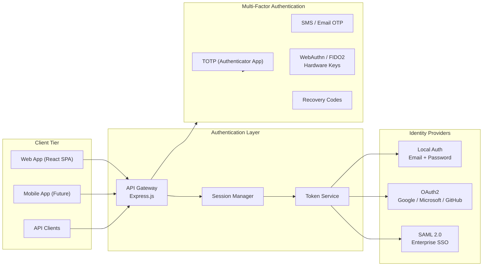

### 3.2 Authentication Methods

| Method | Use Case | Security Level | Implementation |
|--------|----------|----------------|----------------|
| **Email + Password** | Individual researchers, MVP | Standard | Argon2id hashing (memory=64MB, iterations=3, parallelism=4), minimum 12 characters, breach detection via Have I Been Pwned API |
| **OAuth2 / OpenID Connect** | Consumer users, quick onboarding | Standard | PKCE flow for SPAs, state parameter validation, redirect URI whitelist, ID token verification |
| **SAML 2.0** | Enterprise SSO (Azure AD, Okta, OneLogin) | High | SP-initiated SSO, encrypted assertions, signed responses, automatic user provisioning (SCIM) |
| **API Keys** | Service-to-service, integrations | Standard | HMAC-SHA256 signed keys, prefix + hash storage, rotation every 90 days, scope-limited |
| **JWT Access Tokens** | Session management | Standard | RS256 signing, 15-minute expiry, HTTP-only cookies, refresh token rotation (30-day sliding) |

### 3.3 Multi-Factor Authentication (MFA)

MFA is **required** for:
- All admin accounts
- Enterprise workspace owners
- Users accessing HIPAA-covered data

MFA is **optional but recommended** for:
- All other users

#### MFA Enrollment Flow

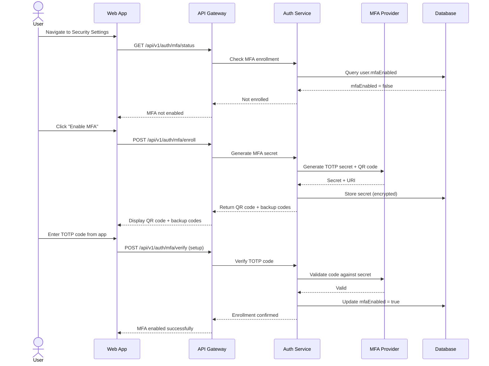

#### MFA Policy Matrix

| User Type | MFA Required | Allowed Methods | Grace Period |
|-----------|--------------|-----------------|--------------|
| Super Admin | Yes | TOTP, WebAuthn | 0 days (immediate) |
| Workspace Admin | Yes | TOTP, WebAuthn, SMS | 7 days |
| Enterprise User | Org-mandated | TOTP, SMS | 14 days (configurable) |
| Individual User | Optional | TOTP, SMS | N/A |
| API Service Account | N/A | API Key + IP allowlist | N/A |

### 3.4 Session Management

| Attribute | Specification |
|-----------|---------------|
| **Access Token Lifetime** | 15 minutes |
| **Refresh Token Lifetime** | 30 days (sliding) |
| **Refresh Token Rotation** | Yes — new token issued, old invalidated |
| **Cookie Flags** | HttpOnly, Secure, SameSite=Strict, __Host- prefix |
| **Session Binding** | Device fingerprint (UA + screen + canvas hash) |
| **Concurrent Sessions** | Max 5 per user; admin can revoke all |
| **Idle Timeout** | 30 minutes |
| **Absolute Timeout** | 12 hours |
| **Logout Behavior** | Access token blacklisted, refresh token invalidated, client-side cache cleared |

### 3.5 Password Policy

| Rule | Requirement |
|------|-------------|
| Minimum Length | 12 characters |
| Complexity | At least 3 of: uppercase, lowercase, number, special character |
| Common Password Check | Rejected if in top 10,000 breached passwords (HIBP) |
| Maximum Age | 90 days (enterprise); no forced rotation (individual) unless breached |
| History | Last 12 passwords cannot be reused |
| Lockout | 5 failed attempts = 15-minute lockout; 10 attempts = admin alert |
| Hashing Algorithm | Argon2id (winner of Password Hashing Competition) |

---

## 4. Role-Based Access Control (RBAC)

### 4.1 Role Definitions

| Role | Scope | Description |
|------|-------|-------------|
| **Super Admin** | Platform | Full system access; manages tenants, global settings, system health |
| **Workspace Admin** | Workspace | Manages workspace users, billing, integrations, data policies |
| **Project Manager** | Project | Creates projects, manages project membership, sets export permissions |
| **Researcher** | Project | Full CRUD on documents, annotations, notes, AI conversations within assigned projects |
| **Viewer** | Project | Read-only access to documents, annotations, and knowledge graph; can add private comments |
| **Guest** | Document | Time-limited access to specific documents or boards; no export |
| **AI Service** | System | Internal service account for AI pipeline operations |

### 4.2 RBAC Matrix: Roles vs Permissions

| Permission | Super Admin | Workspace Admin | Project Manager | Researcher | Viewer | Guest | AI Service |
|------------|:---------:|:---------------:|:---------------:|:----------:|:------:|:-----:|:----------:|
| **User Management** |
| Create user accounts | ✅ | ✅ | ❌ | ❌ | ❌ | ❌ | ❌ |
| Delete user accounts | ✅ | ✅ (workspace only) | ❌ | ❌ | ❌ | ❌ | ❌ |
| Assign roles | ✅ | ✅ | ✅ (project only) | ❌ | ❌ | ❌ | ❌ |
| View user list | ✅ | ✅ | ✅ | ❌ | ❌ | ❌ | ❌ |
| **Workspace Management** |
| Create workspace | ✅ | ❌ | ❌ | ❌ | ❌ | ❌ | ❌ |
| Delete workspace | ✅ | ✅ | ❌ | ❌ | ❌ | ❌ | ❌ |
| Configure SSO/SAML | ✅ | ✅ | ❌ | ❌ | ❌ | ❌ | ❌ |
| Set workspace policies | ✅ | ✅ | ❌ | ❌ | ❌ | ❌ | ❌ |
| View workspace analytics | ✅ | ✅ | ❌ | ❌ | ❌ | ❌ | ❌ |
| **Project Management** |
| Create project | ✅ | ✅ | ✅ | ❌ | ❌ | ❌ | ❌ |
| Delete project | ✅ | ✅ | ✅ | ❌ | ❌ | ❌ | ❌ |
| Archive project | ✅ | ✅ | ✅ | ❌ | ❌ | ❌ | ❌ |
| Manage project members | ✅ | ✅ | ✅ | ❌ | ❌ | ❌ | ❌ |
| Set project visibility | ✅ | ✅ | ✅ | ❌ | ❌ | ❌ | ❌ |
| **Document Management** |
| Upload document | ✅ | ✅ | ✅ | ✅ | ❌ | ❌ | ❌ |
| Delete document | ✅ | ✅ | ✅ | ✅ | ❌ | ❌ | ❌ |
| View document | ✅ | ✅ | ✅ | ✅ | ✅ | ✅ | ✅ |
| Edit document metadata | ✅ | ✅ | ✅ | ✅ | ❌ | ❌ | ❌ |
| Move document between projects | ✅ | ✅ | ✅ | ✅ | ❌ | ❌ | ❌ |
| **Annotation & Highlighting** |
| Create annotation | ✅ | ✅ | ✅ | ✅ | ❌ | ❌ | ❌ |
| Edit own annotation | ✅ | ✅ | ✅ | ✅ | ❌ | ❌ | ❌ |
| Edit others' annotations | ✅ | ✅ | ✅ | ❌ | ❌ | ❌ | ❌ |
| Delete own annotation | ✅ | ✅ | ✅ | ✅ | ❌ | ❌ | ❌ |
| Delete others' annotations | ✅ | ✅ | ✅ | ❌ | ❌ | ❌ | ❌ |
| View all annotations | ✅ | ✅ | ✅ | ✅ | ✅ | ✅ | ❌ |
| **Note & Snippet Management** |
| Create note | ✅ | ✅ | ✅ | ✅ | ❌ | ❌ | ❌ |
| Edit own note | ✅ | ✅ | ✅ | ✅ | ❌ | ❌ | ❌ |
| Edit others' notes | ✅ | ✅ | ✅ | ❌ | ❌ | ❌ | ❌ |
| Delete own note | ✅ | ✅ | ✅ | ✅ | ❌ | ❌ | ❌ |
| Delete others' note | ✅ | ✅ | ✅ | ❌ | ❌ | ❌ | ❌ |
| **AI Chat & Analysis** |
| Start AI conversation | ✅ | ✅ | ✅ | ✅ | ❌ | ❌ | ❌ |
| View AI conversation | ✅ | ✅ | ✅ | ✅ | ✅ | ❌ | ❌ |
| Share AI conversation | ✅ | ✅ | ✅ | ✅ | ❌ | ❌ | ❌ |
| Configure AI model | ✅ | ✅ | ❌ | ❌ | ❌ | ❌ | ❌ |
| **Knowledge Graph** |
| Create node / edge | ✅ | ✅ | ✅ | ✅ | ❌ | ❌ | ❌ |
| Edit knowledge graph | ✅ | ✅ | ✅ | ✅ | ❌ | ❌ | ❌ |
| Delete node / edge | ✅ | ✅ | ✅ | ✅ | ❌ | ❌ | ❌ |
| View knowledge graph | ✅ | ✅ | ✅ | ✅ | ✅ | ✅ | ❌ |
| **Citation & Export** |
| Create citation | ✅ | ✅ | ✅ | ✅ | ❌ | ❌ | ❌ |
| Export to Word/PDF | ✅ | ✅ | ✅ | ✅ | ❌ | ❌ | ❌ |
| Export to reference manager | ✅ | ✅ | ✅ | ✅ | ❌ | ❌ | ❌ |
| Bulk export | ✅ | ✅ | ✅ | ❌ | ❌ | ❌ | ❌ |
| Watermark control | ✅ | ✅ | ✅ | ❌ | ❌ | ❌ | ❌ |
| **Collaboration** |
| Invite collaborators | ✅ | ✅ | ✅ | ✅ | ❌ | ❌ | ❌ |
| Manage collaborator permissions | ✅ | ✅ | ✅ | ❌ | ❌ | ❌ | ❌ |
| Comment on shared items | ✅ | ✅ | ✅ | ✅ | ✅ | ❌ | ❌ |
| Real-time editing | ✅ | ✅ | ✅ | ✅ | ❌ | ❌ | ❌ |
| **Admin & Settings** |
| Configure security settings | ✅ | ✅ | ❌ | ❌ | ❌ | ❌ | ❌ |
| View audit logs | ✅ | ✅ | ❌ | ❌ | ❌ | ❌ | ❌ |
| Configure data retention | ✅ | ✅ | ❌ | ❌ | ❌ | ❌ | ❌ |
| Configure AI provider | ✅ | ❌ | ❌ | ❌ | ❌ | ❌ | ❌ |
| System backup/restore | ✅ | ❌ | ❌ | ❌ | ❌ | ❌ | ❌ |

### 4.3 Permission Inheritance Model

```
Workspace
├── Project A (Project Manager: Alice)
│   ├── Document 1 (Owner: Alice, Collaborators: Bob [Researcher], Carol [Viewer])
│   ├── Document 2 (Owner: Bob, Collaborators: Alice [Researcher])
│   └── Research Board (Owner: Alice, Collaborators: Bob [Researcher])
│
└── Project B (Project Manager: Dave)
    ├── Document 3 (Owner: Dave, Collaborators: Eve [Viewer])
    └── Knowledge Graph (Owner: Dave, Collaborators: Eve [Viewer])
```

**Inheritance Rules**:
1. Workspace Admin inherits all permissions within their workspace
2. Project Manager inherits all permissions within their project
3. Document-level permissions override project-level permissions (more restrictive)
4. Role changes are retroactive — permission recalculation within 1 minute
5. Permission revocation is immediate and terminates active WebSocket sessions

### 4.4 Dynamic Access Control (ABAC)

In addition to RBAC, CiteMind implements Attribute-Based Access Control for fine-grained scenarios:

| Attribute Type | Examples | Use Case |
|----------------|----------|----------|
| **User Attributes** | Department, clearance level, institution affiliation | Legal researchers only access client-confidential documents |
| **Resource Attributes** | Document classification (Public, Internal, Confidential, Restricted), data sensitivity | Restricted documents require additional MFA |
| **Environmental Attributes** | Time of day, IP address, geolocation | Admin access blocked from outside corporate VPN |
| **Action Attributes** | Export, print, share, AI analyze | Export of Restricted documents requires approval workflow |

---

## 5. Tenant Isolation

### 5.1 Multi-Tenant Architecture

CiteMind is designed as a **multi-tenant SaaS** with logical isolation as the primary model, with the capability to upgrade to physical isolation for enterprise customers.

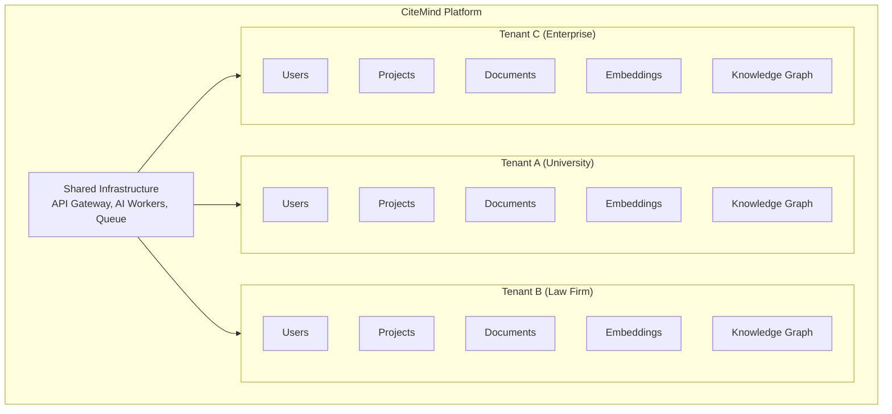

### 5.2 Isolation Levels

| Level | Description | Use Case | Implementation |
|-------|-------------|----------|----------------|
| **Logical (Shared)** | Single database, tenant_id column | Standard SaaS, small teams | Row-level security (RLS) in PostgreSQL, tenant_id filtering on every query |
| **Schema Isolation** | Separate schema per tenant | Medium enterprises, data residency needs | Schema-per-tenant, shared compute |
| **Physical Isolation** | Separate database instance | Large enterprises, regulated industries | Dedicated PostgreSQL + storage per tenant; can be in separate VPC/regions |
| **Dedicated Instance** | Full isolated deployment | Government, healthcare, strict compliance | Separate Kubernetes namespace, own infrastructure stack |

### 5.3 Row-Level Security (RLS) Policies

All database tables contain a `tenant_id` column. PostgreSQL RLS policies enforce:

```sql
-- Example RLS policy for documents table
CREATE POLICY tenant_isolation_policy ON documents
    USING (tenant_id = current_setting('app.current_tenant')::UUID);

-- Set tenant context per request
SET app.current_tenant = '550e8400-e29b-41d4-a716-446655440000';
```

**RLS Policy Table**:

| Table | RLS Policy | Enforced At |
|-------|-----------|-------------|
| `users` | Can only view users in same tenant | Application + DB |
| `documents` | Can only access documents in same tenant | Application + DB |
| `annotations` | Can only access annotations for documents in same tenant | Application + DB |
| `ai_conversations` | Can only access conversations in same tenant | Application + DB |
| `embeddings` | Can only query embeddings in same tenant | Application + DB |
| `knowledge_graph_nodes` | Can only traverse nodes in same tenant | Application + DB |
| `citations` | Can only access citations in same tenant | Application + DB |
| `audit_logs` | Can only access audit logs for same tenant (admins) | Application + DB |

### 5.4 Tenant Context Enforcement

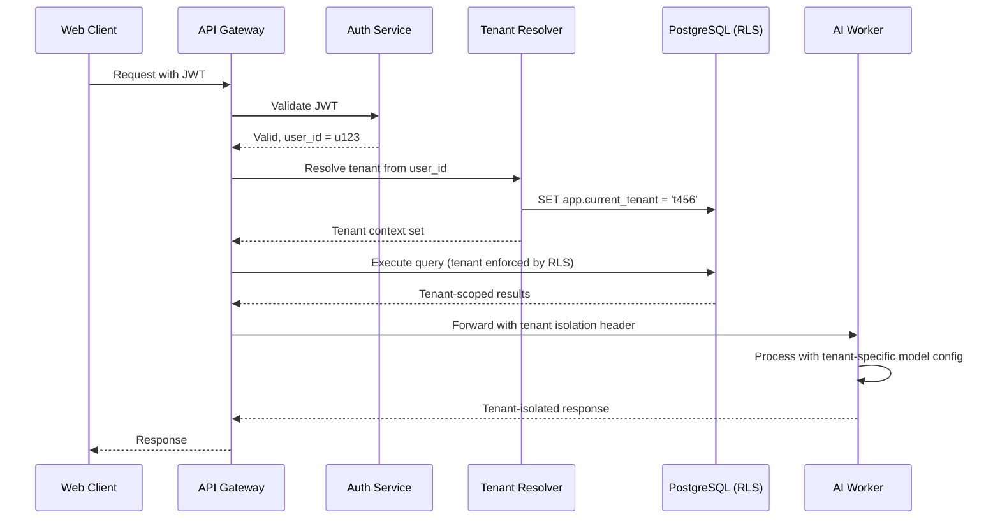

---

## 6. Encryption at Rest

### 6.1 Encryption Scope

| Data Type | Storage Location | Encryption Method | Key Management |
|-----------|------------------|-------------------|----------------|
| **PDF Documents** | S3 / Local filesystem | AES-256-GCM | AWS KMS / HashiCorp Vault |
| **Document Thumbnails** | S3 / Local filesystem | AES-256-GCM | AWS KMS / HashiCorp Vault |
| **Database Files** | PostgreSQL data directory | Transparent Data Encryption (TDE) | Cloud provider KMS |
| **Database Backups** | S3 / Glacier | AES-256-GCM | AWS KMS with separate key |
| **Vector Embeddings** | PostgreSQL (pgvector) | AES-256 via database TDE | Cloud provider KMS |
| **User Passwords** | PostgreSQL | Argon2id (not encrypt — hash) | N/A |
| **MFA Secrets** | PostgreSQL | AES-256-GCM, column-level | AWS KMS / HashiCorp Vault |
| **API Keys** | PostgreSQL | AES-256-GCM, column-level | AWS KMS / HashiCorp Vault |
| **Audit Logs** | PostgreSQL + S3 (archive) | AES-256-GCM | AWS KMS / HashiCorp Vault |
| **AI Conversation History** | PostgreSQL | AES-256-GCM, column-level | AWS KMS / HashiCorp Vault |
| **Knowledge Graph Data** | PostgreSQL / Neo4j | AES-256 via database TDE | Cloud provider KMS |
| **Session Tokens** | Redis | AES-256-GCM | Redis key management |
| **Export Files** | S3 (temporary) | AES-256-GCM | AWS KMS |
| **Search Index** | Elasticsearch / OpenSearch | AES-256 | Cloud provider KMS |

### 6.2 Encryption Architecture

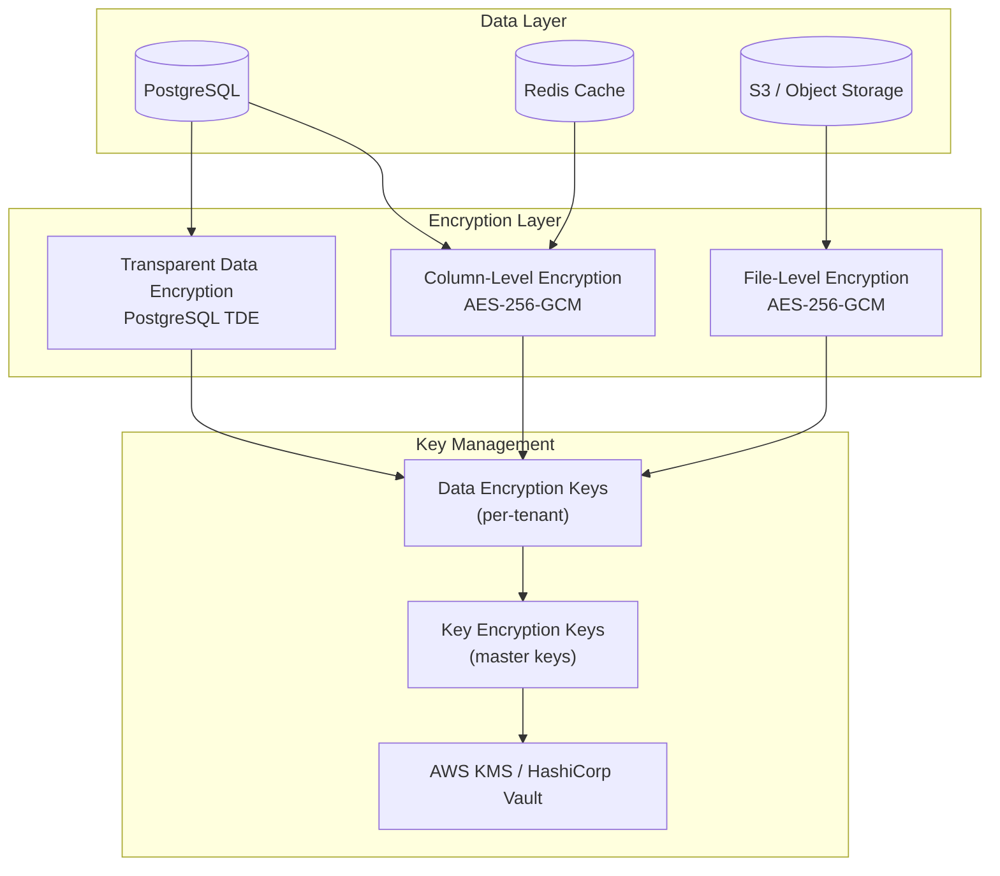

### 6.3 Key Rotation Policy

| Key Type | Rotation Frequency | Rotation Method | Impact |
|----------|-------------------|-----------------|--------|
| **Master Key (KEK)** | Annually | Re-encrypt DEKs with new master key | No data re-encryption required |
| **Data Encryption Key (DEK)** | Per tenant on suspicion of compromise | Re-encrypt all data with new DEK | Background re-encryption process |
| **API Signing Keys** | Every 90 days | Generate new key pair, update JWT validation | Grace period with old key (24h) |
| **Backup Encryption Key** | Every 180 days | Re-encrypt backups | Next backup cycle |

### 6.4 Tenant-Specific Encryption (Enterprise)

Enterprise customers can opt for **Bring Your Own Key (BYOK)**:

- Customer manages master key in their own cloud KMS (AWS KMS, Azure Key Vault, GCP Cloud KMS)
- CiteMind never sees the plaintext master key
- Key usage audit logs sent to customer's SIEM
- Key revocation immediately disables data access for that tenant

---

## 7. Encryption in Transit

### 7.1 TLS Configuration

| Component | Protocol | Certificate | Configuration |
|-----------|----------|-------------|---------------|
| **Web Application** | TLS 1.3 | Let's Encrypt / Custom | HSTS (max-age=31536000), OCSP stapling |
| **API Gateway** | TLS 1.3 | Custom wildcard | Mutual TLS (mTLS) for service-to-service |
| **Database** | TLS 1.3 | Self-signed CA | Verify-full mode, certificate pinning |
| **Redis** | TLS 1.2+ | Self-signed CA | Stunnel or Redis native TLS |
| **WebSocket** | WSS (TLS 1.3) | Same as web app | Secure frame headers |
| **S3 Upload** | TLS 1.3 | AWS certificate | Pre-signed HTTPS URLs only |
| **AI Provider** | TLS 1.3 | Provider certificate | Certificate pinning for OpenAI/Anthropic |
| **Email (SMTP)** | TLS 1.2+ | STARTTLS | Opportunistic TLS with fallback reject |
| **LDAP/AD** | TLS 1.2+ | Enterprise CA | LDAPS on port 636 |

### 7.2 mTLS for Service-to-Service Communication

All internal microservices authenticate each other using mutual TLS:

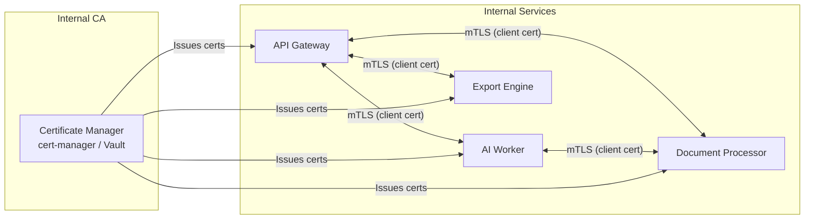

### 7.3 Certificate Management

| Aspect | Policy |
|--------|--------|
| **Certificate Authority** | Let's Encrypt for public; internal CA for service mesh |
| **Auto-renewal** | cert-manager (Kubernetes) or certbot (VM) with 30-day renewal window |
| **Certificate Transparency** | Monitor CT logs for unauthorized certificates |
| **Revocation** | OCSP + CRL; immediate revocation on compromise |
| **Key Length** | RSA 4096-bit or ECDSA P-256 |

---

## 8. Secrets Management

### 8.1 Secrets Classification

| Tier | Examples | Storage | Access Pattern |
|------|----------|---------|----------------|
| **Critical** | Database master password, KMS master key, JWT signing key | HashiCorp Vault / AWS KMS | Manual retrieval only, dual control |
| **High** | API service credentials, OAuth client secrets, SMTP password | HashiCorp Vault | Application read-only at startup |
| **Medium** | Third-party API keys (AI providers), webhook signing secrets | Vault / Secrets Manager | Application read, regular rotation |
| **Low** | Feature flags, non-sensitive configuration | Environment variables / ConfigMap | Application read |

### 8.2 Secrets Management Architecture

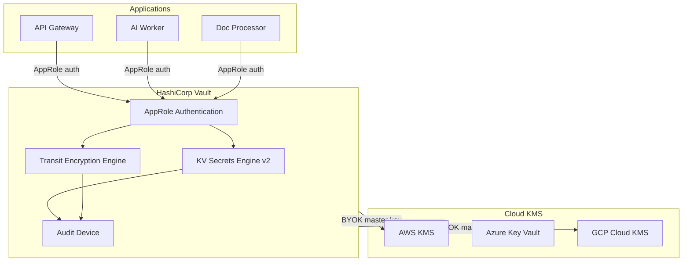

### 8.3 Secrets Lifecycle

| Phase | Policy |
|-------|--------|
| **Generation** | Cryptographically random (32+ bytes for keys); Vault dynamic secrets for databases |
| **Distribution** | Injected at runtime; never hardcoded, never in Git, never in Docker images |
| **Storage** | Vault encrypted at rest; in-memory only in application; no persistent local storage |
| **Rotation** | Automatic for dynamic secrets (DB credentials); 90 days for static API keys; immediate on suspicion |
| **Revocation** | Immediate; Vault path revocation; application restart to clear memory |
| **Audit** | All access logged; anomalous access patterns trigger alerts |

### 8.4 Environment-Specific Secrets

```
production/
  ├── database/
  │   ├── primary_url
  │   ├── replica_url
  │   └── root_password
  ├── ai/
  │   ├── openai_api_key
  │   ├── anthropic_api_key
  │   └── embedding_api_key
  ├── auth/
  │   ├── jwt_signing_private_key
  │   ├── jwt_signing_public_key
  │   └── saml_cert
  ├── storage/
  │   ├── s3_access_key
  │   └── s3_secret_key
  └── email/
      ├── smtp_password
      └── sendgrid_api_key
```

---

## 9. Audit Logging

### 9.1 Audit Log Requirements

Audit logs must be:
- **Complete**: Record all security-relevant events
- **Immutable**: Append-only, tamper-evident (hash chain or blockchain-like)
- **Time-synchronized**: UTC timestamps with NTP-synchronized clocks
- **Attributable**: Link to identifiable user and session
- **Protected**: Separate access controls from application logs
- **Retained**: Per compliance requirements (see Retention Policies)

### 9.2 Events to Log

| Category | Event | Data Captured | Retention |
|----------|-------|---------------|-----------|
| **Authentication** | Login success | User ID, timestamp, IP, device, MFA method | 7 years |
| **Authentication** | Login failure | User ID, timestamp, IP, failure reason, attempt count | 7 years |
| **Authentication** | Logout | User ID, timestamp, session ID | 7 years |
| **Authentication** | Session refresh | User ID, timestamp, old/new token fingerprint | 7 years |
| **Authentication** | MFA enrollment | User ID, timestamp, method | 7 years |
| **Authentication** | MFA challenge | User ID, timestamp, success/failure | 7 years |
| **Authentication** | Password change | User ID, timestamp, method | 7 years |
| **Authentication** | Password reset request | User ID, timestamp, IP | 7 years |
| **Access Control** | Permission granted | Granter, grantee, permission, resource, timestamp | 7 years |
| **Access Control** | Permission revoked | Revoker, grantee, permission, resource, timestamp | 7 years |
| **Access Control** | Role change | User ID, old role, new role, changer, timestamp | 7 years |
| **Document** | Document uploaded | User ID, document ID, filename, size, checksum, timestamp | 7 years |
| **Document** | Document viewed | User ID, document ID, timestamp, IP | 7 years |
| **Document** | Document downloaded | User ID, document ID, timestamp, IP | 7 years |
| **Document** | Document deleted | User ID, document ID, timestamp, permanent/soft | 7 years |
| **Document** | Document shared | User ID, document ID, recipient, permission level, timestamp | 7 years |
| **Document** | Document exported | User ID, document ID, format, timestamp, watermark ID | 7 years |
| **Annotation** | Annotation created | User ID, document ID, annotation ID, timestamp, type | 7 years |
| **Annotation** | Annotation modified | User ID, annotation ID, timestamp, change summary | 7 years |
| **Annotation** | Annotation deleted | User ID, annotation ID, timestamp | 7 years |
| **AI** | AI conversation started | User ID, document ID, conversation ID, model, timestamp | 7 years |
| **AI** | AI message sent | User ID, conversation ID, message length, timestamp | 7 years |
| **AI** | AI response received | User ID, conversation ID, token count, timestamp, latency | 7 years |
| **AI** | AI model switched | User ID, conversation ID, old model, new model, timestamp | 7 years |
| **AI** | Document sent to AI | User ID, document ID, chunk count, timestamp | 7 years |
| **Knowledge Graph** | Node created | User ID, node ID, type, timestamp | 7 years |
| **Knowledge Graph** | Edge created | User ID, source node, target node, relation, timestamp | 7 years |
| **Knowledge Graph** | Graph exported | User ID, graph ID, format, timestamp | 7 years |
| **Citation** | Citation generated | User ID, document ID, citation style, timestamp | 7 years |
| **Admin** | Admin action | Admin ID, action, target, timestamp, IP | 7 years |
| **Admin** | User impersonation | Admin ID, target user, reason, timestamp, duration | 7 years |
| **System** | Backup completed | Backup ID, size, timestamp, integrity hash | 7 years |
| **System** | Restore initiated | Initiator, backup ID, timestamp, reason | 7 years |
| **System** | Configuration change | Changer, setting, old value, new value, timestamp | 7 years |
| **System** | Security alert triggered | Alert type, severity, trigger, timestamp | 7 years |
| **Compliance** | Data export request | User ID, request ID, timestamp, scope | 7 years |
| **Compliance** | Data deletion request | User ID, request ID, timestamp, scope | 7 years |
| **Compliance** | Consent given | User ID, consent type, timestamp, version | 7 years |
| **Compliance** | Consent revoked | User ID, consent type, timestamp | 7 years |

### 9.3 Audit Log Architecture

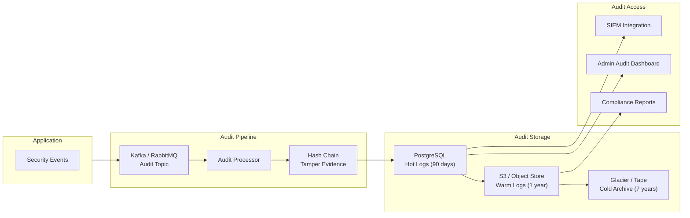

### 9.4 Audit Log Schema

```json
{
  "event_id": "uuid",
  "timestamp": "2025-07-26T10:00:00Z",
  "event_type": "document.viewed",
  "severity": "info",
  "tenant_id": "uuid",
  "actor": {
    "user_id": "uuid",
    "session_id": "uuid",
    "ip_address": "192.168.1.1",
    "user_agent": "Mozilla/5.0...",
    "device_fingerprint": "sha256_hash"
  },
  "resource": {
    "resource_type": "document",
    "resource_id": "uuid",
    "project_id": "uuid"
  },
  "action": {
    "verb": "viewed",
    "status": "success",
    "details": {
      "page_number": 5,
      "zoom_level": 1.0
    }
  },
  "result": {
    "success": true,
    "error_code": null
  },
  "compliance": {
    "gdpr_category": "legitimate_interest",
    "data_subject_id": "uuid"
  },
  "hash": "sha256_of_previous_record",
  "signature": "hmac_signature"
}
```

---

## 10. Document Access Control

### 10.1 Access Control Model

Documents in CiteMind use a **layered access control model** combining:
1. **Ownership** — The user who uploaded the document
2. **Project membership** — Users in the project can access based on role
3. **Explicit sharing** — Document can be shared with specific users or groups
4. **Link sharing** — Time-limited, password-protected, or public links
5. **External integration** — Access via reference managers (Zotero, Mendeley)

### 10.2 Permission Levels

| Level | Read | Annotate | Export | Share | Delete | Manage |
|-------|------|----------|--------|-------|--------|--------|
| **Owner** | ✅ | ✅ | ✅ | ✅ | ✅ | ✅ |
| **Editor** | ✅ | ✅ | ✅ | ✅ | ❌ | ❌ |
| **Commenter** | ✅ | ✅ (comments only) | ❌ | ❌ | ❌ | ❌ |
| **Viewer** | ✅ | ❌ | ❌ | ❌ | ❌ | ❌ |
| **Public (Link)** | ✅ (configurable) | ❌ | ❌ | ❌ | ❌ | ❌ |

### 10.3 Sharing Controls

| Control | Description | Default |
|---------|-------------|---------|
| **Link expiration** | Set expiry date for shared links | 7 days |
| **Password protection** | Require password for link access | Disabled |
| **Download prevention** | Disable PDF download for viewers | Disabled |
| **Copy prevention** | Disable text selection/copy | Disabled |
| **Watermark** | Add viewer email watermark on shared docs | Disabled |
| **Audit trail** | Log all access to shared document | Enabled |
| **Revoke access** | Instant revocation of any share | N/A |
| **Domain restriction** | Only allow access from specific email domains | None |

### 10.4 Document Access Control Flow

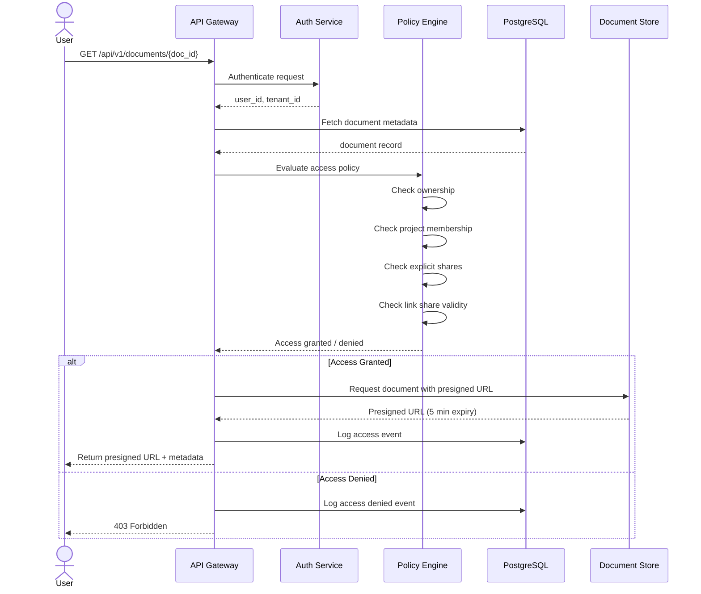

---

## 11. Data Retention Policies

### 11.1 Retention Framework

| Data Category | Retention Period | Trigger | Action | Legal Basis |
|---------------|------------------|---------|--------|-------------|
| **User account data** | Account lifetime + 30 days | Account deletion | Soft delete → purge after 30 days | Contractual necessity |
| **Documents** | Account lifetime + 90 days | Account deletion | Move to cold storage → purge after 90 days | Legitimate interest |
| **Annotations** | Account lifetime + 90 days | Account deletion | Purge with document | Contractual necessity |
| **AI conversations** | 90 days | Conversation age | Anonymize after 90 days | Legitimate interest |
| **AI conversations (enterprise)** | Configurable (default 30 days) | Conversation age | Delete after retention period | Contractual necessity |
| **Audit logs** | 7 years | Calendar time | Archive to cold storage | Legal obligation |
| **Export files** | 7 days | Export creation | Auto-delete from temp storage | Contractual necessity |
| **Deleted documents (trash)** | 30 days | Deletion date | Auto-permanent-delete after 30 days | User control |
| **Embeddings** | Account lifetime + 30 days | Account deletion | Purge from vector DB | Contractual necessity |
| **Knowledge graph** | Account lifetime + 90 days | Account deletion | Purge with account | Contractual necessity |
| **Backups** | 30 days | Backup age | Rotate backups | Legal obligation |
| **Error logs** | 90 days | Log age | Anonymize IP, purge after 90 days | Legitimate interest |
| **Session data** | Session lifetime | Logout/timeout | Immediate purge | Contractual necessity |
| **Marketing data** | 2 years | Last interaction | Anonymize or delete | Consent |
| **Support tickets** | 3 years | Ticket closure | Archive | Contractual necessity |

### 11.2 Data Lifecycle Management

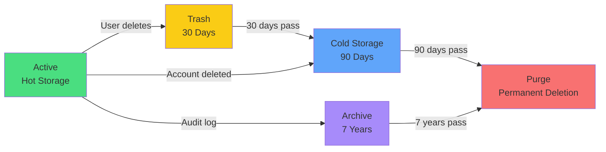

### 11.3 Retention Policy Enforcement

- **Automated deletion jobs** run nightly at 02:00 UTC
- **Soft deletion** preserves referential integrity for 30 days (user can restore)
- **Hard deletion** cryptographically shreds data (secure overwrite for files, `DELETE` for database records)
- **Embeddings** are removed from vector index immediately upon document deletion
- **Audit logs** are never deleted within retention period; archived to immutable storage

---

## 12. Data Deletion (GDPR Right to be Forgotten)

### 12.1 GDPR Compliance Framework

CiteMind is designed to fully support GDPR compliance for EU users and EU-hosted enterprise customers.

### 12.2 Data Subject Rights

| Right | Implementation | Timeline | Verification |
|-------|---------------|----------|--------------|
| **Right to Access** | Export all user data in machine-readable format (JSON) | 30 days | Identity verification required |
| **Right to Rectification** | Edit profile, document metadata, annotation content | Immediate | Authentication |
| **Right to Erasure** | Complete account deletion with data purge | 30 days | Identity verification + confirmation email |
| **Right to Restrict Processing** | Pause AI processing, analytics, marketing | Immediate | Authentication |
| **Right to Data Portability** | Export documents, notes, annotations, knowledge graph in standard formats | 30 days | Identity verification |
| **Right to Object** | Opt-out of marketing, AI training, analytics | Immediate | Authentication |
| **Right to Not be Subject to Automated Decision-Making** | No automated decisions with legal/significant effects; AI is assistive only | N/A | N/A |

### 12.3 Account Deletion Flow

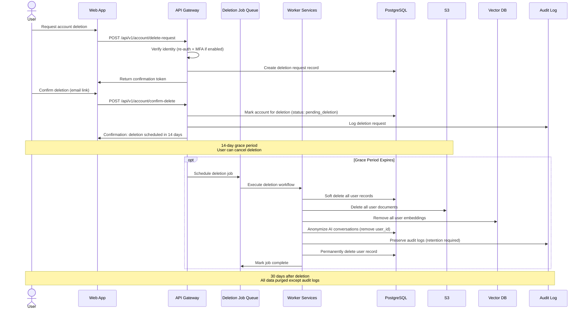

### 12.4 Deletion Verification

After deletion, CiteMind provides:
- **Deletion certificate**: Cryptographic proof of deletion with timestamp
- **Data absence confirmation**: Query confirmation that no user data remains in primary systems
- **Third-party notification**: AI providers notified to delete any retained conversation data (per zero-data-retention agreements)

### 12.5 Exceptions to Deletion

| Exception | Legal Basis | Data Preserved | Duration |
|-----------|-------------|----------------|----------|
| **Legal hold** | Legal obligation | All data subject to litigation hold | Until hold released |
| **Financial records** | Tax/accounting law | Invoices, payment records | 7-10 years (jurisdiction-dependent) |
| **Audit logs** | Legal obligation | Security event logs | 7 years |
| **Aggregated analytics** | Legitimate interest | Anonymized, non-identifiable statistics | Indefinite |

---

## 13. User Consent Management

### 13.1 Consent Categories

| Category | Purpose | Required | Default | Withdrawal Impact |
|----------|---------|----------|---------|-------------------|
| **Terms of Service** | Legal agreement to use platform | Yes | Agreed at signup | Account termination |
| **Privacy Policy** | Data processing notice | Yes | Agreed at signup | Account termination |
| **AI Processing** | Allow AI to analyze documents and generate responses | Yes | Enabled | AI features disabled |
| **Document OCR** | Allow server-side OCR processing | Yes | Enabled | PDF text extraction disabled |
| **Analytics** | Product improvement, usage analytics | No | Opt-in | No impact on functionality |
| **Error Reporting** | Automatic crash and error reporting | No | Opt-in | No impact on functionality |
| **Marketing** | Product updates, newsletters | No | Opt-out | No impact on functionality |
| **AI Training** | Use anonymized data to improve AI models | No | Opt-out | No impact on functionality |
| **Third-party Integrations** | Share data with Zotero, Mendeley, etc. | Per integration | Opt-in per integration | Integration disabled |
| **Collaboration** | Allow other users to view/edit shared content | Per share | Opt-in per share | Collaboration access revoked |

### 13.2 Consent Management Architecture

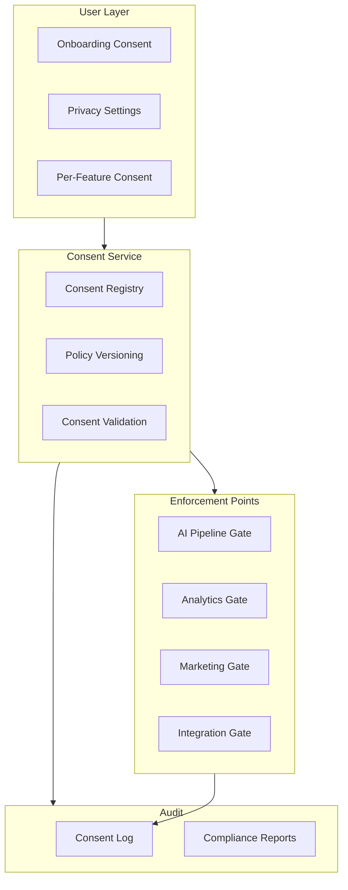

### 13.3 Granular AI Consent

Users can control AI processing at multiple levels:

| Level | Control | Default |
|-------|---------|---------|
| **Global** | Enable/disable all AI features | Enabled |
| **Per-project** | Enable/disable AI for specific projects | Inherits global |
| **Per-document** | Exclude specific documents from AI processing | Inherits project |
| **Per-conversation** | Choose whether conversation is logged | Enabled |
| **Model selection** | Choose which AI model processes data | Organization default |
| **Data retention** | How long AI conversations are retained | 90 days |

### 13.4 Consent Versioning and Re-consent

- Each policy change triggers a new version number
- Users must re-consent to material changes within 30 days
- Non-essential features are disabled if consent is not renewed
- Complete consent history maintained for compliance evidence

---

## 14. AI Privacy Controls

### 14.1 AI Privacy Principles

| Principle | Implementation |
|-----------|----------------|
| **Data Minimization** | Only send document chunks relevant to user query; no full document upload to AI provider |
| **Purpose Limitation** | AI processing only for user's stated research purpose; no secondary use |
| **User Control** | User can disable AI, delete AI conversations, opt-out of AI logging |
| **Transparency** | Clear indication when AI is processing; explanation of what data is sent |
| **No Training on User Data** | Contractual guarantees with AI providers that user data is not used for model training |

### 14.2 AI Processing Privacy Architecture

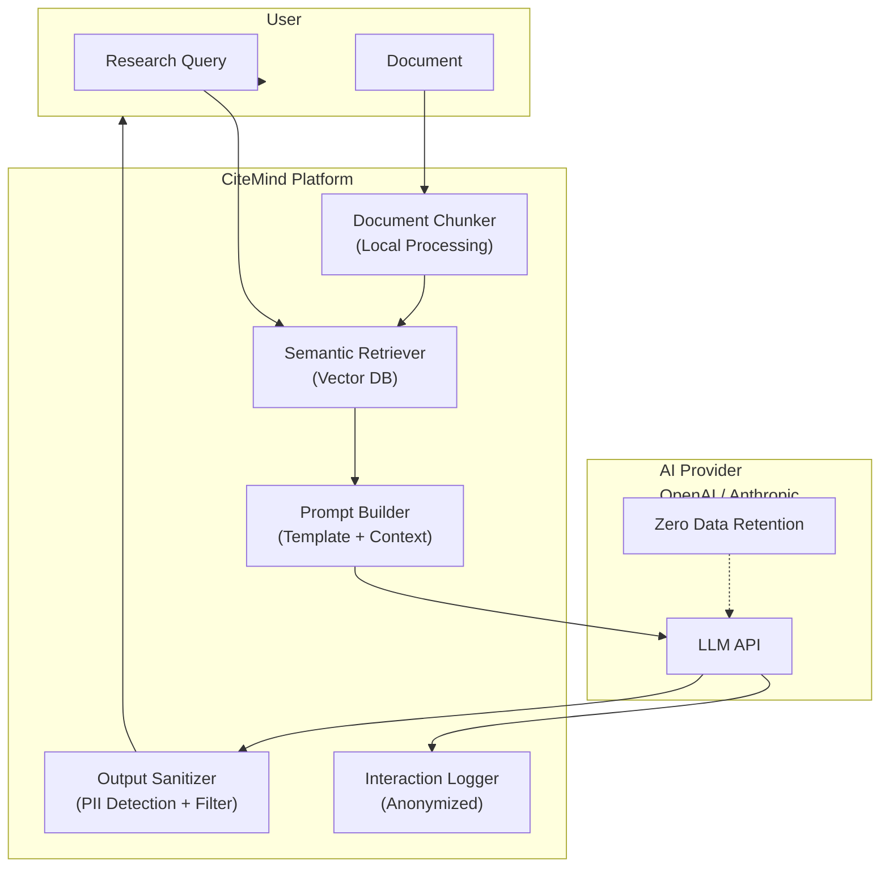

### 14.3 AI Privacy Controls

| Control | Description | User Configurable |
|---------|-------------|-------------------|
| **Chunking scope** | Only relevant chunks sent to AI, not full document | No (system enforced) |
| **Context window** | Maximum tokens sent to AI per request (configurable) | Yes (up to model limit) |
| **PII redaction** | Automatic removal of personal identifiers before AI processing | Yes (on/off) |
| **Conversation logging** | Whether AI conversation is stored for history | Yes (on/off) |
| **Conversation sharing** | Whether AI conversation can be shared with collaborators | Yes (on/off) |
| **Model selection** | Choose provider/model with different privacy postures | Yes (if admin allows) |
| **Local AI option** | Use on-premise/local model for sensitive documents | Enterprise only |
| **Zero data retention** | Enforce ZDR with AI provider | Enterprise only |

### 14.4 PII Detection and Redaction

Before sending content to AI providers, CiteMind scans for and optionally redacts:

| PII Type | Detection Method | Redaction Action |
|----------|------------------|------------------|
| **Names** | Named Entity Recognition (NER) | Replace with `[PERSON]` |
| **Email addresses** | Regex + NER | Replace with `[EMAIL]` |
| **Phone numbers** | Regex | Replace with `[PHONE]` |
| **Social Security Numbers** | Regex | Replace with `[SSN]` |
| **Credit card numbers** | Luhn algorithm + regex | Replace with `[CREDIT_CARD]` |
| **IP addresses** | Regex | Replace with `[IP_ADDRESS]` |
| **Physical addresses** | NER + regex | Replace with `[ADDRESS]` |
| **Dates of birth** | Regex + context | Replace with `[DATE]` |
| **Medical record numbers** | Regex | Replace with `[MRN]` |
| **Custom patterns** | Admin-defined regex | Admin-defined replacement |

---

## 15. Prompt and Document Isolation

### 15.1 Isolation Requirements

The most critical security requirement for CiteMind is ensuring that **no user's documents, annotations, or AI conversations can ever be accessed by another user**, either through direct access or via AI inference.

### 15.2 Isolation Architecture

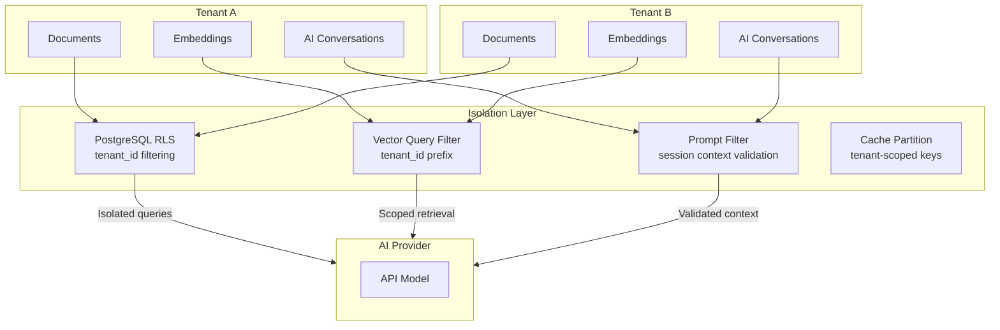

### 15.3 Isolation Mechanisms

| Layer | Mechanism | Verification |
|-------|-----------|------------|
| **Database** | RLS policies on every table; tenant_id required in every query | SQL query audit |
| **Vector DB** | Tenant ID prefix on all embedding IDs; filtered similarity search | Isolation testing |
| **Cache** | Redis key namespacing: `tenant:{id}:resource:{key}` | Cache inspection |
| **AI Prompts** | Session-bound context; no cross-session prompt injection | Red team testing |
| **File Storage** | Tenant-prefixed S3 paths: `s3://bucket/tenants/{id}/documents/` | Path validation |
| **Search Index** | Tenant-filtered index queries; separate indices for enterprise | Search testing |
| **WebSocket** | Channel isolation per tenant; auth token validated on every message | Connection testing |
| **Export** | Tenant-scoped export queue; no cross-tenant file generation | Export audit |

### 15.4 Cross-Tenant Data Leakage Prevention

| Attack Vector | Prevention | Detection |
|---------------|------------|-----------|
| **IDOR (Insecure Direct Object Reference)** | UUID-based IDs; RLS enforces tenant ownership; no sequential IDs | Automated IDOR scanning |
| **SQL Injection via search** | Parameterized queries; ORM-only; no raw SQL from user input | SQL injection testing |
| **Prompt injection to access other docs** | Strict prompt templates; user input escaped; system message enforced | Red team prompt injection |
| **Embedding similarity leakage** | Tenant-filtered vector search; cosine similarity scoped to tenant | Vector isolation tests |
| **Cache poisoning** | Tenant-scoped cache keys; key validation; no user-controlled cache keys | Cache audit |
| **Graph traversal to other tenants** | Graph edges filtered by tenant_id; no global graph traversal | Graph security audit |
| **Backup restore to wrong tenant** | Tenant-tagged backups; restore validation; tenant ID mismatch prevention | Restore testing |
| **Log analysis leakage** | Tenant-scoped log aggregation; no cross-tenant log queries | Log access audit |

### 15.5 AI Conversation Isolation

Each AI conversation is strictly bound to:
- A single user (owner)
- A single tenant
- Specific documents (explicitly selected by user)
- A specific project (inheritance)

The AI system prompt includes the tenant and user context, and the retrieval system will only fetch embeddings from the user's documents. There is no mechanism for the AI to "search" across tenants.

---

## 16. Model Provider Risk

### 16.1 AI Provider Risk Assessment

| Provider | Data Retention | Training on User Data | SOC 2 | HIPAA BAA | FedRAMP | Zero Data Retention Option | Notes |
|----------|---------------|----------------------|-------|-----------|---------|---------------------------|-------|
| **OpenAI (GPT-4)** | 30 days | No (API) | ✅ | ✅ | In progress | Available (Enterprise) | Market leader; ZDR requires Enterprise contract |
| **Anthropic (Claude)** | 30 days | No (API) | ✅ | ✅ | In progress | Available (Enterprise) | Strong on safety; ZDR available |
| **Azure OpenAI** | Configurable | No | ✅ | ✅ | ✅ | Available | Best for enterprise compliance; data stays in Azure |
| **AWS Bedrock** | Configurable | No | ✅ | ✅ | In progress | Available | Good for AWS-centric deployments |
| **Google Vertex AI** | Configurable | No | ✅ | ✅ | In progress | Available | Good for GCP deployments |
| **Local/On-premise (Llama, Mistral)** | None | N/A | Self-managed | Self-managed | Self-managed | N/A | Highest privacy; higher infra cost |

### 16.2 Provider Risk Mitigation

| Risk | Mitigation | Residual Risk |
|------|------------|---------------|
| **Data retention beyond processing** | Zero Data Retention (ZDR) contracts; data processing agreements (DPA) | Low (contractual + audit) |
| **Training on sensitive data** | Explicit opt-out; contractual prohibition; API terms enforcement | Low |
| **Provider data breach** | Data minimization (chunks only); PII redaction; no full documents | Medium (shared responsibility) |
| **Provider availability** | Multi-provider fallback; rate limiting; circuit breaker pattern | Low |
| **Model bias / hallucination** | Source grounding; citation verification; confidence scores; human review | Medium (AI limitation) |
| **Jurisdictional exposure** | EU-based model hosting (Azure EU, GCP EU); data residency controls | Low (with EU hosting) |
| **Prompt injection** | Input sanitization; prompt templating; output validation; rate limiting | Medium (ongoing threat) |

### 16.3 Multi-Provider Strategy

CiteMind implements a **provider abstraction layer** (via LangChain/LangGraph) that allows:
- **Failover**: Automatic fallback if primary provider is unavailable
- **Load balancing**: Distribute requests across providers
- **Cost optimization**: Route to most cost-effective provider for task type
- **Compliance routing**: Route sensitive documents to compliant provider (e.g., Azure OpenAI for HIPAA)
- **User choice**: Allow users to select preferred provider (if admin permits)

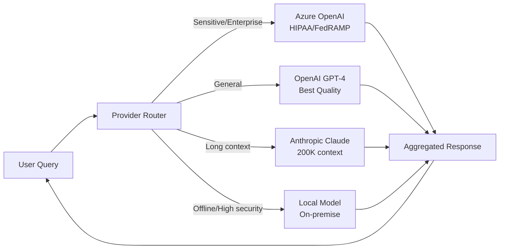

---

## 17. Compliance Readiness

### 17.1 Compliance Framework Overview

CiteMind is designed to achieve compliance with major regulatory frameworks through built-in controls, audit capabilities, and policy enforcement.

### 17.2 Compliance Checklist

| Standard | Requirement | Status | Evidence | Target Date |
|----------|-------------|--------|----------|-------------|
| **GDPR** | Lawful basis for processing | ✅ Implemented | Consent management, legitimate interest assessment | MVP |
| **GDPR** | Data minimization | ✅ Implemented | Chunk-based AI processing, PII redaction | MVP |
| **GDPR** | Right to access | ✅ Implemented | Self-service data export (JSON) | MVP |
| **GDPR** | Right to erasure | ✅ Implemented | Account deletion with 14-day grace period | MVP |
| **GDPR** | Data portability | ✅ Implemented | Export to standard formats (PDF, DOCX, CSV) | MVP |
| **GDPR** | Privacy by design | ✅ Implemented | Data protection impact assessment (DPIA) template | MVP |
| **GDPR** | Data breach notification | 🔄 Planned | Automated breach detection; 72-hour notification workflow | v1.1 |
| **GDPR** | Data Protection Officer (DPO) | 🔄 Planned | DPO appointment; contact in privacy policy | v1.1 |
| **GDPR** | Cross-border transfers | ✅ Implemented | Standard Contractual Clauses (SCCs) with AI providers | MVP |
| **GDPR** | Records of processing | 🔄 Planned | Automated RoPA generation from audit logs | v1.2 |
| **SOC 2 Type I** | Security controls | 🔄 Planned | Control documentation; policy framework | v1.0 |
| **SOC 2 Type I** | Access controls | ✅ Implemented | RBAC, MFA, session management | MVP |
| **SOC 2 Type I** | System monitoring | 🔄 Planned | SIEM integration; anomaly detection | v1.1 |
| **SOC 2 Type II** | Continuous monitoring | 🔄 Planned | 12-month observation period | v2.0 |
| **SOC 2 Type II** | Change management | 🔄 Planned | Documented change control process | v1.2 |
| **HIPAA** | Business Associate Agreement (BAA) | 🔄 Planned | BAA with AI providers (Azure OpenAI) | v1.1 |
| **HIPAA** | ePHI encryption | ✅ Implemented | AES-256 at rest, TLS 1.3 in transit | MVP |
| **HIPAA** | Access controls | ✅ Implemented | RBAC, audit logs, automatic session timeout | MVP |
| **HIPAA** | Audit controls | ✅ Implemented | Comprehensive audit logging, tamper evidence | MVP |
| **HIPAA** | Integrity controls | ✅ Implemented | Checksums, versioning, immutable backups | MVP |
| **HIPAA** | Transmission security | ✅ Implemented | TLS 1.3, mTLS between services | MVP |
| **HIPAA** | Breach notification | 🔄 Planned | Automated breach detection workflow | v1.1 |
| **FedRAMP** | Impact level | 🔄 Planned | Target: FedRAMP Moderate | v2.0 |
| **FedRAMP** | Control implementation | 🔄 Planned | NIST SP 800-53 control mapping | v2.0 |
| **FedRAMP** | Continuous monitoring | 🔄 Planned | POA&M process; 3PAO assessment | v2.0 |
| **ISO 27001** | Information Security Management System | 🔄 Planned | ISMS documentation; risk register | v1.2 |
| **ISO 27001** | Asset management | ✅ Implemented | Asset inventory; data classification | MVP |
| **ISO 27001** | Access control policy | ✅ Implemented | RBAC, least privilege, regular review | MVP |
| **ISO 27001** | Cryptographic controls | ✅ Implemented | Encryption policy, key management | MVP |
| **ISO 27001** | Operations security | 🔄 Planned | Change management, capacity planning | v1.2 |
| **ISO 27001** | Incident management | 🔄 Planned | Incident response plan, communication | v1.1 |
| **CCPA/CPRA** | Consumer rights | ✅ Implemented | Same mechanisms as GDPR (access, delete, portability) | MVP |
| **CCPA/CPRA** | Do Not Sell | ✅ Implemented | No sale of personal data; no third-party sharing for value | MVP |
| **CCPA/CPRA** | Opt-out of sharing | ✅ Implemented | Granular consent controls | MVP |
| **PIPEDA** | Consent and safeguards | ✅ Implemented | Consent management, security safeguards | MVP |
| **PIPEDA** | Breach notification | 🔄 Planned | Same workflow as GDPR breach notification | v1.1 |

### 17.3 Compliance Roadmap

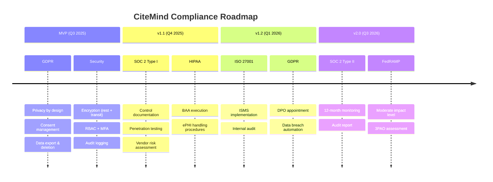

---

## 18. Enterprise Policy Controls

### 18.1 Enterprise Policy Framework

Enterprise customers can configure organization-wide policies that override individual user preferences.

### 18.2 Policy Categories

| Category | Policy | Description | Default |
|----------|--------|-------------|---------|
| **Authentication** | MFA requirement | Require MFA for all workspace members | Optional |
| **Authentication** | SSO enforcement | Disable local auth; require SSO | Optional |
| **Authentication** | Session timeout | Maximum session duration | 12 hours |
| **Authentication** | IP allowlist | Restrict access to corporate IP ranges | None |
| **Authentication** | Device policy | Require managed devices or certificates | None |
| **Data** | AI provider restriction | Restrict which AI providers can be used | All |
| **Data** | Document upload restrictions | Block uploads by file type or size | 100 MB max |
| **Data** | External sharing | Disable or restrict document sharing | Enabled |
| **Data** | Export permissions | Require approval for bulk export | Disabled |
| **Data** | Data residency | Require data storage in specific region | US-East |
| **AI** | AI logging | Require or prohibit AI conversation logging | Enabled |
| **AI** | AI training opt-out | Enforce opt-out from AI training | Enabled |
| **AI** | Model selection | Restrict to specific models (e.g., Azure only) | All |
| **AI** | PII redaction | Enforce automatic PII redaction for AI | Disabled |
| **Retention** | Document retention | Override default document retention | 90 days |
| **Retention** | Audit log retention | Extend audit log retention | 7 years |
| **Retention** | Trash auto-deletion | Override trash retention period | 30 days |
| **Collaboration** | Guest access | Allow or disable guest invitations | Enabled |
| **Collaboration** | External collaborators | Allow collaboration outside organization | Enabled |
| **Collaboration** | Domain restriction | Only allow collaboration with specific domains | None |
| **Security** | Password policy | Enforce enterprise password requirements | Standard |
| **Security** | Admin activity alerts | Alert on admin actions | Enabled |
| **Security** | Impersonation logging | Require justification for user impersonation | Enabled |
| **Compliance** | Audit access | Who can view audit logs | Workspace admins |
| **Compliance** | Report generation | Automated compliance report generation | Monthly |

### 18.3 Policy Enforcement Hierarchy

```
Platform Policy (Super Admin)
    └── Workspace Policy (Workspace Admin)
            └── Project Policy (Project Manager)
                    └── User Preference (Individual)
```

**Precedence**: More restrictive policies always win. If workspace requires MFA, individual cannot disable it.

---

## 19. Admin Dashboard Controls

### 19.1 Admin Dashboard Security

The admin dashboard is a high-value target and receives additional security controls:

| Control | Implementation |
|---------|----------------|
| **Separate URL** | Admin dashboard at `/admin` — different from main app |
| **IP Allowlisting** | Admin access restricted to corporate VPN IPs (configurable) |
| **MFA Required** | Mandatory MFA for all admin accounts; no exceptions |
| **Just-in-Time Access** | Optional: time-limited admin elevation (e.g., 4-hour windows) |
| **Activity Logging** | Every admin action logged with before/after values |
| **Real-time Alerts** | Admin login from new device/location triggers immediate alert |
| **Session Recording** | Optional: record admin sessions for compliance review |
| **Approval Workflows** | Sensitive actions (bulk export, user deletion) require second admin approval |
| **Read-only Mode** | Admin can view all data but cannot modify without elevation |

### 19.2 Admin Dashboard Features

| Feature | Description | Permission Required |
|---------|-------------|---------------------|
| **User Management** | Create, edit, suspend, delete users; view user activity | Workspace Admin+ |
| **Role Management** | Assign and revoke roles; create custom roles | Workspace Admin+ |
| **Security Settings** | Configure MFA, SSO, password policies, session settings | Workspace Admin+ |
| **Audit Log Viewer** | Search and filter audit logs; export reports | Workspace Admin+ |
| **Document Access Review** | View who has access to which documents; revoke access | Workspace Admin+ |
| **AI Usage Analytics** | View AI token consumption, model usage, cost allocation | Workspace Admin+ |
| **Data Retention** | Configure retention policies; trigger manual purges | Workspace Admin+ |
| **Compliance Reports** | Generate GDPR, SOC 2, HIPAA compliance reports | Workspace Admin+ |
| **Integration Management** | Configure AI providers, SSO, reference manager integrations | Workspace Admin+ |
| **Backup & Restore** | Trigger manual backups; initiate restore operations | Super Admin |
| **Tenant Configuration** | Configure tenant isolation level, data residency | Super Admin |
| **System Health** | View system metrics, error rates, queue depths | Super Admin |
| **Impersonation** | Temporarily assume user identity for support (logged) | Super Admin |
| **Global Settings** | Platform-wide configuration, feature flags, rate limits | Super Admin |

### 19.3 Admin Action Approval Workflow

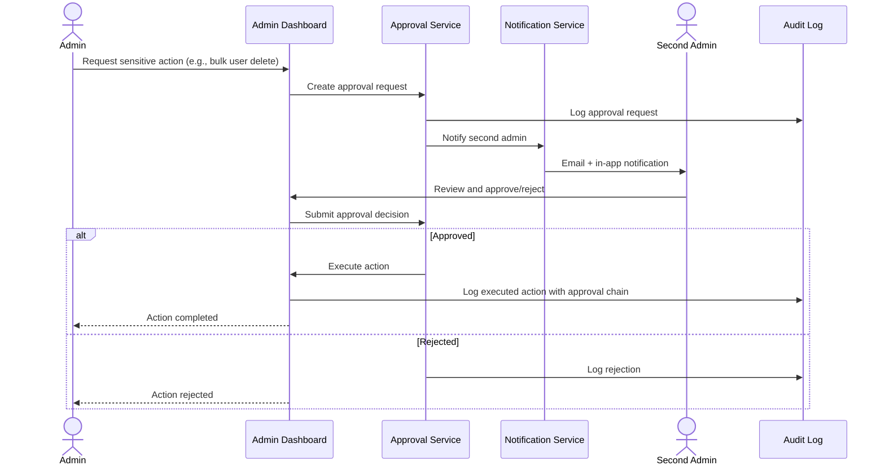

---

## 20. Backup Security

### 20.1 Backup Architecture

| Component | Backup Method | Frequency | Retention | Encryption |
|-----------|--------------|-----------|-----------|------------|
| **PostgreSQL Database** | Automated pg_dump + WAL archiving | Continuous (WAL), Daily (full) | 30 days | AES-256-GCM |
| **Vector Embeddings** | pg_dump of pgvector tables | Daily | 30 days | AES-256-GCM |
| **Document Files** | S3 versioning + cross-region replication | Real-time (replication) | 30 days | AES-256-GCM (SSE-S3) |
| **Knowledge Graph** | Neo4j dump / pg_dump | Daily | 30 days | AES-256-GCM |
| **Redis Cache** | RDB snapshots | Hourly | 24 hours | AES-256-GCM |
| **Configuration** | Infrastructure-as-Code (Terraform) | Every change | Git history | Git encryption |
| **Audit Logs** | Stream to S3 + Glacier | Real-time | 7 years | AES-256-GCM |
| **Application Code** | Git repository | Every commit | Git history | Repository access controls |

### 20.2 Backup Security Controls

| Control | Implementation |
|---------|----------------|
| **Encryption** | All backups encrypted with AES-256-GCM; separate key from production |
| **Key Management** | Backup encryption keys stored in separate Vault instance; dual control |
| **Access Control** | Backup access limited to 2 senior engineers; break-glass procedure documented |
| **Integrity** | SHA-256 checksums for every backup; verification on every restore test |
| **Immutability** | S3 Object Lock (write-once-read-many) for compliance backups |
| **Air Gap** | Monthly backups to offline storage (tape/Glacier Deep Archive) |
| **Geographic Redundancy** | Cross-region replication for all backups |
| **Restore Testing** | Monthly automated restore test; quarterly full disaster recovery drill |
| **Retention** | Automated lifecycle policies; no manual deletion possible |

### 20.3 Disaster Recovery Objectives

| Metric | Target | Implementation |
|--------|--------|----------------|
| **RPO (Recovery Point Objective)** | < 1 hour | Continuous WAL archiving + hourly snapshots |
| **RTO (Recovery Time Objective)** | < 4 hours | Automated failover to standby; infrastructure-as-code |
| **Data Durability** | 99.999999999% (11 nines) | S3 cross-region replication + versioning |
| **Backup Verification** | 100% monthly | Automated restore test with data integrity check |

---

## 21. Incident Response Plan

### 21.1 Incident Response Framework

CiteMind follows the **NIST SP 800-61** incident response lifecycle: **Preparation → Detection & Analysis → Containment, Eradication & Recovery → Post-Incident Activity**.

### 21.2 Incident Severity Levels

| Level | Name | Criteria | Response Time | Examples |
|-------|------|----------|---------------|----------|
| **P0** | Critical | Active data breach; complete service outage; ransomware | 15 minutes | Cross-tenant data leak; admin compromise; AI provider breach |
| **P1** | High | Potential data breach; major feature degradation | 1 hour | Unauthorized access to sensitive docs; AI prompt injection attack; significant data loss |
| **P2** | Medium | Limited security impact; partial service degradation | 4 hours | Suspicious login patterns; minor permission escalation; isolated performance issue |
| **P3** | Low | Security concern without immediate impact; minor bug | 24 hours | Failed penetration attempt; policy violation; non-critical vulnerability |
| **P4** | Informational | Security observation; proactive improvement | 72 hours | Security scan findings; audit anomaly; best practice gap |

### 21.3 Incident Response Playbooks

#### Playbook 1: Suspected Cross-Tenant Data Leakage

| Step | Action | Owner | Timeline |
|------|--------|-------|----------|
| 1 | Receive alert (automated or manual) | Monitoring System | 0 min |
| 2 | Page on-call security engineer | PagerDuty/Opsgenie | 5 min |
| 3 | Verify alert authenticity | Security Engineer | 15 min |
| 4 | If confirmed: invoke incident commander | Security Lead | 20 min |
| 5 | Isolate affected tenant (read-only mode) | Platform Engineer | 30 min |
| 6 | Preserve evidence (snapshot logs, DB) | Platform Engineer | 45 min |
| 7 | Identify scope of leakage (which tenants, which data) | Security Engineer | 2 hours |
| 8 | Notify affected tenants (if any) | Customer Success | 4 hours |
| 9 | Fix root cause (patch, config change) | Engineering | 8 hours |
| 10 | Verify fix with regression test | QA | 12 hours |
| 11 | Restore normal operations | Platform Engineer | 12 hours |
| 12 | Post-incident review | Incident Commander | 72 hours |
| 13 | Update controls to prevent recurrence | Security Team | 1 week |

#### Playbook 2: AI Provider Data Breach

| Step | Action | Owner | Timeline |
|------|--------|-------|----------|
| 1 | Receive notification from AI provider | Security Team | 0 min |
| 2 | Assess whether CiteMind user data affected | Security Engineer | 1 hour |
| 3 | If affected: revoke all API keys for affected provider | Platform Engineer | 2 hours |
| 4 | Switch to fallback AI provider | Engineering | 2 hours |
| 5 | Audit all AI conversations in retention period | Security Engineer | 4 hours |
| 6 | Notify affected users (GDPR 72-hour requirement) | Legal + Customer Success | 24 hours |
| 7 | Review provider DPA and consider termination | Legal | 48 hours |
| 8 | Post-incident review and provider risk reassessment | Security Team | 1 week |

#### Playbook 3: Ransomware/Malware in Document Upload

| Step | Action | Owner | Timeline |
|------|--------|-------|----------|
| 1 | Malware detection alert from document scanner | Security System | 0 min |
| 2 | Quarantine affected document immediately | Platform Engineer | 5 min |
| 3 | Alert uploader and workspace admin | Automated + Customer Success | 15 min |
| 4 | Scan all documents from same uploader | Security Engineer | 2 hours |
| 5 | Forensic analysis of malware sample | Security Engineer | 4 hours |
| 6 | If spread: isolate affected workspace | Platform Engineer | 4 hours |
| 7 | Remove malware; restore from clean backup | Platform Engineer | 8 hours |
| 8 | Update malware signatures and scanning rules | Security Team | 24 hours |

### 21.4 Incident Response Team

| Role | Responsibility | Primary | Secondary |
|------|---------------|---------|-----------|
| **Incident Commander** | Overall coordination, decision making, external communication | CISO / Security Lead | Engineering Lead |
| **Technical Lead** | Technical investigation, containment, recovery | Senior Platform Engineer | Senior Backend Engineer |
| **Communications Lead** | Internal and external communication, regulatory notifications | Head of Customer Success | Legal Counsel |
| **Forensics Lead** | Evidence preservation, root cause analysis, legal hold | Security Engineer | DevOps Engineer |
| **Legal Counsel** | Regulatory obligations, breach notification requirements, liability | General Counsel | External counsel |
| **Customer Liaison** | Customer communication, status updates, remediation | Customer Success Manager | Account Manager |

### 21.5 Communication Templates

| Scenario | Communication | Timing | Audience |
|----------|-------------|--------|----------|
| **P0 Confirmed Breach** | "Security Incident Notification" | Within 72 hours (GDPR) | Affected users, regulators, media |
| **P1 Potential Breach** | "Security Alert: Investigation Underway" | Within 24 hours | Affected users |
| **P2 Security Concern** | "Security Notice: Recommended Actions" | Within 48 hours | Affected users |
| **Service Disruption** | "Service Status Update" | Real-time | All users (status page) |
| **All Clear** | "Incident Resolved: Post-Incident Summary" | After closure | Affected users |

### 21.6 Post-Incident Review

Every P0 and P1 incident requires a **blameless post-mortem** within 72 hours:

| Section | Content |
|---------|---------|
| **Timeline** | Precise timeline of detection, response, and recovery |
| **Impact Assessment** | What data was affected, which users, for how long |
| **Root Cause** | 5 Whys analysis; technical and process factors |
| **Lessons Learned** | What went well, what could be improved |
| **Action Items** | Specific, assigned, time-bound remediation tasks |
| **Control Improvements** | New controls or control enhancements to prevent recurrence |

---

## 22. Appendices

### Appendix A: Security Configuration Baseline

| Component | Secure Configuration |
|-----------|---------------------|
| **PostgreSQL** | SSL required, RLS enabled, `log_connections=on`, `log_disconnections=on`, `log_line_prefix='%t [%p]: [%l-1] user=%u,db=%d,app=%a,client=%h '`, `password_encryption=scram-sha-256` |
| **Redis** | `requirepass` set, `bind` to internal IP, `protected-mode yes`, TLS enabled |
| **Nginx/Load Balancer** | TLS 1.3 only, strong cipher suites, HSTS, security headers (CSP, X-Frame-Options, X-Content-Type-Options), rate limiting |
| **Node.js** | `helmet` middleware, input validation, CORS whitelist, request size limits, timeout configuration |
| **Docker** | Non-root user, read-only filesystem, no new privileges, resource limits, security scanning (Trivy) |
| **Kubernetes** | Pod Security Standards (restricted), network policies, RBAC, secrets encryption at rest, admission controllers |

### Appendix B: Security Testing Schedule

| Test Type | Frequency | Scope | Owner |
|-----------|-----------|-------|-------|
| **SAST (Static Analysis)** | Every commit | All code | Automated (GitHub Actions) |
| **Dependency Scanning** | Every commit | All dependencies | Automated (Snyk/Dependabot) |
| **DAST (Dynamic Analysis)** | Weekly | Production-like staging | Automated (OWASP ZAP) |
| **Container Scanning** | Every build | All Docker images | Automated (Trivy) |
| **Penetration Testing** | Quarterly | Full application | External security firm |
| **Red Team Exercise** | Bi-annually | Production environment | External security firm |
| **AI Safety Testing** | Monthly | AI pipeline | Internal AI safety team |
| **Compliance Audit** | Annually | Full control set | External auditor |
| **Tabletop Exercise** | Quarterly | Incident response | Security team |

### Appendix C: Security Contact Information

| Role | Contact | Escalation |
|------|---------|------------|
| **Security Team** | security@citeMind.io | N/A |
| **Incident Response** | incident@citeMind.io | PagerDuty |
| **Vulnerability Disclosure** | security@citeMind.io (GPG key available) | N/A |
| **Data Protection Officer** | dpo@citeMind.io | Legal team |
| **Customer Security Questions** | security@citeMind.io | Customer Success |

### Appendix D: Glossary

| Term | Definition |
|------|------------|
| **BYOK** | Bring Your Own Key — customer-managed encryption keys |
| **DPIA** | Data Protection Impact Assessment — GDPR requirement for high-risk processing |
| **KEK** | Key Encryption Key — master key that encrypts data encryption keys |
| **mTLS** | Mutual TLS — both client and server authenticate with certificates |
| **RLS** | Row-Level Security — PostgreSQL feature for per-row access control |
| **SCC** | Standard Contractual Clauses — EU mechanism for lawful data transfers |
| **STRIDE** | Spoofing, Tampering, Repudiation, Information Disclosure, Denial of Service, Elevation of Privilege |
| **ZDR** | Zero Data Retention — AI provider deletes all data after processing |
| **3PAO** | Third-Party Assessment Organization — FedRAMP assessor |
| **POA&M** | Plan of Action and Milestones — FedRAMP remediation tracking |

---

> **Document Control**
>
> - **Version**: 1.0
> - **Last Updated**: 2025-07-26
> - **Next Review**: 2025-10-26
> - **Owner**: Security and Compliance Team
> - **Approval**: CTO, CISO, Legal Counsel
> - **Distribution**: Internal — Engineering, Security, Legal, Customer Success
