# Technical Design Document: CiteMind

> **Document**: Technical Design Document (TDD)  
> **Date**: 2025-07-26  
> **Author**: Technical Architecture Agent  
> **Based on**: Product Strategy, Market Research, Competitor Analysis, Gap Analysis  
> **Status**: v1.0 — Foundation Architecture  

---

## Table of Contents

1. [Architecture Overview](#1-architecture-overview)
2. [System Components](#2-system-components)
3. [Frontend Architecture](#3-frontend-architecture)
4. [Backend Architecture](#4-backend-architecture)
5. [AI Processing Architecture](#5-ai-processing-architecture)
6. [Document Processing Pipeline](#6-document-processing-pipeline)
7. [OCR Pipeline](#7-ocr-pipeline)
8. [Embedding Pipeline](#8-embedding-pipeline)
9. [Semantic Search Design](#9-semantic-search-design)
10. [Vector Database Design](#10-vector-database-design)
11. [Knowledge Graph Design](#11-knowledge-graph-design)
12. [Annotation Engine Design](#12-annotation-engine-design)
13. [Citation Engine Design](#13-citation-engine-design)
14. [Export Engine Design](#14-export-engine-design)
15. [Authentication and Authorisation](#15-authentication-and-authorisation)
16. [API Design](#16-api-design)
17. [Database Schema](#17-database-schema)
18. [File Storage Design](#18-file-storage-design)
19. [Sync Design](#19-sync-design)
20. [Offline Mode Design](#20-offline-mode-design)
21. [Error Handling](#21-error-handling)
22. [Observability](#22-observability)
23. [Performance Design](#23-performance-design)
24. [Scalability Design](#24-scalability-design)
25. [Security Design](#25-security-design)
26. [Deployment Design](#26-deployment-design)

---

## 1. Architecture Overview

CiteMind is a **unified AI research workspace** that combines deep PDF annotation, AI document understanding, visual knowledge mapping, citation management, and professional export. The architecture follows a **modern layered pattern** with clear separation of concerns between presentation, application, domain, and infrastructure layers.

### Design Principles

| Principle | Description |
|-----------|-------------|
| **Single-Page Application (SPA)** | Rich, desktop-like experience in the browser with Vite + React 18 |
| **API-First** | All backend capabilities exposed via RESTful JSON API |
| **AI-Abstraction** | Pluggable AI provider layer (OpenAI, Anthropic, local models) via LangChain |
| **Local-First, Cloud-Enhanced** | Core data stored locally (IndexedDB) with optional cloud sync |
| **Event-Driven Async Processing** | Heavy operations (PDF parsing, OCR, embedding) queued via BullMQ |
| **Multi-Tenant Ready** | Tenant isolation from day one for enterprise deployments |
| **Progressive Web App (PWA)** | Offline capability, installable, service worker caching |

### High-Level Architecture Diagram

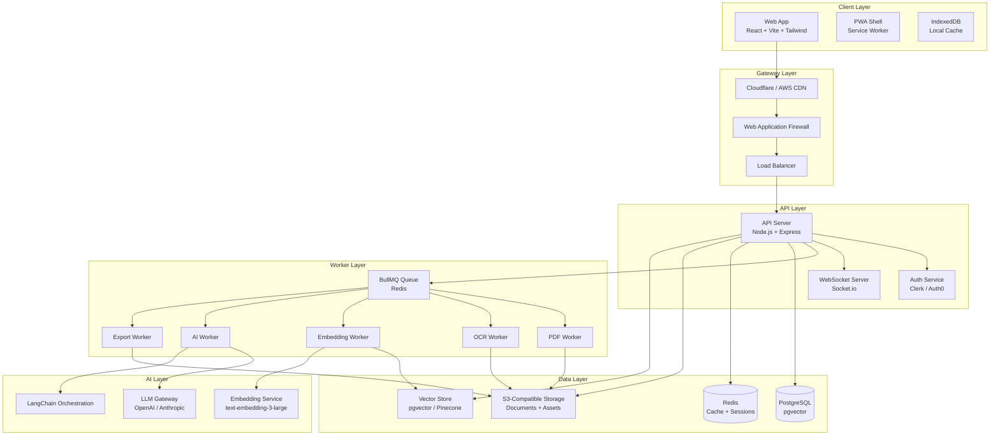

---

## 2. System Components

### Component Responsibilities

| Component | Technology | Responsibility |
|-----------|------------|----------------|
| **Web Client** | React 18, TypeScript, Vite, Tailwind, shadcn/ui | User interface, document viewer, canvas, chat |
| **PDF Renderer** | PDF.js, react-pdf | PDF parsing, rendering, text extraction |
| **Canvas Engine** | React Flow, Fabric.js | Knowledge graph, research board, visual mapping |
| **API Server** | Node.js, Express, TypeScript | REST API, auth middleware, request validation |
| **WebSocket Hub** | Socket.io | Real-time collaboration, cursor sync, live annotations |
| **Job Queue** | BullMQ, Redis | Background job orchestration |
| **PDF Worker** | Node.js, pdf-lib, Poppler | PDF parsing, page extraction, text layer generation |
| **OCR Worker** | Node.js, Tesseract.js, Azure Form Recognizer | Image-to-text extraction |
| **Embedding Worker** | Node.js, OpenAI SDK, LangChain | Chunk generation, embedding computation, vector upsert |
| **AI Worker** | Node.js, LangChain, OpenAI/Anthropic SDK | LLM inference, multi-document reasoning, summarisation |
| **Export Worker** | Node.js, Puppeteer, pandoc | PDF/Word/HTML export, citation formatting |
| **Primary Database** | PostgreSQL 15+, pgvector | Relational data, vector storage (MVP), ACL |
| **Cache** | Redis 7+ | Sessions, rate limiting, cache, job state |
| **Object Storage** | MinIO (local) / AWS S3 (production) | Original PDFs, thumbnails, exports, assets |
| **Search** | PostgreSQL full-text + pgvector hybrid | Semantic + lexical search |
| **Auth Provider** | Clerk / Auth0 (production) | SSO, MFA, SAML, OAuth2 |
| **AI Provider** | OpenAI, Anthropic, Azure OpenAI | LLM, embedding, vision models |

---

## 3. Frontend Architecture

### Tech Stack

| Layer | Technology | Version | Purpose |
|-------|------------|---------|---------|
| Framework | React | 18.x | UI component model |
| Language | TypeScript | 5.x | Type safety |
| Build Tool | Vite | 5.x | Fast dev, optimised builds |
| Styling | Tailwind CSS | 3.x | Utility-first CSS |
| Components | shadcn/ui | latest | Accessible UI primitives |
| State | Zustand | 4.x | Global state management |
| Queries | TanStack Query | 5.x | Server state, caching, sync |
| Routing | React Router | 6.x | SPA navigation |
| PDF | PDF.js + react-pdf | 3.x | PDF rendering, annotation |
| Canvas | React Flow + d3 | 11.x / 7.x | Knowledge graph, research board |
| Forms | React Hook Form + Zod | 7.x / 3.x | Validation, form state |
| Collaboration | Yjs + y-websocket | 13.x | CRDT for real-time sync |
| Offline | Dexie.js | 3.x | IndexedDB wrapper, local-first |

### Frontend Module Structure

```
apps/web/src/
├── main.tsx                 # Entry point
├── App.tsx                  # Root router + providers
├── styles/
│   ├── tokens.css           # Design tokens (colors, typography, spacing)
│   └── globals.css          # Tailwind directives + base styles
├── components/
│   ├── ui/                  # shadcn/ui primitives (Button, Dialog, etc.)
│   ├── pdf/                 # PDF viewer, annotation layer, text layer
│   ├── canvas/              # Research board, knowledge graph, cards
│   ├── chat/                # AI chat panel, message bubbles, citations
│   ├── layout/              # Sidebar, panels, split panes, toolbar
│   └── export/              # Export preview, format selector
├── hooks/
│   ├── usePdf.ts            # PDF.js integration hook
│   ├── useAnnotations.ts    # Annotation CRUD + sync
│   ├── useChat.ts           # AI conversation streaming
│   ├── useCanvas.ts         # React Flow / canvas state
│   ├── useOffline.ts        # Online/offline detection, queue
│   └── useSync.ts           # Local-first sync with server
├── stores/
│   ├── workspaceStore.ts    # Zustand: active project, layout, selection
│   ├── documentStore.ts     # Zustand: open documents, page state
│   ├── chatStore.ts         # Zustand: AI conversations
│   └── canvasStore.ts       # Zustand: graph nodes, edges, board state
├── lib/
│   ├── api.ts               # Axios client, interceptors, error handling
│   ├── websocket.ts         # Socket.io client setup
│   ├── pdfUtils.ts          # PDF coordinate transforms, highlight extraction
│   ├── citation.ts          # Citation formatting (APA, MLA, Chicago, etc.)
│   ├── export.ts            # Export generators (PDF, Word, Markdown)
│   └── syncEngine.ts        # Local-first sync: Dexie + TanStack Query
├── types/
│   └── index.ts             # Shared TypeScript interfaces
└── workers/
    ├── pdfWorker.ts         # Web Worker for PDF parsing in browser
    └── exportWorker.ts      # Web Worker for client-side export generation
```

### State Management Strategy

| State Type | Store | Persistence | Sync Strategy |
|------------|-------|-------------|---------------|
| **Server State** | TanStack Query | HTTP cache + IndexedDB | Background refetch, optimistic updates |
| **UI State** | Zustand | Session only | None (local only) |
| **Document State** | Zustand + Dexie | IndexedDB | Bi-directional sync with conflict resolution |
| **Annotation State** | Zustand + Dexie | IndexedDB | Real-time via WebSocket + offline queue |
| **Canvas State** | Zustand + Yjs | IndexedDB (Yjs doc) | Real-time CRDT sync |
| **Chat State** | Zustand + Dexie | IndexedDB | Sync on reconnect |
| **Offline Queue** | Dexie | IndexedDB | Process when online |

---

## 4. Backend Architecture

### Tech Stack

| Layer | Technology | Version | Purpose |
|-------|------------|---------|---------|
| Runtime | Node.js | 20.x LTS | Server runtime |
| Framework | Express | 4.x | HTTP server, routing, middleware |
| Language | TypeScript | 5.x | Type safety |
| ORM | Prisma | 5.x | Database schema, migrations, queries |
| Validation | Zod | 3.x | Request/response validation |
| Auth | Clerk / Auth0 SDK | latest | JWT verification, user resolution |
| Queue | BullMQ | 4.x | Redis-based job queue |
| Real-time | Socket.io | 4.x | WebSocket server |
| Testing | Vitest + Supertest | 1.x / 6.x | Unit + integration tests |
| PDF | pdf-lib + Poppler | 1.x | PDF manipulation, text extraction |
| OCR | Tesseract.js + Azure | 5.x | OCR fallback + premium |
| AI | LangChain + OpenAI SDK | 0.2.x | LLM abstraction, chains, agents |

### Backend Module Structure

```
apps/api/src/
├── index.ts                 # Entry point: server bootstrap
├── server.ts                # Express app configuration
├── config/
│   ├── env.ts               # Environment variable validation (Zod)
│   ├── database.ts          # Prisma client singleton
│   ├── redis.ts             # Redis / BullMQ client
│   └── storage.ts           # S3 / MinIO client
├── middleware/
│   ├── auth.ts              # JWT verification, tenant extraction
│   ├── rbac.ts              # Role-based access control middleware
│   ├── rateLimit.ts         # Rate limiting (Redis-backed)
│   ├── errorHandler.ts      # Global error handler
│   ├── requestValidator.ts  # Zod request validation wrapper
│   ├── auditLogger.ts       # Audit log middleware
│   └── tenantIsolation.ts   # Multi-tenant query scoping
├── routes/
│   ├── auth.ts              # Auth callbacks, session refresh
│   ├── users.ts             # User CRUD, preferences
│   ├── projects.ts          # Project/workspace management
│   ├── documents.ts         # Document upload, metadata, delete
│   ├── annotations.ts       # Annotation CRUD
│   ├── highlights.ts        # Highlight extraction, management
│   ├── notes.ts             # Note cards, snippets
│   ├── chat.ts              # AI conversation endpoints
│   ├── knowledgeGraph.ts    # Graph nodes, edges, queries
│   ├── citations.ts         # Citation generation, bibliography
│   ├── exports.ts           # Export job creation, status, download
│   ├── collaborators.ts     # Sharing, invites, permissions
│   ├── search.ts            # Semantic + lexical search
│   ├── sync.ts              # Delta sync endpoint (local-first)
│   ├── admin.ts             # Admin dashboard endpoints
│   └── health.ts            # Health checks, readiness probes
├── controllers/             # Route handlers (business logic)
├── services/
│   ├── pdfService.ts        # PDF parsing, page extraction, thumbnails
│   ├── ocrService.ts        # OCR job orchestration
│   ├── embeddingService.ts  # Chunking, embedding, vector upsert
│   ├── aiService.ts         # LLM inference, chat, summarisation
│   ├── citationService.ts   # Citation parsing, formatting, validation
│   ├── exportService.ts     # Export pipeline orchestration
│   ├── searchService.ts     # Hybrid search (semantic + lexical)
│   ├── syncService.ts       # Delta sync, conflict resolution
│   └── collaborationService.ts  # Real-time session management
├── workers/
│   ├── pdfWorker.ts         # BullMQ processor: PDF parsing
│   ├── ocrWorker.ts         # BullMQ processor: OCR
│   ├── embeddingWorker.ts   # BullMQ processor: embeddings
│   ├── aiWorker.ts          # BullMQ processor: LLM jobs
│   └── exportWorker.ts      # BullMQ processor: export generation
├── lib/
│   ├── prisma.ts            # Prisma client + extensions
│   ├── vectorStore.ts       # pgvector / Pinecone abstraction
│   ├── storage.ts           # S3 upload, download, presigned URLs
│   ├── aiProvider.ts        # OpenAI / Anthropic / Azure factory
│   ├── citationParser.ts    # CSL-JSON, BibTeX, RIS parsing
│   ├── chunking.ts          # Text chunking strategies (recursive, semantic)
│   ├── tokenizer.ts         # Token counting for context windows
│   └── permissions.ts       # Permission matrix, ACL evaluation
├── types/
│   └── index.ts             # Shared TypeScript types
└── prisma/
    ├── schema.prisma          # Database schema
    └── migrations/            # Generated migrations
```

### Middleware Pipeline

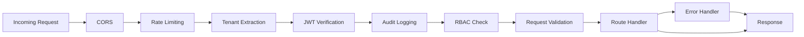

---

## 5. AI Processing Architecture

### AI Provider Abstraction

```typescript
// Abstract base for all AI providers
interface AIProvider {
  chat(messages: ChatMessage[], options: ChatOptions): Promise<ChatResponse>;
  embed(texts: string[], options: EmbedOptions): Promise<number[][]>;
  summarise(text: string, options: SummariseOptions): Promise<string>;
  extract(text: string, schema: ZodSchema): Promise<unknown>;
  vision(image: Buffer, prompt: string): Promise<string>;
}

// Implementations
class OpenAIProvider implements AIProvider { ... }
class AnthropicProvider implements AIProvider { ... }
class AzureOpenAIProvider implements AIProvider { ... }
class LocalLLMProvider implements AIProvider { ... }  // Ollama, LM Studio

// Factory with tenant-level provider selection
class AIProviderFactory {
  getProvider(tenantId: string, feature: AIFeature): AIProvider { ... }
}
```

### LangChain Orchestration

| Chain / Agent | Purpose | Input | Output |
|---------------|---------|-------|--------|
| `DocumentQARetrievalChain` | RAG-based Q&A over single document | Question + document chunks | Answer + source citations |
| `MultiDocumentSynthesisChain` | Reason across multiple documents | Question + multiple doc contexts | Synthesised answer + doc list |
| `ExtractionChain` | Extract structured data from text | Text + Zod schema | JSON object |
| `SummarisationChain` | Summarise long documents | Document text + strategy | Summary (paragraph, bullets, abstract) |
| `CitationVerificationChain` | Verify AI claims against sources | AI response + source chunks | Verified claims + confidence scores |
| `KnowledgeGraphExtractionChain` | Extract entities and relations | Document text | Entities + relations JSON |

### AI Prompt Isolation Architecture

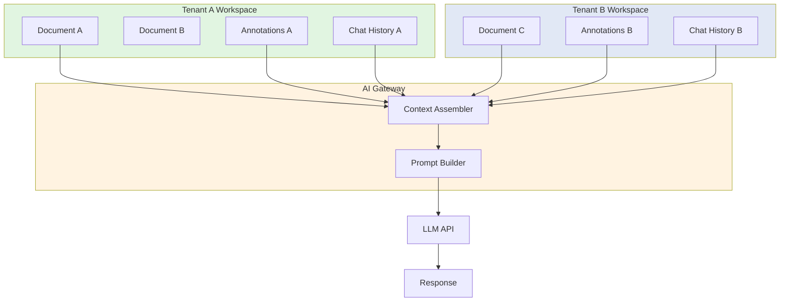

**Isolation rules:**
1. Every prompt includes `tenant_id` in the metadata header
2. Context assembler only fetches vectors scoped to the user's `project_id` and `tenant_id`
3. System prompt explicitly instructs the model: "Only use the provided documents. Do not hallucinate outside sources."
4. No cross-tenant vector search is possible (pgvector `WHERE tenant_id = ?` clause)
5. Chat history is stored per-user, per-project, never shared

---

## 6. Document Processing Pipeline

### Pipeline Stages

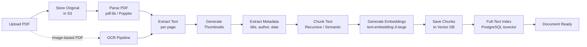

### Stage Details

| Stage | Technology | Output | Async |
|-------|------------|--------|-------|
| **Upload** | Multer (memory) → S3 | Presigned URL, `document_id` | No |
| **Store** | AWS S3 / MinIO | `s3://bucket/tenant_id/documents/{id}.pdf` | No |
| **Parse** | pdf-lib + Poppler `pdftotext` | Page objects with text, coordinates | Yes (Worker) |
| **Extract** | Custom text layer builder | Structured text per page with bounding boxes | Yes |
| **Thumbnail** | pdf-lib + Sharp | WebP thumbnails (200px, 800px) | Yes |
| **Metadata** | pdf-lib metadata + LLM fallback | JSON: title, authors, abstract, year, doi | Yes |
| **Chunking** | Recursive character splitter (LangChain) | Chunks: 512 tokens, 50 overlap, with page refs | Yes |
| **Embedding** | OpenAI text-embedding-3-large | 3072-dimension vectors | Yes |
| **Vector Save** | pgvector `documents` table | Cosine-indexed vectors with metadata | Yes |
| **Full-Text Index** | PostgreSQL `tsvector` | Searchable lexemes per chunk | Yes |

---

## 7. OCR Pipeline

### When OCR is Triggered
1. PDF has no text layer (scanned/image-based PDF)
2. User uploads image file (PNG, JPG, TIFF)
3. PDF contains mixed content with image regions

### OCR Pipeline Flow

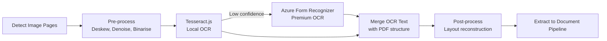

### OCR Configuration

| Parameter | Value | Rationale |
|-----------|-------|-----------|
| Primary Engine | Tesseract.js 5.x | Free, local, fast for clear scans |
| Fallback Engine | Azure Form Recognizer | High accuracy for poor-quality scans, tables, handwriting |
| Confidence Threshold | 75% | Below this, trigger fallback |
| Languages | `eng`, `spa`, `fra`, `deu`, `chi_sim`, `jpn`, `rus` | Top 7 research languages |
| DPI Target | 300 | Minimum for reliable OCR |
| Pre-processing | Deskew, noise removal, contrast enhancement | Improves accuracy 15-30% |
| Table Detection | Azure Form Recognizer only | Structured data extraction |

---

## 8. Embedding Pipeline

### Chunking Strategy

```typescript
interface ChunkingConfig {
  strategy: 'recursive' | 'semantic' | 'fixed' | 'hybrid';
  chunkSize: number;        // tokens (default: 512)
  chunkOverlap: number;     // tokens (default: 50)
  separators: string[];     // ['\n\n', '\n', '. ', ' ', '']
  preserveStructure: boolean; // Keep paragraphs/sections intact
  addMetadata: boolean;     // Include page number, section header
}
```

### Chunking Rules by Document Type

| Document Type | Strategy | Chunk Size | Overlap | Notes |
|---------------|----------|------------|---------|-------|
| Academic Paper | Recursive | 512 | 50 | Respect section boundaries (Abstract, Introduction, Methods, Results, Discussion) |
| Legal Document | Semantic | 256 | 25 | Preserve clause boundaries; chunk by paragraph |
| Book / Chapter | Hybrid | 1024 | 100 | Large chunks for narrative flow; sub-chunk for precise retrieval |
| Spreadsheet / Table | Fixed | 128 | 0 | Each row/cell as separate chunk with column headers |
| Image Caption | Fixed | 64 | 0 | Caption + surrounding context |

### Embedding Model Selection

| Tier | Model | Dimensions | Cost | Use Case |
|------|-------|------------|------|----------|
| **MVP** | OpenAI text-embedding-3-small | 1536 | Low | Fast, good enough for most research |
| **Standard** | OpenAI text-embedding-3-large | 3072 | Medium | Best accuracy, multi-lingual |
| **Enterprise** | Cohere embed-v4 | 1024 | Medium | Long context, domain-specific |
| **On-Premise** | BGE-large-en | 1024 | Free (GPU) | Self-hosted, no data egress |

---

## 9. Semantic Search Design

### Hybrid Search Architecture

CiteMind uses a **hybrid search** combining vector similarity (semantic) with full-text search (lexical) for best results.

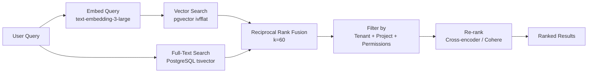

### Search Query Plan

```sql
-- Hybrid search using pgvector + full-text
WITH semantic AS (
  SELECT
    id,
    document_id,
    page_number,
    text_content,
    embedding <=> query_embedding AS distance,
    RANK() OVER (ORDER BY embedding <=> query_embedding) AS semantic_rank
  FROM document_chunks
  WHERE tenant_id = 't-123' AND project_id = 'p-456'
  ORDER BY embedding <=> query_embedding
  LIMIT 100
),
lexical AS (
  SELECT
    id,
    document_id,
    page_number,
    text_content,
    ts_rank_cd(search_vector, query_tsquery) AS rank,
    RANK() OVER (ORDER BY ts_rank_cd(search_vector, query_tsquery) DESC) AS lexical_rank
  FROM document_chunks
  WHERE tenant_id = 't-123' AND project_id = 'p-456'
    AND search_vector @@ query_tsquery
  ORDER BY rank DESC
  LIMIT 100
)
SELECT
  COALESCE(s.id, l.id) AS id,
  COALESCE(s.document_id, l.document_id) AS document_id,
  COALESCE(s.text_content, l.text_content) AS text_content,
  COALESCE(1.0 / (60 + s.semantic_rank), 0) +
  COALESCE(1.0 / (60 + l.lexical_rank), 0) AS fused_score
FROM semantic s
FULL OUTER JOIN lexical l ON s.id = l.id
ORDER BY fused_score DESC
LIMIT 20;
```

### Search API Parameters

```typescript
interface SearchRequest {
  query: string;
  projectId: string;
  filters?: {
    documentIds?: string[];      // Scope to specific documents
    pageRange?: [number, number]; // Page range within documents
    dateRange?: [Date, Date];    // Document upload date
    authors?: string[];          // Filter by author
    tags?: string[];             // Filter by user tags
  };
  searchType: 'semantic' | 'lexical' | 'hybrid'; // Default: hybrid
  topK: number;                 // Default: 10, Max: 100
  includeHighlights: boolean;   // Include matching snippets
  rerank: boolean;              // Apply cross-encoder re-ranking
}
```

---

## 10. Vector Database Design

### MVP: pgvector (PostgreSQL Extension)

For the MVP and small-team deployments, all vectors are stored in PostgreSQL using the `pgvector` extension. This avoids additional infrastructure costs and complexity.

```sql
-- Enable pgvector
CREATE EXTENSION IF NOT EXISTS vector;

-- Document chunks with vectors
CREATE TABLE document_chunks (
    id UUID PRIMARY KEY DEFAULT gen_random_uuid(),
    tenant_id TEXT NOT NULL,
    project_id UUID NOT NULL REFERENCES projects(id),
    document_id UUID NOT NULL REFERENCES documents(id),
    page_number INTEGER NOT NULL,
    chunk_index INTEGER NOT NULL,
    text_content TEXT NOT NULL,
    embedding VECTOR(3072),  -- text-embedding-3-large
    search_vector TSVECTOR,  -- full-text search
    metadata JSONB,          -- { section: "Introduction", bbox: [...] }
    created_at TIMESTAMPTZ DEFAULT NOW(),

    -- Composite index for tenant isolation + vector search
    CONSTRAINT fk_document FOREIGN KEY (document_id) REFERENCES documents(id) ON DELETE CASCADE
);

-- HNSW index for fast vector search (recommended for production)
CREATE INDEX idx_chunks_embedding_hnsw ON document_chunks
USING hnsw (embedding vector_cosine_ops)
WITH (m = 16, ef_construction = 64);

-- IVFFlat index for smaller datasets (faster build)
CREATE INDEX idx_chunks_embedding_ivf ON document_chunks
USING ivfflat (embedding vector_cosine_ops)
WITH (lists = 100);

-- Full-text search index
CREATE INDEX idx_chunks_search_vector ON document_chunks
USING GIN (search_vector);

-- Tenant + project index for fast filtering
CREATE INDEX idx_chunks_tenant_project ON document_chunks(tenant_id, project_id);

-- Trigger to auto-generate tsvector
CREATE OR REPLACE FUNCTION document_chunks_search_vector_update()
RETURNS TRIGGER AS $$
BEGIN
    NEW.search_vector := to_tsvector('english', NEW.text_content);
    RETURN NEW;
END;
$$ LANGUAGE plpgsql;

CREATE TRIGGER tsvector_update
BEFORE INSERT OR UPDATE ON document_chunks
FOR EACH ROW EXECUTE FUNCTION document_chunks_search_vector_update();
```

### Production: Pinecone / Weaviate / Qdrant

For enterprise deployments with 10M+ vectors, a dedicated vector database is recommended.

| Feature | pgvector | Pinecone | Weaviate | Qdrant |
|---------|----------|----------|----------|--------|
| **Hosting** | Self-managed | Managed | Self / Managed | Self / Managed |
| **Max Vectors** | ~10M (practical) | Unlimited | Unlimited | Unlimited |
| **Index Types** | HNSW, IVFFlat | Metadata + ANN | HNSW | HNSW |
| **Hybrid Search** | Native (SQL) | Basic (sparse-dense) | Native | Native |
| **Multi-Tenant** | Row-level security | Namespaces | Classes | Collections |
| **Cost** | Included in PG | ~$70-500/month | Self-hosted free | Self-hosted free |
| **Migration Path** | Easy: same schema | Export / import | GraphQL API | REST API |

**Recommendation**: Start with pgvector. Migrate to Pinecone when vector count exceeds 5M or latency requirements drop below 50ms p95.

---

## 11. Knowledge Graph Design

### Graph Data Model

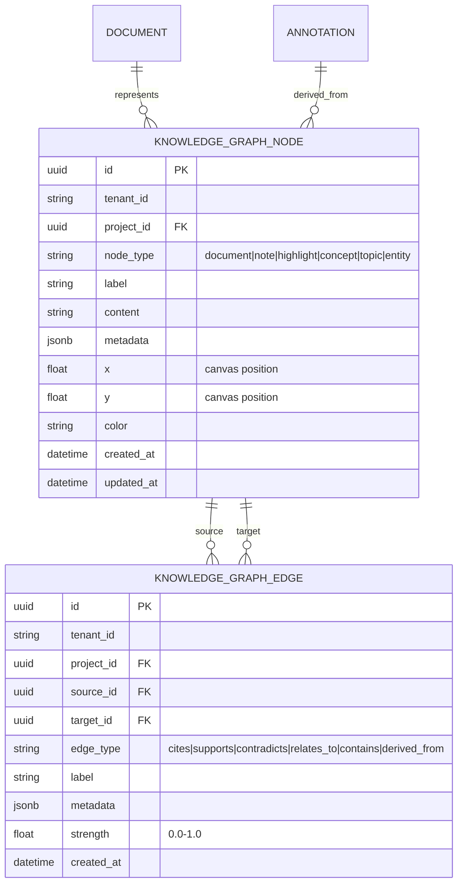

### Node Types

| Node Type | Description | Example |
|-----------|-------------|---------|
| `document` | A source document | "Smith et al. 2024 — Climate Impact" |
| `note` | A user-written note | "Key insight: temperature rise nonlinear" |
| `highlight` | An extracted highlight | "...temperature increased by 2.3°C..." |
| `concept` | An extracted concept | "Greenhouse Gas Effect" |
| `entity` | A named entity | "IPCC", "Paris Agreement" |
| `topic` | A research topic | "Climate Policy" |
| `question` | A research question | "How does deforestation affect carbon sinks?" |

### Edge Types

| Edge Type | Description | Direction |
|-----------|-------------|-----------|
| `cites` | Document A cites Document B | A → B |
| `supports` | Evidence supports a claim | Evidence → Claim |
| `contradicts` | Evidence contradicts a claim | Evidence → Claim |
| `relates_to` | General semantic relationship | Bidirectional |
| `contains` | Document contains a highlight | Document → Highlight |
| `derived_from` | Note derived from highlight | Highlight → Note |
| `answers` | Evidence answers a question | Evidence → Question |

### AI-Powered Graph Extraction

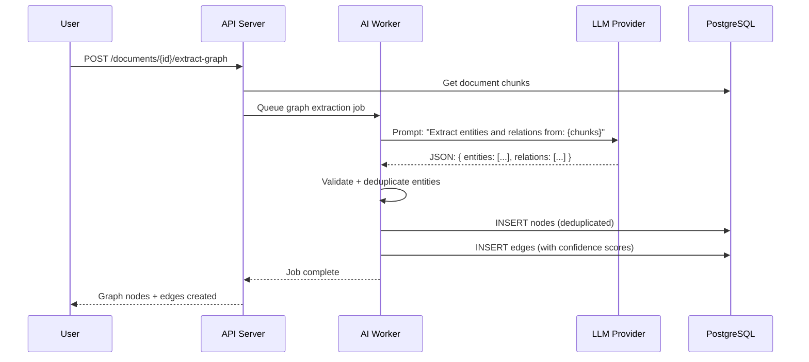

### Graph Query API

```typescript
// Get subgraph for a project
GET /api/projects/:projectId/graph?depth=2&nodeTypes=document,concept,note

// Create manual node
POST /api/projects/:projectId/graph/nodes
{ type: 'note', label: 'Key Insight', content: '...', x: 100, y: 200 }

// Create manual edge
POST /api/projects/:projectId/graph/edges
{ sourceId: '...', targetId: '...', type: 'supports', label: 'supports' }

// AI-suggested connections
GET /api/projects/:projectId/graph/suggestions?nodeId=...
// Returns: { suggestedEdges: [{ targetId, type, confidence, reason }] }
```

---

## 12. Annotation Engine Design

### Annotation Data Model

Annotations in CiteMind are **first-class citizens**. Every annotation is a structured object with spatial coordinates, semantic meaning, and AI-generated context.

```typescript
interface Annotation {
  id: string;                    // UUID
  tenantId: string;
  projectId: string;
  documentId: string;
  userId: string;

  // Spatial
  type: 'highlight' | 'underline' | 'strikethrough' | 'text_comment' | 'area_comment' | 'ink' | 'signature';
  pageNumber: number;
  boundingBox: { x: number; y: number; width: number; height: number };  // PDF coordinates
  quadPoints?: number[];         // For multi-line highlights
  inkList?: { x: number; y: number }[];  // For freehand ink

  // Content
  color: string;                 // Hex color
  textContent?: string;          // Extracted text (for highlights)
  noteContent?: string;          // User-written note (Markdown)
  aiSummary?: string;            // AI-generated summary of the highlight
  aiTags?: string[];             // AI-suggested tags

  // AI-enhanced
  embedding?: number[];         // Vector of the highlighted text
  extractedEntities?: string[];   // Named entities in the highlight
  sentiment?: 'positive' | 'negative' | 'neutral';

  // Metadata
  createdAt: Date;
  updatedAt: Date;
  createdBy: string;
  modifiedBy: string;
  isDeleted: boolean;
  version: number;               // For optimistic concurrency
}
```

### Annotation Layer Rendering

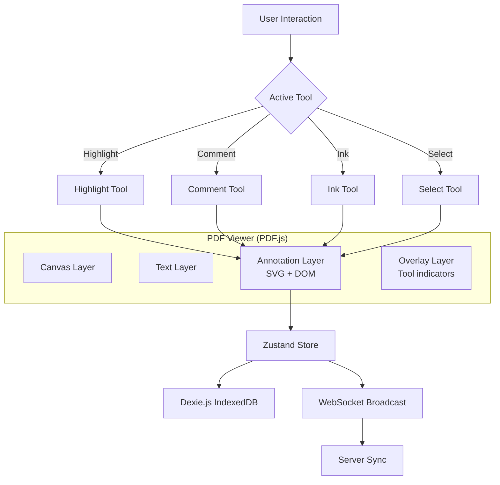

### Annotation Sync Protocol

```typescript
interface AnnotationDelta {
  operation: 'create' | 'update' | 'delete';
  annotation: Partial<Annotation>;
  timestamp: number;             // Lamport timestamp for ordering
  clientId: string;              // Unique client identifier
  checksum: string;              // Hash of annotation for conflict detection
}

// Conflict resolution: Last-write-wins with semantic merge
// For text fields: diff3 algorithm
// For spatial fields: bounding box union (if overlap > 80%)
// For color: user preference wins
```

---

## 13. Citation Engine Design

### Citation Architecture

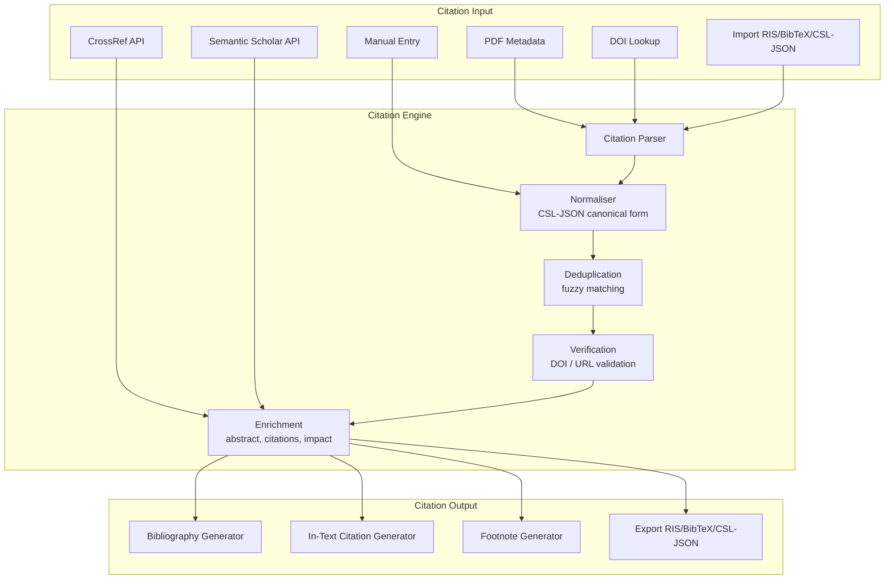

### Supported Citation Styles

| Style | ID | Supported Formats |
|-------|-----|-------------------|
| APA 7th Edition | `apa-7` | In-text, Reference list |
| MLA 9th Edition | `mla-9` | In-text, Works Cited |
| Chicago 17th (Notes-Bibliography) | `chicago-nb` | Footnotes, Bibliography |
| Chicago 17th (Author-Date) | `chicago-ad` | In-text, Reference list |
| IEEE | `ieee` | Numbered, Reference list |
| Harvard | `harvard` | In-text, Reference list |
| Vancouver | `vancouver` | Numbered, Reference list |
| Nature | `nature` | Numbered, Reference list |
| Cell | `cell` | Numbered, Reference list |
| Custom CSL | `custom` | User-uploaded CSL file |

### Citation Database Schema

```sql
CREATE TABLE citations (
    id UUID PRIMARY KEY DEFAULT gen_random_uuid(),
    tenant_id TEXT NOT NULL,
    project_id UUID NOT NULL REFERENCES projects(id),
    document_id UUID REFERENCES documents(id),

    -- Canonical CSL-JSON fields
    type TEXT NOT NULL DEFAULT 'article-journal', -- CSL type
    title TEXT NOT NULL,
    author JSONB,  -- [{ family, given, literal }]
    editor JSONB,
    container_title TEXT,  -- journal, book title
    publisher TEXT,
    publisher_place TEXT,
    volume TEXT,
    issue TEXT,
    page TEXT,
    edition TEXT,
    DOI TEXT,
    ISBN TEXT,
    ISSN TEXT,
    URL TEXT,
    accessed TIMESTAMPTZ,
    issued JSONB,  -- { date-parts: [[year, month, day]] }
    abstract TEXT,
    keywords TEXT[],

    -- CiteMind-specific
    cited_in_documents UUID[],  -- Documents where this citation is used
    cited_in_notes UUID[],     -- Notes where this citation is used
    auto_extracted BOOLEAN DEFAULT false,
    verified BOOLEAN DEFAULT false,
    verification_source TEXT,  -- crossref, semantic_scholar, user

    created_at TIMESTAMPTZ DEFAULT NOW(),
    updated_at TIMESTAMPTZ DEFAULT NOW(),
    created_by UUID NOT NULL REFERENCES users(id)
);

CREATE INDEX idx_citations_tenant_project ON citations(tenant_id, project_id);
CREATE INDEX idx_citations_doi ON citations(DOI) WHERE DOI IS NOT NULL;
CREATE INDEX idx_citations_document ON citations(document_id) WHERE document_id IS NOT NULL;
CREATE INDEX idx_citations_fts ON citations USING GIN (to_tsvector('english', title || ' ' || COALESCE(abstract, '')));
```

---

## 14. Export Engine Design

### Export Formats

| Format | Engine | Quality | Use Case |
|--------|--------|---------|----------|
| **PDF** | Puppeteer + Paged.js | Print-ready | Final deliverable, submission |
| **Microsoft Word** | Pandoc + custom template | Editable | Draft for collaboration |
| **Markdown** | Custom generator | Lossless | Version control, Obsidian import |
| **HTML** | ReactDOMServer + Tailwind | Interactive | Web publishing, sharing |
| **LaTeX** | Pandoc + custom template | Academic | Journal submission, thesis |
| **PowerPoint** | pptxgen.js | Presentation | Research presentations |
| **Bibliography** | CiteProc.js | Standards-compliant | Standalone reference list |

### Export Pipeline

```mermaid
sequenceDiagram
    participant User
    participant API as API Server
    participant QUEUE as BullMQ
    participant WORKER as Export Worker
    participant DB as PostgreSQL
    participant S3 as S3 Storage

    User->>API: POST /exports
    { projectId, scope: 'project', format: 'pdf', includeAnnotations: true, includeCitations: true }
    
    API->>DB: Create export job record (status: queued)
    API->>QUEUE: Add job to export queue
    API-->>User: { exportId, status: 'queued', estimatedTime: 60 }

    QUEUE->>WORKER: Process export job
    WORKER->>DB: Fetch project data (documents, notes, annotations, citations)
    WORKER->>WORKER: Assemble content tree
    WORKER->>WORKER: Apply citation formatting (CSL style)
    WORKER->>WORKER: Apply template (HTML wrapper)
    WORKER->>WORKER: Generate output (Puppeteer/Pandoc)
    WORKER->>S3: Upload generated file
    WORKER->>DB: Update job status: 'completed', set downloadUrl
    WORKER-->>QUEUE: Job complete

    User->>API: GET /exports/:exportId
    API->>DB: Check status
    API-->>User: { status: 'completed', downloadUrl: 'https://s3.../export.pdf', expiresAt: '...' }

    User->>S3: Download file (presigned URL)
```

### Export Templates

```typescript
interface ExportTemplate {
  id: string;
  name: string;
  format: 'pdf' | 'word' | 'latex' | 'markdown' | 'html';
  style: 'academic' | 'legal' | 'consulting' | 'minimal' | 'custom';
  
  // Template configuration
  fonts: { heading: string; body: string; code: string };
  margins: { top: string; right: string; bottom: string; left: string };
  lineSpacing: number;
  pageSize: 'A4' | 'letter' | 'legal';
  
  // Content sections
  includeTableOfContents: boolean;
  includeListOfFigures: boolean;
  includeListOfTables: boolean;
  includeBibliography: boolean;
  citationStyle: string;  // CSL style ID
  
  // Header / footer
  header: { left: string; center: string; right: string };
  footer: { left: string; center: string; right: string };
  pageNumbers: boolean;
  
  // Annotations
  annotationDisplay: 'inline' | 'margin' | 'endnotes' | 'hide';
  annotationColor: boolean;
  
  // Custom CSS (for PDF/HTML)
  customCss?: string;
}
```

---

## 15. Authentication and Authorisation

### Authentication Architecture

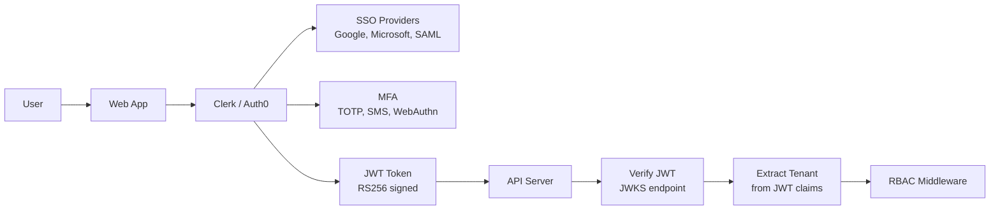

### Authentication Flows

| Flow | Mechanism | Use Case |
|------|-----------|----------|
| **Web Login** | OAuth2 (Google, Microsoft, GitHub) | Standard user login |
| **Enterprise SSO** | SAML 2.0 | University / Corporate SSO |
| **API Access** | API Key + Secret | Service-to-service, integrations |
| **Mobile** | OAuth2 + PKCE | Future mobile app |
| **Guest Access** | Time-limited token | Review-only sharing |

### JWT Claims

```json
{
  "sub": "user_abc123",
  "tenant_id": "tenant_xyz",
  "role": "admin",
  "permissions": ["documents:read", "documents:write", "projects:admin"],
  "plan": "enterprise",
  "iat": 1690000000,
  "exp": 1690003600
}
```

---

## 16. API Design

### RESTful Endpoint Specification

| Method | Endpoint | Description | Auth | Request Body | Response |
|--------|----------|-------------|------|--------------|----------|
| **Auth** |
| POST | `/api/auth/callback` | OAuth callback | Public | `{ code, provider }` | `{ token, user }` |
| POST | `/api/auth/refresh` | Refresh token | Bearer | — | `{ token }` |
| POST | `/api/auth/logout` | Logout | Bearer | — | `204` |
| **Users** |
| GET | `/api/users/me` | Current user | Bearer | — | `User` |
| PATCH | `/api/users/me` | Update profile | Bearer | `{ name, avatar, preferences }` | `User` |
| DELETE | `/api/users/me` | Delete account | Bearer | — | `204` |
| GET | `/api/users/me/preferences` | Get preferences | Bearer | — | `UserPreferences` |
| PUT | `/api/users/me/preferences` | Update preferences | Bearer | `UserPreferences` | `UserPreferences` |
| **Projects** |
| GET | `/api/projects` | List projects | Bearer | — | `Project[]` |
| POST | `/api/projects` | Create project | Bearer | `{ name, description, template }` | `Project` |
| GET | `/api/projects/:id` | Get project | Bearer + project | — | `Project` |
| PATCH | `/api/projects/:id` | Update project | Bearer + project | `{ name, description }` | `Project` |
| DELETE | `/api/projects/:id` | Delete project | Bearer + project | — | `204` |
| POST | `/api/projects/:id/duplicate` | Duplicate project | Bearer + project | — | `Project` |
| **Documents** |
| POST | `/api/projects/:id/documents` | Upload document | Bearer + project | `multipart/form-data` | `Document` |
| GET | `/api/projects/:id/documents` | List documents | Bearer + project | — | `Document[]` |
| GET | `/api/documents/:id` | Get document | Bearer + document | — | `Document` |
| PATCH | `/api/documents/:id` | Update metadata | Bearer + document | `{ title, tags, authors }` | `Document` |
| DELETE | `/api/documents/:id` | Delete document | Bearer + document | — | `204` |
| GET | `/api/documents/:id/download` | Download original | Bearer + document | — | `Blob` |
| GET | `/api/documents/:id/pages/:page` | Get page data | Bearer + document | — | `PageData` |
| GET | `/api/documents/:id/text` | Extracted text | Bearer + document | — | `{ text: string }` |
| POST | `/api/documents/:id/extract` | Re-extract / OCR | Bearer + document | `{ ocr: boolean }` | `Job` |
| **Annotations** |
| POST | `/api/documents/:id/annotations` | Create annotation | Bearer + document | `Annotation` | `Annotation` |
| GET | `/api/documents/:id/annotations` | List annotations | Bearer + document | — | `Annotation[]` |
| PATCH | `/api/annotations/:id` | Update annotation | Bearer + annotation | `Partial<Annotation>` | `Annotation` |
| DELETE | `/api/annotations/:id` | Delete annotation | Bearer + annotation | — | `204` |
| POST | `/api/annotations/:id/ai-summary` | AI summary | Bearer + annotation | — | `{ summary: string, tags: string[] }` |
| **Notes** |
| POST | `/api/projects/:id/notes` | Create note | Bearer + project | `{ title, content, linkedDocuments }` | `Note` |
| GET | `/api/projects/:id/notes` | List notes | Bearer + project | — | `Note[]` |
| GET | `/api/notes/:id` | Get note | Bearer + note | — | `Note` |
| PATCH | `/api/notes/:id` | Update note | Bearer + note | `Partial<Note>` | `Note` |
| DELETE | `/api/notes/:id` | Delete note | Bearer + note | — | `204` |
| **Highlights** |
| GET | `/api/projects/:id/highlights` | All highlights | Bearer + project | — | `Highlight[]` |
| POST | `/api/highlights/:id/tags` | Tag highlight | Bearer + highlight | `{ tags: string[] }` | `Highlight` |
| **AI Chat** |
| POST | `/api/projects/:id/chat` | New conversation | Bearer + project | `{ title }` | `Conversation` |
| GET | `/api/projects/:id/chat` | List conversations | Bearer + project | — | `Conversation[]` |
| POST | `/api/chat/:id/messages` | Send message | Bearer + conversation | `{ content, context: { documentIds, annotationIds } }` | `Message` (SSE) |
| GET | `/api/chat/:id` | Get conversation | Bearer + conversation | — | `Conversation` |
| DELETE | `/api/chat/:id` | Delete conversation | Bearer + conversation | — | `204` |
| POST | `/api/chat/:id/summarise` | Summarise context | Bearer + conversation | `{ scope: 'documents' | 'conversation' }` | `Summary` |
| **Search** |
| POST | `/api/projects/:id/search` | Semantic search | Bearer + project | `SearchRequest` | `SearchResult[]` |
| GET | `/api/projects/:id/search/suggestions` | Auto-complete | Bearer + project | `?q=query` | `string[]` |
| **Knowledge Graph** |
| GET | `/api/projects/:id/graph` | Get graph | Bearer + project | `?depth=2` | `Graph` |
| POST | `/api/projects/:id/graph/nodes` | Create node | Bearer + project | `GraphNode` | `GraphNode` |
| PATCH | `/api/graph/nodes/:id` | Update node | Bearer + node | `Partial<GraphNode>` | `GraphNode` |
| DELETE | `/api/graph/nodes/:id` | Delete node | Bearer + node | — | `204` |
| POST | `/api/projects/:id/graph/edges` | Create edge | Bearer + project | `GraphEdge` | `GraphEdge` |
| DELETE | `/api/graph/edges/:id` | Delete edge | Bearer + edge | — | `204` |
| POST | `/api/projects/:id/graph/extract` | AI extract | Bearer + project | `{ documentIds }` | `Job` |
| GET | `/api/graph/nodes/:id/suggestions` | Suggest connections | Bearer + node | — | `SuggestedEdge[]` |
| **Citations** |
| POST | `/api/projects/:id/citations` | Create citation | Bearer + project | `Citation` | `Citation` |
| GET | `/api/projects/:id/citations` | List citations | Bearer + project | — | `Citation[]` |
| GET | `/api/citations/:id` | Get citation | Bearer + citation | — | `Citation` |
| PATCH | `/api/citations/:id` | Update citation | Bearer + citation | `Partial<Citation>` | `Citation` |
| DELETE | `/api/citations/:id` | Delete citation | Bearer + citation | — | `204` |
| POST | `/api/citations/verify` | Verify DOI/URL | Bearer | `{ doi?: string, url?: string }` | `VerificationResult` |
| POST | `/api/citations/import` | Import bibliography | Bearer + project | `RIS/BibTeX/CSL-JSON` | `Citation[]` |
| GET | `/api/citations/export` | Export bibliography | Bearer + project | `?format=ris&style=apa-7` | `Blob` |
| POST | `/api/citations/:id/generate` | Generate in-text | Bearer + citation | `{ style: 'apa-7', locator: 'p. 23' }` | `{ citation: string }` |
| **Exports** |
| POST | `/api/projects/:id/exports` | Create export | Bearer + project | `ExportRequest` | `ExportJob` |
| GET | `/api/projects/:id/exports` | List exports | Bearer + project | — | `ExportJob[]` |
| GET | `/api/exports/:id` | Get export status | Bearer + export | — | `ExportJob` |
| GET | `/api/exports/:id/download` | Download export | Bearer + export | — | `Blob` |
| DELETE | `/api/exports/:id` | Delete export | Bearer + export | — | `204` |
| **Collaboration** |
| GET | `/api/projects/:id/collaborators` | List collaborators | Bearer + project | — | `Collaborator[]` |
| POST | `/api/projects/:id/collaborators` | Invite user | Bearer + project | `{ email, role: 'viewer' | 'editor' | 'admin' }` | `Collaborator` |
| PATCH | `/api/collaborators/:id` | Update role | Bearer + project | `{ role }` | `Collaborator` |
| DELETE | `/api/collaborators/:id` | Remove collaborator | Bearer + project | — | `204` |
| POST | `/api/collaborators/:id/resend` | Resend invite | Bearer + project | — | `Collaborator` |
| GET | `/api/projects/:id/activity` | Activity feed | Bearer + project | — | `Activity[]` |
| **Sync** |
| POST | `/api/sync/delta` | Delta sync | Bearer | `{ lastSyncAt, changes: Delta[] }` | `{ serverChanges: Delta[], conflicts: Conflict[] }` |
| GET | `/api/sync/status` | Sync status | Bearer | — | `{ lastSyncAt, pendingChanges: number }` |
| **Admin** |
| GET | `/api/admin/tenants` | List tenants | Admin | — | `Tenant[]` |
| GET | `/api/admin/tenants/:id` | Tenant details | Admin | — | `Tenant` |
| PATCH | `/api/admin/tenants/:id` | Update tenant | Admin | `{ plan, limits }` | `Tenant` |
| GET | `/api/admin/users` | List users | Admin | `?tenantId` | `User[]` |
| GET | `/api/admin/usage` | Usage metrics | Admin | `?tenantId&period` | `UsageMetrics` |
| GET | `/api/admin/health` | System health | Admin | — | `HealthStatus` |
| **Health** |
| GET | `/health` | Liveness probe | Public | — | `{ status: 'ok' }` |
| GET | `/health/ready` | Readiness probe | Public | — | `{ status: 'ready', checks: {...} }` |
| GET | `/health/db` | DB health | Public | — | `{ status: 'ok', latency: 12 }` |

---

## 17. Database Schema

### Complete PostgreSQL DDL with pgvector

```sql
-- Enable required extensions
CREATE EXTENSION IF NOT EXISTS "uuid-ossp";
CREATE EXTENSION IF NOT EXISTS "pgvector";
CREATE EXTENSION IF NOT EXISTS "pg_trgm";  -- fuzzy text search

-- ============================================================
-- TENANTS (Multi-tenant isolation root)
-- ============================================================
CREATE TABLE tenants (
    id TEXT PRIMARY KEY,
    name TEXT NOT NULL,
    slug TEXT UNIQUE NOT NULL,
    plan TEXT NOT NULL DEFAULT 'free' CHECK (plan IN ('free', 'starter', 'pro', 'team', 'enterprise')),
    status TEXT NOT NULL DEFAULT 'active' CHECK (status IN ('active', 'suspended', 'cancelled')),
    settings JSONB DEFAULT '{}',
    limits JSONB DEFAULT '{}',  -- { max_projects, max_documents, max_storage_mb, max_users }
    billing_email TEXT,
    created_at TIMESTAMPTZ DEFAULT NOW(),
    updated_at TIMESTAMPTZ DEFAULT NOW()
);

-- ============================================================
-- USERS
-- ============================================================
CREATE TABLE users (
    id UUID PRIMARY KEY DEFAULT gen_random_uuid(),
    tenant_id TEXT NOT NULL REFERENCES tenants(id) ON DELETE CASCADE,
    external_id TEXT,  -- Clerk / Auth0 user ID
    email TEXT NOT NULL,
    name TEXT,
    avatar_url TEXT,
    role TEXT NOT NULL DEFAULT 'member' CHECK (role IN ('super_admin', 'admin', 'member', 'viewer')),
    preferences JSONB DEFAULT '{}',
    last_seen_at TIMESTAMPTZ,
    created_at TIMESTAMPTZ DEFAULT NOW(),
    updated_at TIMESTAMPTZ DEFAULT NOW(),
    UNIQUE(tenant_id, email)
);

CREATE INDEX idx_users_tenant ON users(tenant_id);
CREATE INDEX idx_users_email ON users(email);

-- ============================================================
-- PROJECTS (Research Workspaces)
-- ============================================================
CREATE TABLE projects (
    id UUID PRIMARY KEY DEFAULT gen_random_uuid(),
    tenant_id TEXT NOT NULL REFERENCES tenants(id) ON DELETE CASCADE,
    name TEXT NOT NULL,
    description TEXT,
    icon TEXT,
    color TEXT,
    settings JSONB DEFAULT '{}',
    is_archived BOOLEAN DEFAULT false,
    created_by UUID NOT NULL REFERENCES users(id),
    created_at TIMESTAMPTZ DEFAULT NOW(),
    updated_at TIMESTAMPTZ DEFAULT NOW()
);

CREATE INDEX idx_projects_tenant ON projects(tenant_id);
CREATE INDEX idx_projects_created_by ON projects(created_by);

-- ============================================================
-- PROJECT COLLABORATORS
-- ============================================================
CREATE TABLE project_collaborators (
    id UUID PRIMARY KEY DEFAULT gen_random_uuid(),
    project_id UUID NOT NULL REFERENCES projects(id) ON DELETE CASCADE,
    user_id UUID NOT NULL REFERENCES users(id) ON DELETE CASCADE,
    role TEXT NOT NULL DEFAULT 'editor' CHECK (role IN ('viewer', 'editor', 'admin')),
    invited_by UUID REFERENCES users(id),
    invited_at TIMESTAMPTZ DEFAULT NOW(),
    accepted_at TIMESTAMPTZ,
    created_at TIMESTAMPTZ DEFAULT NOW(),
    UNIQUE(project_id, user_id)
);

CREATE INDEX idx_collaborators_project ON project_collaborators(project_id);
CREATE INDEX idx_collaborators_user ON project_collaborators(user_id);

-- ============================================================
-- DOCUMENTS
-- ============================================================
CREATE TABLE documents (
    id UUID PRIMARY KEY DEFAULT gen_random_uuid(),
    tenant_id TEXT NOT NULL REFERENCES tenants(id) ON DELETE CASCADE,
    project_id UUID NOT NULL REFERENCES projects(id) ON DELETE CASCADE,
    title TEXT NOT NULL,
    description TEXT,
    authors TEXT[],
    source_url TEXT,
    doi TEXT,
    isbn TEXT,
    publication_date DATE,
    publisher TEXT,
    page_count INTEGER,
    file_size INTEGER,  -- bytes
    file_type TEXT NOT NULL DEFAULT 'application/pdf',
    storage_key TEXT NOT NULL,  -- S3 path
    storage_bucket TEXT NOT NULL DEFAULT 'default',
    thumbnail_key TEXT,
    metadata JSONB DEFAULT '{}',  -- extracted PDF metadata
    processing_status TEXT NOT NULL DEFAULT 'pending' 
        CHECK (processing_status IN ('pending', 'processing', 'completed', 'failed', 'ocr_required')),
    processing_error TEXT,
    language TEXT DEFAULT 'en',
    tags TEXT[],
    is_favorite BOOLEAN DEFAULT false,
    last_read_at TIMESTAMPTZ,
    last_read_page INTEGER DEFAULT 1,
    created_by UUID NOT NULL REFERENCES users(id),
    created_at TIMESTAMPTZ DEFAULT NOW(),
    updated_at TIMESTAMPTZ DEFAULT NOW()
);

CREATE INDEX idx_documents_tenant_project ON documents(tenant_id, project_id);
CREATE INDEX idx_documents_status ON documents(processing_status);
CREATE INDEX idx_documents_doi ON documents(doi) WHERE doi IS NOT NULL;
CREATE INDEX idx_documents_fts ON documents USING GIN (to_tsvector('english', title || ' ' || COALESCE(description, '')));
CREATE INDEX idx_documents_tags ON documents USING GIN (tags);

-- ============================================================
-- DOCUMENT PAGES
-- ============================================================
CREATE TABLE document_pages (
    id UUID PRIMARY KEY DEFAULT gen_random_uuid(),
    document_id UUID NOT NULL REFERENCES documents(id) ON DELETE CASCADE,
    page_number INTEGER NOT NULL,
    text_content TEXT,
    text_layer JSONB,  -- [{ text, bbox: {x, y, w, h} }]
    ocr_text TEXT,  -- OCR fallback text
    thumbnail_key TEXT,
    width FLOAT,   -- PDF points
    height FLOAT,  -- PDF points
    created_at TIMESTAMPTZ DEFAULT NOW(),
    UNIQUE(document_id, page_number)
);

CREATE INDEX idx_pages_document ON document_pages(document_id);

-- ============================================================
-- DOCUMENT CHUNKS (Vector Search)
-- ============================================================
CREATE TABLE document_chunks (
    id UUID PRIMARY KEY DEFAULT gen_random_uuid(),
    tenant_id TEXT NOT NULL,
    project_id UUID NOT NULL REFERENCES projects(id) ON DELETE CASCADE,
    document_id UUID NOT NULL REFERENCES documents(id) ON DELETE CASCADE,
    page_id UUID REFERENCES document_pages(id) ON DELETE CASCADE,
    page_number INTEGER NOT NULL,
    chunk_index INTEGER NOT NULL,
    text_content TEXT NOT NULL,
    embedding VECTOR(3072),
    search_vector TSVECTOR,
    metadata JSONB DEFAULT '{}',
    created_at TIMESTAMPTZ DEFAULT NOW(),
    UNIQUE(document_id, page_number, chunk_index)
);

-- HNSW index for fast approximate vector search
CREATE INDEX idx_chunks_embedding_hnsw ON document_chunks
USING hnsw (embedding vector_cosine_ops)
WITH (m = 16, ef_construction = 64);

-- Full-text search index
CREATE INDEX idx_chunks_search_vector ON document_chunks USING GIN (search_vector);
CREATE INDEX idx_chunks_tenant_project ON document_chunks(tenant_id, project_id);
CREATE INDEX idx_chunks_document ON document_chunks(document_id);

-- Trigger for tsvector auto-generation
CREATE OR REPLACE FUNCTION document_chunks_search_vector_update()
RETURNS TRIGGER AS $$
BEGIN
    NEW.search_vector := to_tsvector('english', COALESCE(NEW.text_content, ''));
    RETURN NEW;
END;
$$ LANGUAGE plpgsql;

CREATE TRIGGER tr_document_chunks_search_vector
BEFORE INSERT OR UPDATE ON document_chunks
FOR EACH ROW EXECUTE FUNCTION document_chunks_search_vector_update();

-- ============================================================
-- ANNOTATIONS
-- ============================================================
CREATE TABLE annotations (
    id UUID PRIMARY KEY DEFAULT gen_random_uuid(),
    tenant_id TEXT NOT NULL,
    project_id UUID NOT NULL REFERENCES projects(id) ON DELETE CASCADE,
    document_id UUID NOT NULL REFERENCES documents(id) ON DELETE CASCADE,
    user_id UUID NOT NULL REFERENCES users(id),
    type TEXT NOT NULL CHECK (type IN ('highlight', 'underline', 'strikethrough', 'text_comment', 'area_comment', 'ink', 'signature')),
    page_number INTEGER NOT NULL,
    bounding_box JSONB NOT NULL,  -- { x, y, width, height }
    quad_points JSONB,  -- [x1, y1, x2, y2, ...] for multi-line
    ink_list JSONB,  -- [{ x, y }, ...] for freehand
    color TEXT NOT NULL DEFAULT '#FFEB3B',
    text_content TEXT,  -- extracted highlighted text
    note_content TEXT,  -- user-written note (Markdown)
    ai_summary TEXT,
    ai_tags TEXT[],
    embedding VECTOR(3072),
    extracted_entities TEXT[],
    sentiment TEXT CHECK (sentiment IN ('positive', 'negative', 'neutral')),
    resolved_at TIMESTAMPTZ,
    resolved_by UUID REFERENCES users(id),
    version INTEGER NOT NULL DEFAULT 1,
    is_deleted BOOLEAN DEFAULT false,
    created_at TIMESTAMPTZ DEFAULT NOW(),
    updated_at TIMESTAMPTZ DEFAULT NOW()
);

CREATE INDEX idx_annotations_tenant_project ON annotations(tenant_id, project_id);
CREATE INDEX idx_annotations_document ON annotations(document_id);
CREATE INDEX idx_annotations_user ON annotations(user_id);
CREATE INDEX idx_annotations_page ON annotations(document_id, page_number);
CREATE INDEX idx_annotations_fts ON annotations USING GIN (to_tsvector('english', COALESCE(text_content, '') || ' ' || COALESCE(note_content, '')));

-- ============================================================
-- NOTES (Research Cards)
-- ============================================================
CREATE TABLE notes (
    id UUID PRIMARY KEY DEFAULT gen_random_uuid(),
    tenant_id TEXT NOT NULL,
    project_id UUID NOT NULL REFERENCES projects(id) ON DELETE CASCADE,
    user_id UUID NOT NULL REFERENCES users(id),
    title TEXT,
    content TEXT NOT NULL,  -- Markdown
    plain_text TEXT,  -- Plain text for search
    color TEXT DEFAULT '#ffffff',
    icon TEXT,
    tags TEXT[],
    linked_document_ids UUID[],
    linked_annotation_ids UUID[],
    linked_note_ids UUID[],
    canvas_position JSONB,  -- { x, y, width, height } for research board
    embedding VECTOR(3072),
    is_pinned BOOLEAN DEFAULT false,
    is_archived BOOLEAN DEFAULT false,
    version INTEGER NOT NULL DEFAULT 1,
    created_at TIMESTAMPTZ DEFAULT NOW(),
    updated_at TIMESTAMPTZ DEFAULT NOW()
);

CREATE INDEX idx_notes_tenant_project ON notes(tenant_id, project_id);
CREATE INDEX idx_notes_user ON notes(user_id);
CREATE INDEX idx_notes_fts ON notes USING GIN (to_tsvector('english', COALESCE(title, '') || ' ' || COALESCE(plain_text, '')));
CREATE INDEX idx_notes_tags ON notes USING GIN (tags);

-- ============================================================
-- AI CONVERSATIONS
-- ============================================================
CREATE TABLE ai_conversations (
    id UUID PRIMARY KEY DEFAULT gen_random_uuid(),
    tenant_id TEXT NOT NULL,
    project_id UUID NOT NULL REFERENCES projects(id) ON DELETE CASCADE,
    user_id UUID NOT NULL REFERENCES users(id),
    title TEXT,
    model TEXT NOT NULL DEFAULT 'gpt-4o',
    system_prompt TEXT,
    context_documents UUID[],
    context_annotations UUID[],
    metadata JSONB DEFAULT '{}',
    is_pinned BOOLEAN DEFAULT false,
    created_at TIMESTAMPTZ DEFAULT NOW(),
    updated_at TIMESTAMPTZ DEFAULT NOW()
);

CREATE INDEX idx_conversations_project ON ai_conversations(project_id);
CREATE INDEX idx_conversations_user ON ai_conversations(user_id);

-- ============================================================
-- AI MESSAGES
-- ============================================================
CREATE TABLE ai_messages (
    id UUID PRIMARY KEY DEFAULT gen_random_uuid(),
    conversation_id UUID NOT NULL REFERENCES ai_conversations(id) ON DELETE CASCADE,
    role TEXT NOT NULL CHECK (role IN ('system', 'user', 'assistant', 'tool')),
    content TEXT NOT NULL,
    citations JSONB,  -- [{ documentId, chunkId, text, pageNumber }]
    tool_calls JSONB,  -- LangChain tool calls
    tokens_input INTEGER,
    tokens_output INTEGER,
    latency_ms INTEGER,
    model TEXT,
    created_at TIMESTAMPTZ DEFAULT NOW()
);

CREATE INDEX idx_messages_conversation ON ai_messages(conversation_id);
CREATE INDEX idx_messages_created ON ai_messages(created_at);

-- ============================================================
-- KNOWLEDGE GRAPH NODES
-- ============================================================
CREATE TABLE knowledge_graph_nodes (
    id UUID PRIMARY KEY DEFAULT gen_random_uuid(),
    tenant_id TEXT NOT NULL,
    project_id UUID NOT NULL REFERENCES projects(id) ON DELETE CASCADE,
    user_id UUID NOT NULL REFERENCES users(id),
    node_type TEXT NOT NULL CHECK (node_type IN ('document', 'note', 'highlight', 'concept', 'entity', 'topic', 'question')),
    label TEXT NOT NULL,
    content TEXT,
    metadata JSONB DEFAULT '{}',
    canvas_position JSONB,  -- { x, y }
    canvas_size JSONB,  -- { width, height }
    color TEXT,
    source_document_id UUID REFERENCES documents(id),
    source_annotation_id UUID REFERENCES annotations(id),
    source_note_id UUID REFERENCES notes(id),
    ai_confidence FLOAT,
    embedding VECTOR(3072),
    created_at TIMESTAMPTZ DEFAULT NOW(),
    updated_at TIMESTAMPTZ DEFAULT NOW()
);

CREATE INDEX idx_kg_nodes_project ON knowledge_graph_nodes(project_id);
CREATE INDEX idx_kg_nodes_type ON knowledge_graph_nodes(node_type);
CREATE INDEX idx_kg_nodes_document ON knowledge_graph_nodes(source_document_id) WHERE source_document_id IS NOT NULL;

-- ============================================================
-- KNOWLEDGE GRAPH EDGES
-- ============================================================
CREATE TABLE knowledge_graph_edges (
    id UUID PRIMARY KEY DEFAULT gen_random_uuid(),
    tenant_id TEXT NOT NULL,
    project_id UUID NOT NULL REFERENCES projects(id) ON DELETE CASCADE,
    source_id UUID NOT NULL REFERENCES knowledge_graph_nodes(id) ON DELETE CASCADE,
    target_id UUID NOT NULL REFERENCES knowledge_graph_nodes(id) ON DELETE CASCADE,
    edge_type TEXT NOT NULL CHECK (edge_type IN ('cites', 'supports', 'contradicts', 'relates_to', 'contains', 'derived_from', 'answers')),
    label TEXT,
    metadata JSONB DEFAULT '{}',
    strength FLOAT CHECK (strength >= 0 AND strength <= 1),
    ai_confidence FLOAT,
    created_at TIMESTAMPTZ DEFAULT NOW(),
    UNIQUE(source_id, target_id, edge_type)
);

CREATE INDEX idx_kg_edges_project ON knowledge_graph_edges(project_id);
CREATE INDEX idx_kg_edges_source ON knowledge_graph_edges(source_id);
CREATE INDEX idx_kg_edges_target ON knowledge_graph_edges(target_id);

-- ============================================================
-- CITATIONS
-- ============================================================
CREATE TABLE citations (
    id UUID PRIMARY KEY DEFAULT gen_random_uuid(),
    tenant_id TEXT NOT NULL,
    project_id UUID NOT NULL REFERENCES projects(id) ON DELETE CASCADE,
    document_id UUID REFERENCES documents(id),
    type TEXT NOT NULL DEFAULT 'article-journal',
    title TEXT NOT NULL,
    author JSONB,  -- [{ family, given, literal }]
    editor JSONB,
    container_title TEXT,
    publisher TEXT,
    publisher_place TEXT,
    volume TEXT,
    issue TEXT,
    page TEXT,
    edition TEXT,
    DOI TEXT,
    ISBN TEXT,
    ISSN TEXT,
    URL TEXT,
    accessed TIMESTAMPTZ,
    issued JSONB,  -- { date-parts: [[year, month, day]] }
    abstract TEXT,
    keywords TEXT[],
    cited_in_documents UUID[],
    cited_in_notes UUID[],
    auto_extracted BOOLEAN DEFAULT false,
    verified BOOLEAN DEFAULT false,
    verification_source TEXT,
    created_by UUID NOT NULL REFERENCES users(id),
    created_at TIMESTAMPTZ DEFAULT NOW(),
    updated_at TIMESTAMPTZ DEFAULT NOW()
);

CREATE INDEX idx_citations_tenant_project ON citations(tenant_id, project_id);
CREATE INDEX idx_citations_doi ON citations(DOI) WHERE DOI IS NOT NULL;
CREATE INDEX idx_citations_document ON citations(document_id) WHERE document_id IS NOT NULL;
CREATE INDEX idx_citations_fts ON citations USING GIN (to_tsvector('english', title || ' ' || COALESCE(abstract, '')));

-- ============================================================
-- EXPORTS
-- ============================================================
CREATE TABLE exports (
    id UUID PRIMARY KEY DEFAULT gen_random_uuid(),
    tenant_id TEXT NOT NULL,
    project_id UUID NOT NULL REFERENCES projects(id) ON DELETE CASCADE,
    user_id UUID NOT NULL REFERENCES users(id),
    name TEXT NOT NULL,
    format TEXT NOT NULL CHECK (format IN ('pdf', 'word', 'markdown', 'html', 'latex', 'powerpoint', 'bibliography')),
    scope TEXT NOT NULL CHECK (scope IN ('project', 'document', 'selection', 'graph')),
    scope_ids UUID[],
    configuration JSONB NOT NULL DEFAULT '{}',
    status TEXT NOT NULL DEFAULT 'queued' CHECK (status IN ('queued', 'processing', 'completed', 'failed', 'cancelled')),
    error_message TEXT,
    file_key TEXT,
    file_size INTEGER,
    download_url TEXT,
    expires_at TIMESTAMPTZ,
    created_at TIMESTAMPTZ DEFAULT NOW(),
    completed_at TIMESTAMPTZ
);

CREATE INDEX idx_exports_project ON exports(project_id);
CREATE INDEX idx_exports_user ON exports(user_id);
CREATE INDEX idx_exports_status ON exports(status);

-- ============================================================
-- ACTIVITY LOG (Audit Trail)
-- ============================================================
CREATE TABLE activity_log (
    id UUID PRIMARY KEY DEFAULT gen_random_uuid(),
    tenant_id TEXT NOT NULL,
    project_id UUID REFERENCES projects(id) ON DELETE SET NULL,
    user_id UUID REFERENCES users(id) ON DELETE SET NULL,
    action TEXT NOT NULL,  -- document.uploaded, annotation.created, etc.
    entity_type TEXT NOT NULL,
    entity_id UUID,
    metadata JSONB DEFAULT '{}',
    ip_address INET,
    user_agent TEXT,
    created_at TIMESTAMPTZ DEFAULT NOW()
);

CREATE INDEX idx_activity_tenant ON activity_log(tenant_id);
CREATE INDEX idx_activity_project ON activity_log(project_id);
CREATE INDEX idx_activity_user ON activity_log(user_id);
CREATE INDEX idx_activity_created ON activity_log(created_at);
CREATE INDEX idx_action_entity ON activity_log(entity_type, entity_id);

-- ============================================================
-- USER SETTINGS
-- ============================================================
CREATE TABLE user_settings (
    id UUID PRIMARY KEY DEFAULT gen_random_uuid(),
    user_id UUID NOT NULL REFERENCES users(id) ON DELETE CASCADE,
    theme TEXT NOT NULL DEFAULT 'system' CHECK (theme IN ('light', 'dark', 'system')),
    font_size INTEGER DEFAULT 14,
    pdf_viewer_mode TEXT DEFAULT 'continuous' CHECK (pdf_viewer_mode IN ('single', 'continuous', 'facing')),
    default_citation_style TEXT DEFAULT 'apa-7',
    default_export_format TEXT DEFAULT 'pdf',
    ai_model TEXT DEFAULT 'gpt-4o',
    ai_temperature FLOAT DEFAULT 0.7,
    sidebar_collapsed BOOLEAN DEFAULT false,
    shortcuts JSONB DEFAULT '{}',
    notification_preferences JSONB DEFAULT '{}',
    privacy_settings JSONB DEFAULT '{}',
    created_at TIMESTAMPTZ DEFAULT NOW(),
    updated_at TIMESTAMPTZ DEFAULT NOW(),
    UNIQUE(user_id)
);

-- ============================================================
-- ROW-LEVEL SECURITY (RLS) for Multi-Tenant Isolation
-- ============================================================
ALTER TABLE users ENABLE ROW LEVEL SECURITY;
ALTER TABLE projects ENABLE ROW LEVEL SECURITY;
ALTER TABLE project_collaborators ENABLE ROW LEVEL SECURITY;
ALTER TABLE documents ENABLE ROW LEVEL SECURITY;
ALTER TABLE document_pages ENABLE ROW LEVEL SECURITY;
ALTER TABLE document_chunks ENABLE ROW LEVEL SECURITY;
ALTER TABLE annotations ENABLE ROW LEVEL SECURITY;
ALTER TABLE notes ENABLE ROW LEVEL SECURITY;
ALTER TABLE ai_conversations ENABLE ROW LEVEL SECURITY;
ALTER TABLE ai_messages ENABLE ROW LEVEL SECURITY;
ALTER TABLE knowledge_graph_nodes ENABLE ROW LEVEL SECURITY;
ALTER TABLE knowledge_graph_edges ENABLE ROW LEVEL SECURITY;
ALTER TABLE citations ENABLE ROW LEVEL SECURITY;
ALTER TABLE exports ENABLE ROW LEVEL SECURITY;
ALTER TABLE activity_log ENABLE ROW LEVEL SECURITY;

-- Example RLS policy for documents
CREATE POLICY documents_tenant_isolation ON documents
FOR ALL TO app_user
USING (tenant_id = current_setting('app.current_tenant_id', true));

-- Example RLS policy for projects (with collaborator access)
CREATE POLICY projects_access ON projects
FOR ALL TO app_user
USING (
    tenant_id = current_setting('app.current_tenant_id', true)
    AND (
        created_by = current_setting('app.current_user_id', true)::UUID
        OR EXISTS (
            SELECT 1 FROM project_collaborators
            WHERE project_id = projects.id
            AND user_id = current_setting('app.current_user_id', true)::UUID
        )
    )
);
```

---

## 18. File Storage Design

### Storage Architecture

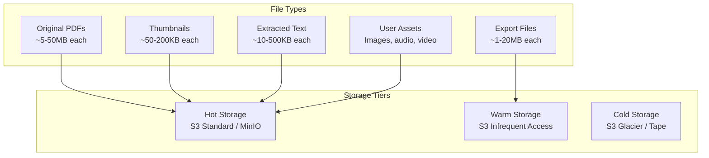

### S3 Bucket Structure

```
citemind-storage/
├── {tenant_id}/
│   ├── documents/
│   │   ├── {document_id}.pdf           # Original PDF
│   │   ├── {document_id}/
│   │   │   ├── pages/
│   │   │   │   ├── page_001.webp       # 200px thumbnail
│   │   │   │   ├── page_001_800.webp   # 800px preview
│   │   │   │   ├── page_002.webp
│   │   │   │   └── ...
│   │   │   ├── text.json               # Extracted text per page
│   │   │   └── ocr.json                # OCR results (if applicable)
│   │   └── metadata.json               # Document metadata
│   ├── exports/
│   │   ├── {export_id}.pdf
│   │   ├── {export_id}.docx
│   │   └── ...
│   ├── assets/
│   │   ├── {asset_id}.png
│   │   └── ...
│   └── backups/
│       └── ...
```

### Storage Configuration

| Parameter | MVP (Local) | Production (S3) |
|-----------|-------------|-------------------|
| **Backend** | MinIO (Docker) | AWS S3 / Cloudflare R2 |
| **Region** | Local | us-east-1 / eu-west-1 |
| **Encryption** | None | AES-256-S3 (server-side) |
| **Versioning** | Disabled | Enabled |
| **Lifecycle** | None | 90 days → IA, 1 year → Glacier |
| **CORS** | Localhost only | App domain |
| **Presigned URL TTL** | 5 minutes | 5 minutes |
| **Max Upload Size** | 100MB | 500MB |
| **Multipart Threshold** | 10MB | 10MB |

---

## 19. Sync Design

### Local-First Sync Architecture

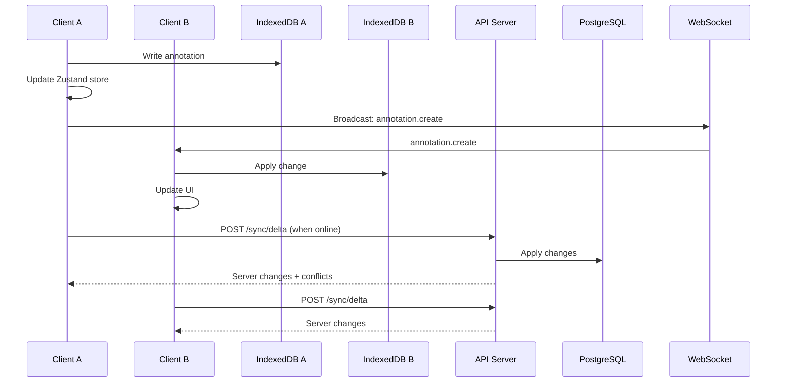

### Sync Protocol

```typescript
interface SyncState {
  lastSyncAt: string;  // ISO timestamp
  clientId: string;    // UUID per device
  deviceName: string;    // "MacBook Pro", "iPad", etc.
}

interface Delta {
  id: string;            // UUID for the change
  table: string;         // 'annotations', 'notes', 'knowledge_graph_nodes', etc.
  operation: 'create' | 'update' | 'delete';
  recordId: string;      // UUID of the record
  data: Record<string, unknown>;  // Full record (create) or partial (update)
  checksum: string;      // Hash of the data for conflict detection
  timestamp: number;     // Lamport timestamp (logical clock)
  clientId: string;      // Source device
}

interface SyncResponse {
  serverChanges: Delta[];
  conflicts: Conflict[];
  newLastSyncAt: string;
}

interface Conflict {
  table: string;
  recordId: string;
  localVersion: Delta;
  serverVersion: Delta;
  resolution: 'server_wins' | 'client_wins' | 'merge';  // Server decides based on policy
}
```

### Sync Rules

| Data Type | Sync Direction | Conflict Resolution | Real-Time |
|-----------|---------------|---------------------|-----------|
| Annotations | Bi-directional | Last-write-wins (timestamp) | Yes (WebSocket) |
| Notes | Bi-directional | Merge (text diff3) | Yes (WebSocket) |
| Graph Nodes | Bi-directional | Last-write-wins | Yes (CRDT via Yjs) |
| Graph Edges | Bi-directional | Last-write-wins | Yes (CRDT via Yjs) |
| Chat Messages | Server → Client only | N/A (append-only) | Yes (SSE) |
| Documents | Server → Client only | N/A (immutable after upload) | No |
| Citations | Bi-directional | Server wins (canonical) | No |
| Settings | Bi-directional | Last-write-wins | No |
| Exports | Server → Client only | N/A | No |

---

## 20. Offline Mode Design

### Offline Capability Matrix

| Feature | Online Only | Offline Read | Offline Write | Sync When Online |
|---------|-------------|---------------|---------------|------------------|
| **PDF Viewing** | — | ✅ Cached | — | — |
| **PDF Annotation** | — | ✅ | ✅ | ✅ |
| **Note Editing** | — | ✅ | ✅ | ✅ |
| **Canvas Editing** | — | ✅ | ✅ | ✅ (CRDT) |
| **AI Chat** | ✅ | — | — | — |
| **Document Upload** | ✅ | — | — | — |
| **Search** | — | ✅ Local only | — | — |
| **Export** | ✅ | — | — | — |
| **Citation Lookup** | ✅ | — | — | — |
| **Settings** | — | ✅ | ✅ | ✅ |

### Offline Queue

```typescript
interface OfflineQueueItem {
  id: string;
  priority: number;      // 1-5 (annotations = 1, notes = 2, settings = 5)
  operation: 'create' | 'update' | 'delete';
  table: string;
  recordId: string;
  data: unknown;
  attempts: number;
  maxAttempts: number;
  createdAt: Date;
  error?: string;
  status: 'pending' | 'processing' | 'failed' | 'completed';
}

// Queue processing
// 1. On reconnect, process queue in priority order
// 2. Retry failed items up to 3 times with exponential backoff
// 3. If item fails permanently, notify user and keep in "failed" state
// 4. User can manually retry failed items
```

### Service Worker Strategy

```javascript
// Service Worker: Cache strategies
const CACHE_STRATEGIES = {
  // App shell: cache-first, always serve from cache
  '/': 'CacheFirst',
  '/index.html': 'CacheFirst',
  '/assets/*.js': 'CacheFirst',
  '/assets/*.css': 'CacheFirst',
  
  // API: network-first with cache fallback (for offline read)
  '/api/documents': 'NetworkFirst',
  '/api/annotations': 'NetworkFirst',
  '/api/notes': 'NetworkFirst',
  '/api/projects': 'NetworkFirst',
  
  // PDFs: cache-first with background update
  '/api/documents/*/download': 'StaleWhileRevalidate',
  
  // Images: cache-first
  '/api/documents/*/pages/*/thumbnail': 'CacheFirst',
};
```

---

## 21. Error Handling

### Error Classification

| Category | Examples | HTTP Status | User Message | Retry |
|----------|----------|-------------|--------------|-------|
| **Validation** | Invalid JSON, missing field | 400 | "Please check your input and try again." | No |
| **Auth** | Expired token, invalid credentials | 401 | "Please sign in again." | No |
| **Permission** | Insufficient role | 403 | "You don't have permission to do this." | No |
| **Not Found** | Document doesn't exist | 404 | "The requested item was not found." | No |
| **Rate Limit** | Too many requests | 429 | "Please slow down. Try again in {seconds}s." | Yes (after delay) |
| **AI Timeout** | LLM API slow | 504 | "AI is taking longer than expected. Retry?" | Yes |
| **AI Error** | LLM API error, rate limit | 502 | "AI service temporarily unavailable." | Yes |
| **Processing** | PDF parse failure, OCR error | 500 | "We couldn't process this file. Try another?" | No |
| **Storage** | S3 upload failed | 500 | "Upload failed. Please try again." | Yes |
| **Database** | Connection timeout | 500 | "Something went wrong. We're on it." | Yes |
| **Conflict** | Sync conflict detected | 409 | "This item was changed elsewhere. Review changes?" | Manual |

### Error Response Format

```typescript
interface APIError {
  error: {
    code: string;           // 'VALIDATION_ERROR', 'AI_TIMEOUT', 'RATE_LIMITED'
    message: string;        // Human-readable message
    details?: unknown;      // Additional context (validation errors, etc.)
    requestId: string;      // For support tracing
    retryAfter?: number;    // Seconds to wait (for 429/504)
    action?: 'retry' | 'reload' | 'contact_support' | 'none';
  };
}
```

### Global Error Handler (Backend)

```typescript
// Express global error handler
app.use((err: Error, req: Request, res: Response, next: NextFunction) => {
  const requestId = req.headers['x-request-id'] || uuid();
  
  // Log to structured logger
  logger.error({
    err: err.message,
    stack: err.stack,
    requestId,
    path: req.path,
    method: req.method,
    userId: req.user?.id,
    tenantId: req.tenant?.id,
  });

  // Categorise and respond
  if (err instanceof ValidationError) {
    return res.status(400).json({
      error: { code: 'VALIDATION_ERROR', message: err.message, details: err.details, requestId }
    });
  }
  
  if (err instanceof AIProviderError) {
    return res.status(502).json({
      error: { code: 'AI_ERROR', message: 'AI service temporarily unavailable.', requestId, retryAfter: 5, action: 'retry' }
    });
  }
  
  // Default: 500
  res.status(500).json({
    error: { code: 'INTERNAL_ERROR', message: 'Something went wrong. Please try again.', requestId, action: 'retry' }
  });
});
```

---

## 22. Observability

### Observability Stack

| Layer | Tool | Purpose |
|-------|------|---------|
| **Logging** | Pino (structured JSON) | Application logs, request tracing |
| **Metrics** | Prometheus + Grafana | Performance metrics, business metrics |
| **Tracing** | OpenTelemetry + Jaeger | Distributed tracing, latency analysis |
| **Error Tracking** | Sentry | Error aggregation, alerting |
| **Uptime** | UptimeRobot / Pingdom | External health checks |
| **Analytics** | PostHog / Mixpanel | Product analytics, funnel analysis |

### Key Metrics

```typescript
// Business metrics
const metrics = {
  // User engagement
  'user.active_daily': Gauge,
  'user.active_weekly': Gauge,
  'user.signup_rate': Counter,
  'user.churn_rate': Gauge,
  
  // Document processing
  'document.uploaded': Counter,
  'document.processed': Counter,
  'document.processing_duration': Histogram,
  'document.processing_failed': Counter,
  
  // AI usage
  'ai.request': Counter,
  'ai.tokens_input': Counter,
  'ai.tokens_output': Counter,
  'ai.latency': Histogram,
  'ai.errors': Counter,
  'ai.cost': Counter,  // Estimated USD
  
  // Annotations
  'annotation.created': Counter,
  'annotation.ai_enhanced': Counter,
  
  // Export
  'export.created': Counter,
  'export.duration': Histogram,
  
  // Search
  'search.query': Counter,
  'search.latency': Histogram,
  'search.zero_results': Counter,
};
```

### Health Checks

| Endpoint | Checks | Expected | Timeout |
|----------|--------|----------|---------|
| `/health` | Process running | `status: ok` | 1s |
| `/health/ready` | DB connected, Redis connected, S3 reachable | `status: ready` | 5s |
| `/health/db` | DB query: `SELECT 1` | `status: ok` | 2s |
| `/health/ai` | LLM provider ping | `status: ok` | 5s |

---

## 23. Performance Design

### Performance Targets

| Metric | Target | Measurement |
|--------|--------|-------------|
| **Time to First Byte (TTFB)** | < 200ms | WebPageTest |
| **First Contentful Paint (FCP)** | < 1.5s | Lighthouse |
| **Largest Contentful Paint (LCP)** | < 2.5s | Lighthouse |
| **Time to Interactive (TTI)** | < 3.5s | Lighthouse |
| **PDF Load Time** | < 2s for 10MB | Instrumented |
| **Annotation Render** | < 16ms | Instrumented |
| **Search Latency** | < 200ms p95 | Server metrics |
| **AI Chat First Token** | < 2s | Instrumented |
| **AI Chat Token Rate** | > 20 tokens/s | Instrumented |
| **Export Generation** | < 30s for 100 pages | Job metrics |
| **Sync Latency** | < 500ms | Instrumented |

### Performance Optimisations

| Area | Technique | Impact |
|------|-----------|--------|
| **Frontend** | Vite code splitting + lazy loading | -40% initial JS |
| **Frontend** | React.memo + useMemo for PDF layers | Smooth 60fps scrolling |
| **Frontend** | Virtualised annotation list | Handle 10k+ annotations |
| **Frontend** | Web Worker for PDF parsing | Non-blocking UI |
| **Frontend** | Image lazy loading + WebP | -60% image bandwidth |
| **Backend** | Connection pooling (Prisma) | 100+ concurrent DB ops |
| **Backend** | Redis caching for document metadata | -80% DB reads |
| **Backend** | CDN for PDFs and thumbnails | -90% origin bandwidth |
| **Backend** | Presigned S3 URLs (direct upload) | Bypass API server |
| **AI** | Streaming responses (SSE) | Perceived speed +2x |
| **AI** | Caching common queries (Redis) | -50% repeated AI calls |
| **AI** | Batched embedding requests | -30% embedding cost |
| **Search** | HNSW index + query caching | < 50ms p95 |
| **Search** | Hybrid search with lexical fallback | Accuracy +15% |

---

## 24. Scalability Design

### Scaling Dimensions

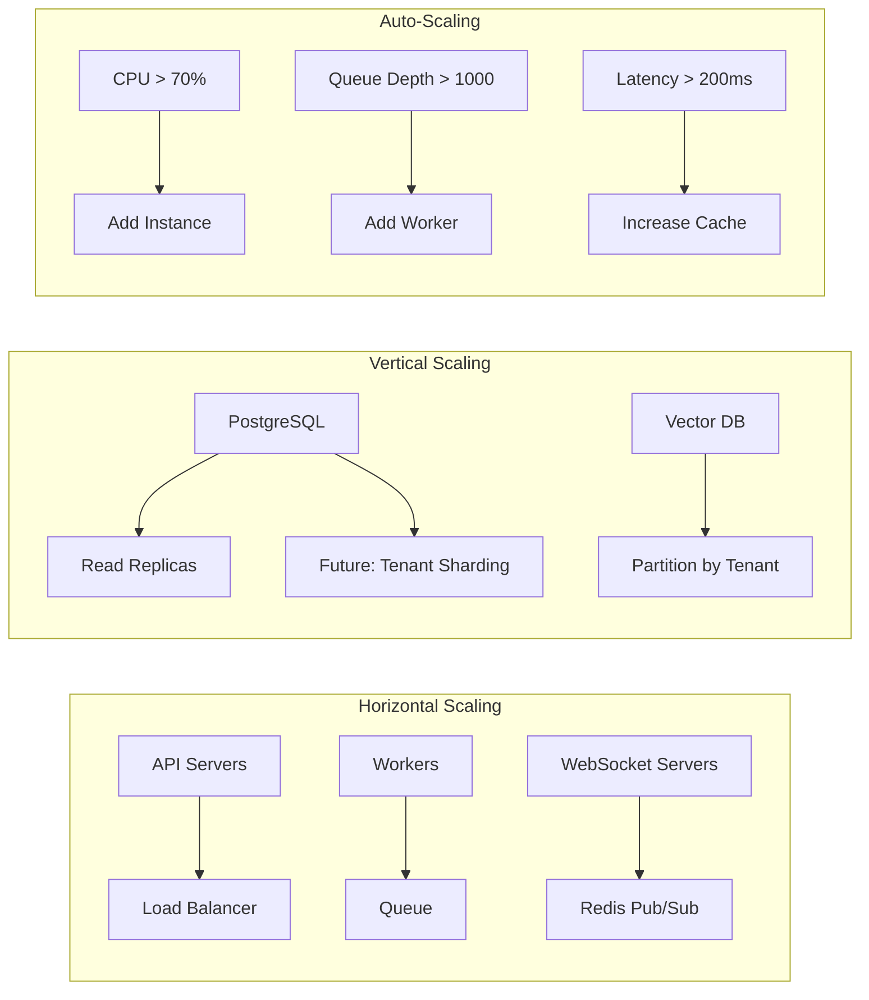

### Scaling Triggers

| Resource | Metric | Threshold | Action |
|----------|--------|-----------|--------|
| API Servers | CPU > 70% for 5min | Add 1 instance | Auto-scaling group |
| API Servers | Request latency p95 > 500ms | Add 2 instances | Auto-scaling group |
| Workers | Queue depth > 1000 jobs | Add 2 workers | KEDA / custom scaler |
| Workers | Job processing time > 5min | Add 2 workers | KEDA / custom scaler |
| PostgreSQL | CPU > 80% for 10min | Scale up instance + add read replica | Manual / Terraform |
| PostgreSQL | Storage > 80% | Scale storage | Auto (managed DB) |
| Redis | Memory > 80% | Scale up instance | Manual |
| S3 | — | Unlimited | Auto |

### Multi-Region Strategy

| Phase | Setup | RTO | RPO |
|-------|-------|-----|-----|
| **MVP** | Single region, daily backups | 4 hours | 24 hours |
| **Growth** | Single region, continuous replication, standby | 1 hour | 1 hour |
| **Enterprise** | Active-active (2 regions), global load balancer | 5 minutes | 0 (sync) |

---

## 25. Security Design

### Security Layers

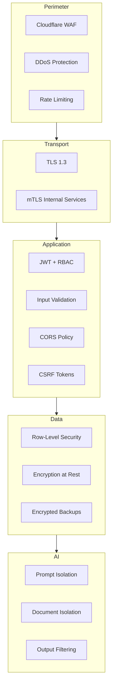

### Security Checklist

| Control | Implementation | Status |
|---------|---------------|--------|
| **HTTPS Only** | TLS 1.3, HSTS, certificate pinning | Required |
| **CORS** | Strict origin whitelist | Required |
| **CSRF** | Double-submit cookie pattern | Required |
| **XSS** | Content Security Policy, React auto-escape | Required |
| **SQL Injection** | Prisma ORM (parameterised queries) | Required |
| **NoSQL Injection** | Zod validation on all inputs | Required |
| **File Upload** | Type validation, size limits, virus scan (ClamAV) | Required |
| **Path Traversal** | S3 key validation, no user paths in filenames | Required |
| **Secrets** | HashiCorp Vault / AWS Secrets Manager | Required |
| **API Keys** | Scoped, rotated, rate-limited | Required |
| **Audit Logs** | Immutable, tamper-evident, 7-year retention | Enterprise |
| **Penetration Testing** | Annual third-party pentest | Enterprise |
| **Dependency Scanning** | Snyk / Dependabot on CI | Required |
| **Container Scanning** | Trivy on build | Required |
| **SAST** | SonarQube / CodeQL on CI | Required |
| **DAST** | OWASP ZAP on staging | Required |

### AI Security

| Risk | Mitigation |
|------|------------|
| **Prompt Injection** | Strict system prompt, input validation, output filtering |
| **Data Leakage** | Tenant-scoped vectors, no cross-tenant retrieval, no training on user data |
| **Hallucination** | Citation verification chain, confidence scores, user warning labels |
| **Jailbreak** | Input/output classifiers (OpenAI Moderation, Azure Content Safety) |
| **Model Provider Breach** | No PII in prompts, data processing agreements, SOC2 audit |

---

## 26. Deployment Design

### Deployment Architecture

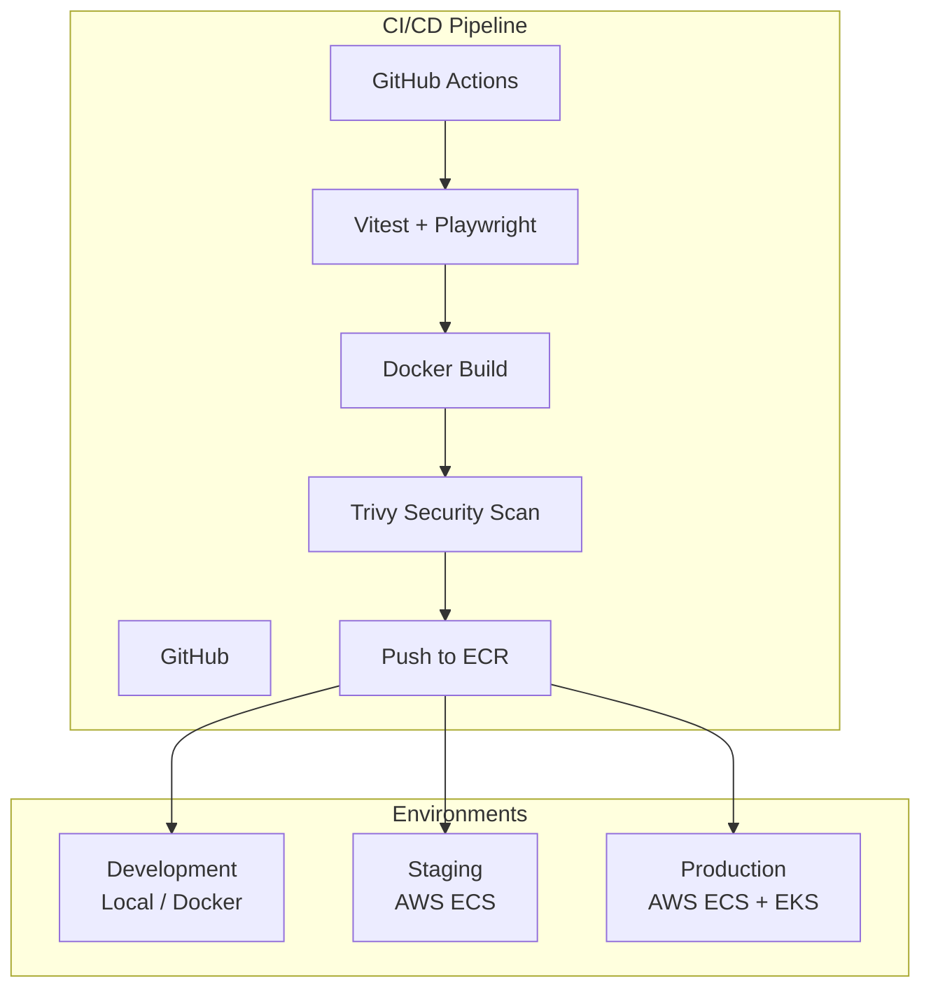

### Infrastructure as Code

| Layer | Tool | Purpose |
|-------|------|---------|
| **Cloud** | Terraform | AWS/Azure/GCP resources |
| **Kubernetes** | Helm + Kustomize | K8s manifests, secrets |
| **Containers** | Docker + Docker Compose | Local dev, CI builds |
| **Database** | Prisma Migrations | Schema versioning |
| **Config** | AWS Parameter Store / Consul | Environment variables |

### Docker Compose (MVP Local)

```yaml
# docker-compose.yml (MVP)
version: '3.8'
services:
  web:
    build: ./apps/web
    ports:
      - "3000:3000"
    depends_on:
      - api

  api:
    build: ./apps/api
    ports:
      - "4000:4000"
    environment:
      - DATABASE_URL=postgresql://postgres:postgres@db:5432/citemind
      - REDIS_URL=redis://redis:6379
      - S3_ENDPOINT=minio:9000
    depends_on:
      - db
      - redis
      - minio

  worker:
    build: ./apps/api
    command: npm run worker
    environment:
      - DATABASE_URL=postgresql://postgres:postgres@db:5432/citemind
      - REDIS_URL=redis://redis:6379
      - S3_ENDPOINT=minio:9000
    depends_on:
      - db
      - redis
      - minio

  db:
    image: ankane/pgvector:latest
    environment:
      - POSTGRES_USER=postgres
      - POSTGRES_PASSWORD=postgres
      - POSTGRES_DB=citemind
    volumes:
      - pgdata:/var/lib/postgresql/data

  redis:
    image: redis:7-alpine

  minio:
    image: minio/minio
    command: server /data --console-address ":9001"
    environment:
      - MINIO_ROOT_USER=minio
      - MINIO_ROOT_PASSWORD=minio123
    volumes:
      - miniodata:/data

volumes:
  pgdata:
  miniodata:
```

### Production Deployment (AWS)

| Component | AWS Service | Configuration |
|-----------|-------------|---------------|
| **CDN** | CloudFront | Global edge, HTTPS, S3 origin |
| **WAF** | AWS WAF | OWASP rules, rate limiting, bot control |
| **API Gateway** | API Gateway v2 | HTTP APIs, JWT authorizer, throttling |
| **Web App** | S3 + CloudFront | Static hosting, cache policies |
| **API Servers** | ECS Fargate | 2-10 tasks, auto-scaling |
| **Workers** | ECS Fargate | 2-20 tasks, queue-based scaling |
| **WebSocket** | AppSync / ECS | Real-time connections |
| **Database** | RDS PostgreSQL 15 | Multi-AZ, pgvector, read replicas |
| **Vector DB** | RDS pgvector (MVP) / Pinecone | HNSW index |
| **Cache** | ElastiCache Redis 7 | Cluster mode, 2 shards |
| **Queue** | ElastiCache Redis (BullMQ) | — |
| **Storage** | S3 | Versioning, lifecycle, encryption |
| **Search** | OpenSearch (future) / pgvector | Full-text + vector hybrid |
| **Auth** | Cognito / Clerk | SSO, MFA, SAML |
| **Secrets** | AWS Secrets Manager | Rotation, encryption |
| **Logs** | CloudWatch Logs | 30-day retention |
| **Metrics** | CloudWatch Metrics | Custom dashboards |
| **Tracing** | X-Ray / OpenTelemetry | Distributed tracing |
| **Alerting** | SNS + PagerDuty | Critical alerts |
| **CI/CD** | GitHub Actions → ECR → ECS | Blue-green deployment |

---

## Appendix A: Sequence Diagram — AI Chat Workflow

```mermaid
sequenceDiagram
    autonumber
    participant User
    participant Web as Web App
    participant API as API Server
    participant Auth as Auth Service
    participant AI as AI Worker
    participant LLM as LLM Provider
    participant DB as PostgreSQL
    participant VDB as Vector DB
    participant Redis as Redis

    User->>Web: Type question in chat panel
    Web->>Web: Build context: selected documents, annotations
    Web->>API: POST /api/chat/:id/messages
    { content: "What are the main findings?", context: { documentIds: [...] } }

    API->>Auth: Verify JWT
    Auth-->>API: { userId, tenantId, permissions }

    API->>DB: Save user message (role: user)
    API->>Redis: Publish "ai.job" to queue
    API-->>Web: 202 Accepted + message ID

    Web->>Web: Show streaming placeholder

    Redis->>AI: Dequeue job
    AI->>VDB: Semantic search: query embedding + tenant filter
    VDB-->>AI: Relevant chunks (top 10)

    AI->>DB: Fetch conversation history (last 10 messages)
    DB-->>AI: Messages

    AI->>AI: Assemble prompt with context
    Note over AI: System prompt + Retrieved chunks + History + User question

    AI->>LLM: POST /chat/completions (streaming)
    LLM-->>AI: SSE stream (tokens)

    loop Each token chunk
        AI->>Redis: Stream token to WebSocket room
        Redis->>Web: Forward token via SSE
        Web->>Web: Append token to message
    end

    AI->>AI: Extract citations from response
    AI->>DB: Save assistant message with citations
    AI->>DB: Update conversation title (if first message)
    AI->>Redis: Publish "job.complete"
    Redis->>Web: Final message + done signal

    Web->>User: Display complete response with inline citations
```

---

## Appendix B: Sequence Diagram — Annotation Workflow

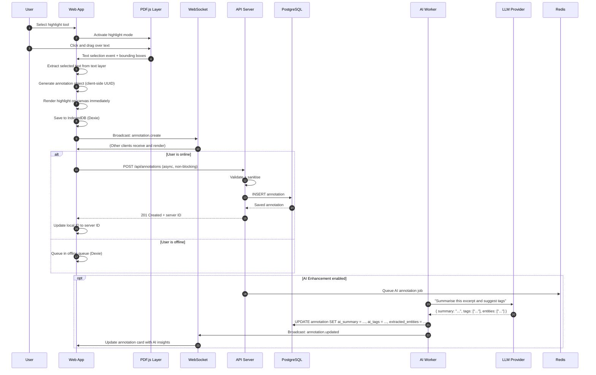

---

## Appendix C: Entity Relationship Diagram

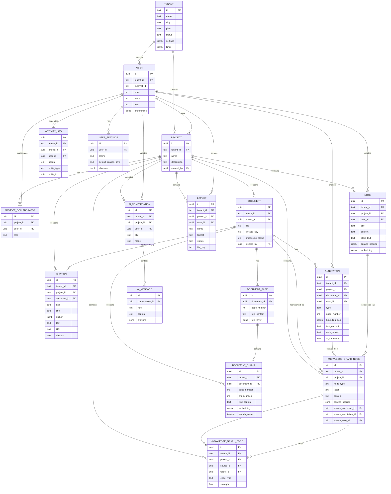

---

## Appendix D: Data Flow Diagram

```mermaid
flowchart TB
    subgraph Sources["Data Sources"]
        UPLOAD[User Upload<br/>PDF, Image, URL]
        IMPORT[Import<br/>Zotero, Mendeley, BibTeX]
        CLIP[Web Clipper<br/>Browser extension]
    end

    subgraph Ingestion["Ingestion Layer"]
        PARSE[PDF Parser<br/>pdf-lib + Poppler]
        OCR[OCR Engine<br/>Tesseract + Azure]
        META[Metadata Extractor<br/>CrossRef + DOI]
    end

    subgraph Processing["Processing Layer"]
        CHUNK[Text Chunker<br/>Recursive + Semantic]
        EMBED[Embedding Generator<br/>OpenAI / Local]
        INDEX[Indexer<br/>pgvector + tsvector]
        EXTRACT[Entity Extractor<br/>LLM + SpaCy]
    end

    subgraph Storage["Storage Layer"]
        S3[(Object Storage<br/>S3 / MinIO)]
        PG[(PostgreSQL<br/>Relational + Vector)]
        REDIS[(Redis<br/>Cache + Queue)]
        IDX[(IndexedDB<br/>Client Cache)]
    end

    subgraph Consumption["Consumption Layer"]
        VIEWER[Document Viewer<br/>PDF.js + Annotations]
        CHAT[AI Chat<br/>RAG + Streaming]
        SEARCH[Search<br/>Hybrid Semantic + Lexical]
        GRAPH[Knowledge Graph<br/>React Flow + d3]
        BOARD[Research Board<br/>Infinite Canvas]
        EXPORT[Export Engine<br/>Puppeteer + Pandoc]
    end

    UPLOAD --> PARSE
    IMPORT --> META
    CLIP --> PARSE
    PARSE --> CHUNK
    OCR --> CHUNK
    META --> PG
    CHUNK --> EMBED
    CHUNK --> INDEX
    EMBED --> INDEX
    EXTRACT --> GRAPH
    PARSE --> S3
    INDEX --> PG
    PG --> REDIS
    PG --> IDX
    S3 --> VIEWER
    PG --> VIEWER
    PG --> CHAT
    PG --> SEARCH
    PG --> GRAPH
    PG --> BOARD
    PG --> EXPORT
    REDIS --> CHAT
    REDIS --> EXPORT
    IDX --> VIEWER
    IDX --> BOARD
```

---

## Appendix E: Security Flow Diagram

```mermaid
flowchart TB
    subgraph Client["Client"]
        BROWSER[Browser]
        PWA[PWA / Service Worker]
        IDX[IndexedDB
        Local Cache]
    end

    subgraph Edge["Edge Layer"]
        CDN[CDN
        Cloudflare / AWS]
        WAF[WAF
        OWASP Rules]
        DDoS[DDoS Protection]
    end

    subgraph Gateway["Gateway Layer"]
        LB[Load Balancer
        TLS 1.3]
        RATE[Rate Limiter
        Redis-backed]
    end

    subgraph Application["Application Layer"]
        AUTH[JWT Verification
        Clerk / Auth0]
        RBAC[RBAC Middleware
        Role Check]
        TENANT[Tenant Isolation
        RLS Policies]
        INPUT[Input Validation
        Zod Schemas]
        AUDIT[Audit Logger
        Activity Log]
    end

    subgraph AI["AI Layer"]
        PROMPT[Prompt Builder
        Tenant Context]
        ISOLATE[Document Isolation
        Vector Filter]
        FILTER[Output Filter
        Moderation API]
    end

    subgraph Data["Data Layer"]
        PG[(PostgreSQL
        AES-256 at Rest)]
        S3[(S3 / MinIO
        Server-Side Encryption)]
        REDIS[(Redis
        TLS + Auth)]
    end

    BROWSER --> CDN
    PWA --> CDN
    CDN --> WAF --> DDoS --> LB
    LB --> RATE --> AUTH
    AUTH --> RBAC --> TENANT
    TENANT --> INPUT --> AUDIT
    AUDIT --> PG
    AUDIT --> S3
    INPUT --> PROMPT
    PROMPT --> ISOLATE --> FILTER
    FILTER --> PG
    FILTER --> REDIS
    PG --> S3
```

---

## Document History

| Version | Date | Author | Changes |
|---------|------|--------|---------|
| 1.0 | 2025-07-26 | Technical Architecture Agent | Initial comprehensive TDD |

---

*End of Technical Design Document*
