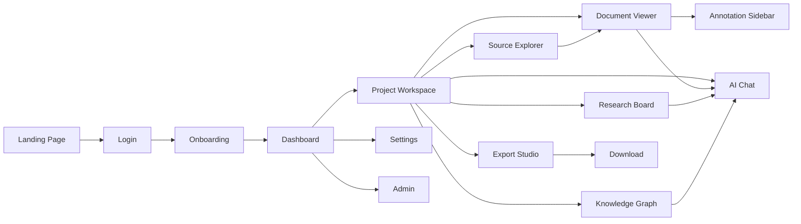
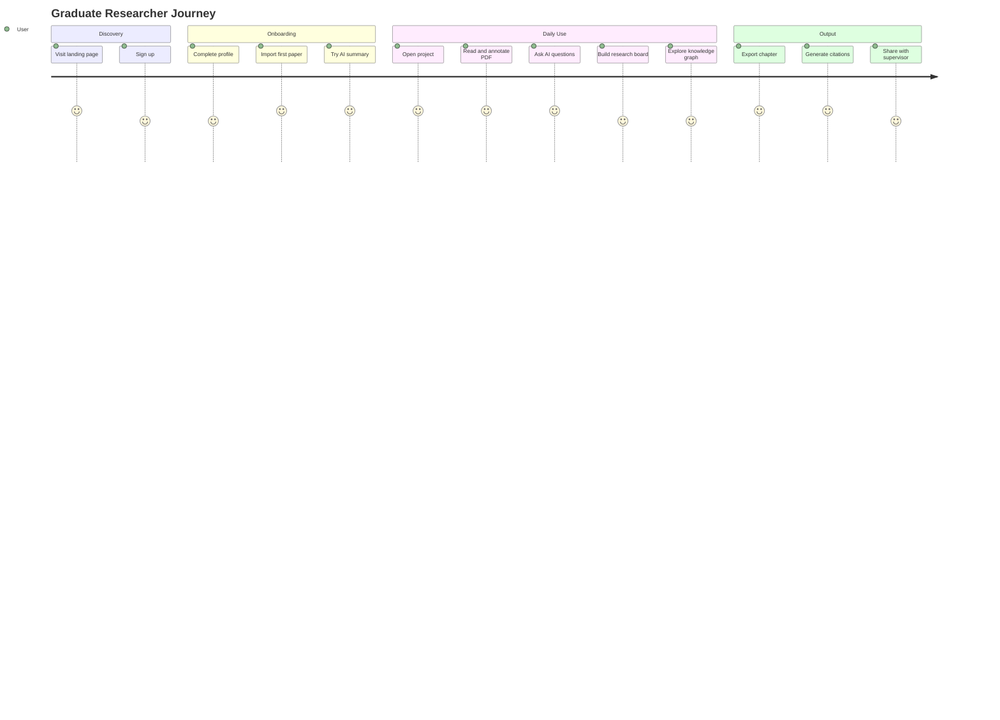
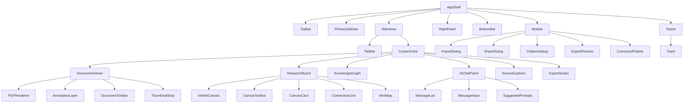
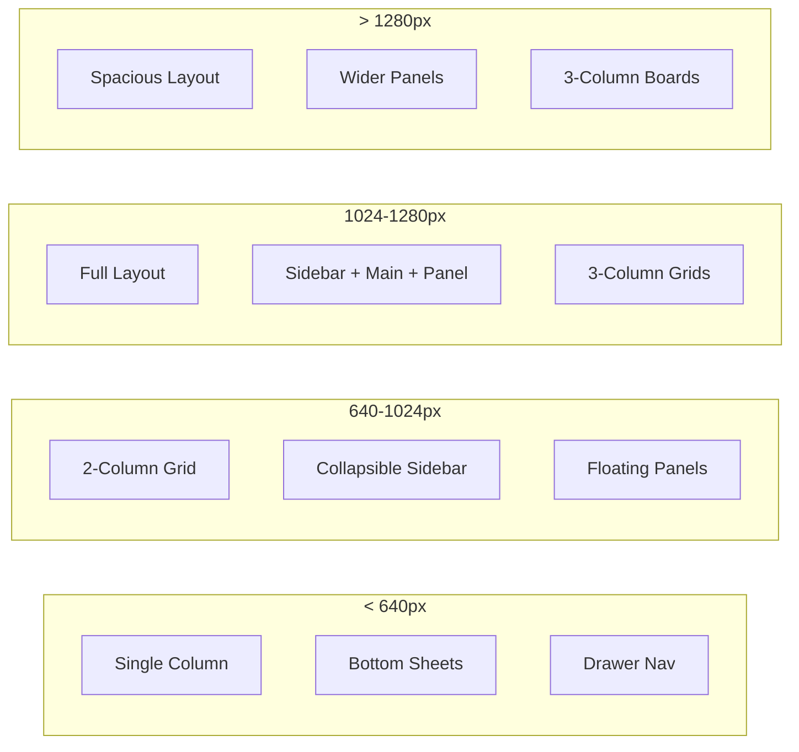

# CiteMind — UI/UX Design Document

> **Version**: 1.0  
> **Date**: 2025-08-01  
> **Designer**: UI/UX Design Agent  
> **Project**: CiteMind — AI-Powered Research Notebook & Document Intelligence Workspace  
> **Status**: Draft for engineering handoff

---

## Table of Contents

1. [Design Vision & Principles](#1-design-vision--principles)
2. [Information Architecture](#2-information-architecture)
3. [Main Navigation Structure](#3-main-navigation-structure)
4. [Screen List](#4-screen-list)
5. [Wireframe Descriptions](#5-wireframe-descriptions)
6. [UI Component List](#6-ui-component-list)
7. [Design System](#7-design-system)
8. [Colour Palette](#8-colour-palette)
9. [Typography](#9-typography)
10. [Empty States](#10-empty-states)
11. [Loading States](#11-loading-states)
12. [Error States](#12-error-states)
13. [Onboarding Flow](#13-onboarding-flow)
14. [Power User Shortcuts](#14-power-user-shortcuts)
15. [Accessibility Rules](#15-accessibility-rules)
16. [Responsive Design Strategy](#16-responsive-design-strategy)
17. [Animation & Motion Guidelines](#17-animation--motion-guidelines)
18. [Appendix: Mermaid Diagrams](#appendix-mermaid-diagrams)

---

## 1. Design Vision & Principles

### 1.1 Design Vision

CiteMind is a **premium research cockpit** — not a generic CRUD app. It should feel like stepping into the command centre of a serious knowledge worker: dark-mode-friendly, high information density, clear visual hierarchy, minimal chrome, maximum content. The interface should reward deep work, not shallow browsing.

**Design Inspiration Matrix**:

| Source | What We Adopt | What We Avoid |
|--------|--------------|---------------|
| **LiquidText** | Spatial freedom, fluid document manipulation, annotation-driven reading | iOS-only limitation, no AI integration |
| **Obsidian** | Speed, keyboard-centric workflow, backlinking, graph view | Steep learning curve, plugin dependency |
| **Heptabase** | Visual clarity, card-based thinking, infinite canvas | Immature AI, weak export |
| **Notion** | Polish, block-based editing, collaboration UX | Surface-level PDF, slow at scale |
| **Modern AI Tools** (ChatGPT, Claude) | Conversational interfaces, contextual suggestions, clean chat panels | Generic responses, no document grounding |
| **Zotero** | Citation-native workflow, metadata richness | Dated UX, no visual workspace |

### 1.2 Core Design Principles

| Principle | Description | Application |
|-----------|-------------|-------------|
| **P1. Content-First Chrome** | UI chrome (menus, toolbars, sidebars) should recede. Content — documents, notes, graphs — should dominate. | Minimal top bar; collapsible sidebars; full-bleed document viewer; floating action bars that appear on interaction. |
| **P2. Contextual Intelligence** | AI features should appear *in context* — where the user is working, not in a separate panel. | AI chat slides from document selection; suggested connections appear near highlights; smart citations appear inline. |
| **P3. Spatial Memory** | Users should be able to arrange their workspace spatially and return to it. | Infinite canvas research board; persistent workspace layouts; zoom/pan on knowledge graphs. |
| **P4. Progressive Disclosure** | Show the minimum necessary by default; reveal depth on demand. | Simple annotation tools visible; advanced AI features in expandable drawers; export options in nested menus. |
| **P5. Keyboard Sovereignty** | Every action should be accessible via keyboard for power users. | Comprehensive shortcuts; vim-like navigation modes; command palette (Cmd+K). |
| **P6. Feedback Without Noise** | Every user action should receive clear, immediate feedback — but never be intrusive. | Subtle toast notifications; inline validation; progress indicators on long operations; haptic-style visual cues. |
| **P7. Dark-Mode Native** | The interface is designed for dark mode first; light mode is an adaptation. | Colour palette optimised for dark backgrounds; reduced eye strain for long reading sessions; OLED-friendly pure blacks optional. |

---

## 2. Information Architecture

### 2.1 Site Map

```
CiteMind
├── Marketing (unauthenticated)
│   ├── Landing Page
│   ├── Pricing
│   ├── Features
│   ├── Use Cases
│   └── Changelog
├── Authentication
│   ├── Login
│   ├── Sign Up
│   ├── Password Reset
│   ├── OAuth Callback
│   └── Onboarding Wizard
├── Dashboard (authenticated)
│   ├── Project Overview
│   ├── Recent Activity
│   ├── Quick Actions
│   └── Templates Gallery
├── Project Workspace
│   ├── Document Viewer (PDF with annotations)
│   ├── Annotation Sidebar
│   ├── AI Chat Panel
│   ├── Research Board (infinite canvas)
│   ├── Knowledge Graph View
│   ├── Source Explorer (document library)
│   ├── Notes & Outliner
│   └── Export Studio
├── Settings
│   ├── Profile
│   ├── Account & Billing
│   ├── Preferences (theme, density, shortcuts)
│   ├── Notifications
│   ├── Integrations (Zotero, Mendeley, Notion, etc.)
│   └── AI Settings (model preferences, API keys)
├── Admin (enterprise)
│   ├── User Management
│   ├── Team Settings
│   ├── Security Policies
│   ├── Audit Logs
│   └── Billing
└── Help
    ├── Getting Started
    ├── Keyboard Shortcuts
    ├── Tutorials
    ├── Feedback
    └── Support Chat
```

### 2.2 Content Hierarchy

```
Level 0: App Shell (navigation, status bar, global search)
Level 1: Workspace Layout (sidebar, main area, right panel)
Level 2: Document / Canvas / List (primary content)
Level 3: Overlays & Modals (dialogs, drawers, popovers)
Level 4: Notifications & Toasts (transient feedback)
```

### 2.3 Navigation Patterns

| Pattern | Usage | Example |
|---------|-------|---------|
| **Persistent Sidebar** | Primary navigation between major sections | Left sidebar: Projects, Sources, Graph, Board, Settings |
| **Collapsible Panel** | Secondary tools that toggle visibility | Right panel: AI Chat, Annotations, Outline |
| **Tab Bar** | Switching between views of the same object | Document tabs: Reader, Notes, AI Chat, Related |
| **Breadcrumb** | Deep navigation within hierarchical content | Project > Document > Section > Annotation |
| **Command Palette** | Universal search & action launcher | Cmd+K → "export as docx" |
| **Floating Toolbar** | Contextual tools near the cursor | Annotation tools appear on text selection |
| **Bottom Sheet** | Mobile-friendly action panels | Export options on mobile |

---

## 3. Main Navigation Structure

### 3.1 Primary Sidebar (Left)

```
┌─────────────────┐
│  🧠 CiteMind    │  ← Logo + Home
├─────────────────┤
│  🔍 Search...   │  ← Global search (Cmd+K)
├─────────────────┤
│  📁 Projects    │  ← Project list (expandable)
│    ├─ Thesis    │
│    ├─ Legal Case│
│    └─ R&D Q3    │
│                 │
│  📚 Sources     │  ← Document library
│  🕸️ Graph       │  ← Knowledge graph view
│  🎨 Board       │  ← Research board (canvas)
│  💬 AI Chat     │  ← AI assistant panel
│                 │
│  ⚙️ Settings    │  ← User preferences
│  🆘 Help        │  ← Documentation
├─────────────────┤
│  👤 Profile     │  ← Account menu
└─────────────────┘
```

**Behaviour**:
- Width: 240px (default), collapsible to 64px (icon-only)
- Collapse trigger: Pin icon or hover-edge on narrow screens
- Active state: Subtle left border accent + background tint
- Hover: Slight background elevation
- Keyboard: `Ctrl/Cmd+Shift+B` to toggle

### 3.2 Secondary Panel (Right)

Context-dependent panel that switches based on active workspace:

| Workspace | Right Panel Content |
|-----------|---------------------|
| Document Viewer | AI Chat, Annotations, Outline |
| Research Board | Inspector, Card Properties, AI Suggestions |
| Knowledge Graph | Node Details, Filter Controls, Layout Options |
| Source Explorer | Document Preview, Metadata, Tags |

**Behaviour**:
- Width: 320px (default), resizable (240px–480px)
- Toggle: Button in top toolbar or `Ctrl/Cmd+Shift+R`
- Can be detached as floating window (desktop only)

### 3.3 Top Bar

```
┌─────────────────────────────────────────────────────────────┐
│  ← →  │  Project Name  ▼  │  Breadcrumb: Doc > Section    │  🔍  │  🔔  │  👤  │
└─────────────────────────────────────────────────────────────┘
```

**Elements**:
- Navigation arrows (back/forward history)
- Project selector dropdown
- Breadcrumb trail (clickable)
- Global search button
- Notification bell with badge
- User avatar menu

**Height**: 48px
**Style**: Subtle border-bottom, slightly elevated background

---

## 4. Screen List

### 4.1 Marketing Screens

| Screen | Route | Description |
|--------|-------|-------------|
| Landing Page | `/` | Hero, feature grid, social proof, CTA |
| Pricing | `/pricing` | Tier comparison, FAQ, enterprise CTA |
| Features | `/features` | Detailed feature walkthrough |
| Use Cases | `/use-cases` | Persona-specific landing pages |
| Changelog | `/changelog` | Release notes, roadmap |

### 4.2 Authentication Screens

| Screen | Route | Description |
|--------|-------|-------------|
| Login | `/login` | Email/password, OAuth options, MFA |
| Sign Up | `/signup` | Registration, plan selection, verification |
| Password Reset | `/reset-password` | Email flow, token validation |
| OAuth Callback | `/auth/callback` | Post-OAuth redirect handler |
| Onboarding Wizard | `/onboarding` | 4-step setup (see §13) |

### 4.3 Core Application Screens

| Screen | Route | Description | Priority |
|--------|-------|-------------|----------|
| Dashboard | `/dashboard` | Project overview, recent activity, quick start | P0 |
| Project Workspace | `/project/:id` | Main working area with tabs | P0 |
| Document Viewer | `/project/:id/doc/:docId` | PDF reader with annotation layer | P0 |
| Annotation Sidebar | `/project/:id/doc/:docId/annotations` | List of highlights, notes, tags | P0 |
| AI Chat Panel | `/project/:id/chat` | Conversational AI interface | P0 |
| Research Board | `/project/:id/board` | Infinite canvas with cards | P0 |
| Knowledge Graph | `/project/:id/graph` | Visual network of concepts | P0 |
| Source Explorer | `/project/:id/sources` | Document library with filters | P0 |
| Notes & Outliner | `/project/:id/notes` | Hierarchical note editor | P0 |
| Export Studio | `/project/:id/export` | Format selection, preview, download | P1 |
| Settings | `/settings` | User preferences, account, integrations | P0 |
| Admin Panel | `/admin` | Enterprise user/team management | P2 |

### 4.4 Modal & Overlay Screens

| Screen | Trigger | Description |
|--------|---------|-------------|
| Import Dialog | "Import" button | File upload, URL, integration import |
| Share Dialog | "Share" button | Link generation, permissions, embed |
| Citation Dialog | "Cite" button | Citation format selection, bibliography preview |
| AI Prompt Builder | AI panel menu | Custom prompt creation, template selection |
| Export Preview | Export studio | Live preview of output before download |
| Keyboard Shortcuts | `?` key | Cheat sheet overlay |
| Command Palette | `Cmd+K` | Universal search & action launcher |
| Notification Drawer | Bell icon | Recent notifications, activity feed |

---

## 5. Wireframe Descriptions

### 5.1 Landing Page

**Layout**: Full-width, single-page scroll with sections.

```
┌────────────────────────────────────────────┐
│  🧠 CiteMind              Features Pricing  │
├────────────────────────────────────────────┤
│                                            │
│     The AI Research Notebook               │
│     for Serious Thinkers                   │
│                                            │
│     Read. Annotate. Connect. Synthesize.   │
│     [ Start Free → ]  [ See Demo ▶ ]       │
│                                            │
│     ┌─────────────────────────────────┐   │
│     │  [Hero Screenshot / Animation]  │   │
│     └─────────────────────────────────┘   │
│                                            │
├────────────────────────────────────────────┤
│  Trusted by researchers at: [MIT] [Stanford│
│  [Oxford] [Google Research] [McKinsey]      │
├────────────────────────────────────────────┤
│  Feature Grid (6 cards)                    │
├────────────────────────────────────────────┤
│  How It Works (3-step process)             │
├────────────────────────────────────────────┤
│  Use Cases (4 persona cards)                 │
├────────────────────────────────────────────┤
│  Pricing Tiers                             │
├────────────────────────────────────────────┤
│  Testimonials / Social Proof               │
├────────────────────────────────────────────┤
│  CTA Banner                                │
├────────────────────────────────────────────┤
│  Footer                                    │
└────────────────────────────────────────────┘
```

**Key Elements**:
- **Hero**: Dark gradient background, large serif heading ("The AI Research Notebook"), subheading in sans-serif, two CTAs (primary: filled button, secondary: ghost with play icon).
- **Hero Visual**: Animated screenshot or video showing the workspace — document on left, AI chat on right, annotations visible.
- **Feature Grid**: 6 cards (2×3 on desktop, 1×6 on mobile) with icon, title, and 2-line description. Icons are line-art, subtle colour.
- **Trust Bar**: Greyscale logos of institutions, hover reveals colour.
- **Pricing**: 3 cards (Free, Pro, Team) with feature checklists, highlighted middle card.
- **CTA Banner**: Full-width, dark background, "Ready to rethink your research?" with email capture.

**Dark mode**: Landing page respects system preference; hero is dark by default.

---

### 5.2 Login / Sign Up

**Layout**: Split screen on desktop, stacked on mobile.

```
┌────────────────────────┬────────────────────────┐
│                        │                        │
│  🧠 CiteMind           │  ┌──────────────────┐ │
│                        │  │  Sign In          │ │
│  "The best research    │  │                  │ │
│   tool I've ever       │  │  [Email         ] │ │
│   used."               │  │  [Password     ] │ │
│                        │  │  [Sign In →]     │ │
│  — Dr. Sarah Chen,     │  │                  │ │
│    MIT                 │  │  ─── or ───      │ │
│                        │  │  [G] [A] [M]     │ │
│  [Testimonial carousel]│  │                  │ │
│                        │  │  No account?     │ │
│                        │  │  [Create one]    │ │
│                        │  └──────────────────┘ │
│                        │                        │
└────────────────────────┴────────────────────────┘
```

**Left Panel**:
- Brand logo (top-left)
- Large testimonial quote (serif font, 24px)
- Attribution with avatar
- Dot indicators for carousel
- Background: subtle gradient or abstract pattern

**Right Panel**:
- Card container with shadow
- Tab switcher: "Sign In" / "Sign Up"
- Input fields: Email, Password (with visibility toggle)
- Sign In button (full width, primary colour)
- "Forgot password?" link
- Divider with "or"
- OAuth buttons: Google, Apple, Microsoft (icon + text)
- Bottom text: "No account? [Create one]" (link)

**Sign Up variant**:
- Additional fields: Full Name, Confirm Password
- Plan selection toggle (if applicable)
- Terms checkbox with link
- "Create Account" button
- "Already have an account? [Sign in]"

**States**:
- Loading: Button shows spinner, inputs disabled
- Error: Inline validation messages, red border on invalid fields
- Success: Auto-redirect to onboarding or dashboard

---

### 5.3 Dashboard (Project Overview)

**Layout**: Three-column grid on desktop, single column on mobile.

```
┌─────────────────────────────────────────────────────────────┐
│  🧠 CiteMind    │  Search... │  🔔 │  👤                 │
├──────────┬──────────────────────────────────────────────────┤
│          │  ┌────────────────────────────────────────────┐  │
│  📁      │  │  Welcome back, Dr. Chen 👋                │  │
│  Projects│  │  You have 3 active projects.             │  │
│  📚      │  │  [Continue Thesis] [New Project +]        │  │
│  🕸️      │  └────────────────────────────────────────────┘  │
│  🎨      │                                                  │
│  💬      │  ┌──────────────┐ ┌──────────────┐ ┌──────────┐ │
│  ⚙️      │  │ 📄 Thesis   │ │ ⚖️ Legal Case│ │ 🔬 R&D   │ │
│          │  │ 12 docs      │ │ 8 docs       │ │ 5 docs   │ │
│          │  │ Updated 2h   │ │ Updated 1d   │ │ Updated 3d│ │
│          │  │ [Open →]     │ │ [Open →]     │ │ [Open →] │ │
│          │  └──────────────┘ └──────────────┘ └──────────┘ │
│          │                                                  │
│          │  Recent Activity                                 │
│          │  ┌────────────────────────────────────────────┐  │
│          │  │ 📝  Highlighted "Methods" in Paper 3      │  │
│          │  │ 🤖  AI summarized 3 documents              │  │
│          │  │ 🔗  Connected "Neural Nets" to "Deep Learning│  │
│          │  │ 📤  Exported "Thesis Chapter 1" as .docx  │  │
│          │  └────────────────────────────────────────────┘  │
│          │                                                  │
│          │  Quick Start Templates                           │
│          │  ┌────────┐ ┌────────┐ ┌────────┐ ┌────────┐    │
│          │  │ 📚 Lit │ │ ⚖️ Legal│ │ 🧪 Lab │ │ 📊 Market│  │
│          │  │ Review │ │ Brief │ │ Report │ │ Analysis │  │
│          │  └────────┘ └────────┘ └────────┘ └────────┘    │
│          │                                                  │
└──────────┴──────────────────────────────────────────────────┘
```

**Key Elements**:
- **Welcome Banner**: Personalized greeting, quick action buttons (continue most recent project, create new).
- **Project Cards**: Thumbnail preview (first page or canvas snapshot), title, document count, last updated, "Open" button. Hover reveals quick actions (star, share, delete).
- **Recent Activity**: Chronological feed of actions across all projects. Each item has icon, description, timestamp, and project link.
- **Quick Start Templates**: 4-card grid of pre-configured project templates with descriptions on hover.

**Empty State** (first visit):
- Welcome banner expanded with tutorial video
- "Create Your First Project" CTA prominent
- Template gallery more prominent
- No activity feed; instead: "Your activity will appear here."

---

### 5.4 Project Workspace (Main Working Area)

**Layout**: Tab-based workspace with persistent sidebar.

```
┌─────────────────────────────────────────────────────────────┐
│  ← →  │  Thesis Research  ▼  │  Doc > Section            │  🔍 │  🔔 │  👤 │
├──────────┬──────────────────────────────────────┬────────┤
│          │  [Reader] [Board] [Graph] [Notes] [AI] │        │
│  📁      │  ────────────────────────────────────│  💬 AI │
│  Sources │                                       │  Chat  │
│  📄 Doc1 │  ┌─────────────────────────────────┐  │        │
│  📄 Doc2 │  │                                 │  │  🤖  │
│  📄 Doc3 │  │     PDF Document Viewer         │  │ ──── │
│  📄 Doc4 │  │                                 │  │ What │
│  📄 Doc5 │  │  [Page 1 of 42]                 │  │ can  │
│          │  │                                 │  │ I    │
│  🎨 Board│  │  ┌───────────────────────────┐  │  │ help │
│  🕸️ Graph│  │  │                           │  │  │ you  │
│  📝 Notes│  │  │   PDF content area with   │  │  │ with?│
│          │  │  │   text selection,         │  │  │      │
│          │  │  │   highlight overlays,     │  │  │  [Type│
│          │  │  │   annotation pins         │  │  │   here│
│          │  │  │                           │  │  │   ...]│
│          │  │  └───────────────────────────┘  │  │      │
│          │  │                                 │  │      │
│          │  │  ┌──────┐ ┌──────┐ ┌──────┐   │  │      │
│          │  │  │ Prev │ │ Page │ │ Next │   │  │      │
│          │  │  └──────┘ └──────┘ └──────┘   │  │      │
│          │  └─────────────────────────────────┘  │      │
│          │                                       │      │
└──────────┴──────────────────────────────────────┴────────┘
```

**Tab Bar**:
- Horizontal tabs below the top bar
- Tabs: Reader (default), Board, Graph, Notes, AI Chat
- Each tab has its own layout but shares the left sidebar
- Right panel content changes per tab

**Left Sidebar** (project-specific):
- Sources list: Documents in the project, draggable, with status indicators (unread, annotated, AI-processed)
- Quick nav: Board, Graph, Notes (mirror of tabs)
- Collapsible sections

**Right Panel** (contextual):
- **Reader tab**: AI Chat, Annotations, Outline
- **Board tab**: Inspector, Card Properties, AI Suggestions
- **Graph tab**: Node Details, Filter Controls, Layout Options
- **Notes tab**: Backlinks, Outline, Tag Cloud

---

### 5.5 Document Viewer (PDF with Annotations)

**Layout**: Full-bleed PDF viewer with overlay annotation layer and floating toolbar.

```
┌─────────────────────────────────────────────────────────────┐
│  ← →  │  Paper: Neural Networks... │  🔍 │  🔔 │  👤 │
├─────────────────────────────────────────────────────────────┤
│  ┌─────────────────────────────────────────────────────┐  │
│  │  [PDF Toolbar]                                      │  │
│  │  Zoom: [100% ▼]  │  Page: [ 5 / 42 ]  │  🔍  🖊️  📌  │  │
│  ├─────────────────────────────────────────────────────┤  │
│  │                                                     │  │
│  │  ┌─────────────────────────────────────────────┐   │  │
│  │  │  ┌─────────────────────────────────────┐    │   │  │
│  │  │  │  Title: Neural Networks in...     │    │   │  │
│  │  │  │  Author: Smith et al.             │    │   │  │
│  │  │  │                                     │    │   │  │
│  │  │  │  Abstract                           │    │   │  │
│  │  │  │  [highlighted text ─────────────]  │    │   │  │
│  │  │  │  │  This paper proposes...        │  │    │   │  │
│  │  │  │  └─────────────────────────────────┘  │    │   │  │
│  │  │  │                                     │    │   │  │
│  │  │  │  ┌──┐                               │    │   │  │
│  │  │  │  │📝│  "Key insight: use of attention│    │   │  │
│  │  │  │  └──┘  mechanism"                 │    │   │  │
│  │  │  │                                     │    │   │  │
│  │  │  │  1. Introduction                    │    │   │  │
│  │  │  │  [selected text ─────────────────]  │    │   │  │
│  │  │  │  │ The field of...                │  │    │   │  │
│  │  │  │  └─────────────────────────────────┘  │    │   │  │
│  │  │  │         ┌────────────────────────┐   │    │   │  │
│  │  │  │         │ 🖊️ Highlight  │ 💬 Note │   │    │   │  │
│  │  │  │         │ 🏷️ Tag       │ 🤖 Ask   │   │    │   │  │
│  │  │  │         └────────────────────────┘   │    │   │  │
│  │  │  └─────────────────────────────────────┘    │   │  │
│  │  │                                             │   │  │
│  │  │  ┌──────┐ ┌──────┐ ┌──────┐              │   │  │
│  │  │  │ Prev │ │ Page │ │ Next │              │   │  │
│  │  │  └──────┘ └──────┘ └──────┘              │   │  │
│  │  └─────────────────────────────────────────────┘   │  │
│  │                                                     │  │
│  │  [Thumbnail strip: 1 2 3 4 5 6 7 8 9...]           │  │
│  └─────────────────────────────────────────────────────┘  │
│                                                           │
│  ┌─────────────────┐                                      │
│  │ AI Suggestion   │  ← Floating suggestion chip           │
│  │ "Summarise this│     (appears near cursor on selection)  │
│  │  section?"     │                                      │
│  └─────────────────┘                                      │
└─────────────────────────────────────────────────────────────┘
```

**PDF Toolbar** (sticky top of viewer):
- Zoom controls: `-` / `+` / dropdown (`Fit Width`, `Fit Page`, `200%`)
- Page navigation: input field + `/ total` + arrows
- Search in document: magnifying glass icon
- Annotation mode toggle: pen icon
- Bookmark current page: pin icon

**Annotation Layer**:
- Overlays on top of PDF render (SVG or Canvas)
- Highlights: translucent coloured rectangles behind text
- Notes: small icon pins that expand on hover/click
- Selection popup: appears on text selection with 4 options (Highlight, Note, Tag, Ask AI)
- Drawn annotations: freehand pen, underline, strikethrough

**Thumbnail Strip** (bottom, collapsible):
- Horizontal scrollable strip of page thumbnails
- Current page highlighted with border
- Pages with annotations marked with dot indicator
- Click to jump to page

**Floating Context Menu** (on text selection):
```
┌─────────────────────────────┐
│  🖊️ Highlight   │  💬 Note   │
│  🏷️ Tag        │  🤖 Ask AI │
└─────────────────────────────┘
```
- Positioned near the selection, flips to avoid viewport edges
- Disappears on click outside or `Escape`

**Annotation Sidebar** (right panel, when open):
```
┌─────────────────────┐
│ Annotations        ✕ │
├─────────────────────┤
│ 🔍 Search annotations│
├─────────────────────┤
│ Filter: [All ▼]     │
├─────────────────────┤
│ 🖊️ Highlight        │
│ "Neural networks..."│
│ Page 5 | 2h ago    │
│ [🟡 Yellow]          │
├─────────────────────┤
│ 💬 Note              │
│ "Key insight..."     │
│ Page 5 | 2h ago    │
│ [🔵 Blue]            │
├─────────────────────┤
│ 🏷️ Tag: #methodology│
│ Page 7 | 1d ago     │
│ [🟢 Green]           │
└─────────────────────┘
```

---

### 5.6 AI Chat Panel

**Layout**: Conversation interface with message bubbles, input bar, and contextual tools.

```
┌─────────────────────────────────┐
│ AI Assistant              │  ⚙️ │
├─────────────────────────────────┤
│                                 │
│  🤖 CiteMind AI                │
│  ───────────────────────────── │
│  I'm ready to help with your   │
│  research. Ask me anything     │
│  about your documents.         │
│                                 │
│  ───────────────────────────── │
│                                 │
│  👤 You                        │
│  What are the main limitations │
│  of the Transformer architecture│
│  mentioned in these papers?    │
│                                 │
│  ───────────────────────────── │
│                                 │
│  🤖 CiteMind AI                │
│  Based on the 3 papers in your│
│  project, here are the key     │
│  limitations:                  │
│                                 │
│  1. **Quadratic complexity** │
│     with sequence length [1]   │
│                                 │
│  2. **Lack of interpretability**│
│     [2]                        │
│                                 │
│  [📄 See in Paper 1] [📄 See   │
│   in Paper 2]                  │
│                                 │
│  [Sources: Smith et al. 2024,  │
│   Jones et al. 2023]            │
│                                 │
│  ───────────────────────────── │
│                                 │
│  ┌──────────────────────────┐  │
│  │ Suggested:              │  │
│  │ • Compare with RNNs     │  │
│  │ • Find counter-arguments│  │
│  │ • Extract citations     │  │
│  └──────────────────────────┘  │
│                                 │
├─────────────────────────────────┤
│  📎 │ [Ask about selection...] │
│  🎤 │                          │
└─────────────────────────────────┘
```

**Header**:
- Title: "AI Assistant" or custom name
- Settings gear (model selection, temperature, system prompt)
- Clear conversation button (in menu)

**Message Bubbles**:
- AI messages: left-aligned, subtle background, avatar icon
- User messages: right-aligned, primary colour tint
- Cited sources: inline superscript numbers linking to documents
- Action chips: "See in Paper 1", "See in Paper 2" — navigate to document highlight

**Suggested Prompts** (below last AI message):
- Horizontal scrollable chips
- Context-aware based on current document/project
- Examples: "Summarize this section", "Compare with other papers", "Find methodological flaws", "Extract all citations"

**Input Bar** (sticky bottom):
- Text input with placeholder: "Ask about your research..."
- Paperclip icon for attaching specific document sections
- Microphone icon for voice input (future)
- Send button (or Enter key)
- Typing indicator when AI is generating

**Empty State**:
- Welcome message from AI
- Suggested starter prompts grid (2×2)
- Tip: "Select text in any document and click 'Ask AI' to ask about it specifically."

---

### 5.7 Research Board (Infinite Canvas)

**Layout**: Pan/zoom canvas with draggable cards, connections, and floating toolbar.

```
┌─────────────────────────────────────────────────────────────┐
│  ← →  │  Thesis Research  ▼  │  Board                    │  🔍 │  🔔 │  👤 │
├─────────────────────────────────────────────────────────────┤
│  ┌─────────────────────────────────────────────────────┐  │
│  │  [Board Toolbar]                                    │  │
│  │  🖱️ Select │ ✏️ Pen │ 📝 Text │ 🔗 Link │ 🎨 Colour │  │
│  │  Zoom: [100%]  │  Mini-map: [▓▓▓░░]               │  │
│  ├─────────────────────────────────────────────────────┤  │
│  │                                                     │  │
│  │  Canvas (infinite, pan/zoom)                        │  │
│  │                                                     │  │
│  │        ┌─────────────┐      ┌─────────────┐      │  │
│  │        │ 📄 Paper 1   │─────→│ 📄 Paper 2   │      │  │
│  │        │ "Neural..."  │      │ "Attention.."│      │  │
│  │        │ [thumbnail]  │      │ [thumbnail]  │      │  │
│  │        │ 3 highlights │      │ 5 highlights │      │  │
│  │        └──────┬──────┘      └──────┬──────┘      │  │
│  │               │                    │               │  │
│  │               │      ┌─────────────┘             │  │
│  │               │      │                            │  │
│  │               └─────→│ 📝 Synthesis Note         │  │
│  │                      │ "Key insight: Both papers  │  │
│  │                      │  propose attention-based..." │  │
│  │                      │  — created by AI            │  │
│  │                      └────────────────────────────┘  │  │
│  │                                                     │  │
│  │  ┌─────────────────────────────────────────────┐   │  │
│  │  │ 🏷️ Tag: #transformers  │  🏷️ Tag: #attention │   │  │
│  │  └─────────────────────────────────────────────┘   │  │
│  │                                                     │  │
│  │  ┌─────────────┐                                    │  │
│  │  │ 💬 AI Chat  │  ← Floating chat widget (optional)│  │
│  │  │ (minimized) │                                    │  │
│  │  └─────────────┘                                    │  │
│  │                                                     │  │
│  │  ┌─────────────────┐                                │  │
│  │  │ 🤖 AI Suggestion│                                │  │
│  │  │ "Connect Paper 3?│                               │  │
│  │  │  It cites both."  │                               │  │
│  │  │ [Yes] [Ignore]   │                               │  │
│  │  └─────────────────┘                                │  │
│  │                                                     │  │
│  └─────────────────────────────────────────────────────┘  │
│                                                             │
└─────────────────────────────────────────────────────────────┘
```

**Canvas Behaviour**:
- Pan: click-drag on empty space or middle mouse button
- Zoom: mouse wheel or pinch gesture, range 25%–400%
- Mini-map: bottom-right corner, shows viewport rectangle, click to jump
- Grid: subtle dot grid or line grid (toggleable)

**Card Types**:
- **Document Card**: Thumbnail preview, title, metadata (author, date), highlight count, annotation indicator. Double-click opens document.
- **Note Card**: Text content, created by user or AI, colour-coded. Supports markdown rendering.
- **Image Card**: Embedded image, figure from paper, diagram.
- **Link Card**: URL preview, web snippet, bookmark.
- **Group Card**: Container with title, can hold nested cards. Collapsible.

**Connections**:
- Curved bezier lines between cards
- Colour-coded by relationship type (cites, contradicts, supports, relates-to)
- Arrowheads indicate direction
- Label text on connection (optional)
- Right-click connection to edit or delete

**Toolbar** (top of canvas):
- Tool selector: Select (V), Pen (P), Text (T), Link (L), Image (I)
- Colour palette for cards/connections
- Undo/Redo buttons
- Zoom controls
- Layout auto-arrange button (AI-assisted)
- Filter by tag/type

**AI Suggestions** (floating on canvas):
- Appear when AI detects potential connections
- "Connect Paper 3? It cites both."
- Action buttons: [Yes], [Ignore], [Learn More]
- Dismissable, non-intrusive

**Right Panel** (Inspector):
- Selected card properties: title, content, tags, colour, connections
- "Add Connection" button with search
- "Generate AI Summary" for document cards
- "Export Selection" for multiple cards

---

### 5.8 Knowledge Graph (Visual Graph View)

**Layout**: Force-directed or hierarchical graph visualization with node exploration.

```
┌─────────────────────────────────────────────────────────────┐
│  ← →  │  Thesis Research  ▼  │  Graph                    │  🔍 │  🔔 │  👤 │
├─────────────────────────────────────────────────────────────┤
│  ┌─────────────────────────────────────────────────────┐  │
│  │  [Graph Controls]                                   │  │
│  │  Layout: [Force ▼]  │  Filter: [All ▼]  │  Search: │  │
│  │  Physics: [On ▼]  │  Labels: [Auto ▼] │  Legend: │  │
│  ├─────────────────────────────────────────────────────┤  │
│  │                                                     │  │
│  │  Graph Visualization                                │  │
│  │                                                     │  │
│  │         ┌─────────┐                                 │  │
│  │         │  📄     │  ← Document node (blue)        │  │
│  │         │ Paper 1 │                                 │  │
│  │         └────┬────┘                                 │  │
│  │              │ cites                               │  │
│  │    ┌─────────┼─────────┐                          │  │
│  │    │         │         │                          │  │
│  │    ▼         ▼         ▼                          │  │
│  │ ┌─────┐  ┌─────┐  ┌─────┐                        │  │
│  │ │ 📝  │  │ 📝  │  │ 📝  │  ← Concept nodes (green)│  │
│  │ │Transform│ │Attention│ │Neural Net│              │  │
│  │ └─────┘  └──┬──┘  └─────┘                        │  │
│  │              │                                     │  │
│  │              │ related_to                          │  │
│  │              ▼                                     │  │
│  │           ┌─────┐                                │  │
│  │           │ 📄  │  ← Document node (blue)        │  │
│  │           │Paper 2│                               │  │
│  │           └──┬──┘                                │  │
│  │              │                                     │  │
│  │              │ contradicts                       │  │
│  │              ▼                                     │  │
│  │           ┌─────┐                                │  │
│  │           │ 📄  │                                │  │
│  │           │Paper 3│                               │  │
│  │           └─────┘                                │  │
│  │                                                     │  │
│  │  ┌─────────────────────────────────────────────┐   │  │
│  │  │  Node: "Attention Mechanism"               │   │  │
│  │  │  Type: Concept                            │   │  │
│  │  │  Occurs in: 3 documents                  │   │  │
│  │  │  Related: Transformer, BERT, GPT           │   │  │
│  │  │  [Explore] [Highlight in Documents]       │   │  │
│  │  └─────────────────────────────────────────────┘   │  │
│  │                                                     │  │
│  └─────────────────────────────────────────────────────┘  │
│                                                             │
└─────────────────────────────────────────────────────────────┘
```

**Graph Controls** (top bar):
- Layout algorithm selector: Force-directed, Hierarchical, Circular, Radial
- Physics toggle: on/off (pause simulation)
- Filter: by node type, by tag, by date range
- Search: find and focus on specific node
- Label display: always, on hover, auto (density-based)
- Legend toggle: shows colour key for node types

**Node Types**:
- **Document** (blue circle): Papers, books, articles. Size = page count. Icon = document.
- **Concept** (green hexagon): Extracted entities, keywords, topics. Size = frequency.
- **Author** (purple diamond): People. Size = publication count. Icon = person.
- **Note** (yellow square): User notes. Size = content length. Icon = note.
- **Highlight** (orange dot): Specific annotations. Size = significance score.

**Edge Types**:
- `cites` (solid arrow): Document → Document
- `mentions` (dashed): Document → Concept
- `related_to` (dotted): Concept → Concept
- `authored_by` (solid): Document → Author
- `contradicts` (red, thick): Document → Document
- `supports` (green, thick): Document → Document

**Interactions**:
- Click node: select, show details in right panel, highlight connected edges
- Double-click node: open document (if document node) or expand concept
- Drag node: reposition (physics temporarily disabled for that node)
- Hover node: show tooltip with name and type
- Right-click: context menu (explore, hide, group, pin)
- Scroll wheel: zoom
- Click-drag background: pan

**Right Panel** (Node Details):
- Node name, type, metadata
- Occurrence list (documents where this appears)
- Related nodes list with relationship type
- Actions: "Explore" (expand 1 hop), "Highlight in Documents", "Create Note", "Merge with..."

---

### 5.9 Source Explorer (Document Library)

**Layout**: File-manager-like view with list, grid, and table modes.

```
┌─────────────────────────────────────────────────────────────┐
│  ← →  │  Thesis Research  ▼  │  Sources                  │  🔍 │  🔔 │  👤 │
├─────────────────────────────────────────────────────────────┤
│  ┌─────────────────────────────────────────────────────┐  │
│  │  [Sources Toolbar]                                    │  │
│  │  [Import +] │ [New Folder] │ [Sort: Date ▼] │ [View: │  │
│  │  Grid ▼] │ 🔍 Search sources...                   │  │
│  ├─────────────────────────────────────────────────────┤  │
│  │  Filter: [All] [PDFs] [Images] [Web] [Notes]       │  │
│  ├─────────────────────────────────────────────────────┤  │
│  │                                                     │  │
│  │  ┌─────────────┐ ┌─────────────┐ ┌─────────────┐   │  │
│  │  │ 📄           │ │ 📄           │ │ 📄           │   │  │
│  │  │ [thumbnail]  │ │ [thumbnail]  │ │ [thumbnail]  │   │  │
│  │  │              │ │              │ │              │   │  │
│  │  │ Paper 1.pdf  │ │ Paper 2.pdf  │ │ Paper 3.pdf  │   │  │
│  │  │ 42 pages     │ │ 28 pages     │ │ 15 pages     │   │  │
│  │  │ 12 highlights│ │ 5 highlights │ │ 0 highlights │   │  │
│  │  │ [AI ✓]       │ │ [AI ✓]       │ │ [AI ⏳]      │   │  │
│  │  │ Updated 2h   │ │ Updated 1d   │ │ Added 5m     │   │  │
│  │  └─────────────┘ └─────────────┘ └─────────────┘   │  │
│  │                                                     │  │
│  │  ┌─────────────┐ ┌─────────────┐ ┌─────────────┐   │  │
│  │  │ 📝 Note 1   │ │ 🌐 Web Clip  │ │ 📁 Folder   │   │  │
│  │  │ "Ideas..."  │ │ [preview]    │ │ [icon]      │   │  │
│  │  │ 2h ago      │ │ 1d ago       │ │ 3 items     │   │  │
│  │  └─────────────┘ └─────────────┘ └─────────────┘   │  │
│  │                                                     │  │
│  └─────────────────────────────────────────────────────┘  │
│                                                             │
└─────────────────────────────────────────────────────────────┘
```

**Toolbar**:
- Import button with dropdown: Upload files, Import from URL, Import from Zotero, Import from Mendeley, Import folder
- New Folder button
- Sort dropdown: Date Added, Date Modified, Name, Size, Highlight Count, AI Processed
- View toggle: Grid (default), List, Table
- Search bar with live filtering

**Filter Chips**:
- Horizontal scrollable: All, PDFs, Images, Web Clips, Notes, Folders, Unread, Annotated, AI Processed, Unprocessed
- Multi-select possible

**Grid Cards**:
- Thumbnail preview (first page for PDFs, screenshot for web, icon for notes)
- Title (truncated with tooltip)
- Metadata: page count, file size, highlight count
- AI status: ✓ (processed), ⏳ (processing), ✗ (not processed), 🚫 (failed)
- Last updated timestamp
- Hover reveals action buttons: Open, Share, Delete, More (⋮)

**List View**:
- Columns: Icon, Title, Type, Size, Highlights, AI Status, Date Added, Actions
- Sortable columns
- Checkbox for bulk actions

**Table View**:
- Full metadata table with all fields
- Best for bulk operations and detailed filtering

**Right Panel** (on selection):
- Document preview (first page thumbnail)
- Full metadata: title, authors, date, journal, DOI, tags
- AI-generated summary
- Actions: Open, Add to Board, Export, Delete
- Tags editor

**Empty State**:
- Large icon (📚 or 🗂️)
- "No sources yet"
- "Import your first document to get started"
- CTA button: "Import Documents"
- Secondary: "Create a Note" or "Connect Zotero"

---

### 5.10 Export Studio

**Layout**: Step-by-step wizard with preview and format options.

```
┌─────────────────────────────────────────────────────────────┐
│  ← →  │  Thesis Research  ▼  │  Export Studio            │  🔍 │  🔔 │  👤 │
├─────────────────────────────────────────────────────────────┤
│  ┌─────────────────────────────────────────────────────┐  │
│  │  Export Studio                                      │  │
│  │  ━━━━━━━━━━━━━━━━━━━━━━━━━━━━━━━━━━━━━━━━━━━━━━━━  │  │
│  │  Step 1: Select Content    Step 2: Format    Step 3:│  │
│  │  Preview & Download                                 │  │
│  ├─────────────────────────────────────────────────────┤  │
│  │                                                     │  │
│  │  What would you like to export?                     │  │
│  │                                                     │  │
│  │  ○ Entire Project                                   │  │
│  │  ○ Selected Documents (3 selected)                  │  │
│  │  ○ Research Board                                   │  │
│  │  ○ Knowledge Graph (as image)                     │  │
│  │  ○ AI Conversation                                  │  │
│  │  ○ Custom Selection (use checkboxes below)          │  │
│  │                                                     │  │
│  │  ┌─────────────────────────────────────────────┐     │  │
│  │  │ 📄 Paper 1.pdf          [✓]               │     │  │
│  │  │ 📄 Paper 2.pdf          [✓]               │     │  │
│  │  │ 📄 Paper 3.pdf          [✓]               │     │  │
│  │  │ 📝 Synthesis Note       [✓]               │     │  │
│  │  │ 💬 AI Conversation      [ ]               │     │  │
│  │  │ 🎨 Research Board       [ ]               │     │  │
│  │  └─────────────────────────────────────────────┘     │  │
│  │                                                     │  │
│  │  [ ← Back ]  [ Continue → ]                         │  │
│  │                                                     │  │
│  └─────────────────────────────────────────────────────┘  │
│                                                             │
└─────────────────────────────────────────────────────────────┘
```

**Step 1: Select Content**:
- Radio buttons for scope
- Expandable list with checkboxes for granular selection
- Select All / Deselect All buttons
- Estimated size indicator

**Step 2: Format** (after Continue):
```
┌─────────────────────────────────────────────┐
│  Choose Format                              │
│                                             │
│  Documents:                                 │
│  ○ PDF (annotated)  ○ PDF (clean)          │
│  ○ Word (.docx)     ○ Markdown (.md)       │
│  ○ Plain Text       ○ LaTeX (.tex)         │
│                                             │
│  Research Board:                            │
│  ○ PNG Image        ○ SVG Vector           │
│  ○ PDF Export       ○ Interactive HTML     │
│                                             │
│  Knowledge Graph:                           │
│  ○ PNG            ○ SVG                    │
│  ○ Interactive HTML                        │
│                                             │
│  AI Conversation:                             │
│  ○ Markdown       ○ PDF                    │
│  ○ Plain Text                              │
│                                             │
│  Include:                                   │
│  [✓] Citations    [✓] Annotations          │
│  [✓] AI Notes     [ ] Raw AI Metadata      │
│                                             │
│  Citation Style: [APA 7th ▼]                │
│                                             │
│  [ ← Back ]  [ Preview → ]                  │
└─────────────────────────────────────────────┘
```

**Step 3: Preview & Download**:
- Live preview of output (iframe or text preview)
- Format-specific options: margins, font, page size, colour/B&W
- "Regenerate Preview" button
- Download button with format label
- "Export to..." integration buttons (Google Docs, Notion, Overleaf)

---

### 5.11 Settings

**Layout**: Two-column layout with sidebar navigation and content panel.

```
┌─────────────────────────────────────────────────────────────┐
│  🧠 CiteMind    │  Search... │  🔔 │  👤                 │
├──────────┬──────────────────────────────────────────────────┤
│          │  Settings                                        │
│  👤      │  ━━━━━━━━━━━━━━━━━━━━━━━━━━━━━━━━━━━━━━━━━━━━ │
│  Profile │                                                  │
│  🔐      │  ┌────────────────────────────────────────────┐ │
│  Account │  │  Profile                                    │ │
│  🎨      │  │  ┌────────────────┐  Full Name: [        ]  │ │
│  Display │  │  │ [Avatar]       │  Email:    [        ]  │ │
│  ⌨️      │  │  │                │  Bio:      [        ]  │ │
│  Shortcuts│  │  └────────────────┘  Institution:[      ]  │ │
│  🔔      │  │  [Upload Photo]    [Save Changes]            │ │
│  Notif.  │  └────────────────────────────────────────────┘ │
│  🔌      │                                                  │
│  Integr. │  ┌────────────────────────────────────────────┐ │
│  🤖      │  │  Account & Billing                          │ │
│  AI      │  │  Plan: Pro ($12/month)                    │ │
│  🗑️      │  │  [Manage Subscription]                     │ │
│  Danger  │  │  Usage: 847 / 1000 AI queries             │ │
│          │  │  [Upgrade Plan]                             │ │
│          │  └────────────────────────────────────────────┘ │
│          │                                                  │
└──────────┴──────────────────────────────────────────────────┘
```

**Settings Categories** (left sidebar):
1. **Profile**: Avatar, name, email, bio, institution, public profile URL
2. **Account & Billing**: Plan, subscription, usage, invoices, payment method
3. **Display**: Theme (light/dark/system), accent colour, font size, density (compact/comfortable), sidebar behaviour
4. **Keyboard Shortcuts**: Full shortcut map with search, editable bindings
5. **Notifications**: Email, push, in-app notification preferences per event type
6. **Integrations**: Zotero, Mendeley, Notion, Google Drive, Dropbox, Reference Manager connections
7. **AI Settings**: Default model, temperature, system prompt, API key (for enterprise)
8. **Danger Zone**: Delete account, export all data, reset workspace

**Content Panel**:
- Section header with description
- Form fields with validation
- Save state: unsaved changes indicator, "Save Changes" button (disabled until changes)
- Revert button for individual fields

---

### 5.12 Admin Panel (Enterprise)

**Layout**: Dashboard-style with metrics, tables, and management tools.

```
┌─────────────────────────────────────────────────────────────┐
│  🧠 CiteMind    │  Search... │  🔔 │  👤 (Admin)         │
├──────────┬──────────────────────────────────────────────────┤
│          │  Admin Dashboard                                 │
│  📊      │  ━━━━━━━━━━━━━━━━━━━━━━━━━━━━━━━━━━━━━━━━━━━━ │
│  Overview│                                                  │
│  👥      │  ┌────────┐ ┌────────┐ ┌────────┐ ┌────────┐   │
│  Users   │  │ 24     │ │ 156    │ │ 3      │ │ 12     │   │
│  🏢      │  │ Users  │ │Projects│ │ Teams  │ │Pending │   │
│  Teams   │  │        │ │        │ │        │ │Invites │   │
│  🔐      │  └────────┘ └────────┘ └────────┘ └────────┘   │
│  Security│                                                  │
│  📈      │  Usage Trends (chart)                            │
│  Billing │  ┌────────────────────────────────────────────┐   │
│  📝      │  │  [Line chart: queries/day over 30 days]    │   │
│  Audit   │  └────────────────────────────────────────────┘   │
│          │                                                  │
│          │  Recent Users                                    │
│  ┌──────┐│  ┌────────────────────────────────────────────┐   │
│  │ Dr.  ││  │ Name    │ Role    │ Projects │ Last Active │   │
│  │ Chen ││  │ ──────────────────────────────────────────── │   │
│  │      ││  │ A. Chen │ Admin   │ 5        │ 2 min ago   │   │
│  │ M.   ││  │ B. Smith│ Member  │ 3        │ 1h ago      │   │
│  │ Patel││  │ C. Jones│ Guest   │ 1        │ 2d ago      │   │
│  └──────┘│  └────────────────────────────────────────────┘   │
│          │                                                  │
└──────────┴──────────────────────────────────────────────────┘
```

**Admin Sections**:
1. **Overview**: Metrics cards, usage charts, recent activity
2. **User Management**: Table of users, invite, deactivate, role assignment, activity view
3. **Team Settings**: Team name, branding, default settings, workspace templates
4. **Security Policies**: Password policy, MFA enforcement, session timeout, IP allowlist
5. **Audit Logs**: Filterable table of all events, exportable, timestamped
6. **Billing**: Plan details, usage reports, invoice history, payment method

---

## 6. UI Component List

### 6.1 Layout Components

| Component | States | Variants | Description |
|-----------|--------|----------|-------------|
| **AppShell** | Default, Loading, Error | Full, Minimal (auth pages) | Root layout with sidebar, top bar, main area |
| **Sidebar** | Expanded, Collapsed, Hover-reveal | Primary, Secondary, Project | Left/right navigation panels |
| **TopBar** | Default, Scrolled | — | Sticky header with nav, search, user |
| **MainArea** | Default, Loading, Empty | Tabbed, Single, Split | Content container with layout modes |
| **RightPanel** | Open, Closed, Detached | AI, Annotations, Inspector, Details | Contextual side panel |
| **BottomBar** | Default, Progress | — | Status bar with progress, sync status |
| **Modal** | Open, Closed, Loading | Small, Medium, Large, Fullscreen | Overlay dialog container |
| **Drawer** | Open, Closed, Sliding | Left, Right, Bottom | Slide-in panel for mobile/tablet |
| **Toast** | Entering, Stable, Exiting | Success, Error, Warning, Info | Transient notification |
| **Tooltip** | Visible, Hidden | — | Hover info popup |
| **Popover** | Open, Closed | — | Click-triggered floating panel |
| **CommandPalette** | Open, Closed, Searching | — | `Cmd+K` search & action launcher |

### 6.2 Navigation Components

| Component | States | Variants | Description |
|-----------|--------|----------|-------------|
| **NavItem** | Default, Hover, Active, Disabled | With icon, With badge, With children | Sidebar navigation item |
| **Breadcrumb** | Default | Collapsible (truncates on narrow) | Path navigation with dropdowns |
| **TabBar** | Default, Overflow | Horizontal, Vertical | Tab switching |
| **Tab** | Default, Active, Disabled, Closable | — | Individual tab |
| **Pagination** | Default, Disabled | Simple, With input | Page navigation |
| **PageSelector** | Default, Open | — | Page number dropdown |

### 6.3 Data Display Components

| Component | States | Variants | Description |
|-----------|--------|----------|-------------|
| **Card** | Default, Hover, Selected, Loading | Document, Note, Source, Project | Content card container |
| **CardGrid** | Default, Loading, Empty | 1-col, 2-col, 3-col, 4-col, Auto-fill | Responsive grid layout |
| **Table** | Default, Loading, Empty, Sorting | Standard, Dense, Striped | Data table with sorting/filtering |
| **List** | Default, Loading, Empty | Standard, Compact, Divided | Vertical list of items |
| **ListItem** | Default, Hover, Selected, Active | With thumbnail, With actions, With checkbox | Individual list row |
| **Avatar** | Default, Loading, Fallback | XS, S, M, L, XL | User/image avatar |
| **Badge** | Default | Neutral, Primary, Success, Warning, Danger, Info | Status/label indicator |
| **Tag** | Default, Hover, Removable | Colour-coded | Label/tag pill |
| **Chip** | Default, Hover, Selected | Suggestion, Filter, Action | Clickable text chip |
| **ProgressBar** | Default, Indeterminate, Complete | Linear, Circular | Progress indicator |
| **Skeleton** | Default | Text, Card, Table, Circle | Loading placeholder |
| **EmptyState** | Default | Icon, Illustration, Action | Empty content placeholder |
| **Tooltip** | Visible, Hidden | — | Info on hover |
| **StatCard** | Default | Simple, With trend, With icon | Metric display card |
| **Timeline** | Default | Vertical, Horizontal | Chronological event list |
| **Tree** | Default, Expanded, Collapsed | — | Hierarchical data view |

### 6.4 Form Components

| Component | States | Variants | Description |
|-----------|--------|----------|-------------|
| **Input** | Default, Focus, Error, Disabled, Valid | Text, Email, Password, Number, Search | Text input field |
| **TextArea** | Default, Focus, Error, Disabled | Standard, Auto-resize, Rich text | Multi-line text input |
| **Select** | Default, Open, Focus, Error, Disabled | Single, Multi, Searchable, Creatable | Dropdown selection |
| **Checkbox** | Default, Checked, Indeterminate, Disabled | — | Boolean toggle |
| **Radio** | Default, Checked, Disabled | — | Single selection |
| **Switch** | Default, Checked, Disabled | — | Toggle switch |
| **Slider** | Default, Dragging, Disabled | Single, Range | Numeric range input |
| **DatePicker** | Default, Open, Focus, Error | Single, Range, With time | Date selection |
| **FileUpload** | Default, DragOver, Uploading, Error, Success | Single, Multi, With preview | File drop zone |
| **ColorPicker** | Default, Open | — | Colour selection |
| **Form** | Default, Submitting, Valid, Invalid | — | Form container with validation |
| **Fieldset** | Default, Disabled | — | Grouped fields with legend |
| **Label** | Default, Required, Error | — | Field label |
| **Hint** | Default, Error | — | Helper text below field |
| **ErrorMessage** | Default | — | Validation error text |

### 6.5 Action Components

| Component | States | Variants | Description |
|-----------|--------|----------|-------------|
| **Button** | Default, Hover, Active, Focus, Disabled, Loading | Primary, Secondary, Ghost, Danger, Link, Icon | Clickable action |
| **ButtonGroup** | Default | — | Grouped buttons |
| **IconButton** | Default, Hover, Active, Disabled | — | Button with only icon |
| **SplitButton** | Default, Open | — | Button with dropdown action |
| **ActionMenu** | Default, Open | — | Context menu / dropdown |
| **ActionMenuItem** | Default, Hover, Disabled, With shortcut | — | Menu item |
| **SpeedDial** | Default, Open | — | Floating action button with expanded options |
| **Toolbar** | Default | Horizontal, Vertical | Group of action buttons |
| **Pagination** | Default, Disabled | Simple, With input | Page navigation |

### 6.6 Feedback Components

| Component | States | Variants | Description |
|-----------|--------|----------|-------------|
| **Alert** | Default, Dismissed | Info, Success, Warning, Error | Banner message |
| **Toast** | Entering, Stable, Exiting | Success, Error, Warning, Info | Transient notification |
| **Snackbar** | Default, Dismissed | With action | Bottom notification |
| **Dialog** | Open, Closed, Loading | Alert, Confirm, Form, Custom | Modal dialog |
| **Drawer** | Open, Closed | Left, Right, Bottom | Slide panel |
| **ProgressBar** | Default, Indeterminate | Linear, Circular | Progress indicator |
| **Spinner** | Default | Small, Medium, Large | Loading spinner |
| **Skeleton** | Default | Text, Card, Table | Loading placeholder |
| **EmptyState** | Default | Icon, Illustration, Action | No content state |
| **ErrorBoundary** | Error | — | Fallback error UI |

### 6.7 Document-Specific Components

| Component | States | Variants | Description |
|-----------|--------|----------|-------------|
| **PDFViewer** | Loading, Rendering, Error, Ready | Single page, Continuous, Thumbnails | PDF document renderer |
| **AnnotationLayer** | Default, Editing | Highlight, Note, Ink, Stamp | SVG overlay on PDF |
| **Highlight** | Default, Hover, Selected, Editing | Colour variants | Text highlight rect |
| **NotePin** | Default, Hover, Expanded, Minimized | — | Annotation note icon |
| **SelectionPopover** | Visible, Hidden | — | Text selection action menu |
| **PageThumbnail** | Default, Active, Loading | — | PDF page thumbnail |
| **ThumbnailStrip** | Default, Collapsed | Horizontal, Vertical | Scrollable page previews |
| **OutlinePanel** | Default, Loading, Empty | — | Document table of contents |
| **SearchInDocument** | Default, Searching, Results | — | PDF text search interface |
| **DocumentToolbar** | Default | — | PDF viewer controls |
| **ZoomControls** | Default | — | Zoom in/out/reset |
| **PageNavigator** | Default | Input, Slider | Page jump controls |

### 6.8 AI-Specific Components

| Component | States | Variants | Description |
|-----------|--------|----------|-------------|
| **AIChatPanel** | Default, Loading, Error | Collapsed, Expanded, Floating | Chat interface container |
| **MessageBubble** | Default, Loading, Error | AI, User, System | Chat message |
| **MessageInput** | Default, Focus, Disabled, Sending | — | Chat input with send |
| **SuggestedPrompts** | Default | Horizontal, Grid | AI suggestion chips |
| **CitationChip** | Default, Hover, Clicked | Inline, Footnote | Citation reference in AI text |
| **SourceCard** | Default, Hover | — | Document source preview in chat |
| **ThinkingIndicator** | Default, Streaming | — | AI "thinking" animation |
| **AIModelSelector** | Default, Open | — | Model selection dropdown |
| **AIPromptBuilder** | Default, Open | — | Custom prompt creation modal |
| **AIActionMenu** | Default, Open | — | Contextual AI actions |

### 6.9 Canvas Components

| Component | States | Variants | Description |
|-----------|--------|----------|-------------|
| **InfiniteCanvas** | Default, Panning, Zooming | Board, Graph | Pan/zoom container |
| **CanvasCard** | Default, Hover, Selected, Dragging | Document, Note, Image, Link, Group | Draggable card |
| **ConnectionLine** | Default, Hover, Selected | Solid, Dashed, Dotted, Arrow | Bezier curve connection |
| **CanvasToolbar** | Default | Top, Bottom, Floating | Canvas tool selector |
| **MiniMap** | Default, Hover | — | Canvas overview map |
| **Grid** | Default, Hidden | Dot, Line | Canvas background grid |
| **NodeDetails** | Default, Editing | — | Right panel for selected node |
| **GraphControls** | Default | — | Graph layout/filter controls |
| **GraphLegend** | Default, Collapsed | — | Node/edge type legend |

### 6.10 Export Components

| Component | States | Variants | Description |
|-----------|--------|----------|-------------|
| **ExportWizard** | Step1, Step2, Step3 | — | Step-by-step export flow |
| **FormatSelector** | Default | Grid, List | Export format cards |
| **PreviewPane** | Loading, Ready, Error | PDF, Image, Text, HTML | Live output preview |
| **CitationStyleSelector** | Default, Open | — | Citation format dropdown |
| **ExportOptions** | Default | — | Checkboxes for include/exclude |
| **DownloadButton** | Default, Generating, Ready | — | Final download action |

---

## 7. Design System

### 7.1 Design Tokens Overview

Design tokens are the atomic values that define the visual language of CiteMind. They ensure consistency across all platforms and enable easy theming.

| Token Category | File | Purpose |
|----------------|------|---------|
| **Colours** | `tokens.css` | All colours, gradients, opacity values |
| **Typography** | `tokens.css` | Font families, sizes, weights, line heights, letter spacing |
| **Spacing** | `tokens.css` | Margins, paddings, gaps, insets |
| **Shadows** | `tokens.css` | Elevation shadows, glows, inner shadows |
| **Radii** | `tokens.css` | Border radius values |
| **Breakpoints** | `tokens.css` | Responsive width thresholds |
| **Z-Index** | `tokens.css` | Layer stacking order |
| **Transitions** | `tokens.css` | Animation timing, easing functions |
| **Grid** | `tokens.css` | Column counts, gutter widths |

### 7.2 Spacing Scale

Based on an 8px grid system with 4px micro-steps for fine adjustments.

| Token | Value | Usage |
|-------|-------|-------|
| `--space-0` | 0px | No space |
| `--space-px` | 1px | Hairline borders |
| `--space-0-5` | 2px | Micro gaps |
| `--space-1` | 4px | Tight padding, icon gaps |
| `--space-2` | 8px | Default element gap |
| `--space-3` | 12px | Small padding |
| `--space-4` | 16px | Standard padding |
| `--space-5` | 20px | Medium padding |
| `--space-6` | 24px | Section padding |
| `--space-8` | 32px | Large padding |
| `--space-10` | 40px | Component spacing |
| `--space-12` | 48px | Section separation |
| `--space-16` | 64px | Major section gaps |
| `--space-20` | 80px | Page-level spacing |
| `--space-24` | 96px | Hero spacing |
| `--space-32` | 128px | Maximum content spacing |

### 7.3 Border Radius Scale

| Token | Value | Usage |
|-------|-------|-------|
| `--radius-none` | 0px | Sharp edges (tables, data) |
| `--radius-sm` | 4px | Small elements (tags, badges) |
| `--radius-md` | 8px | Default (buttons, inputs) |
| `--radius-lg` | 12px | Cards, panels, modals |
| `--radius-xl` | 16px | Large cards, dialogs |
| `--radius-2xl` | 24px | Feature cards, hero containers |
| `--radius-full` | 9999px | Pills, avatars, circular buttons |

### 7.4 Shadow Scale (Dark Mode Optimised)

| Token | Value | Usage |
|-------|-------|-------|
| `--shadow-none` | none | Flat elements |
| `--shadow-sm` | `0 1px 2px rgba(0,0,0,0.3)` | Subtle elevation (inputs) |
| `--shadow-md` | `0 4px 6px rgba(0,0,0,0.4), 0 1px 3px rgba(0,0,0,0.2)` | Cards, buttons |
| `--shadow-lg` | `0 10px 15px rgba(0,0,0,0.5), 0 4px 6px rgba(0,0,0,0.3)` | Modals, drawers |
| `--shadow-xl` | `0 20px 25px rgba(0,0,0,0.6), 0 10px 10px rgba(0,0,0,0.4)` | Fullscreen overlays |
| `--shadow-glow` | `0 0 20px rgba(99,102,241,0.15)` | AI accent glow |
| `--shadow-inner` | `inset 0 2px 4px rgba(0,0,0,0.3)` | Pressed states |

### 7.5 Z-Index Scale

| Token | Value | Usage |
|-------|-------|-------|
| `--z-base` | 0 | Default content |
| `--z-dropdown` | 100 | Dropdown menus |
| `--z-sticky` | 200 | Sticky headers |
| `--z-fixed` | 300 | Fixed elements |
| `--z-drawer` | 400 | Side panels |
| `--z-modal` | 500 | Modals/dialogs |
| `--z-popover` | 600 | Popovers, tooltips |
| `--z-toast` | 700 | Toast notifications |
| `--z-command` | 800 | Command palette |
| `--z-max` | 9999 | Maximum layer |

### 7.6 Transition Tokens

| Token | Value | Usage |
|-------|-------|-------|
| `--transition-fast` | `150ms ease-out` | Micro-interactions (hover, focus) |
| `--transition-normal` | `250ms ease-out` | Standard transitions (open/close) |
| `--transition-slow` | `400ms ease-out` | Major transitions (page, modal) |
| `--transition-spring` | `500ms cubic-bezier(0.34, 1.56, 0.64, 1)` | Bouncy animations (drawers, toasts) |
| `--transition-ai` | `800ms ease-in-out` | AI thinking, streaming text |

### 7.7 Grid System

| Token | Value | Usage |
|-------|-------|-------|
| `--grid-columns` | 12 | Default column count |
| `--grid-gap` | 24px | Default gutter |
| `--grid-gap-sm` | 16px | Small gutter (dense layouts) |
| `--grid-max-width` | 1440px | Maximum content width |
| `--grid-margin` | 24px | Side margins (desktop) |
| `--grid-margin-mobile` | 16px | Side margins (mobile) |

### 7.8 Breakpoints

| Token | Value | Target |
|-------|-------|--------|
| `--bp-xs` | 0px | Mobile |
| `--bp-sm` | 640px | Large mobile |
| `--bp-md` | 768px | Tablet |
| `--bp-lg` | 1024px | Small desktop |
| `--bp-xl` | 1280px | Desktop |
| `--bp-2xl` | 1536px | Large desktop |

---

## 8. Colour Palette

### 8.1 Colour Philosophy

CiteMind uses a **dark-first palette** optimised for long reading sessions. The palette is designed to reduce eye strain, maintain focus, and create a premium, professional atmosphere. Colours are desaturated and warm to avoid the clinical feel of pure blue-grey dark modes.

**Principles**:
- **Background layers**: Multiple depths of dark grey, never pure black (avoids OLED smearing, maintains depth perception)
- **Foreground text**: High contrast but not harsh (soft whites and greys)
- **Accent**: Indigo/violet for primary actions (associated with knowledge, creativity, AI); teal for success; amber for warnings; rose for errors
- **Annotations**: Distinct, saturated colours for highlights that pop against dark backgrounds
- **AI elements**: Subtle glow effects to distinguish AI-generated content

### 8.2 Dark Mode (Default)

| Token | Hex | Usage |
|-------|-----|-------|
| **Background** | | |
| `--bg-base` | `#0F1117` | Deepest background (app shell) |
| `--bg-surface` | `#181A20` | Primary surface (cards, panels) |
| `--bg-surface-raised` | `#1E2028` | Elevated surface (hover, dropdowns) |
| `--bg-surface-overlay` | `#252830` | Highest surface (modals, popovers) |
| `--bg-input` | `#15171D` | Input field backgrounds |
| `--bg-subtle` | `#1A1C23` | Subtle differentiation |
| **Foreground** | | |
| `--fg-primary` | `#E8E9EC` | Primary text (headings, body) |
| `--fg-secondary` | `#9CA3AF` | Secondary text (labels, meta) |
| `--fg-tertiary` | `#6B7280` | Tertiary text (disabled, hints) |
| `--fg-muted` | `#4B5563` | Muted text (placeholders, empty) |
| `--fg-inverse` | `#0F1117` | Text on primary colour backgrounds |
| **Border** | | |
| `--border-default` | `#2A2D35` | Default borders |
| `--border-subtle` | `#1E2028` | Subtle dividers |
| `--border-hover` | `#3D414D` | Hover state borders |
| `--border-focus` | `#6366F1` | Focus ring |
| `--border-error` | `#F43F5E` | Error state |
| **Primary (Indigo)** | | |
| `--primary-50` | `#EEF2FF` | Lightest tint |
| `--primary-100` | `#E0E7FF` | Hover backgrounds |
| `--primary-200` | `#C7D2FE` | Light elements |
| `--primary-300` | `#A5B4FC` | — |
| `--primary-400` | `#818CF8` | Secondary accent |
| `--primary-500` | `#6366F1` | **Primary action** |
| `--primary-600` | `#4F46E5` | Primary hover |
| `--primary-700` | `#4338CA` | Primary active |
| `--primary-800` | `#3730A3` | Dark tint |
| `--primary-900` | `#312E81` | Darkest tint |
| **Secondary (Slate)** | | |
| `--secondary-500` | `#64748B` | Secondary actions |
| `--secondary-600` | `#475569` | Secondary hover |
| **Semantic Colours** | | |
| `--success` | `#10B981` | Success states, confirmations |
| `--success-bg` | `rgba(16,185,129,0.1)` | Success backgrounds |
| `--warning` | `#F59E0B` | Warnings, attention needed |
| `--warning-bg` | `rgba(245,158,11,0.1)` | Warning backgrounds |
| `--error` | `#F43F5E` | Errors, destructive actions |
| `--error-bg` | `rgba(244,63,94,0.1)` | Error backgrounds |
| `--info` | `#3B82F6` | Information, neutral alerts |
| `--info-bg` | `rgba(59,130,246,0.1)` | Info backgrounds |
| **Annotation Colours** | | |
| `--highlight-yellow` | `#FCD34D` | Standard highlight |
| `--highlight-yellow-bg` | `rgba(252,211,77,0.2)` | Yellow highlight bg |
| `--highlight-green` | `#4ADE80` | Key finding |
| `--highlight-green-bg` | `rgba(74,222,128,0.2)` | Green highlight bg |
| `--highlight-blue` | `#60A5FA` | Important note |
| `--highlight-blue-bg` | `rgba(96,165,250,0.2)` | Blue highlight bg |
| `--highlight-pink` | `#F472B6` | Critical insight |
| `--highlight-pink-bg` | `rgba(244,114,182,0.2)` | Pink highlight bg |
| `--highlight-purple` | `#A78BFA` | Methodology |
| `--highlight-purple-bg` | `rgba(167,139,250,0.2)` | Purple highlight bg |
| `--highlight-orange` | `#FB923C` | Question/doubt |
| `--highlight-orange-bg` | `rgba(251,146,60,0.2)` | Orange highlight bg |
| **AI-Specific** | | |
| `--ai-glow` | `rgba(99,102,241,0.15)` | AI element glow |
| `--ai-text` | `#A5B4FC` | AI-generated text tint |
| `--ai-border` | `#818CF8` | AI element borders |
| `--ai-gradient-start` | `#6366F1` | AI gradient start |
| `--ai-gradient-end` | `#8B5CF6` | AI gradient end |
| **Graph Node Colours** | | |
| `--graph-document` | `#3B82F6` | Document nodes |
| `--graph-concept` | `#10B981` | Concept nodes |
| `--graph-author` | `#A855F7` | Author nodes |
| `--graph-note` | `#F59E0B` | Note nodes |
| `--graph-highlight` | `#F97316` | Highlight nodes |

### 8.3 Light Mode

| Token | Hex | Usage |
|-------|-----|-------|
| `--bg-base` | `#F8F9FB` | App background |
| `--bg-surface` | `#FFFFFF` | Cards, panels |
| `--bg-surface-raised` | `#F3F4F6` | Elevated surfaces |
| `--bg-surface-overlay` | `#FFFFFF` | Modals, popovers |
| `--bg-input` | `#F9FAFB` | Input fields |
| `--fg-primary` | `#111827` | Primary text |
| `--fg-secondary` | `#4B5563` | Secondary text |
| `--fg-tertiary` | `#9CA3AF` | Tertiary text |
| `--fg-muted` | `#D1D5DB` | Muted text |
| `--border-default` | `#E5E7EB` | Default borders |
| `--border-subtle` | `#F3F4F6` | Subtle dividers |
| `--border-hover` | `#D1D5DB` | Hover borders |
| `--border-focus` | `#6366F1` | Focus ring |

All other tokens (primary, semantic, annotation, graph) remain the same in light mode for consistency.

### 8.4 Colour Usage Rules

| Context | Token | Notes |
|---------|-------|-------|
| App background | `--bg-base` | Always the deepest layer |
| Card background | `--bg-surface` | One level above base |
| Card hover | `--bg-surface-raised` | Subtle elevation |
| Modal/dropdown | `--bg-surface-overlay` | Highest surface |
| Primary button | `--primary-500` | Default state |
| Primary button hover | `--primary-600` | Darker on hover |
| Primary button active | `--primary-700` | Darkest on press |
| Secondary button | `--secondary-500` | Grey, less prominent |
| Ghost button | transparent + `--border-default` | Outlined style |
| Danger button | `--error` | Destructive actions |
| Success indicator | `--success` | Checkmarks, confirmations |
| Warning indicator | `--warning` | Attention, caution |
| Error indicator | `--error` | Validation, failures |
| Link | `--primary-400` | Underlined on hover |
| Focus ring | `--border-focus` | 2px offset, 2px width |
| Highlight | `--highlight-yellow` | Default annotation |
| AI suggestion | `--ai-glow` | Subtle glow effect |

---

## 9. Typography

### 9.1 Font Families

| Purpose | Font | Fallback | Weights | Notes |
|---------|------|----------|---------|-------|
| **Primary (UI)** | Inter | system-ui, -apple-system, sans-serif | 400, 500, 600, 700 | Clean, modern, excellent for dense UI |
| **Reading (Documents)** | Source Serif 4 | Georgia, Times, serif | 400, 600 | Optimised for long-form reading |
| **Monospace** | JetBrains Mono | Menlo, Monaco, Consolas, monospace | 400, 500, 600 | Code, citations, technical text |
| **Display (Marketing)** | DM Serif Display | Georgia, serif | 400 | Hero headings, quotes |

**Font loading strategy**:
- Inter: Preload critical weights (400, 600)
- Source Serif 4: Lazy load for document viewer
- JetBrains Mono: Load on demand for code blocks
- DM Serif Display: Load for marketing pages only

### 9.2 Type Scale

Based on a major third ratio (1.25) with a base size of 16px.

| Token | Size | Line Height | Letter Spacing | Weight | Usage |
|-------|------|-------------|----------------|--------|-------|
| `--text-xs` | 12px | 16px | 0.01em | 400 | Captions, timestamps, badges |
| `--text-sm` | 14px | 20px | 0 | 400 | Secondary text, labels, buttons |
| `--text-base` | 16px | 24px | 0 | 400 | Body text, inputs |
| `--text-lg` | 18px | 28px | -0.01em | 400 | Lead paragraphs, card titles |
| `--text-xl` | 20px | 30px | -0.02em | 500 | Section headings, modal titles |
| `--text-2xl` | 24px | 32px | -0.02em | 600 | Page titles, major headings |
| `--text-3xl` | 30px | 38px | -0.02em | 600 | Hero subtitles |
| `--text-4xl` | 36px | 44px | -0.02em | 700 | Hero headings (marketing) |
| `--text-5xl` | 48px | 56px | -0.03em | 700 | Major hero text |
| `--text-6xl` | 60px | 68px | -0.03em | 700 | Display text |

### 9.3 Font Weight Usage

| Weight | Usage |
|--------|-------|
| 400 (Regular) | Body text, descriptions, labels |
| 500 (Medium) | Button text, tab labels, list items |
| 600 (SemiBold) | Headings, card titles, active states |
| 700 (Bold) | Page titles, major headings, emphasis |

### 9.4 Line Height Rules

| Context | Line Height | Example |
|---------|-------------|---------|
| Dense UI | 1.25 | Tables, lists, buttons |
| Standard UI | 1.5 | Cards, forms, sidebars |
| Body text | 1.6 | Paragraphs, notes, AI chat |
| Reading mode | 1.75 | PDF document text, long articles |
| Headings | 1.2 | Titles, section headers |

### 9.5 Letter Spacing Rules

| Context | Letter Spacing | Example |
|---------|----------------|---------|
| Small caps / labels | 0.05em | Uppercase labels, badges |
| Standard | 0 | Body text, headings |
| Tight | -0.02em | Large headings (2xl+) |
| Extra tight | -0.03em | Display text (5xl+) |

### 9.6 Typography Patterns

| Element | Font | Size | Weight | Line Height | Colour | Notes |
|---------|------|------|--------|-------------|--------|-------|
| Page Title | Inter | `--text-2xl` | 600 | 1.2 | `--fg-primary` | Top of main area |
| Section Heading | Inter | `--text-xl` | 600 | 1.2 | `--fg-primary` | Card headers, sections |
| Card Title | Inter | `--text-lg` | 500 | 1.3 | `--fg-primary` | Inside cards |
| Body Text | Inter | `--text-base` | 400 | 1.5 | `--fg-primary` | Default body |
| Secondary Text | Inter | `--text-sm` | 400 | 1.5 | `--fg-secondary` | Metadata, hints |
| Caption | Inter | `--text-xs` | 400 | 1.4 | `--fg-tertiary` | Timestamps, small labels |
| Button Text | Inter | `--text-sm` | 500 | 1 | `--fg-inverse` (on primary) | All buttons |
| Label | Inter | `--text-xs` | 500 | 1 | `--fg-secondary` | Form labels, uppercase |
| Input Text | Inter | `--text-base` | 400 | 1.5 | `--fg-primary` | Form inputs |
| AI Message | Inter | `--text-base` | 400 | 1.6 | `--fg-primary` | Chat messages |
| Document Body | Source Serif 4 | 16px | 400 | 1.75 | `--fg-primary` | PDF reading |
| Document Heading | Source Serif 4 | 20px | 600 | 1.3 | `--fg-primary` | PDF headings |
| Code / Citation | JetBrains Mono | `--text-sm` | 400 | 1.5 | `--fg-secondary` | Monospace contexts |
| Hero Heading | DM Serif Display | `--text-5xl` | 700 | 1.1 | `--fg-primary` | Marketing only |
| Hero Subheading | Inter | `--text-xl` | 400 | 1.5 | `--fg-secondary` | Marketing only |
| Quote | DM Serif Display | `--text-2xl` | 400 | 1.4 | `--fg-primary` | Testimonials |

---

## 10. Empty States

### 10.1 Empty State Design Principles

Every empty state should:
1. **Explain why it's empty** (not just "no data")
2. **Suggest what to do next** (clear CTA)
3. **Maintain visual balance** (icon + text + action, centred)
4. **Match the context** (use relevant icons and language)

**Empty State Component Structure**:
```
┌─────────────────────────────┐
│                             │
│      [Icon / Illustration]  │  ← 48–64px, muted colour
│                             │
│      Heading                │  ← `--text-xl`, `--fg-primary`
│      "No documents yet"     │
│                             │
│      Description            │  ← `--text-base`, `--fg-secondary`
│      "Import your first    │
│       document to start    │
│       analysing."           │
│                             │
│      [Primary Action]       │  ← CTA button
│      [Secondary Action]     │  ← Text link (optional)
│                             │
└─────────────────────────────┘
```

### 10.2 Empty States by Screen

| Screen | Icon | Heading | Description | Primary CTA | Secondary CTA |
|--------|------|---------|-------------|-------------|---------------|
| **Dashboard (no projects)** | 🗂️ | "No projects yet" | "Create your first research project to start collecting and analysing documents." | "Create Project" | "Browse Templates" |
| **Project (no sources)** | 📚 | "No sources yet" | "Import documents, web clips, or notes to build your research library." | "Import Sources" | "Create Note" |
| **Document Viewer (no annotations)** | 🖊️ | "No annotations yet" | "Select text in the document to highlight, add notes, or ask AI questions." | "How to Annotate" (tooltip) | — |
| **AI Chat (no conversation)** | 🤖 | "AI Assistant ready" | "Ask me anything about your research. I can summarise, compare, and connect ideas across your documents." | "Summarise Project" | "Suggested: Compare Papers" |
| **Research Board (empty)** | 🎨 | "Blank canvas" | "Drag documents from your sources to start building your research map. Connect ideas with links." | "Add from Sources" | "Auto-Arrange" (disabled) |
| **Knowledge Graph (empty)** | 🕸️ | "No graph yet" | "Import and annotate documents. The graph will automatically extract concepts and relationships." | "Import Documents" | "How Graph Works" |
| **Source Explorer (no results)** | 🔍 | "No sources found" | "Try adjusting your filters or search terms." | "Clear Filters" | — |
| **Export Studio (nothing selected)** | 📤 | "Nothing selected" | "Select documents, notes, or board items to export." | "Select All" | — |
| **Annotations Sidebar (empty)** | 📝 | "No annotations" | "Your highlights and notes will appear here." | — | — |
| **Notifications (empty)** | 🔔 | "No notifications" | "You're all caught up! Activity alerts will appear here." | — | — |
| **Search Results (no results)** | 🔍 | "No results found" | "Try different keywords or check your spelling." | "Clear Search" | — |
| **Trash/Deleted (empty)** | 🗑️ | "Trash is empty" | "Deleted items will appear here for 30 days." | — | — |
| **Collaborators (none)** | 👥 | "No collaborators" | "Invite team members to research together in real time." | "Invite People" | — |
| **Settings Integrations (none)** | 🔌 | "No integrations" | "Connect your favourite tools to streamline your workflow." | "Browse Integrations" | — |
| **Favourites/Starred (empty)** | ⭐ | "No favourites" | "Star important documents, notes, or annotations for quick access." | "Browse Sources" | — |

---

## 11. Loading States

### 11.1 Loading State Design Principles

1. **Never block the entire UI** unless absolutely necessary
2. **Show progress for long operations** (>2 seconds)
3. **Use skeletons for content** (not spinners)
4. **Use spinners for actions** (buttons, small components)
5. **Provide time estimates** for very long operations (>10 seconds)
6. **Allow cancellation** for user-initiated long operations

### 11.2 Loading Patterns by Operation

| Operation | Duration | Pattern | Visual |
|-----------|----------|---------|--------|
| **Page navigation** | < 300ms | None | Instant transition |
| **Tab switch** | < 200ms | None | Instant transition |
| **Modal open** | < 200ms | Fade | Opacity transition |
| **Document list load** | < 1s | Skeleton | 6–8 skeleton cards |
| **PDF open** | 1–3s | Skeleton + progress | Page skeleton + "Loading PDF..." |
| **AI chat response** | 2–10s | Streaming + thinking | Typing indicator, then streaming text |
| **AI document processing** | 5–30s | Progress bar | "Analysing document... 45%" with cancel |
| **Graph render** | 1–5s | Skeleton + spinner | Canvas area with "Building graph..." |
| **Export generation** | 3–15s | Progress bar + preview | Stepper with progress, live preview |
| **File upload** | 2s–2min | Progress bar | Upload percentage, speed, ETA |
| **Search** | < 500ms | Skeleton | 3–5 skeleton results |
| **Sync** | Background | Status indicator | Subtle spinner in status bar |
| **Save** | < 1s | None | Silent (auto-save) |
| **Delete** | < 1s | Toast | "Deleted" with undo |
| **Import (bulk)** | 1–5min | Progress bar + log | "Importing 15/42 documents..." with details |

### 11.3 Skeleton Specifications

**Card Skeleton**:
```
┌─────────────────────────┐
│ ┌─────────────┐         │  ← Thumbnail area: 100% width, 120px height
│ │             │         │     Animated shimmer gradient
│ └─────────────┘         │
│ ┌────────┐              │  ← Title: 60% width, 16px height
│ └────────┘              │     `bg-surface-raised`, rounded-sm
│ ┌──────────────┐        │  ← Meta: 80% width, 12px height
│ └──────────────┘        │     `bg-surface-raised`, rounded-sm
│ ┌──────┐                │  ← Footer: 40% width, 12px height
│ └──────┘                │
└─────────────────────────┘
```
- Animation: Shimmer from left to right, 1.5s loop, `ease-in-out`
- Background: `--bg-surface`
- Shimmer: `--bg-surface-raised` at 50% opacity
- Border radius: `--radius-md` for container, `--radius-sm` for lines

**Table Skeleton**:
- 5–8 rows
- Each row: 3–4 columns with varying widths (40%, 30%, 20%, 10%)
- Header row: slightly brighter shimmer
- Checkbox column: 16px square skeleton

**Text Skeleton**:
- 3–5 lines of varying widths (100%, 90%, 80%, 60%)
- Height: `--text-base` line height
- Gap: `--space-2` between lines

### 11.4 AI Streaming Text

When AI is generating a response:
1. **Thinking indicator**: Three pulsing dots with "Thinking..." text
2. **Streaming**: Words appear one by one with cursor blinking at end
3. **Citation loading**: Superscript numbers appear as `[1]`, then linkify when document reference resolves
4. **Completion**: Cursor disappears, full message stable

**Cursor style**:
- Vertical bar `|` blinking at 1Hz
- Colour: `--primary-400`
- Position: end of streamed text

### 11.5 Progress Indicators

| Type | Usage | Specification |
|------|-------|---------------|
| **Linear progress** | Long operations | 4px height, `--primary-500` fill, `--bg-surface-raised` track, rounded-full |
| **Circular progress** | Button loading, small areas | 16px diameter, 2px stroke, `--primary-500` |
| **Circular progress (large)** | Modal, full-screen | 48px diameter, 4px stroke, with percentage text |
| **Indeterminate** | Unknown duration | Animated linear bar with infinite slide |
| **Stepper** | Multi-step wizard | Horizontal dots/circles with labels, current step active |

---

## 12. Error States

### 12.1 Error State Design Principles

1. **Be specific**: Say what went wrong, not just "Error"
2. **Be helpful**: Suggest how to fix it
3. **Be visible**: Use colour, icons, and positioning to draw attention
4. **Be forgiving**: Allow retry, undo, or recovery where possible
5. **Be calm**: Don't use alarming language for recoverable errors

### 12.2 Error Patterns by Severity

| Severity | Visual | Usage | Examples |
|----------|--------|-------|----------|
| **Critical** | Red alert banner, modal blocking | System failure, data loss risk | "Failed to save. Your changes may be lost." |
| **Error** | Red toast/inline, non-blocking | Operation failure | "Failed to import PDF. File may be corrupted." |
| **Warning** | Amber banner/inline | Potential issue, recoverable | "Document is large. AI processing may take longer." |
| **Info** | Blue inline | Neutral issue | "This document is not yet AI-processed." |
| **Success** | Green toast | Recovery confirmation | "Connection restored. Changes saved." |

### 12.3 Error States by Context

| Context | Error | Message | Action | Recovery |
|---------|-------|---------|--------|----------|
| **Document load** | PDF failed to load | "Could not load document. The file may be corrupted or unsupported." | "Retry" button, "Try another file" link | Re-upload file |
| **AI chat** | AI service error | "AI service is temporarily unavailable. Please try again." | "Retry" button | Wait and retry |
| **AI chat** | Rate limit | "You've reached your AI query limit. Upgrade for more." | "Upgrade" button | Upgrade plan or wait |
| **Export** | Export failed | "Export failed. Try a different format or reduce content." | "Try Again", "Try Different Format" | Retry with different settings |
| **Upload** | File too large | "File exceeds 50MB limit. Split the document or compress it." | "Learn More" link | Use smaller file |
| **Upload** | Unsupported format | "Only PDF, DOCX, TXT, and MD files are supported." | — | Convert file |
| **Network** | Connection lost | "Connection lost. Changes will sync when you're back online." | "Retry Connection" | Restore connection |
| **Auth** | Session expired | "Your session has expired. Please sign in again." | "Sign In" button | Re-authenticate |
| **Auth** | Permission denied | "You don't have permission to access this resource." | "Request Access" | Contact admin |
| **Sync** | Sync conflict | "This document was edited on another device. Which version to keep?" | "Keep Local", "Keep Remote", "Merge" | Manual merge or choose |
| **Search** | Search timeout | "Search took too long. Try a more specific query." | "Refine Search" | Narrow query |
| **Graph** | Graph too large | "Graph has too many nodes to display. Apply filters to reduce." | "Apply Filters" | Filter by date/tag |
| **Canvas** | Canvas save failed | "Could not save board changes. Check your connection." | "Retry Save" | Retry or export manually |
| **Annotation** | Annotation save failed | "Annotation not saved. It will be retried automatically." | Auto-retry indicator | Auto-retry or manual save |
| **Import** | Import partially failed | "12 of 15 documents imported. 3 failed." | "View Failed", "Retry Failed" | Retry failed items |
| **Integration** | Zotero disconnect | "Zotero connection lost. Reconnect to sync references." | "Reconnect" | Re-authenticate |
| **General** | Unknown error | "Something went wrong. Our team has been notified." | "Reload" button | Page refresh |

### 12.4 Error UI Components

**Inline Error** (form field):
```
┌─────────────────────────────┐
│ Email                       │
│ ┌─────────────────────────┐ │
│ │ ajeet@example           │ │  ← Red border
│ └─────────────────────────┘ │
│ ⚠️ Please enter a valid   │  ← Red text, small
│    email address.           │
└─────────────────────────────┘
```
- Border: `--border-error`, 1px
- Icon: Warning triangle, `--error` colour
- Text: `--error`, `--text-sm`
- Margin top: `--space-1`

**Toast Error**:
```
┌─────────────────────────────────────┐
│  ⚠️  Export failed. Please retry.   │  ← `--error-bg` background
│      [Retry]  [Dismiss]             │
└─────────────────────────────────────┘
```
- Background: `--error-bg`
- Left border: 3px `--error`
- Icon: Warning circle
- Actions: Retry button, Dismiss link
- Auto-dismiss: 10 seconds (or manual)

**Error Page** (full screen):
```
┌─────────────────────────────────────────────┐
│                                             │
│              ┌─────────┐                    │
│              │   ⚠️    │  ← Large icon      │
│              │  (500)  │                    │
│              └─────────┘                    │
│                                             │
│         Something went wrong                │
│    We're sorry, but an unexpected error       │
│    occurred. Our team has been notified.      │
│                                             │
│         [Reload Page]  [Go to Dashboard]      │
│                                             │
│    Error ID: err-20250801-abc123              │
│    (Include this when contacting support)     │
│                                             │
└─────────────────────────────────────────────┘
```
- Background: `--bg-base`
- Icon: 64px, `--error` colour
- Heading: `--text-2xl`, `--fg-primary`
- Description: `--text-base`, `--fg-secondary`
- Error ID: `--text-xs`, `--fg-tertiary`, monospace

---

## 13. Onboarding Flow

### 13.1 Onboarding Strategy

The onboarding flow should:
1. **Get users to value quickly** (first document imported within 60 seconds)
2. **Teach by doing**, not by explaining
3. **Respect expertise** (allow skipping, power users can bypass)
4. **Set up personalisation** (theme, field of study, integrations)
5. **Create a sense of progress** (step indicator, completion celebration)

**Total estimated time**: 3–5 minutes
**Steps**: 4
**Skip option**: Available at every step

### 13.2 Step-by-Step Onboarding

---

**Step 1: Welcome & Profile**

```
┌─────────────────────────────────────────────┐
│                                             │
│   🧠 Welcome to CiteMind                    │
│                                             │
│   The AI research notebook for serious      │
│   thinkers. Let's set up your workspace.    │
│                                             │
│   ┌─────────────────────────────────────┐   │
│   │                                     │   │
│   │  What's your name?                  │   │
│   │  [Dr. Sarah Chen              ]     │   │
│   │                                     │   │
│   │  What's your field of research?     │   │
│   │  [Computer Science ▼]               │   │
│   │                                     │   │
│   │  What's your role?                  │   │
│   │  ○ Graduate Student                 │   │
│   │  ○ Researcher                       │   │
│   │  ○ Professor                        │   │
│   │  ○ Industry R&D                     │   │
│   │  ○ Legal Professional               │   │
│   │  ○ Consultant                       │   │
│   │                                     │   │
│   └─────────────────────────────────────┘   │
│                                             │
│   [Skip]                    [Continue →]    │
│                                             │
│   Step 1 of 4                               │
│   ━━━━░░░░                                  │
│                                             │
└─────────────────────────────────────────────┘
```

- Fields: Name (pre-filled from account), Field dropdown (50+ options), Role radio
- Purpose: Personalise AI responses, suggest templates, set default citation styles
- Progress: 25%

---

**Step 2: Import Your First Document**

```
┌─────────────────────────────────────────────┐
│                                             │
│   📚 Import Your First Document             │
│                                             │
│   CiteMind works best with your research    │
│   materials. Let's import your first one.   │
│                                             │
│   ┌─────────────────────────────────────┐   │
│   │                                     │   │
│   │  [ 🖱️ Drag & Drop PDF here ]       │   │
│   │      or click to browse             │   │
│   │                                     │   │
│   └─────────────────────────────────────┘   │
│                                             │
│   Or import from:                           │
│   ┌────────┐ ┌────────┐ ┌────────┐          │
│   │ Zotero │ │  Drive │ │  URL   │          │
│   └────────┘ └────────┘ └────────┘          │
│                                             │
│   Don't have a document?                    │
│   [Try with a sample research paper]        │
│                                             │
│   [Skip]                    [Continue →]    │
│                                             │
│   Step 2 of 4                               │
│   ━━━━━━━━━░░░                              │
│                                             │
└─────────────────────────────────────────────┘
```

- File drop zone with preview on drag
- Integration buttons (if connected)
- Sample document option for trial
- On file drop: show thumbnail, filename, size; enable Continue
- Progress: 50%

---

**Step 3: Try AI Analysis**

```
┌─────────────────────────────────────────────┐
│                                             │
│   🤖 Meet Your AI Research Assistant        │
│                                             │
│   CiteMind AI reads your documents and      │
│   helps you find insights, connections,      │
│   and citations.                            │
│                                             │
│   ┌─────────────────────────────────────┐   │
│   │  Your document is being analysed... │   │
│   │  ━━━━━━━━━━━━━━━━━━━━━━━━ 100%    │   │
│   │                                     │   │
│   │  ✓ Text extracted                  │   │
│   │  ✓ Key concepts identified         │   │
│   │  ✓ Citations indexed               │   │
│   │  ✓ Summary generated               │   │
│   │                                     │   │
│   └─────────────────────────────────────┘   │
│                                             │
│   Here's what the AI found:                 │
│   ┌─────────────────────────────────────┐   │
│   │                                     │   │
│   │  🤖 "This paper proposes a novel    │   │
│   │     attention mechanism for..."   │   │
│   │                                     │   │
│   │  Key concepts: Attention,           │   │
│   │  Transformer, Neural Networks      │   │
│   │                                     │   │
│   │  [Explore Document] [Ask AI →]      │   │
│   │                                     │   │
│   └─────────────────────────────────────┘   │
│                                             │
│   [Skip]                    [Continue →]    │
│                                             │
│   Step 3 of 4                               │
│   ━━━━━━━━━━━━━━━━░░                        │
│                                             │
└─────────────────────────────────────────────┘
```

- Show AI processing with checklist animation
- Display actual AI summary of imported document
- Interactive buttons to explore or ask AI
- Demonstrate value before user commits
- Progress: 75%

---

**Step 4: Personalise & Finish**

```
┌─────────────────────────────────────────────┐
│                                             │
│   🎨 Personalise Your Workspace             │
│                                             │
│   Choose your preferences. You can change   │
│   these anytime in Settings.                │
│                                             │
│   ┌─────────────────────────────────────┐   │
│   │                                     │   │
│   │  Theme                              │   │
│   │  ○ Light  ● Dark  ○ System           │   │
│   │                                     │   │
│   │  Accent Colour                      │   │
│   │  [🔵] [🟣] [🟢] [🟠] [🔴]           │   │
│   │                                     │   │
│   │  Default Citation Style             │   │
│   │  [APA 7th Edition ▼]                │   │
│   │                                     │   │
│   │  Notification Preferences            │   │
│   │  [✓] Weekly digest                  │   │
│   │  [✓] AI suggestions                 │   │
│   │  [ ] Marketing updates              │   │
│   │                                     │   │
│   └─────────────────────────────────────┘   │
│                                             │
│   [Skip]              [Finish Setup →]      │
│                                             │
│   Step 4 of 4                               │
│   ━━━━━━━━━━━━━━━━━━━━━━                    │
│                                             │
└─────────────────────────────────────────────┘
```

- Theme selection with live preview
- Accent colour (affects highlights, primary buttons)
- Citation style default (contextual from Step 1 field)
- Notification preferences
- Progress: 100%

---

**Completion**:

```
┌─────────────────────────────────────────────┐
│                                             │
│   🎉 You're all set!                        │
│                                             │
│   Your workspace is ready. Here's a quick   │
│   tip to get started:                       │
│                                             │
│   ┌─────────────────────────────────────┐   │
│   │  💡 Tip: Select text in any         │   │
│   │  document and click 'Ask AI' to     │   │
│   │  get instant insights.              │   │
│   └─────────────────────────────────────┘   │
│                                             │
│   [Take a Quick Tour]  [Go to Dashboard]    │
│                                             │
└─────────────────────────────────────────────┘
```

- Celebration animation (confetti or checkmark)
- Contextual tip based on role/field
- Two CTAs: interactive tour or direct to workspace

### 13.3 Post-Onboarding Touchpoints

| Time | Action | Channel |
|------|--------|---------|
| Day 1 | "Here's how to annotate effectively" tooltip | In-app |
| Day 2 | "Try the Research Board" prompt | In-app |
| Day 3 | "Connect your reference manager" suggestion | In-app |
| Day 7 | Weekly digest email with project stats | Email |
| Day 14 | "You've been productive! Here's a tip..." | In-app |
| Day 30 | "Complete your profile for better AI" reminder | In-app |

---

## 14. Power User Shortcuts

### 14.1 Keyboard Shortcut Philosophy

CiteMind is designed for **keyboard sovereignty**. Every action should be accessible without a mouse, and common workflows should be achievable in a few keystrokes. Shortcuts follow standard conventions where possible (Cmd on macOS, Ctrl on Windows/Linux) and use mnemonic keys where appropriate.

### 14.2 Global Shortcuts

| Shortcut | Action | Context |
|----------|--------|---------|
| `Cmd/Ctrl + K` | Open Command Palette | Global |
| `Cmd/Ctrl + Shift + K` | Open AI Chat (global) | Global |
| `Cmd/Ctrl + /` | Show Keyboard Shortcuts | Global |
| `Cmd/Ctrl + ,` | Open Settings | Global |
| `Cmd/Ctrl + Shift + N` | New Project | Global |
| `Cmd/Ctrl + O` | Import Document | Global |
| `Cmd/Ctrl + S` | Save (force sync) | Global |
| `Cmd/Ctrl + Shift + S` | Export | Global |
| `Cmd/Ctrl + Z` | Undo | Global |
| `Cmd/Ctrl + Shift + Z` | Redo | Global |
| `Cmd/Ctrl + F` | Search (context-aware) | Global |
| `Cmd/Ctrl + Shift + F` | Global Search | Global |
| `Cmd/Ctrl + 1–5` | Switch to project 1–5 | Global |
| `Cmd/Ctrl + B` | Toggle primary sidebar | Global |
| `Cmd/Ctrl + Shift + B` | Toggle secondary sidebar | Global |
| `Cmd/Ctrl + \` | Toggle right panel | Global |
| `Cmd/Ctrl + .` | Toggle notification drawer | Global |
| `Escape` | Close modal / dismiss toast / exit mode | Global |
| `?` | Show keyboard shortcuts | Global (when no input focused) |
| `Shift + ?` | Show all shortcuts cheat sheet | Global |

### 14.3 Document Viewer Shortcuts

| Shortcut | Action | Context |
|----------|--------|---------|
| `Space` | Page down / Scroll down | Document Viewer |
| `Shift + Space` | Page up / Scroll up | Document Viewer |
| `J` / `↓` | Next page | Document Viewer |
| `K` / `↑` | Previous page | Document Viewer |
| `G` | Go to page (prompt) | Document Viewer |
| `Shift + G` | Go to last page | Document Viewer |
| `H` | Highlight selected text | Document Viewer (text selected) |
| `N` | Add note to selection | Document Viewer (text selected) |
| `T` | Tag selection | Document Viewer (text selected) |
| `A` | Ask AI about selection | Document Viewer (text selected) |
| `+` / `=` | Zoom in | Document Viewer |
| `-` | Zoom out | Document Viewer |
| `0` | Reset zoom | Document Viewer |
| `F` | Toggle fullscreen | Document Viewer |
| `R` | Rotate page | Document Viewer |
| `D` | Toggle document sidebar | Document Viewer |
| `Tab` | Next annotation | Document Viewer |
| `Shift + Tab` | Previous annotation | Document Viewer |
| `Delete` | Delete selected annotation | Document Viewer (annotation selected) |
| `Shift + Click` | Multi-select annotations | Document Viewer |

### 14.4 AI Chat Shortcuts

| Shortcut | Action | Context |
|----------|--------|---------|
| `Cmd/Ctrl + Shift + K` | Focus AI chat input | Global |
| `Enter` | Send message | AI Chat (input focused) |
| `Shift + Enter` | New line in input | AI Chat (input focused) |
| `↑` | Edit last message | AI Chat (input focused, empty) |
| `Cmd/Ctrl + C` | Copy AI response | AI Chat (message selected) |
| `Cmd/Ctrl + Shift + C` | Copy with citations | AI Chat (message selected) |
| `Cmd/Ctrl + 1–9` | Click suggested prompt N | AI Chat |
| `Escape` | Close AI panel | AI Chat (panel open) |

### 14.5 Research Board Shortcuts

| Shortcut | Action | Context |
|----------|--------|---------|
| `V` | Select tool | Board |
| `P` | Pen tool | Board |
| `T` | Text tool | Board |
| `L` | Link tool | Board |
| `I` | Image tool | Board |
| `Space` | Pan (hold) | Board |
| `Shift + Drag` | Constrain drag axis | Board |
| `Cmd/Ctrl + D` | Duplicate selected | Board |
| `Delete` | Delete selected | Board |
| `Cmd/Ctrl + G` | Group selected | Board |
| `Cmd/Ctrl + Shift + G` | Ungroup | Board |
| `Cmd/Ctrl + A` | Select all | Board |
| `Cmd/Ctrl + Shift + A` | Deselect all | Board |
| `Shift + Click` | Add to selection | Board |
| `1–6` | Set highlight colour | Board (with text selected) |
| `Z` | Zoom to fit | Board |
| `Shift + Z` | Zoom to selection | Board |
| `Cmd/Ctrl + +` | Zoom in | Board |
| `Cmd/Ctrl + -` | Zoom out | Board |
| `Cmd/Ctrl + 0` | Reset zoom | Board |

### 14.6 Knowledge Graph Shortcuts

| Shortcut | Action | Context |
|----------|--------|---------|
| `F` | Toggle physics | Graph |
| `R` | Reset layout | Graph |
| `Cmd/Ctrl + F` | Find node | Graph |
| `Enter` | Open selected node | Graph |
| `Delete` | Hide selected node | Graph |
| `H` | Show/hide labels | Graph |
| `L` | Toggle legend | Graph |
| `1–5` | Apply filter preset | Graph |
| `Shift + Drag` | Pan canvas | Graph |
| `Scroll` | Zoom | Graph |
| `Double-click` | Focus on node | Graph |
| `Right-click` | Context menu | Graph |

### 14.7 Source Explorer Shortcuts

| Shortcut | Action | Context |
|----------|--------|---------|
| `N` | New folder | Sources |
| `U` | Upload file | Sources |
| `I` | Import from integration | Sources |
| `Delete` | Move to trash | Sources (item selected) |
| `Shift + Delete` | Permanent delete | Sources |
| `R` | Rename | Sources (item selected) |
| `Enter` | Open selected | Sources |
| `Cmd/Ctrl + A` | Select all visible | Sources |
| `Shift + Click` | Range select | Sources |
| `Cmd/Ctrl + Click` | Multi-select | Sources |
| `G` | Grid view | Sources |
| `L` | List view | Sources |
| `T` | Table view | Sources |
| `1–9` | Sort by column N | Sources (table view) |

### 14.8 Shortcut Cheat Sheet

Accessible via `?` or `Cmd/Ctrl + /`. Organised by category with search.

```
┌─────────────────────────────────────────────┐
│  Keyboard Shortcuts              [✕]        │
│  🔍 Search shortcuts...                      │
├─────────────────────────────────────────────┤
│  Global                    │  Document Viewer│
│  ───────────────────────── │  ─────────────│
│  Cmd+K  Command Palette    │  J/↓  Next page │
│  Cmd+O  Import Document    │  K/↑  Prev page │
│  Cmd+,  Settings           │  H    Highlight │
│  Cmd+/  This cheat sheet   │  N    Add note  │
│  Cmd+1  Project 1           │  +    Zoom in   │
│  ...                       │  ...            │
│                            │                 │
│  AI Chat        │  Board   │  Sources        │
│  ───────────────│  ────────│  ──────────────│
│  Cmd+Shift+K  Chat         │  V  Select tool│
│  ↑  Edit last msg          │  P  Pen tool    │
│  Enter  Send                │  Space  Pan     │
│  ...                        │  ...            │
└─────────────────────────────────────────────┘
```

---

## 15. Accessibility Rules

### 15.1 WCAG 2.1 AA Compliance

CiteMind targets **WCAG 2.1 Level AA** compliance as a minimum, with Level AAA where feasible. This is not just a checkbox — it's essential for researchers with disabilities, including visual impairments, motor limitations, and cognitive differences.

### 15.2 Perceivable

| Guideline | Requirement | Implementation |
|-----------|-------------|----------------|
| **1.1 Text Alternatives** | All non-text content has text alternatives | Icons have `aria-label`; images have `alt`; charts have data tables |
| **1.2 Time-based Media** | Captions/transcripts for video/audio | All tutorial videos have captions; AI voice output has text equivalent |
| **1.3 Adaptable** | Content readable without CSS | Semantic HTML; heading hierarchy; ARIA landmarks |
| **1.4 Distinguishable** | Colour not sole means of conveying info | Annotations have labels + colour; status uses icon + text + colour |
| **1.4.3 Contrast (AA)** | 4.5:1 for normal text, 3:1 for large text | All text meets ratio; annotation colours have sufficient contrast |
| **1.4.4 Resize Text** | Text resizable to 200% without loss | Relative units (rem, em); no fixed heights; scrollable containers |
| **1.4.5 Images of Text** | Avoid images of text | All text rendered as HTML; no text in images except logos |
| **1.4.10 Reflow** | Content readable at 320px width | Responsive design; no horizontal scroll at 320px |
| **1.4.11 Non-text Contrast** | UI components have 3:1 contrast | Buttons, inputs, focus rings meet contrast |
| **1.4.12 Text Spacing** | No loss of content with increased spacing | Flexible layouts; no text truncation at increased spacing |
| **1.4.13 Content on Hover** | Hover content is dismissible, hoverable, persistent | Tooltips dismissible with Escape; hoverable; don't timeout |

### 15.3 Operable

| Guideline | Requirement | Implementation |
|-----------|-------------|----------------|
| **2.1 Keyboard Accessible** | All functionality available via keyboard | Comprehensive shortcuts; logical tab order; no keyboard traps |
| **2.2 Enough Time** | Users can extend or disable time limits | AI processing shows progress but doesn't timeout; auto-save frequent |
| **2.3 Seizures** | No flashing content | No flashing >3Hz; no unexpected animations |
| **2.4 Navigable** | Multiple ways to navigate | Skip links; breadcrumbs; table of contents; search; landmarks |
| **2.4.7 Focus Visible** | Focus indicator visible | 2px solid `--border-focus` outline; offset 2px; never suppress |
| **2.5 Input Modalities** | Gestures have alternatives | All touch gestures have button alternatives; drag has keyboard alternative |

### 15.4 Understandable

| Guideline | Requirement | Implementation |
|-----------|-------------|----------------|
| **3.1 Readable** | Language identifiable | `lang` attribute on HTML; language selector in settings |
| **3.2 Predictable** | Consistent navigation and behaviour | Navigation consistent across pages; similar actions behave similarly |
| **3.3 Input Assistance** | Error prevention and correction | Inline validation; undo for destructive actions; confirmations for irreversible |
| **3.3.1 Error Identification** | Errors identified in text | Colour + icon + text for all errors; linked to fields |
| **3.3.3 Error Suggestion** | Suggestions for correction | Validation messages include how to fix |
| **3.3.4 Error Prevention** | Confirm for legal/financial/data | Confirm for delete, export, account deletion |

### 15.5 Robust

| Guideline | Requirement | Implementation |
|-----------|-------------|----------------|
| **4.1 Compatible** | Compatible with assistive tech | Valid HTML; ARIA used correctly; no duplicate roles; screen reader tested |
| **4.1.3 Status Messages** | Status messages announced | Toasts use `aria-live`; progress updates announced; loading states conveyed |

### 15.6 ARIA Implementation

| Element | ARIA Role / Attributes | Notes |
|---------|------------------------|-------|
| App shell | `role="application"` | For keyboard-heavy app |
| Sidebar | `role="navigation"` + `aria-label="Primary"` | Landmark navigation |
| Main content | `role="main"` | Main landmark |
| Top bar | `role="banner"` | Banner landmark |
| Modal | `role="dialog"` + `aria-modal="true"` + `aria-labelledby` | Focus trap + return focus |
| Command palette | `role="dialog"` + `aria-label="Command palette"` | Searchable action list |
| Toast | `role="status"` + `aria-live="polite"` | Non-intrusive announcements |
| Alert | `role="alert"` + `aria-live="assertive"` | Critical announcements |
| AI chat | `role="log"` + `aria-live="polite"` | Chat messages announced |
| AI message | `role="article"` + `aria-label="AI message"` | Distinguishable from user |
| PDF viewer | `role="document"` | Document reading area |
| Annotation | `role="button"` + `aria-label="Annotation: [text]"` | Accessible annotation pins |
| Canvas | `role="application"` + `aria-label="Research board"` | Complex widget |
| Graph | `role="img"` + `aria-label="Knowledge graph"` + `aria-describedby` | Alternative text description |
| Tabs | `role="tablist"` + `role="tab"` + `role="tabpanel"` | Standard tab pattern |
| Tree | `role="tree"` + `role="treeitem"` | Hierarchical navigation |
| Progress | `role="progressbar"` + `aria-valuenow` + `aria-valuemax` | Accessible progress |
| Search | `role="search"` | Search landmark |
| Tooltip | `role="tooltip"` + `aria-describedby` | Linked to trigger |
| Button loading | `aria-busy="true"` + `aria-disabled="true"` | Loading state |

### 15.7 Screen Reader Optimisations

| Feature | Implementation |
|---------|----------------|
| **Skip links** | "Skip to main content", "Skip to navigation" links at top of page |
| **Heading hierarchy** | Single H1 per page; no skipped levels; logical order |
| **Document outline** | PDF outline exposed as nested list; headings announced |
| **Annotation navigation** | "Annotation 1 of 5: Highlight on page 3" |
| **AI chat narration** | "AI is thinking..." → "AI says: [content]" |
| **Citation links** | "Citation 1, link to Smith et al. 2024, page 5" |
| **Graph description** | "Graph showing 12 documents and 8 concepts. Document 'Paper 1' is connected to 3 concepts." |
| **Canvas navigation** | Arrow keys move between cards; Enter opens; Delete removes |
| **Live regions** | All async operations announced via `aria-live` |
| **Loading announcements** | "Loading PDF. 45% complete." |
| **Export progress** | "Exporting. Step 2 of 3. Generating preview." |
| **Drag and drop** | Keyboard alternative: cut/copy/paste; ARIA drag attributes |

### 15.8 Motion & Animation Preferences

| Preference | Implementation |
|------------|----------------|
| `prefers-reduced-motion: reduce` | Disable all non-essential animations; instant transitions; no parallax; no shimmer (use static placeholder) |
| `prefers-reduced-motion: reduce` + AI streaming | Show full text instantly, no cursor animation |
| `prefers-reduced-motion: reduce` + canvas | No pan/zoom animation; instant jumps |
| `prefers-reduced-motion: reduce` + graph | No physics simulation; static layout |

### 15.9 High Contrast Mode

| Mode | Implementation |
|------|----------------|
| Windows High Contrast | All UI elements visible with system colours; no reliance on custom colours; borders visible |
| `forced-colors: active` | Respect system colour palette; remove gradients; ensure borders |

### 15.10 Focus Management

| Rule | Implementation |
|------|----------------|
| Focus trap | Modals, drawers, command palette trap focus |
| Focus return | On close, return focus to trigger element |
| Focus visible | `:focus-visible` only (not on mouse click) |
| Focus indicator | 2px solid `--border-focus`, 2px offset, `outline: none` + `box-shadow` |
| Skip focusables | Hidden elements not focusable; `tabindex="-1"` for programmatic only |
| Tab order | Logical DOM order; no `tabindex` > 0 |

---

## 16. Responsive Design Strategy

### 16.1 Device Breakpoints

| Breakpoint | Width | Target | Layout Strategy |
|------------|-------|--------|-----------------|
| **Mobile** | < 640px | Phones | Single column, stacked panels, bottom sheets, hamburger nav |
| **Tablet** | 640–1024px | Tablets, small laptops | Collapsible sidebar, 2-column grids, floating panels |
| **Desktop** | 1024–1280px | Standard laptops | Full layout, sidebar + main + right panel |
| **Large Desktop** | 1280–1536px | External monitors | Spacious layout, wider panels, more visible content |
| **Ultra-wide** | > 1536px | Large monitors | Maximum content width, potential for 3-column layouts |

### 16.2 Responsive Layout Patterns

**App Shell**:

| Element | Mobile | Tablet | Desktop | Large Desktop |
|---------|--------|--------|---------|---------------|
| Primary Sidebar | Hidden (drawer) | Collapsed (64px) | Expanded (240px) | Expanded (240px) |
| Top Bar | 48px | 48px | 48px | 48px |
| Right Panel | Hidden (drawer) | Hidden (toggle) | Visible (320px) | Visible (360px) |
| Main Area | 100% | Remaining | Remaining | Remaining |
| Bottom Bar | Hidden | Hidden | Status bar | Status bar |

**Document Viewer**:

| Element | Mobile | Tablet | Desktop |
|---------|--------|--------|---------|
| PDF width | 100% | 100% | Fit to page or 70% |
| Annotation sidebar | Bottom sheet | Drawer | Right panel |
| Thumbnail strip | Collapsible bottom | Collapsible bottom | Collapsible bottom |
| Toolbar | Bottom floating | Top sticky | Top sticky |
| Zoom default | Fit width | Fit width | 100% or fit width |

**Research Board**:

| Element | Mobile | Tablet | Desktop |
|---------|--------|--------|---------|
| Canvas tools | Bottom floating bar | Bottom floating bar | Top toolbar |
| Card size | 200px | 240px | 280px |
| Mini-map | Hidden | Bottom-right | Bottom-right |
| Right panel | Bottom sheet | Drawer | Inspector panel |
| Touch gestures | Pan, pinch, tap | Pan, pinch, tap | Mouse + keyboard |

### 16.3 Touch Optimisations

| Element | Touch Target | Implementation |
|---------|--------------|----------------|
| Buttons | 44×44px minimum | Padding ensures size even on small buttons |
| List items | 48px height | Generous tap area |
| Annotation pins | 32×32px | Larger than visual for easier tapping |
| Cards | Full card tap | No separate small buttons inside |
| Toolbar buttons | 48×48px | Spaced for finger accuracy |
| Text selection | Long-press | Context menu on long-press |
| Canvas | Pinch to zoom | Native gesture support |
| Swipe gestures | Left sidebar swipe | Swipe from left to open sidebar |
| Pull to refresh | Document list | Pull down to refresh sources |

### 16.4 Mobile-First Priorities

**P0 (Must work on mobile)**:
- Document viewing and reading
- Text highlighting and basic annotation
- AI chat (simplified)
- Source browsing and search
- Project switching
- Settings

**P1 (Enhanced on tablet)**:
- Research board (view and basic edit)
- Knowledge graph (view only)
- Export (simplified options)
- Split view (document + notes)

**P2 (Desktop-primary)**:
- Complex board editing
- Graph editing and layout
- Multi-panel workspace
- Advanced export settings
- Bulk operations
- Admin panel

### 16.5 Orientation Handling

| Orientation | Behaviour |
|-------------|-----------|
| **Portrait** | Standard mobile layout; sidebar as drawer; document fills width |
| **Landscape** | Two-column where possible; sidebar can be persistent if wide enough; document side-by-side with annotations |
| **Rotation** | Preserve scroll position; re-layout gracefully; don't reset zoom |

---

## 17. Animation & Motion Guidelines

### 17.1 Animation Philosophy

Animations in CiteMind serve three purposes:
1. **Orientation**: Show where things come from and go to (spatial understanding)
2. **Feedback**: Confirm that actions happened (reactive feel)
3. **Delight**: Make the experience feel polished and premium (without being distracting)

**Rules**:
- No animation is purely decorative
- All animations can be disabled via `prefers-reduced-motion`
- Animations are fast (mostly < 300ms) to not impede workflow
- Physics-based animations feel natural (spring, ease-out)
- AI-related animations are distinct (glow, gradient) to signal AI presence

### 17.2 Animation Patterns

| Pattern | Duration | Easing | Usage |
|---------|----------|--------|-------|
| **Fade In** | 200ms | `ease-out` | Modals, toasts, dropdowns |
| **Fade Out** | 150ms | `ease-in` | Dismissal of modals, toasts |
| **Slide In (Right)** | 250ms | `cubic-bezier(0.32, 0.72, 0, 1)` | Right panel, drawer |
| **Slide In (Bottom)** | 300ms | `cubic-bezier(0.32, 0.72, 0, 1)` | Bottom sheets, mobile panels |
| **Scale In** | 200ms | `cubic-bezier(0.34, 1.56, 0.64, 1)` | Popovers, tooltips, context menus |
| **Scale Out** | 150ms | `ease-in` | Close popover |
| **Page Transition** | 300ms | `ease-in-out` | Route transitions (fade + slight slide) |
| **Tab Switch** | 200ms | `ease-out` | Content crossfade |
| **Sidebar Toggle** | 250ms | `cubic-bezier(0.32, 0.72, 0, 1)` | Expand/collapse |
| **Card Hover** | 150ms | `ease-out` | Lift + shadow increase |
| **Card Select** | 100ms | `ease-out` | Border colour change |
| **Button Press** | 100ms | `ease-in` | Scale to 0.97 |
| **Button Release** | 150ms | `spring` | Scale back to 1 |
| **Skeleton Shimmer** | 1500ms | `ease-in-out` | Infinite loop, left to right |
| **Spinner** | 1000ms | `linear` | Infinite rotation |
| **Progress Fill** | 400ms | `ease-out` | Progress bar growth |
| **AI Thinking** | 800ms | `ease-in-out` | Pulsing dots |
| **AI Streaming** | 50ms per char | `linear` | Character appearance |
| **AI Cursor** | 1000ms | `steps(1)` | Blink animation |
| **AI Glow** | 3000ms | `ease-in-out` | Infinite subtle pulse |
| **Canvas Pan** | 0ms | — | Direct manipulation (no animation) |
| **Canvas Zoom** | 150ms | `ease-out` | Smooth zoom transition |
| **Canvas Card Drag** | 0ms | — | Direct manipulation |
| **Canvas Card Drop** | 200ms | `spring` | Settle animation |
| **Graph Node Appear** | 300ms | `spring` | Scale from 0 + fade |
| **Graph Edge Draw** | 400ms | `ease-out` | Stroke dashoffset animation |
| **Graph Node Hover** | 150ms | `ease-out` | Scale up + glow |
| **Highlight Appear** | 200ms | `ease-out` | Opacity + slight scale |
| **Annotation Pin Pop** | 250ms | `spring` | Scale from 0 with bounce |
| **Toast Enter** | 300ms | `spring` | Slide from right + fade |
| **Toast Exit** | 200ms | `ease-in` | Fade + slide right |
| **Notification Badge** | 300ms | `spring` | Scale bounce on new notification |
| **Scroll Indicator** | 500ms | `ease-out` | Fade after scroll stop |
| **Focus Ring** | 150ms | `ease-out` | Border + shadow transition |
| **Error Shake** | 400ms | `ease-in-out` | Horizontal wobble (3 cycles) |
| **Success Checkmark** | 300ms | `spring` | Stroke draw + scale |
| **Export Progress** | 600ms | `ease-out` | Step transition |
| **Search Results** | 200ms | `ease-out` | Staggered fade-in (50ms per item) |
| **Drag Ghost** | 0ms | — | Follow cursor directly |
| **Drop Target** | 200ms | `ease-out` | Background colour + border pulse |
| **Sort Reorder** | 300ms | `spring` | Items slide to new positions |

### 17.3 Easing Definitions

```css
--ease-out: cubic-bezier(0, 0, 0.2, 1);
--ease-in: cubic-bezier(0.4, 0, 1, 1);
--ease-in-out: cubic-bezier(0.4, 0, 0.2, 1);
--ease-spring: cubic-bezier(0.34, 1.56, 0.64, 1);
--ease-drawer: cubic-bezier(0.32, 0.72, 0, 1);
```

### 17.4 AI-Specific Motion

**AI Thinking Indicator**:
- Three dots in a row
- Each dot scales from 0.5 to 1 sequentially
- Colour: `--primary-400`
- Duration: 800ms loop
- Text: "Thinking..." with ellipsis animation

**AI Streaming Cursor**:
- Vertical bar `|` at end of text
- Blink: 1s cycle, 50% opacity
- Colour: `--primary-400`
- Disappears when streaming complete

**AI Glow Effect**:
- Subtle box-shadow: `0 0 20px rgba(99,102,241,0.15)`
- Pulses slowly: 3s cycle
- Applied to: AI chat panel border, AI-generated cards, AI suggestion chips

**AI Gradient Border** (for premium features):
- Animated gradient border on AI feature cards
- Colours: `--primary-500` → `--primary-700` → `--primary-500`
- Duration: 4s loop
- Only on desktop, disabled with reduced motion

### 17.5 Canvas & Graph Motion

**Pan/Zoom**:
- Pan: Direct manipulation, no animation (follows finger/mouse)
- Zoom: 150ms smooth transition for wheel/pinch
- Zoom origin: Cursor position or pinch center

**Card Interactions**:
- Drag: Direct manipulation, slight shadow increase
- Drop: Spring settle animation (200ms)
- Select: Scale 1.02 + border glow (150ms)
- Delete: Scale to 0 + fade (200ms)
- Create: Scale from 0 + fade (250ms, spring)

**Graph Physics**:
- Node movement: Physics simulation (force-directed)
- Edge creation: Stroke draw animation (400ms)
- Node hover: Scale 1.1 + glow (150ms)
- Cluster expand: Nodes fly outward (300ms, spring)

### 17.6 Performance Guidelines

| Rule | Implementation |
|------|----------------|
| **Use `transform` and `opacity`** | Never animate `width`, `height`, `top`, `left` |
| **Use `will-change`** | Add before animation, remove after |
| **Use CSS animations** | Prefer CSS over JS for simple animations |
| **Throttle scroll events** | 16ms minimum (60fps) |
| **Debounce resize** | 100ms delay for layout recalculation |
| **Lazy animation** | Don't animate off-screen elements |
| **Reduce motion** | Respect `prefers-reduced-motion` |
| **GPU acceleration** | Use `translate3d` for moving elements |
| **Limit simultaneous** | Max 10 concurrent animations |
| **Test on low-end** | Ensure 30fps minimum on budget devices |

---

## Appendix: Mermaid Diagrams

### A.1 Information Architecture Diagram

```mermaid
graph TD
    A[CiteMind App] --> B[Marketing]
    A --> C[Authentication]
    A --> D[Dashboard]
    A --> E[Project Workspace]
    A --> F[Settings]
    A --> G[Admin]
    A --> H[Help]

    B --> B1[Landing]
    B --> B2[Pricing]
    B --> B3[Features]

    C --> C1[Login]
    C --> C2[Sign Up]
    C --> C3[Onboarding]

    D --> D1[Project Overview]
    D --> D2[Recent Activity]
    D --> D3[Quick Start]

    E --> E1[Document Viewer]
    E --> E2[Research Board]
    E --> E3[Knowledge Graph]
    E --> E4[AI Chat]
    E --> E5[Source Explorer]
    E --> E6[Export Studio]

    E1 --> E1a[PDF Reader]
    E1 --> E1b[Annotation Layer]
    E1 --> E1c[Outline Panel]

    E2 --> E2a[Infinite Canvas]
    E2 --> E2b[Cards]
    E2 --> E2c[Connections]

    F --> F1[Profile]
    F --> F2[Preferences]
    F --> F3[Integrations]
    F --> F4[AI Settings]

    G --> G1[User Management]
    G --> G2[Billing]
    G --> G3[Audit Logs]
```



### A.2 Navigation Flow Diagram



### A.3 User Journey — Graduate Researcher



### A.4 Component Hierarchy



### A.5 Responsive Layout Breakpoints



---

## Document Control

| Version | Date | Author | Changes |
|---------|------|--------|---------|
| 1.0 | 2025-08-01 | UI/UX Design Agent | Initial comprehensive design document |

---

*End of UI/UX Design Document*
